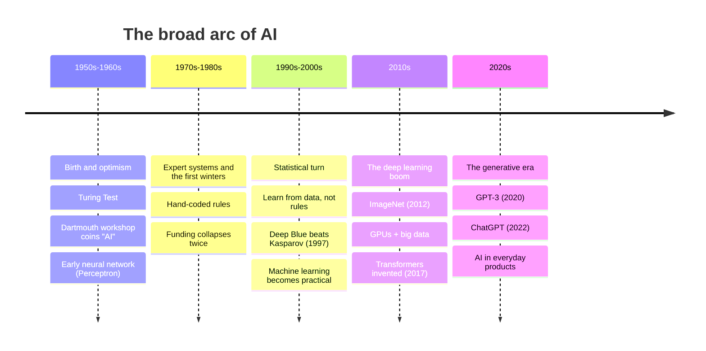

---
tags:
  - Chapter 1
---

# 1.2 Basics of AI

!!! objective "In this section"
    - A working definition of artificial intelligence
    - The history of AI, and why *this* moment is different
    - The key concepts that recur throughout the course

---

## What is AI?

Let us start with a definition that is honest about how slippery the term is.

> **Artificial Intelligence** is the field of building computer systems that perform tasks
> which, when a human does them, we would describe as requiring intelligence.

That phrasing is deliberately awkward, because AI is a *moving target*. In 1970, a program
that played competent chess was unambiguously "AI". Today your phone does it and nobody calls
it intelligent. In 1990, recognising handwritten digits was a research milestone. Today it
sorts your post silently.

This phenomenon is common enough to have a name.

!!! note "The AI effect"
    *"As soon as AI successfully solves a problem, the problem is no longer considered
    AI."* Once we understand how a thing works mechanically, it stops feeling like
    intelligence and starts feeling like engineering. Spam filters, route planners,
    autocomplete, and face unlock were all "AI" before they became ordinary.

    This matters practically: **there is far more AI in your organisation than the inventory
    that says "AI projects"**. Security teams routinely miss ML systems because nobody
    labelled them as such.

### What AI is not

Three misconceptions worth demolishing immediately, because they distort security thinking.

<dl class="caisp-terms" markdown>

<dt>AI is not a mind</dt>
<dd>Current AI systems do not have beliefs, intentions, or understanding in the human sense.
When an LLM produces "I think you should reset your password", there is no "I" doing any
thinking. It is generating statistically likely text. This matters for security: you cannot
appeal to a model's judgement, because it has none. It has patterns.</dd>

<dt>AI is not a database</dt>
<dd>A model does not "look up" answers. It has no table of facts it consults. It generates
output from learned statistical patterns, which is precisely why it can produce fluent,
confident, completely fabricated answers — <em>hallucinations</em>. A database that does not
have your record returns "not found". A model that does not know invents.</dd>

<dt>AI is not deterministic software</dt>
<dd>As covered in section 1.1, the same input can yield different outputs. Testing gives
probabilistic assurance, not proof.</dd>

</dl>

---

## History and evolution of AI

You do not need to memorise dates. What you *do* need is the shape of the story, because it
explains why AI security became urgent so suddenly.

### The rule-based era, and why it failed

The first few decades of AI were built on an appealing idea: **intelligence is rules**. If a
doctor diagnoses illness by reasoning from symptoms, then write down the doctor's rules and
the computer can do it too. These were **expert systems**, and they were the commercial face
of AI in the 1980s.

They worked, narrowly, and then they hit a wall. Consider writing rules to recognise a cat in
a photo. "It has pointed ears." What if it is facing away? "It has fur." So does a dog. "It
has whiskers." Not visible at that resolution. Every rule you add spawns exceptions, and the
exceptions spawn exceptions. The real world is too irregular to enumerate.

When expectations vastly outran results, funding collapsed — twice. These periods are called
the **AI winters**, and they are the reason many senior technologists were sceptical of AI
right up until the 2010s.

### The statistical turn

The breakthrough was a change of strategy so simple it sounds like giving up:

> Stop telling the computer the rules. Show it thousands of examples and let it work out the
> rules itself.

Do not write a definition of "cat". Show the system 50,000 labelled photographs and let it
discover, statistically, what distinguishes cats from everything else. This is **machine
learning**, and it is the dominant paradigm today.

The trade is profound and has direct security consequences:

| | Rule-based | Learned from data |
|---|---|---|
| Where behaviour comes from | Human-written rules | Patterns in the training data |
| Can you read why it decided? | Yes — read the rules | Often not — it is millions of numbers |
| Handles messy real-world input | Poorly | Well |
| To change behaviour | Edit the rules | Retrain with different data |
| **Attack surface** | **The code** | **The code *and* the data** |

That last row is the entire reason data poisoning exists as a threat category.

### Why now? Three things arrived at once

People had the core ideas for neural networks since the 1950s. They did not work well for
sixty years. Then, in roughly a decade, they started working spectacularly. Nothing magical
happened — three practical ingredients matured simultaneously.

**1. Data.** The internet created text and image collections of a scale previously
unimaginable. Modern language models train on a substantial fraction of the public web.
Learning-from-examples needs examples, and suddenly there were trillions.

**2. Compute.** Graphics cards (GPUs), built to render video games, turned out to be
extraordinarily good at the specific mathematics neural networks require — doing the same
simple operation on enormous quantities of numbers simultaneously. What would have taken
decades on a 1990s CPU now takes days.

**3. Architecture.** In 2017, a paper called *"Attention Is All You Need"* introduced the
**transformer**. It solved a practical problem: earlier designs processed text one word at a
time, which is slow and forgets long-range context. Transformers process a whole sequence at
once and learn which words to pay attention to. That made training on internet-scale text
feasible, and every major LLM today — GPT, Claude, Gemini, Llama — is a transformer.

!!! info "Why 2022 felt like a sudden explosion"
    The technology had been improving steadily for a decade, but in November 2022 ChatGPT
    put it behind a text box that anyone could use, with no technical knowledge required.
    The *capability* curve was gradual; the *access* curve was a cliff.

    Security teams experienced this as: "we had approximately zero AI exposure, and then
    within six months every department was pasting company data into a chatbot." The
    governance scramble in Chapter 7 is a direct consequence.

---

## Key concepts in AI

These terms appear constantly from here on. Get comfortable with them now; each is expanded
later in the course.

### Model

A **model** is the artefact that results from training. Concretely, it is a file — sometimes
a few megabytes, sometimes hundreds of gigabytes — containing a very large collection of
numbers plus a description of how they are arranged.

!!! tip "The recipe analogy"
    - The **algorithm** is the recipe: the procedure for learning and for producing output.
    - The **training data** is the ingredients.
    - The **model** is the cake: the finished thing you actually ship and use.

    You can share a cake without sharing the recipe. You can also, sometimes, work out a
    great deal about the ingredients by carefully examining the cake — which is exactly what
    *membership inference* and *model inversion* attacks do.

### Parameters (weights)

The numbers inside the model are its **parameters**, often called **weights**. Training is
the process of adjusting them. Each one is individually meaningless; collectively they encode
everything the model learned.

When you hear "a 7-billion-parameter model", that is the count of those numbers. More
parameters generally means more capability and more resource cost — though the relationship
is far from simple.

### Training vs. inference

Two fundamentally different activities that beginners often conflate.

<dl class="caisp-terms" markdown>

<dt>Training</dt>
<dd>Building the model by adjusting parameters to fit data. Extremely expensive
(potentially millions of dollars for a frontier model). Happens rarely.</dd>

<dt>Inference</dt>
<dd>Using the finished model to produce an output for one new input. Comparatively cheap.
Happens constantly — every chatbot message is an inference.</dd>

</dl>

The security relevance is that these have completely different threat profiles. Attacks
against *training* (poisoning, backdoors) are high-effort, high-impact, and durable — the
damage is baked into the model. Attacks against *inference* (prompt injection, extraction) are
low-effort, repeatable, and what most attackers actually do.

### Features

A **feature** is an individual measurable property the model uses. For predicting house
prices: square footage, number of bedrooms, postcode. For older ML systems, humans chose
features by hand — a craft called *feature engineering*. A key advantage of deep learning is
that it learns useful features itself from raw data.

### Labels and ground truth

In supervised learning, the **label** is the correct answer attached to a training example
(this photo is a "cat"). Collectively the correct answers are the **ground truth**.

Security note: ground truth is produced by *humans*, often crowd-workers at scale. If an
attacker can influence labelling, they can shape the model without touching a line of code.

### Generalisation, overfitting, underfitting

The entire goal of ML is **generalisation**: performing well on data it has never seen. Two
ways to fail:

- **Overfitting** — the model memorises the training data, including its noise and quirks.
  It scores brilliantly on data it has seen and poorly on anything new. The student who
  memorised past exam papers without understanding the subject.
- **Underfitting** — the model is too simple to capture the real pattern. Poor performance
  everywhere. The student who did not study.

!!! warning "Overfitting is a security issue, not just a quality issue"
    A model that memorised its training data can be induced to *reproduce* it. If that data
    contained personal information, credentials, or proprietary text, the model becomes an
    exfiltration channel. This is the mechanism behind training-data extraction attacks and a
    major cause of *sensitive information disclosure* (Chapter 3).

### Bias

**Bias** has two distinct meanings, and conflating them causes confusion:

1. **Statistical bias** — a technical property of a model's error pattern.
2. **Societal bias** — the model systematically disadvantaging groups of people, typically
   because historical data reflected historical discrimination.

The second is what makes headlines, triggers regulation, and increasingly lands organisations
in court. It is not a bug introduced by a careless programmer; it is a faithful reflection of
patterns in the data, which is precisely what makes it hard to remove.

### Inference latency and cost

Practical properties with direct security implications: because each inference consumes real
compute, **an attacker who can make you run expensive inferences can run up your bill or
exhaust your capacity**. That is *model denial of service* (Chapter 3) — an attack with no
traditional-security analogue, because normal web requests do not cost you dollars each.

---

!!! question "Check your understanding"
    ??? success "Why did rule-based AI fail at tasks like image recognition?"
        The real world has too many exceptions to enumerate. Every rule ("cats have pointed
        ears") has countless counterexamples (the cat is facing away, is a breed with folded
        ears, is partially hidden). Hand-written rules cannot cover the irregularity of
        reality, whereas learning from examples can.

    ??? success "What are the three ingredients that made modern AI work, and which one is most recent?"
        Data (internet scale), compute (GPUs), and architecture (the transformer, 2017). The
        transformer is the most recent and was the specific unlock for large language models.

    ??? success "Why is overfitting a security concern and not just an accuracy concern?"
        An overfitted model has effectively memorised training examples and can be prompted
        to reproduce them. If the training data contained sensitive information, the model
        leaks it — turning a quality problem into a data-breach problem.

---

<a class="caisp-card" href="../03-types-of-ai/" markdown>
Next · 1.3
### Types of AI
Narrow vs. general, the three learning styles, NLP and computer vision.
</a>

