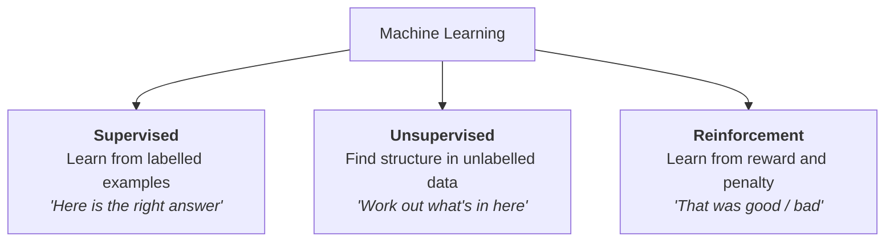

---
tags:
  - Chapter 1
---

# 1.3 Types of AI

!!! objective "In this section"
    - Narrow AI vs. General AI — and why the distinction matters for security
    - The three learning paradigms: supervised, unsupervised, reinforcement
    - Two major application domains: NLP and computer vision
    - The distinct attack surface each one creates

---

## Narrow AI vs. General AI

The single most important classification, and the one most distorted by popular media.

<dl class="caisp-terms" markdown>

<dt>Narrow AI (also: Weak AI, ANI)</dt>
<dd>A system built to do <strong>one kind of task</strong>. It may do that task far better
than any human, and it cannot do anything else. A world-champion chess engine cannot make a
sandwich, and cannot even play draughts.</dd>

<dt>General AI (also: Strong AI, AGI)</dt>
<dd>A hypothetical system able to understand, learn, and apply knowledge across
<strong>any</strong> intellectual domain, as a human can. It does not exist.</dd>

</dl>

!!! warning "Every AI system you will ever secure in this course is narrow AI"
    This includes ChatGPT, Claude, Gemini, and every other LLM. They are extraordinarily
    *broad* narrow AI — they handle a remarkable range of language tasks — but they are still
    pattern-completion systems trained for a specific objective. They are not general
    intelligences, and none of them "understands" in the way you do.

### Why this matters to a security professional

It is easy to dismiss the narrow/general distinction as philosophy. It is not; it changes how
you assess risk.

**It sets expectations about failure.** A narrow system fails in ways that look bizarre to a
human, because it never had human-style understanding to fall back on. An image classifier
can be flipped from "panda" to "gibbon" by a change to the pixels that you cannot even see.
A language model can be talked out of its safety instructions by a sufficiently creative
story. These are not signs of a badly built system — they are the expected behaviour of
pattern-matchers pushed outside their training distribution.

**It prevents two opposite mistakes.**

- *Over-trusting*: assuming the model "knows what it's doing" and giving it authority it
  should not have. It does not know what it is doing. It is completing a pattern.
- *Over-dismissing*: assuming that because it is "just statistics", it is harmless. A narrow
  system wired to your payments API is not harmless.

**It focuses you on the real risk.** The realistic danger from today's AI is not a
self-aware system deciding to harm you. It is a *mindless* system, given too much
permission, being manipulated by an ordinary human attacker. That is a mundane, solvable,
engineering-and-governance problem — and it is the one we spend this course on.

---

## The three learning paradigms

How does a model learn? There are three broad answers. Nearly every ML system you meet uses
one of these, or a combination.

### Supervised learning

**The idea:** show the model many examples where each input comes with the correct answer,
and let it learn the mapping from one to the other.

**The analogy:** a child learning animals with flashcards. You hold up a picture and say
"dog". After enough cards, they can identify a dog they have never seen before.

**Concrete examples:**

| Input | Label | Application |
|---|---|---|
| An email | "spam" / "not spam" | Spam filtering |
| A chest X-ray | "pneumonia" / "clear" | Medical triage |
| A transaction | "fraud" / "legitimate" | Payment fraud detection |
| A photo | "cat" / "dog" / "bird" | Image classification |
| A review | "positive" / "negative" | Sentiment analysis |

**The catch:** you need a large volume of correctly labelled data, and labelling is slow,
expensive, and usually done by people.

!!! danger "Security implications of supervised learning"
    - **Label poisoning.** An attacker who can influence labels controls behaviour. Flip the
      label on a carefully chosen subset of fraud examples and the model learns to wave that
      pattern through. No code is modified; the model is simply *taught* to be wrong.
    - **Labelling supply chain.** Labelling is frequently outsourced to crowd-work platforms.
      That is a third party with write access to what your model believes. Chapter 6 treats
      this as the supply-chain problem it is.
    - **Class imbalance as an attack aid.** Fraud is rare, so fraud datasets are wildly
      imbalanced. Models trained on them are fragile in exactly the region attackers operate
      in.

### Unsupervised learning

**The idea:** give the model data with *no* labels and ask it to find structure by itself.

**The analogy:** hand someone a box of assorted Lego and ask them to sort it into groups.
Nobody told them the categories. They might sort by colour, by size, by shape — they discover
the structure.

**Common uses:**

- **Clustering** — grouping similar customers, documents, or network sessions.
- **Anomaly detection** — learning "normal" and flagging deviations. This is the backbone of
  a great deal of security tooling: intrusion detection, insider-threat analytics, fraud
  monitoring.
- **Dimensionality reduction** — compressing data while keeping its important structure.
- **Learning embeddings** — producing the numerical meaning-vectors that power semantic
  search and RAG.

!!! danger "Security implications of unsupervised learning"
    - **Anomaly detection can be acclimatised.** Because these systems learn what "normal"
      looks like, an attacker who moves slowly enough can *shift the baseline*, gradually
      teaching the detector that their behaviour is normal. This is one of the most elegant
      attacks in the field, and it requires nothing but patience.
    - **Discovered groupings can be sensitive.** A clustering model may reconstruct
      protected attributes (ethnicity, health status, sexuality) that were never in the input,
      creating privacy and compliance exposure nobody designed in.

### Reinforcement learning

**The idea:** an **agent** takes actions in an **environment**, receives **rewards** or
penalties, and learns a strategy that maximises long-term reward.

**The analogy:** training a dog. You do not explain "sit" — you reward the behaviour when it
happens and it becomes more frequent.

**Where you have seen it:** game-playing systems that beat world champions at Go and
StarCraft; robotics; logistics and resource scheduling.

**Why it matters here specifically:** reinforcement learning is a key ingredient in making
LLMs helpful and safe. After a language model is pre-trained on text, it is typically refined
with **Reinforcement Learning from Human Feedback (RLHF)** — humans rank candidate responses,
and the model is trained toward the preferred ones. Much of the difference between "a model
that completes text" and "an assistant that behaves itself" comes from this step.

!!! danger "Security implications of reinforcement learning"
    - **Reward hacking.** Agents optimise the reward they are given, not the goal you
      intended. If the measurement and the intent diverge even slightly, the agent will find
      and exploit the gap. This is an alignment failure that presents as a security failure.
    - **RLHF is a human-in-the-loop attack surface.** The safety behaviour of a major model
      is shaped by human preference data. Influence the feedback, influence the safety layer.
    - **Agentic systems compound risk.** An RL-style agent that takes real actions — browsing,
      calling APIs, running code — turns a manipulated decision into a real-world
      consequence. Chapter 7's agent labs explore exactly this.

### A quick comparison

| | Supervised | Unsupervised | Reinforcement |
|---|---|---|---|
| Needs labels? | Yes | No | No (needs a reward signal) |
| Learns from | Correct answers | Structure in data | Consequences of actions |
| Typical output | A prediction | A grouping or representation | A policy (what to do next) |
| Classic security use | Spam/fraud/malware classification | Anomaly and intrusion detection | Automated response agents |
| Headline weakness | Label poisoning | Baseline drift | Reward hacking |

---

## Natural Language Processing (NLP)

**NLP** is the branch of AI concerned with human language: understanding it, generating it,
translating it, summarising it.

Language is a genuinely hard problem for computers, for reasons that are invisible to us
because we are so good at it:

- **Ambiguity.** *"I saw a man on a hill with a telescope."* Who has the telescope?
- **Context dependence.** *"It's freezing in here"* is a statement about temperature or a
  request to close the window, depending entirely on situation.
- **Idiom and implication.** *"Break a leg"* means the opposite of what it says.
- **Reference.** *"The trophy didn't fit in the suitcase because it was too big."* What does
  "it" refer to? You know instantly. A computer must infer it.

Common NLP tasks: classification (spam, sentiment), named entity recognition, machine
translation, question answering, summarisation, and — the one that dominates this course —
text generation.

!!! info "NLP is where this course lives"
    Because LLMs are NLP systems, and because LLM adoption exploded, most current AI security
    practice is NLP security. Chapters 2 and 3 are almost entirely about attacking and
    defending language models.

!!! danger "Security implications of NLP"
    - **The input is natural language, so the exploit is natural language.** No special
      tooling required. The payload is a sentence.
    - **Language is infinitely paraphrasable.** A blocklist that stops one phrasing will not
      stop the ten thousand equivalent phrasings. Defences based on matching bad strings fail
      almost immediately.
    - **Encoding tricks abound.** Text can be obfuscated with unusual Unicode, base64,
      spacing, homoglyphs, or embedding in other languages — often defeating naive filters
      while remaining perfectly comprehensible to the model.

---

## Computer vision

**Computer vision** is AI applied to images and video: classifying what is in a picture,
detecting and locating objects, segmenting regions, recognising faces, reading text from
images.

Applications range from the benign (photo search, medical imaging, quality inspection) to the
safety-critical (autonomous vehicles) to the contentious (biometric surveillance).

!!! danger "Security implications of computer vision"
    - **Adversarial examples.** Tiny, deliberately computed changes to an image — frequently
      imperceptible to a human — can cause confident misclassification. This is the classic
      demonstration that these systems do not "see" as we do. The consequences range from
      trivial to lethal depending on deployment.
    - **Physical-world attacks.** Adversarial patterns can be printed on stickers, clothing,
      or road signs. The attack surface leaves the network entirely and enters physical
      space, which almost no security programme is designed to cover.
    - **Biometric spoofing and privacy.** Face recognition invites presentation attacks, and
      the underlying data is permanent — you can reset a password, not your face. This is a
      significant driver of regulation in Chapter 7.

!!! note "Multimodal models blur the line"
    Modern systems increasingly accept images *and* text together. This creates a hybrid
    threat: **an instruction hidden inside an image**. A model asked to describe a photo can
    read attacker text embedded in that photo and treat it as a command. It is prompt
    injection with a new delivery channel, and it neatly defeats defences that only inspect
    the text field.

---

!!! question "Check your understanding"
    ??? success "Is ChatGPT narrow AI or general AI?"
        Narrow. It is unusually broad — it handles many language tasks — but it is still a
        pattern-completion system trained on a specific objective, with no general
        understanding or ability to operate outside language-shaped tasks.

    ??? success "Your company uses an unsupervised anomaly detector for insider threat. What is the characteristic attack against it?"
        Gradual baseline shifting. Because the system continuously learns what "normal" looks
        like, an attacker who escalates slowly can train the detector to accept their
        behaviour as normal. Patience defeats it, not cleverness.

    ??? success "Why are blocklists a weak defence for an NLP system?"
        Natural language has effectively unlimited paraphrases, plus encoding and obfuscation
        options. Blocking known-bad strings stops the exact strings you thought of and
        nothing else. Defence must be based on behaviour and architecture, not string
        matching.

---

<a class="caisp-card" href="04-core-components.md">
  Next · 1.4
  Core Components of AI Systems
  Algorithms and models, data, and computing power — and how each is attacked.
</a>

