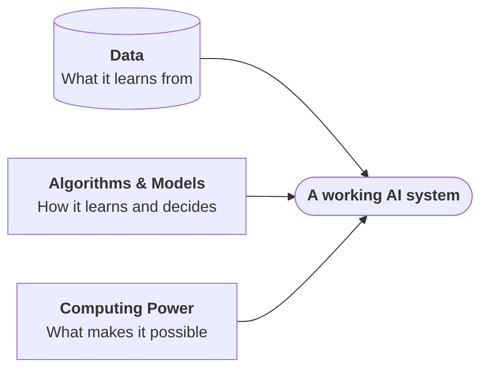
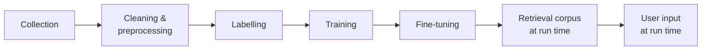

---
tags:
  - Chapter 1
---

# 1.4 Core Components of AI Systems

!!! objective "In this section"
    - The three pillars every AI system stands on
    - How each pillar is attacked
    - Why "secure the model" is only one third of the job

---

Strip away the marketing and every AI system, from a spam filter to a frontier language
model, is built from the same three ingredients:

Remove any one and you have nothing. And — this is the point of the section — **each one is
a separate attack surface with its own defences**. A security programme that hardens the
model but ignores the data pipeline is leaving two thirds of the system undefended.

---

## Component 1 — Algorithms and models

### The distinction that beginners blur

These two words get used interchangeably in casual conversation. They are not the same thing,
and keeping them apart makes everything clearer.

<dl class="caisp-terms" markdown>

<dt>Algorithm</dt>
<dd>A <strong>procedure</strong>. A set of steps. "Linear regression", "random forest",
"gradient descent", "the transformer architecture" are all algorithms. An algorithm is
generic, public, and usually described in a research paper.</dd>

<dt>Model</dt>
<dd>The <strong>artefact</strong> produced by running a training algorithm over a specific
dataset. It is a concrete file full of numbers. It is specific, often proprietary, and it is
the thing you deploy.</dd>

</dl>

!!! tip "The recipe and the cake, again"
    The **algorithm** is the recipe. The **data** is the ingredients. The **model** is the
    cake you actually serve. Two bakeries following the same public recipe with different
    ingredients produce very different cakes.

    This is why the research being open does not make models commodities: everyone knows the
    transformer recipe, but the data, the scale, and the refinement produce enormously
    different results.

### Model formats — where the danger hides

A model has to be saved to disk and loaded again. The *file format* used to do that turns out
to be a first-class security concern, and it surprises almost everyone the first time.

| Format | Used by | Can it execute code on load? |
|---|---|---|
| **Pickle** (`.pkl`, `.pt`, `.bin`) | PyTorch, scikit-learn | **Yes — by design** |
| **SafeTensors** (`.safetensors`) | Hugging Face ecosystem | No |
| **ONNX** (`.onnx`) | Cross-framework exchange | Limited, but has had issues |
| **HDF5 / Keras** (`.h5`) | TensorFlow / Keras | Possible via custom layers |
| **GGUF** | llama.cpp and local runtimes | No (data only) |

The critical one is **pickle**. Python's pickle format does not merely store data — it stores
instructions for *reconstructing* Python objects, and reconstruction can involve calling
arbitrary functions. Loading a pickle file from an untrusted source is therefore
approximately equivalent to running a program someone sent you.

!!! danger "Say this out loud until it feels normal"
    **Downloading a model is downloading executable content.**

    Not "downloading data". Not "downloading a document". A PyTorch checkpoint from a
    stranger deserves exactly the same suspicion as a `.exe` from a stranger.

    This is why the industry moved toward **SafeTensors**, a format that deliberately
    supports *only* numbers and metadata, with no mechanism for code execution. When you have
    the choice, choose SafeTensors. Chapter 4 has you scanning pickle files with
    `picklescan`, and Chapter 6 covers signing and verifying models properly.

### Attacks on the model

<dl class="caisp-terms" markdown>

<dt>Model theft / extraction</dt>
<dd>Stealing the weights outright (via a compromised registry, an exposed bucket, or an
insider), or reconstructing equivalent behaviour by querying the model many times and
training a copy on its answers. The second approach needs no access beyond the public API.</dd>

<dt>Backdoors</dt>
<dd>Hidden behaviour planted during training or fine-tuning that activates only on a secret
trigger. The model passes every normal test — it behaves perfectly until it sees the trigger
phrase or pattern. Detection is genuinely hard, which is why <em>provenance</em> matters more
than <em>inspection</em>.</dd>

<dt>Malicious serialisation</dt>
<dd>Weaponising the file format itself, as above.</dd>

<dt>Model inversion and membership inference</dt>
<dd>Working backwards from a model's outputs to recover facts about its training data —
including whether a specific individual's record was part of it. A privacy breach with no
"breach" in the traditional sense.</dd>

</dl>

---

## Component 2 — Data

If the model is the engine, data is both the fuel and the design. A model can never be better
than what it learned from, and it inherits every flaw in that material.

### The stages where data matters

Data is not a single thing that appears once. It flows through an AI system at several
distinct points, each a separate opportunity for compromise.

Most people, asked "where does data enter an AI system?", think only of training. In practice
the *run-time* stages — the retrieval corpus and user input — are where most real incidents
occur, because they are continuously exposed and continuously modifiable.

### Properties that matter

<dl class="caisp-terms" markdown>

<dt>Volume</dt>
<dd>Modern models need enormous quantities. Scale makes manual review impossible, which is
precisely what makes poisoning viable: nobody is reading it all.</dd>

<dt>Quality</dt>
<dd>Errors, duplicates, and noise degrade the model. "Garbage in, garbage out" is literal
here.</dd>

<dt>Representativeness</dt>
<dd>If training data does not reflect the real population the model will face, it fails on
the under-represented parts — the origin of most fairness failures.</dd>

<dt>Provenance</dt>
<dd>Where did it come from? Who touched it? Can you prove it? For most public datasets the
honest answer is "the internet" and "we cannot". Chapter 6 treats this as the central
supply-chain question.</dd>

<dt>Sensitivity</dt>
<dd>Training data frequently contains personal data, and models can be induced to reproduce
it. Data protection law applies to what a model memorised, not just to your database.</dd>

</dl>

### Attacks on data

<dl class="caisp-terms" markdown>

<dt>Data poisoning</dt>
<dd>Injecting crafted examples into training data so the model learns attacker-chosen
behaviour. Alarmingly, this often requires influencing only a tiny fraction of a dataset —
and if a dataset is assembled by scraping the public web, <em>anybody can contribute to
it</em>.</dd>

<dt>Label flipping</dt>
<dd>A targeted variant: change the labels on a specific, carefully chosen subset so the model
systematically misclassifies exactly the cases the attacker cares about.</dd>

<dt>Retrieval corpus poisoning</dt>
<dd>Planting malicious content in the documents a RAG system searches. The model faithfully
reports what it retrieved — and what it retrieved was written by the attacker. Covered
properly in section 1.6.</dd>

<dt>Data exfiltration</dt>
<dd>Stealing the training data itself, which is often more commercially valuable and more
legally sensitive than the model.</dd>

</dl>

!!! warning "Why data poisoning is the most under-rated AI threat"
    It is invisible, durable, and cheap.

    - **Invisible:** the model passes its evaluations, because the attacker designed the
      backdoor not to affect general performance.
    - **Durable:** the flaw lives in the weights. Patching the application does nothing.
      Removing it means retraining — which can cost millions and weeks.
    - **Cheap:** if a dataset is web-scraped, the cost of contributing to it is the cost of
      publishing a web page.

---

## Component 3 — Computing power

The least glamorous pillar and the one security teams most often forget entirely.

### Why AI is compute-hungry

Training adjusts billions of parameters over billions of examples, repeatedly. The arithmetic
is simple but the quantity is staggering. This is why **GPUs** dominate: a CPU has a handful
of powerful cores optimised for doing different things quickly in sequence; a GPU has
thousands of simple cores optimised for doing *the same thing* to vast quantities of numbers
simultaneously. That is exactly the shape of neural network maths.

The practical consequences:

- **Training frontier models is capital-intensive.** Large training runs consume thousands of
  GPUs for weeks. This concentrates the ability to build frontier models in a small number of
  organisations — which is itself a supply-chain risk for everyone downstream.
- **Inference is cheap individually and expensive in aggregate.** Each request costs
  fractions of a cent. Millions of requests cost real money.
- **Most teams rent, not own.** Which means your AI compute is someone else's cloud, with all
  the shared-responsibility implications that carries.

### Attacks on compute

<dl class="caisp-terms" markdown>

<dt>Model denial of service / denial of wallet</dt>
<dd>Deliberately sending inputs that are maximally expensive to process — enormous contexts,
prompts that trigger very long generations, or recursive tool calls. The goal may be to
exhaust capacity for legitimate users, or simply to run up your bill. The second is sometimes
called <em>denial of wallet</em>, and it is a genuinely novel attack class: traditional web
requests do not each cost you money.</dd>

<dt>Resource hijacking</dt>
<dd>GPUs are valuable and attractive to steal cycles from. Compromised ML infrastructure is a
prime target for cryptomining and for attackers wanting free compute for their own training.</dd>

<dt>Attacks on the ML platform</dt>
<dd>Notebooks, experiment trackers, model registries, and orchestration tools frequently run
with broad credentials and were often deployed by data scientists rather than platform
engineers. They are regularly found exposed to the internet with weak or absent
authentication. Chapter 4 covers this in depth.</dd>

<dt>Side-channel attacks</dt>
<dd>In shared or multi-tenant environments, timing and resource-usage patterns can leak
information about what a model is doing or what data it is processing.</dd>

</dl>

---

## Bringing it together

Here is the summary worth remembering — the three pillars, mapped to their threats and their
defences.

| Component | You are protecting | Headline threats | Primary defences |
|---|---|---|---|
| **Algorithms & models** | Weights, architecture, behaviour | Theft, extraction, backdoors, malicious file formats | Access control, SafeTensors, scanning, signing, provenance |
| **Data** | Training sets, corpora, user input | Poisoning, label flipping, exfiltration, privacy leakage | Provenance tracking, validation, curation, access control, minimisation |
| **Compute** | Availability, cost, platform | DoS / denial of wallet, hijacking, exposed ML tooling | Rate limiting, quotas, cost alerts, standard infrastructure hardening |

!!! tip "A question to ask about any AI system you assess"
    For each of the three components: **who can influence it, and how would I know if they
    did?**

    Most organisations can answer that for compute (they have logs), partially for models
    (they have a registry), and not at all for data. That gap is where you will find your
    highest-value findings for years to come.

---

!!! question "Check your understanding"
    ??? success "Why is loading a `.pt` PyTorch file riskier than loading a `.safetensors` file?"
        `.pt` files typically use Python's pickle format, which stores instructions for
        reconstructing objects and can therefore execute arbitrary code when loaded.
        SafeTensors was designed to store only numbers and metadata, with no code-execution
        mechanism.

    ??? success "An attacker adds 200 crafted pages to a website they control, knowing a public dataset scrapes it. Which component are they attacking, and why is it hard to detect?"
        Data. It is hard to detect because web-scale datasets are far too large to review
        manually, the poisoned examples are designed not to degrade general performance, and
        the resulting flaw lives in the model's weights where there is no line of code to
        inspect.

    ??? success "What is 'denial of wallet' and why has it no real equivalent in traditional web security?"
        Sending deliberately expensive inference requests to run up the victim's costs. It
        differs from classic DoS because the goal is financial rather than availability, and
        it exists because each AI request consumes metered compute — ordinary web requests
        are essentially free to serve.

---

<a class="caisp-card" href="../05-intro-to-ml/" markdown>
Next · 1.5
### Introduction to Machine Learning
The ML workflow end to end, and the concepts you will use constantly.
</a>

