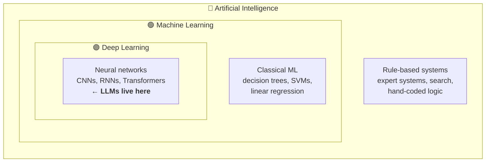
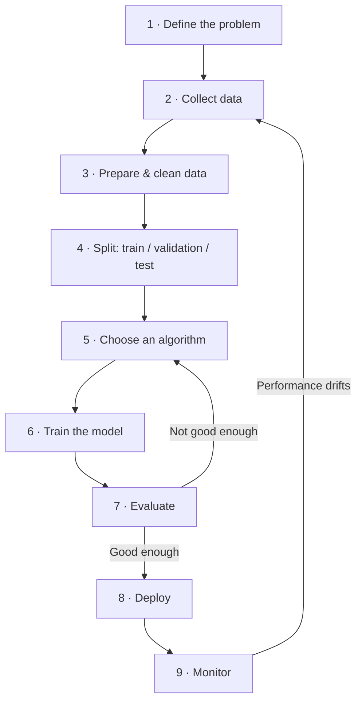

---
tags:
  - Chapter 1
---

# 1.5 Introduction to Machine Learning

!!! objective "In this section"
    - A precise definition of machine learning
    - How AI, ML, and deep learning nest inside one another
    - The end-to-end ML workflow, and where an attacker can reach each stage
    - The key concepts you will use for the rest of the course

---

## What is machine learning?

The classic definition comes from Tom Mitchell (1997), and it is worth unpacking because it
is unusually precise:

> A computer program is said to **learn** from experience *E* with respect to some task *T*
> and performance measure *P*, if its performance at *T*, as measured by *P*, improves with
> experience *E*.

In plainer terms: **the system gets better at a job by being exposed to data, rather than by
someone editing its instructions.**

Take spam filtering:

- **Task (T):** classify an email as spam or not spam.
- **Experience (E):** thousands of emails already marked spam or not by users.
- **Performance (P):** the percentage it gets right.

If showing it more marked-up emails raises its accuracy, it is learning. Nobody wrote a rule
saying "emails containing 'FREE VIAGRA' are spam" — it worked that out.

!!! note "Why this beat hand-written rules"
    Early spam filters *were* rule-based, and spammers defeated them trivially by writing
    "V1AGRA", "\/iagra", "V-i-a-g-r-a". Every new evasion required a human to notice and
    write a new rule — a losing race.

    A learning filter adapts as new labelled examples arrive, without anyone writing rules.
    This is why ML won. Note, though, what it created: **the filter's behaviour is now
    controlled by whoever supplies the labelled examples.** We traded a code-injection
    problem for a data-integrity problem. That trade is the origin of most of this course.

---

## Differences between AI and ML

A source of constant confusion, resolved by one picture.

Read it as a set of nested boxes:

- **All machine learning is AI. Not all AI is machine learning.** A chess engine using
  hand-written search rules is AI with no learning in it.
- **All deep learning is machine learning. Not all machine learning is deep learning.** A
  decision tree predicting loan defaults is ML with no neural network.
- **LLMs sit in the innermost box.** They are deep learning, which is machine learning, which
  is AI.

| | AI | ML | Deep Learning |
|---|---|---|---|
| Scope | The whole field | Systems that learn from data | Learning with multi-layer neural networks |
| Behaviour comes from | Rules or learning | Training data | Training data |
| Data needed | Possibly none | Moderate to large | Large to enormous |
| Feature engineering | N/A | Usually by hand | Learned automatically |
| Interpretability | Often high | Moderate | Usually low |
| Example | A rules-based chatbot | Fraud scoring | GPT, image recognition |

!!! tip "Use the terms precisely and people will trust you"
    In a room where everyone says "AI" for everything, the person who correctly says "that's
    a classical ML model, not a deep network, so we *can* inspect its decision logic" is
    immediately identifiable as someone who knows what they are talking about. Precision is
    cheap credibility.

---

## The machine learning workflow

Almost every ML project follows the same lifecycle. You must know this diagram cold, because
**threat modeling an AI system is largely a matter of walking this pipeline and asking who can
reach each stage.**

### Walking the stages

**1. Define the problem.** What are you predicting, and what does success mean? Vague goals
produce unmeasurable systems. From a security view, this is where you should also ask: *what
is the worst thing this system could get wrong?*

**2. Collect data.** Gather examples. Sources include internal systems, purchased datasets,
public datasets, and web scraping. **This is the first and most under-defended attack
surface** — if an attacker can contribute to any source you draw from, they have a path into
your model.

**3. Prepare and clean.** Handle missing values, remove duplicates, normalise formats,
convert text and categories into numbers. This is typically 70–80% of the real work. It is
also where quiet, catastrophic mistakes happen.

!!! warning "Data leakage — the mistake that fools everyone"
    **Data leakage** is when information that will not be available at prediction time
    accidentally gets into training. The classic case: predicting whether a customer will
    cancel, while accidentally including a field called `cancellation_date`.

    The model achieves 99.8% accuracy. Everyone celebrates. It is useless in production
    because that field is empty for customers who have not cancelled yet.

    Beware: "data leakage" here means *training contamination*, not a data breach. Same
    words, entirely different meaning. Context tells you which.

**4. Split the data.** You divide it into three parts, and the discipline matters:

<dl class="caisp-terms" markdown>

<dt>Training set (~70%)</dt>
<dd>What the model learns from.</dd>

<dt>Validation set (~15%)</dt>
<dd>Used while developing to tune settings and compare approaches.</dd>

<dt>Test set (~15%)</dt>
<dd>Held back and touched <strong>once</strong>, at the very end, to get an honest estimate
of real-world performance. Every time you peek at the test set and adjust, you contaminate
it — you are now fitting to your test data and your estimate becomes optimistic fiction.</dd>

</dl>

**5. Choose an algorithm.** Match the method to the problem, the data volume, and your
interpretability requirements. In a regulated setting, "we cannot explain why it declined
your loan" may be legally disqualifying, which rules out some choices regardless of accuracy.

**6. Train.** Run the algorithm over the training data, iteratively adjusting parameters to
reduce error. For classical models, minutes. For frontier LLMs, thousands of GPUs for weeks.

**7. Evaluate.** Measure performance on data the model has not seen.

**8. Deploy.** Put it where it can serve predictions — an API, an app, an embedded device.
This is where the model meets untrusted users and where most of the OWASP LLM Top 10 applies.

**9. Monitor.** Models degrade. The world shifts underneath them, so yesterday's accurate
model is tomorrow's liability.

!!! info "Model drift"
    **Drift** is the silent decay of model performance as reality diverges from the training
    data. Customer behaviour changes; fraud patterns evolve; language shifts.

    Drift has a security dimension people miss: **an attacker can deliberately induce drift.**
    Feed a continuously-learning system a slow stream of crafted inputs and you gradually
    move its notion of "normal" toward whatever you want it to accept. Recall the anomaly
    detector from section 1.3 — this is the same attack, described from the defender's side.

### The pipeline as an attack map

Overlay the threats onto the same nine stages, and you have the beginnings of a threat model:

| Stage | What an attacker wants | Example |
|---|---|---|
| 2 · Collect | Get poisoned data in | Publish crafted pages a scraper will ingest |
| 3 · Prepare | Subvert the pipeline | Compromise a preprocessing script or its dependencies |
| 4 · Split | Corrupt the evaluation | Contaminate the test set so a backdoored model passes |
| 6 · Train | Plant a backdoor | Malicious fine-tuning; compromised training job |
| 7 · Evaluate | Hide the flaw | Backdoor that only triggers outside the evaluation set |
| 8 · Deploy | Reach the model | Prompt injection, extraction, DoS, insecure output handling |
| 9 · Monitor | Stay invisible | Gradual drift induction; poisoning the feedback loop |

Notice how few of these are "hack the server". That is the point.

---

## Key ML concepts

The working vocabulary. You will meet all of these again.

### Model evaluation metrics

"Accuracy" alone is dangerously misleading, and understanding why is genuinely important for
security work.

!!! danger "The accuracy trap"
    Suppose 1 in 1,000 transactions is fraudulent. Build a model that says "not fraud" every
    single time. Its accuracy is **99.9%** — and it catches zero fraud.

    This is not a contrived example. Security-relevant problems (fraud, intrusion, malware)
    are almost always **heavily imbalanced**, so accuracy is almost always the wrong metric.
    Anyone reporting only accuracy on a rare-event problem either does not understand the
    problem or is hiding something.

Better metrics:

<dl class="caisp-terms" markdown>

<dt>Precision</dt>
<dd>Of everything the model flagged, what fraction was actually positive? Low precision means
lots of <strong>false alarms</strong> — the reason SOC analysts stop trusting a tool.</dd>

<dt>Recall (sensitivity)</dt>
<dd>Of everything that actually was positive, what fraction did the model catch? Low recall
means <strong>missed attacks</strong>.</dd>

<dt>F1 score</dt>
<dd>A single number balancing precision and recall, useful for comparing models at a glance.</dd>

<dt>Confusion matrix</dt>
<dd>The full breakdown: true positives, false positives, true negatives, false negatives.
Always ask to see this rather than a single headline number.</dd>

</dl>

!!! tip "Precision and recall trade off — and the right balance is a business decision, not a technical one"
    - A **malware scanner** that misses real malware is dangerous → favour **recall**.
    - A **system that auto-blocks user accounts** generating false positives is damaging →
      favour **precision**.

    There is no universally correct answer, only a correct answer *for this context*. Being
    the person who asks "what is the cost of each error type here?" is valuable.

### Hyperparameters

Settings chosen *before* training that control how learning happens — how fast the model
adjusts, how large the network is, how long it trains. Distinct from parameters, which the
model learns by itself. Tuning them is a large part of practical ML work.

### Loss function

The measure of how wrong the model currently is. Training is, mechanically, the process of
making this number smaller. What you choose to measure determines what the model becomes —
which is the same "you get what you measure" trap as reward hacking, one level down.

### Epoch, batch, learning rate

- **Epoch** — one complete pass through the training data.
- **Batch** — the chunk of examples processed before updating parameters.
- **Learning rate** — how large each adjustment is. Too high and training is unstable; too
  low and it takes forever.

### Transfer learning and fine-tuning

Rather than training from scratch (ruinously expensive), you take a model someone already
trained on a huge general dataset and adapt it to your narrower task with a comparatively
small amount of your own data.

This is the single most important economic fact in modern AI: **almost nobody trains from
scratch.** Practically everyone builds on a foundation model.

!!! danger "Transfer learning inherits everything"
    When you fine-tune someone else's model, you inherit:

    - Every bias in their training data.
    - Every backdoor anyone planted in it.
    - Every piece of memorised sensitive data it absorbed.
    - Every licensing and provenance question attached to it.

    Fine-tuning does **not** cleanse a base model. A backdoor planted in a foundation model
    commonly survives fine-tuning intact. This is why Chapter 6 treats model provenance as
    seriously as it does, and it is the mechanism behind model-mediated supply-chain attacks
    in Chapter 7.

---

!!! question "Check your understanding"
    ??? success "A colleague reports their intrusion detection model is 99.4% accurate. What is your first question?"
        "What are the precision and recall?" — or equivalently, "show me the confusion
        matrix." Intrusions are rare, so a model that flags nothing scores very high accuracy
        while being worthless. Accuracy on imbalanced problems tells you almost nothing.

    ??? success "Why is the test set only used once?"
        Because every time you look at test performance and change your approach, you are
        fitting your decisions to that data. It stops being an unseen sample and your
        performance estimate becomes optimistically biased — you no longer have an honest
        prediction of real-world behaviour.

    ??? success "Your team fine-tunes a public foundation model on internal data. Which risks did you inherit?"
        All of the base model's: its biases, any planted backdoors, any memorised sensitive
        data, and its licensing/provenance uncertainty. Fine-tuning adapts behaviour; it does
        not remove what is already in the weights.

---

<a class="caisp-card" href="../06-rag/" markdown>
Next · 1.6
### Retrieval Augmented Generation
How models are given knowledge they were never trained on — and the attack surface that
creates.
</a>

