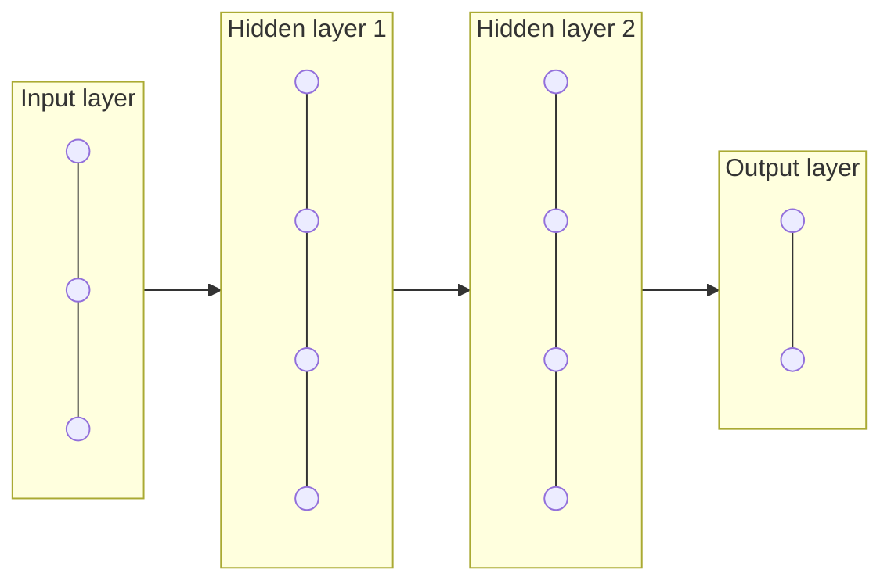
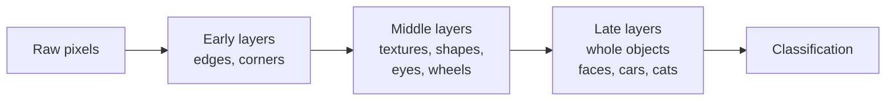

---
tags:
  - Chapter 1
---

# 1.7 Basics of Deep Learning

!!! objective "In this section"
    - What deep learning is, and what the "deep" refers to
    - How a neural network works, explained without equations
    - What CNNs are and why they matter
    - Why the opacity of these systems is a security problem in itself

---

## What is deep learning?

**Deep learning** is machine learning using **neural networks with many layers**. That is the
whole definition. The "deep" refers to the number of layers, nothing more profound.

What makes it important is a single capability: **deep networks learn their own features.**

Recall from section 1.2 that classical ML needed humans to decide which properties mattered —
*feature engineering*. To detect fraud you might hand-craft features like "transaction amount",
"time since last transaction", "distance from usual location". A skilled human had to know
what mattered.

Deep learning removes that step. Feed it raw data and it discovers useful features itself,
building them up in layers of increasing abstraction. For images, early layers learn edges,
middle layers learn shapes and textures, later layers learn objects. **Nobody told it to do
that**; the structure emerged from training.

This is why deep learning dominates messy, unstructured data — images, audio, text — where
humans cannot easily articulate the relevant features.

| | Classical ML | Deep learning |
|---|---|---|
| Features | Hand-engineered by experts | Learned automatically |
| Data needed | Thousands of examples | Often millions |
| Compute needed | Modest (a laptop) | Heavy (GPUs) |
| Best on | Tabular, structured data | Images, audio, text |
| Interpretability | Often good | Usually poor |
| Example | Credit scoring with a decision tree | Image recognition, LLMs |

!!! note "Deep learning is not automatically the right choice"
    It is fashionable, which leads teams to reach for it reflexively. For structured tabular
    data — most business problems — a well-tuned gradient-boosted tree frequently beats a
    neural network while being faster, cheaper, and *explainable*.

    From a security and compliance standpoint, explainability is not a nice-to-have. If you
    must justify a decision to a regulator or a court, a model you cannot interrogate is a
    liability. "We chose the interpretable model" is sometimes the strongest security control
    available.

---

## Introduction to neural networks

### The basic unit: a neuron

The name comes loosely from biology, but do not lean on the analogy — an artificial neuron is
a small piece of arithmetic, nothing more.

A single neuron:

1. **Receives** several numbers as input.
2. **Multiplies** each by a *weight* (how much that input matters).
3. **Adds** them all up, plus a *bias* (a baseline nudge).
4. **Applies an activation function** — a simple rule that decides the output, and crucially
   introduces non-linearity so the network can learn curved, complex relationships rather
   than only straight lines.

That is it. One neuron is a weighted sum followed by a squash.

!!! tip "The committee analogy"
    Think of a neuron as one member of a committee deciding whether to approve a loan.

    Each input is an opinion from an advisor (income, credit history, employment). The
    **weights** are how much this committee member trusts each advisor. The **bias** is their
    personal predisposition toward approving or refusing. The **activation** is the moment
    they convert all that into a decision.

    Now stack thousands of such members into layers, where each layer's decisions become the
    next layer's advisors, and you have a neural network. No individual is smart. The
    structure is.

### Layers

Neurons are organised into layers:

<dl class="caisp-terms" markdown>

<dt>Input layer</dt>
<dd>Where data enters. One neuron per input value — one per pixel, or per token, or per
feature.</dd>

<dt>Hidden layers</dt>
<dd>The layers in between, where the actual learning of representations happens. "Hidden"
only means you do not directly observe them. <strong>More hidden layers = deeper
network.</strong></dd>

<dt>Output layer</dt>
<dd>Produces the result: a class probability, a predicted number, or a distribution over
possible next tokens.</dd>

</dl>

### How a network learns

Training is a loop of four steps, repeated millions of times:

1. **Forward pass.** Push an example through the network and get a prediction.
2. **Compute the loss.** Compare the prediction to the correct answer. The **loss** is a
   number measuring how wrong it was.
3. **Backpropagation.** Work backwards through the network, calculating how much each
   individual weight contributed to the error. This is the central algorithmic idea in deep
   learning.
4. **Update.** Nudge every weight slightly in the direction that would have reduced the
   error. The size of the nudge is the **learning rate**.

Repeat for millions of examples. Slowly, the weights settle into a configuration that
produces good predictions.

!!! info "Gradient descent, intuitively"
    Picture standing on a foggy hillside, trying to reach the valley floor. You cannot see
    far, but you can feel which way the ground slopes. So you take a small step downhill,
    reassess, and repeat.

    That is **gradient descent**. The hill is the loss, your position is the current weights,
    and each step is one update. Too large a step and you leap across the valley and out the
    other side; too small and you are there all week. That is the learning rate trade-off in
    one image.

### What this means for security

Two consequences follow directly from the mechanism, and they matter enormously.

**First: the model's behaviour is stored in millions of numbers, not in readable logic.**
There is no function to review, no rule to audit. You cannot open a model and see "when the
input contains X, do Y". This is the core of the **interpretability problem**, and it
undermines familiar security practices: you cannot code-review a weight matrix, and a
backdoor hidden in those numbers does not look different from legitimate learning.

**Second: everything the model knows came from the data.** Since behaviour is learned rather
than written, whoever influenced the training data influenced the behaviour. Data integrity
*is* behavioural integrity. That single sentence justifies the entire field of AI supply-chain
security.

---

## Convolutional Neural Networks (CNNs)

CNNs are the architecture that made computer vision work. You will not build one in this
course, but you should understand them, because the classic adversarial-example attacks were
demonstrated against CNNs and the intuition transfers.

### The problem CNNs solve

A modest 1000×1000 colour photograph contains three million numbers. Connecting every pixel
to every neuron in even a small first layer means billions of weights — computationally
hopeless, and it would also throw away something important: **in an image, nearby pixels are
related**. A plain network treats pixel (1,1) and pixel (999,999) as equally related, which is
nonsense.

### The CNN idea: sliding filters

Instead of connecting everything to everything, a CNN slides a small window — a **filter** or
**kernel**, perhaps 3×3 pixels — across the image, looking for a specific local pattern. The
same filter is reused across the whole image, which is both efficient and sensible: a vertical
edge is a vertical edge wherever it appears.

Stack these layers and a hierarchy emerges naturally:

Two other standard ingredients:

- **Pooling layers** shrink the representation, keeping the strongest signals. This makes the
  network faster and more tolerant of small shifts in position.
- **Fully connected layers** at the end combine all the detected features into a final
  decision.

### Why CNNs matter for security

!!! danger "Adversarial examples"
    The famous result: take a photo a CNN confidently classifies as a panda, add a carefully
    computed pattern of tiny pixel changes — **invisible to a human** — and the network now
    confidently classifies it as a gibbon, often with higher confidence than before.

    This is not a bug in one model. It is a general property of high-dimensional learned
    decision boundaries, and it revealed something fundamental: **these systems are not doing
    what we assumed.** They are not recognising "panda-ness". They are responding to
    statistical texture patterns that happen to correlate with pandas in the training data,
    and those patterns can be manipulated independently of anything a human would notice.

    The consequences scale with deployment. Against a photo-tagging app: a curiosity. Against
    medical imaging, autonomous vehicles, or weapons targeting: severe.

    And it moves into the physical world. Adversarial patterns can be printed — on a sticker
    placed on a road sign, on a patch worn on clothing, on a pair of glasses. At that point
    the attack surface has left your network entirely, and no amount of TLS helps.

The deeper lesson generalises well beyond images, and it is the right note to end the
chapter's technical content on:

> **A model that performs brilliantly on its test set has proven it handles *typical* inputs.
> It has proven nothing about *adversarial* inputs.**

Normal evaluation samples from the same distribution as training. Attackers deliberately
search for the rare inputs where the model fails. Those inputs exist in essentially every
model, and finding them is the attacker's entire job. This gap — between average-case
performance and worst-case behaviour — is the space in which AI security operates.

---

!!! question "Check your understanding"
    ??? success "What does the 'deep' in deep learning refer to?"
        The number of layers in the neural network. Many layers = deep. It carries no other
        meaning.

    ??? success "Why can't you code-review a neural network the way you review application code?"
        Its behaviour is encoded in millions of numeric weights rather than human-readable
        logic. There is no statement to read, so a planted backdoor is not visually
        distinguishable from legitimately learned patterns. Assurance must come from
        provenance, testing, and monitoring instead of inspection.

    ??? success "Why do adversarial examples suggest CNNs don't 'see' as humans do?"
        Changes far too small for a human to perceive completely flip the model's confident
        classification. A system genuinely recognising objects would be unaffected. It shows
        the model relies on statistical patterns that correlate with the label rather than on
        the semantic content a human perceives.

---

<a class="caisp-card" href="../lab-01-chatbot/" markdown>
Next · Lab 1.1
### Build a Chatbot with an LLM
Enough theory. Time to build something and watch it work.
</a>

