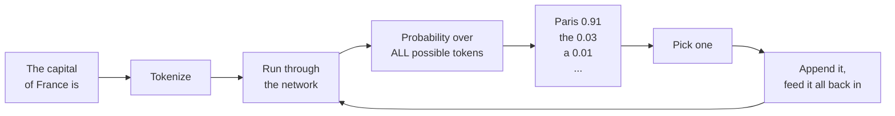

---
tags:
  - Chapter 2
---

# 2.1 Introduction to Large Language Models

!!! objective "In this section"
    - A precise definition of a large language model
    - How an LLM actually produces text — the next-token loop
    - The transformer and the attention mechanism, without maths
    - Why "large" matters, and what emerges from scale
    - The security consequences that follow directly from the architecture

---

## Definition of large language models

Let us build the definition one word at a time, because each word carries weight.

> A **large language model** is a **machine learning model**, trained on a **large** amount of
> **text**, that predicts the **next token** in a sequence.

<dl class="caisp-terms" markdown>

<dt>Machine learning model</dt>
<dd>From Chapter 1: behaviour learned from data, not written as rules. Specifically a deep
neural network — a transformer.</dd>

<dt>Large</dt>
<dd>Two things are large: the <strong>training data</strong> (a substantial fraction of the
public internet — trillions of words) and the <strong>model itself</strong> (billions of
parameters).</dd>

<dt>Text</dt>
<dd>The training material is language: books, articles, code, forums, documentation. The model
learns the statistical structure of language.</dd>

<dt>Predicts the next token</dt>
<dd>This is the entire job. Everything an LLM does — answering questions, writing code,
translating, summarising — is this one operation repeated. Understanding this deflates a lot of
mystique and clarifies a lot of security thinking.</dd>

</dl>

!!! note "That's it. That's the whole thing."
    An LLM is autocomplete. Extraordinarily sophisticated autocomplete, trained on
    civilisation's text, but autocomplete. It does not "want" anything, "know" anything, or
    "understand" in the human sense. It predicts likely next tokens.

    Keep returning to this. When a model does something surprising — helpful or harmful —
    the explanation is always "this was a statistically likely continuation given its
    training", never "the model decided to".

---

## How LLMs work

### The next-token loop

Here is the actual mechanism, start to finish. Suppose you type:

> "The capital of France is"

The model does this:

1. **Tokenize** the input — break it into tokens (Lab 2.2 makes this concrete).
2. **Run** the tokens through the network.
3. **Output a probability for every possible next token** — the whole vocabulary, tens of
   thousands of options, each with a probability.
4. **Select one** (more on this below).
5. **Append it** to the sequence and go back to step 2.

Repeat until the model emits a "stop" token or hits a length limit. That is how a single word
becomes a paragraph: one token at a time, each new token informed by everything before it.

### Selecting the token: why answers vary

Step 4 is where a crucial security property lives. The model does not always pick the highest-
probability token. It usually **samples** from the distribution, controlled by settings you
met in Lab 1.1:

<dl class="caisp-terms" markdown>

<dt>Temperature</dt>
<dd>How much randomness. Low (0.1) = almost always the top token, predictable. High (1.0+) =
adventurous, creative, more likely to go off the rails.</dd>

<dt>Top-p (nucleus sampling)</dt>
<dd>Only consider the most probable tokens whose probabilities sum to <em>p</em> (e.g. 0.9),
then sample among those.</dd>

<dt>Top-k</dt>
<dd>Only consider the <em>k</em> most probable tokens.</dd>

</dl>

!!! danger "The security consequence of sampling"
    Because generation samples from a distribution, **the same prompt can produce different
    outputs**. This is not a bug; it is the design.

    For security this is profound: a defence that blocks an attack on one run may let it
    through on the next. A safety test that passes proves the model was safe *for that sample*,
    not that it is safe. Assurance for LLMs is statistical, never absolute — you reason about
    the *probability* of bad output, and you build enforcement *outside* the model because the
    model's own behaviour is non-deterministic.

---

## The transformer and attention

Every modern LLM is a **transformer**, introduced in the 2017 paper *"Attention Is All You
Need"*. You do not need the maths, but you do need the intuition, because the architecture
explains several vulnerabilities.

### The problem transformers solved

Earlier language models (RNNs, LSTMs) read text **one word at a time, in order**, carrying a
running memory. Two problems:

- **Slow.** Sequential processing cannot be parallelised well, so training on internet-scale
  data was impractical.
- **Forgetful.** By the end of a long paragraph, the running memory had faded on the start.
  Long-range connections — "the trophy… it… too big" — were lost.

### The attention mechanism

The transformer's key idea: **process the whole sequence at once, and let every word look at
every other word to decide what is relevant.** That "looking at" is **attention**.

!!! info "The dinner-party analogy"
    You are at a noisy party, following a conversation. You do not weight every sound equally
    — you *attend* to the person speaking to you, half-attend to an interesting word from the
    next table, and ignore the rest. Your brain assigns attention weights to everything it
    hears.

    Attention does exactly this for words. Reading "The animal didn't cross the street because
    **it** was too tired", the model computes that "it" should attend strongly to "animal"
    (not "street"). Change "tired" to "wide" and "it" now attends to "street". The model
    learns these relationships from data.

This is why transformers handle context, ambiguity, and long-range dependencies so well — and
it is why they are so effective at *following instructions buried anywhere in the input*. The
model attends to relevant tokens regardless of *where* they appear or *who* put them there,
which is exactly the mechanism prompt injection exploits.

### Encoders and decoders

Transformers come in two halves, and which half a model uses defines what it is good at — the
subject of the next section:

- **Encoder** — reads the whole input and builds a rich representation of it. Great for
  *understanding* (classification, search). This is BERT's world.
- **Decoder** — generates output one token at a time, each token attending to what came
  before. Great for *generation*. This is GPT's world.

---

## Why "large" matters: emergence

Something strange and important happens as models grow: **capabilities appear that were never
explicitly trained, and that smaller models simply do not have.** This is called
**emergence**.

A small language model can complete sentences. Make it far larger, train it on far more text,
and — without anyone programming these abilities — it can suddenly translate languages, write
working code, do multi-step reasoning, and follow instructions it has never seen. Nobody added
a "translation module". It emerged from scale.

!!! warning "Emergence is a security problem, not just a marvel"
    Emergence means **you cannot fully enumerate what a large model can do.** Its capabilities
    are discovered, not specified.

    The direct consequence: **you cannot fully enumerate what it can be *made* to do.** A
    model's harmful capabilities are as emergent and as unpredictable as its helpful ones.
    This is why "we didn't train it to do X, so it can't do X" is never a valid security
    argument for an LLM. It may well do X; nobody checked, because nobody can check
    everything.

---

## Importance and impact of LLMs

Why does any of this matter enough to build a course around? Because LLMs crossed a threshold
that changed who uses AI and how.

**They made AI conversational.** Previous ML systems needed a data scientist to use. LLMs
respond to plain language, so *everyone* can use them. That collapsed the barrier to adoption
overnight.

**They generalise.** One model does translation, summarisation, coding, analysis, and chat.
Previously each needed a bespoke system. This generality is why LLMs spread into every kind of
software so fast.

**They act, not just answer.** Increasingly, LLMs are wired to *tools* — they can search the
web, run code, call APIs, send email, and control other software. A model that merely
generated text was a curiosity risk. A model that can *take actions* is a genuine security
concern, because a manipulated decision becomes a real-world consequence. This is the seed of
*excessive agency* (Chapter 3) and of the agent labs (Chapter 7).

### The impact on the threat landscape, summarised

| Property of LLMs | Security consequence |
|---|---|
| Conversational | Anyone can attack them; the payload is English |
| Non-deterministic | Testing is probabilistic; single passes prove little |
| Instruction-following | They follow injected instructions too |
| Emergent capabilities | You cannot enumerate what they can be made to do |
| Wired to tools | Manipulation turns into real-world action |
| Built on shared foundations | One poisoned base model affects thousands downstream |

Every item in that table is a theme of the rest of the course. This section is where they all
originate.

---

!!! question "Check your understanding"
    ??? success "In one sentence, what does an LLM fundamentally do?"
        It predicts the next token in a sequence, repeatedly — everything else (answering,
        coding, translating) is that one operation applied over and over.

    ??? success "Why does the same prompt sometimes give different answers?"
        Because generation samples from a probability distribution over next tokens rather
        than always choosing the single most likely one. Settings like temperature and top-p
        control how much randomness is introduced.

    ??? success "How does the attention mechanism relate to prompt injection?"
        Attention lets the model weigh relevance across the entire input regardless of where
        text appears. It will attend to and follow instruction-like text wherever it sits —
        including text injected by an attacker — because the architecture has no concept of
        which parts of the input are trusted.

    ??? success "Why is 'we didn't train it to do X' a weak security argument for an LLM?"
        Because large models have emergent capabilities that were never explicitly trained and
        cannot be fully enumerated. The absence of intentional training for a behaviour does
        not mean the behaviour is absent.

---

<a class="caisp-card" href="02-gpt-and-bert.md">
  Next · 2.2
  Understanding LLMs — GPT &amp; BERT
  Two architectures, two purposes: generation vs. understanding.
</a>

