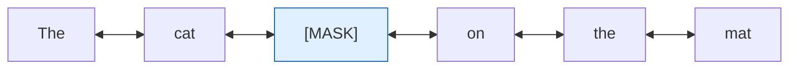

---
tags:
  - Chapter 2
---

# 2.2 Understanding LLMs — GPT and BERT

!!! objective "In this section"
    - What GPT is, what each letter means, and how it generates
    - What BERT is, why "bidirectional" matters, and what it is used for
    - How to choose between them — and why the choice is a security decision
    - The distinct attack surface of each family

---

Two names dominate the history of modern language models, and they represent two different
answers to the question "what should a language model be for?"

- **GPT** — built to **generate**. It writes.
- **BERT** — built to **understand**. It reads.

Both are transformers. They use different halves of the architecture, and that single design
choice ripples through everything: what they can do, how they are used, and how they are
attacked.

---

## GPT — Generative Pre-trained Transformer

Every word in the name is informative.

<dl class="caisp-terms" markdown>

<dt>Generative</dt>
<dd>It produces new text, token by token. This distinguishes it from models that only
classify or score existing text.</dd>

<dt>Pre-trained</dt>
<dd>It was first trained on an enormous general corpus, before being adapted to any specific
task. This is the foundation-model idea from Chapter 1 — train once at great expense, adapt
cheaply many times.</dd>

<dt>Transformer</dt>
<dd>The architecture from section 2.1. Specifically, GPT uses the <strong>decoder</strong>
half.</dd>

</dl>

### How GPT sees text: left to right

GPT is **autoregressive** and **unidirectional**. When predicting a token, it can only attend
to tokens *before* it — never after.


Predicting the token after "the", GPT sees everything to the left and nothing to the right —
because nothing to the right exists yet. It is writing.

!!! info "Why the restriction exists"
    It is not a limitation; it is the *point*. If the model could see future tokens during
    training, predicting them would be trivial — it would learn nothing. The restriction is
    what forces genuine learning about language.

    This restriction is called **causal** or **masked** attention: each position is masked
    from seeing anything ahead of it.

### The training objective

GPT's entire pre-training task is embarrassingly simple: **given this text, predict the next
token.** Take the internet, hide the next word, ask the model to guess, correct it, repeat a
few trillion times.

Everything else — reasoning, translation, coding — emerges from doing that objective
extremely well at extreme scale. That is the emergence discussed in section 2.1.

### What GPT-style models are used for

Chat assistants, content writing, code generation, translation, summarisation, question
answering, agents. If the task produces text, it is a decoder model.

!!! danger "GPT's security profile"
    - **It will continue *any* text.** The base mechanism has no notion of "this instruction
      came from a stranger". Instruction-following and injection-following are the same
      capability.
    - **It can fabricate fluently.** Since it generates plausible continuations rather than
      retrieving facts, hallucination is intrinsic, not accidental.
    - **It can reproduce training data.** Memorised sequences can be regurgitated, which is
      the mechanism behind training-data extraction.
    - **Output is unbounded.** It can generate anything expressible in text, including
      content the surrounding application is not prepared to handle safely.

---

## BERT — Bidirectional Encoder Representations from Transformers

Again, unpack the name.

<dl class="caisp-terms" markdown>

<dt>Bidirectional</dt>
<dd>It sees the whole sentence at once — left <em>and</em> right context simultaneously. This
is the crucial difference.</dd>

<dt>Encoder</dt>
<dd>It uses the encoder half of the transformer. It builds a representation of text rather
than generating new text.</dd>

<dt>Representations</dt>
<dd>Its output is not words; it is rich numerical representations (embeddings) of the input's
meaning.</dd>

</dl>

### How BERT sees text: both directions



BERT sees "The cat **[MASK]** on the mat" and uses *both* sides to infer the hidden word. Full
context makes it far better at understanding meaning than a left-to-right model.

!!! tip "Why bidirectionality matters — a concrete case"
    Consider the word **"bank"**:

    - "I sat on the river **bank**."
    - "I deposited money at the **bank**."

    To disambiguate, you need the words on both sides. GPT, reading left to right, has to
    commit before seeing "river" or "money" in some constructions. BERT sees everything at
    once, so its representation of "bank" is correctly contextualised.

    This is why BERT-family models dominate *understanding* tasks even though they cannot
    write.

### The training objective

BERT trains on two tasks:

1. **Masked Language Modelling (MLM)** — hide ~15% of tokens at random and predict them from
   both-sided context. This is why bidirectionality is possible: there is no "cheating"
   problem because the answer is genuinely hidden.
2. **Next Sentence Prediction** — given two sentences, decide whether the second follows the
   first. (Later variants dropped or replaced this.)

### What BERT-style models are used for

Classification (spam, sentiment, toxicity), named entity recognition, semantic search and
retrieval, embeddings for RAG, content moderation, extractive question answering.

!!! note "You have already used BERT-family models"
    The embedding models that power RAG (section 1.6) are encoder models in this family. So
    are most content classifiers and toxicity filters. BERT is far less famous than GPT but is
    quietly everywhere — including inside the *defences* you will build in Chapter 4.

!!! danger "BERT's security profile"
    - **Adversarial examples.** Classifiers are highly susceptible to small, meaning-preserving
      text perturbations that flip their output. This is exactly what you will do in
      **Lab 2.7** with TextAttack.
    - **Backdoor triggers.** Because classifiers give a discrete output, a backdoor can be
      planted that flips the class on a specific trigger phrase — studied in **Lab 2.9**.
    - **They are often the security control.** When a BERT-style classifier *is* your toxicity
      filter or your spam detector, evading it is the attack. Defeating the classifier defeats
      the defence.
    - **Embedding attacks.** Manipulating embeddings can poison retrieval in a RAG system
      (section 1.6).

---

## GPT vs BERT — side by side

| | **GPT** (decoder) | **BERT** (encoder) |
|---|---|---|
| Direction | Left to right (causal) | Bidirectional |
| Core job | **Generate** text | **Understand** text |
| Output | New tokens | Representations / classifications |
| Training objective | Predict the next token | Predict masked tokens |
| Typical uses | Chat, writing, code, agents | Classification, search, embeddings, moderation |
| Typical size | Very large (billions+) | Smaller (millions to low billions) |
| Runs on a laptop? | Small versions only | Usually yes |
| Headline risk | Injection, hallucination, data regurgitation | Adversarial evasion, backdoors |
| Often deployed as | The product | The **control** protecting the product |

!!! tip "The security framing worth internalising"
    In most real architectures, **GPT-family models are the thing you are protecting, and
    BERT-family models are part of what protects them.**

    A typical guarded LLM application looks like:

    ```
    user input → [encoder classifier: is this malicious?] → GPT → [encoder classifier: is
    this output safe?] → user
    ```

    That means an attacker who can defeat a small encoder classifier has disabled your
    guardrail — and encoder classifiers are *precisely* the models most vulnerable to
    adversarial text perturbation. Lab 2.7 is not an academic exercise; it is an attack on the
    defensive layer you will build in Chapter 4.

---

## Beyond GPT and BERT

The landscape has grown. You should recognise these names:

<dl class="caisp-terms" markdown>

<dt>Encoder-decoder models (T5, BART)</dt>
<dd>Use both halves. Strong at transformation tasks — translation, summarisation — where you
read one thing fully and write another.</dd>

<dt>Modern decoder families (Llama, Mistral, Claude, Gemini, GPT-4 and successors)</dt>
<dd>Almost all frontier chat models are decoder-only, scaled up and refined with instruction
tuning and RLHF.</dd>

<dt>Encoder refinements (RoBERTa, DeBERTa, DistilBERT)</dt>
<dd>Improved or compressed BERT variants. DistilBERT in particular is small enough to run
comfortably on a laptop, which is why it appears in several of this course's labs.</dd>

<dt>Multimodal models</dt>
<dd>Accept images, audio, or video alongside text. They inherit every text vulnerability and
add new input channels — including instructions hidden inside images (section 1.3).</dd>

</dl>

!!! note "Why decoder-only won for chat"
    Encoder-decoder models are elegant, but decoder-only models turned out to scale better and
    to handle *every* task by reframing it as text continuation. Want a translation? Prompt:
    "Translate to French: ...". Want a classification? "Is this spam? ...". One architecture,
    every task — and that generality is why they dominate.

    It is also why the attack surface is so broad: **if every task is text continuation, every
    attack is text.**

---

!!! question "Check your understanding"
    ??? success "Why can't BERT write a paragraph for you?"
        BERT is an encoder trained to produce representations and fill in masked tokens using
        both-sided context. It has no autoregressive generation loop — it was never built to
        produce a sequence of new tokens one after another.

    ??? success "Your company uses a BERT-based toxicity classifier to filter LLM output. An attacker defeats it with small word substitutions. What class of attack is this and why is the classifier vulnerable?"
        An adversarial example / adversarial text attack. Classifiers learn decision boundaries
        from statistical patterns, and small meaning-preserving perturbations can push an input
        across the boundary without changing how a human reads it. Since the classifier *is*
        the control, defeating it disables the guardrail.

    ??? success "Why is hallucination intrinsic to GPT-style models rather than a fixable bug?"
        Because they generate statistically plausible continuations rather than retrieving
        verified facts. Producing fluent, confident, incorrect text is the same mechanism as
        producing fluent, confident, correct text — there is no internal distinction between
        the two.

---

<div class="caisp-cards" markdown>

<a class="caisp-card" href="../03-training-and-augmenting/" markdown>
<span class="caisp-kicker">Next · 2.3</span>
### Training & Augmenting LLMs
Foundational vs. fine-tuned models, and how RAG fits in.
</a>

</div>
