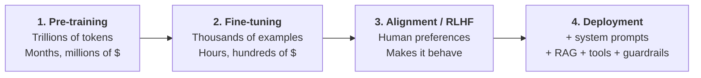
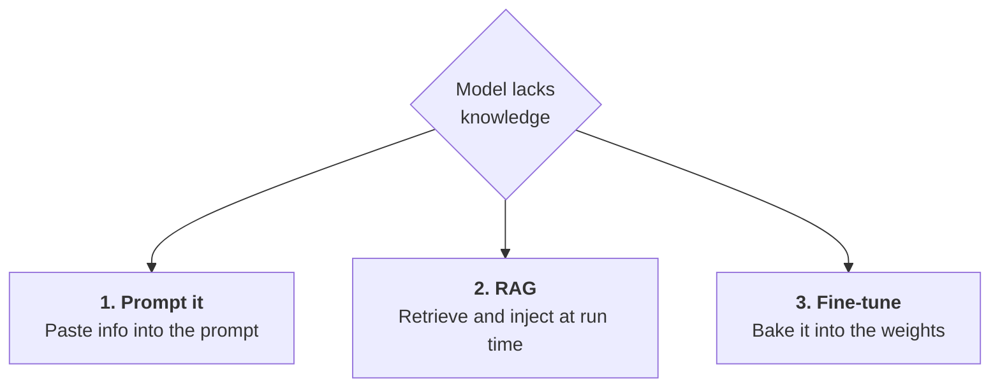

---
tags:
  - Chapter 2
---

# 2.3 Training and Augmenting LLMs

!!! objective "In this section"
    - The full training pipeline: pre-training → fine-tuning → alignment
    - What a foundational model is and why almost nobody trains one
    - What fine-tuning does — and critically, what it does *not* undo
    - The three ways to give a model new knowledge, and when to use each

---

## The training pipeline

A production chat model is not trained once. It goes through distinct stages, each with a
different purpose, cost, and — importantly for us — a different threat profile.

### Stage 1 — Pre-training: building the foundation

The model is trained on a vast general corpus to predict the next token. It learns grammar,
facts, reasoning patterns, coding, and the statistical structure of language itself.

This stage is astronomically expensive — thousands of GPUs running for weeks or months, costing
millions of dollars. The output is a **foundational model** (also *base* or *pre-trained*
model).

!!! warning "A base model is not an assistant"
    A freshly pre-trained model is a pure text-continuer. Give it "What is the capital of
    France?" and it might reply with a list of more quiz questions, because that is a
    statistically plausible continuation of a document containing that sentence.

    It has knowledge but no *instruction-following behaviour*. Turning it into something that
    answers rather than continues is what stages 2 and 3 are for. This is exactly the behaviour
    you saw from `distilgpt2` in Lab 1.1 — a small base model, rambling, because nobody taught
    it to be helpful.

### Stage 2 — Fine-tuning: specialising

Take the pre-trained model and train it further on a much smaller, targeted dataset. This is
cheap by comparison — hours, not months — because you are adjusting an existing model rather
than building one.

Two broad flavours:

<dl class="caisp-terms" markdown>

<dt>Instruction tuning</dt>
<dd>Train on many (instruction, good response) pairs so the model learns the <em>behaviour</em>
of following instructions. This is what converts a text-continuer into an assistant.</dd>

<dt>Domain fine-tuning</dt>
<dd>Train on data from your specific domain — legal documents, medical notes, your product's
support tickets — so the model adopts the vocabulary, tone, and conventions of that field.</dd>

</dl>

### Stage 3 — Alignment (RLHF)

From Chapter 1: humans rank candidate responses, and the model is trained toward preferred
ones. This is where "helpful, harmless, honest" behaviour largely comes from, and where most
refusal behaviour is installed.

!!! note "Safety lives here, and it is a behaviour — not a barrier"
    A model's refusals are *learned tendencies*, produced by training on human preferences.
    They are not access controls or filters. They are a statistical inclination to respond a
    certain way.

    This is precisely why jailbreaks work. You are not bypassing a security mechanism; you are
    finding inputs where the learned tendency does not dominate. That is a fundamentally
    different — and weaker — kind of protection than an enforced boundary, and it is why
    Chapter 4's external guardrails matter so much.

### Stage 4 — Deployment-time augmentation

Finally, the application wraps the model: a system prompt, retrieved documents (RAG), tool
access, and input/output guardrails. No weights change here — this is configuration and
architecture.

---

## Foundational model vs. fine-tuned model

| | **Foundational (base)** | **Fine-tuned** |
|---|---|---|
| Trained on | Vast general corpus | Smaller targeted dataset |
| Cost | Millions of dollars | Hundreds to thousands |
| Who builds them | A handful of large labs | Almost anyone |
| Behaviour | Continues text | Follows instructions / domain-specialised |
| Knowledge | Broad, general | Broad **plus** narrow depth |
| Examples | Llama base, GPT base | ChatGPT, Claude, your company's support bot |

!!! info "The most important economic fact in modern AI"
    **Almost nobody trains a foundational model.** The cost concentrates that ability in a few
    organisations. Everyone else — including essentially every company deploying AI — builds on
    someone else's foundation.

    This creates a supply chain of extraordinary concentration: a small number of base models
    underpin thousands of downstream products. A flaw, bias, or backdoor in one base model
    propagates to everything built on it. Chapter 6 is dedicated to this; Chapter 7 covers
    model-mediated supply-chain attacks that exploit it directly.

### What fine-tuning does not do

This is the security point of the section, and it is consistently misunderstood.

!!! danger "Fine-tuning adapts behaviour. It does not cleanse the model."
    When you fine-tune someone else's model, you keep everything already in the weights:

    - **Memorised training data**, including anything sensitive it absorbed.
    - **Biases** from the original corpus.
    - **Backdoors**, if any were planted. Research consistently shows backdoors frequently
      **survive fine-tuning intact** — the trigger still works afterwards.
    - **Licensing and provenance uncertainty** about what the base was trained on.

    Fine-tuning is a thin layer of new behaviour over an enormous mass of inherited behaviour.
    Treat the base model as a dependency you are shipping — because that is exactly what it is.

And there is a second, less obvious danger running the other way:

!!! danger "Fine-tuning can *remove* safety"
    Alignment (stage 3) is just training. Further training can undo it. Research has repeatedly
    shown that fine-tuning an aligned model on even a small amount of data — sometimes only a
    few hundred examples, and **sometimes data that is not itself harmful** — can substantially
    degrade its safety behaviour.

    Practical implications:

    - If you fine-tune a safety-aligned model, **re-test its safety afterwards**. Do not assume
      the vendor's alignment survived your training run.
    - Anyone who can submit fine-tuning data to your pipeline can potentially strip your
      model's refusals. Treat fine-tuning datasets as high-integrity assets.

---

## Three ways to give a model knowledge

A question you will face constantly in real work: *"the model doesn't know about X — how do we
fix that?"* There are three answers, and choosing correctly is both an engineering and a
security decision.

### 1. Put it in the prompt

Simply include the information in the context. Zero infrastructure, instant updates.

**Use when:** the information is small, static, and non-sensitive — a tone guide, a short
policy, a few examples.

**Limits:** context windows are finite, long prompts cost money on every call, and anything in
the prompt is potentially extractable (Lab 1.1).

### 2. Retrieval Augmented Generation

Fetch relevant documents at query time and inject them (section 1.6).

**Use when:** the knowledge is large, changes frequently, needs citations, or must be
permission-controlled and deletable. **This is the right default for company knowledge.**

**Limits:** retrieval quality caps answer quality, and the corpus becomes an attack surface —
indirect prompt injection and access-control bypass.

### 3. Fine-tuning

Train the knowledge into the weights.

**Use when:** you need a change in *style, format, or behaviour* rather than facts — a
consistent tone, a rigid output structure, or domain-specific phrasing.

**Limits:** expensive, slow to update, and — decisively — **you cannot reliably delete what you
bake in.**

!!! tip "The rule of thumb that will serve you well"
    **Fine-tune for *behaviour*. Use RAG for *knowledge*.**

    Teams routinely get this backwards. They fine-tune a model on their documentation, then
    discover that updating a document means retraining, that the model still hallucinates
    details, that it cannot cite sources, and that they now have customer data permanently
    embedded in weights they cannot un-embed.

    That last point is the one that becomes a legal problem. Under data protection regimes with
    a right to erasure, "we trained it into the model" is not a defensible answer to a deletion
    request. RAG lets you delete a row. Fine-tuning does not.

### Comparison

| | Prompt | RAG | Fine-tuning |
|---|---|---|---|
| Setup cost | None | Moderate | High |
| Update speed | Instant | Minutes | Retrain |
| Handles large corpora | No | Yes | Partially |
| Citations | Manual | Yes | No |
| Permission control | No | **Yes** | No |
| **Deletable** | Yes | **Yes** | **No** |
| Best for | Small static context | Knowledge | Behaviour & style |
| Main risk | Prompt extraction | Corpus poisoning | Inherited + baked-in data |

---

!!! question "Check your understanding"
    ??? success "Why does a freshly pre-trained base model make a poor chatbot?"
        It has only learned to continue text, not to follow instructions. Asked a question, it
        may continue with more questions or unrelated text, because that is a plausible
        continuation. Instruction tuning and alignment are what produce assistant behaviour.

    ??? success "Your team fine-tunes a safety-aligned model on internal support tickets. What must you do afterwards, and why?"
        Re-test its safety behaviour. Alignment is itself a product of training, and further
        fine-tuning — even on benign data — can measurably degrade refusal behaviour. You
        cannot assume the vendor's safety properties survived your training run.

    ??? success "A company wants its assistant to know its 40,000-page internal wiki, which changes daily. Fine-tune or RAG? Why?"
        RAG. The corpus is large, changes constantly, needs citations, should respect user
        permissions, and must support deletion. Fine-tuning would be expensive, stale
        immediately, uncitable, and would bake content into weights where it cannot be removed.

---

<a class="caisp-card" href="../04-use-cases/" markdown>
Next · 2.4
### Use Cases of LLMs
Generation, understanding, and conversational AI — and the risk each carries.
</a>

