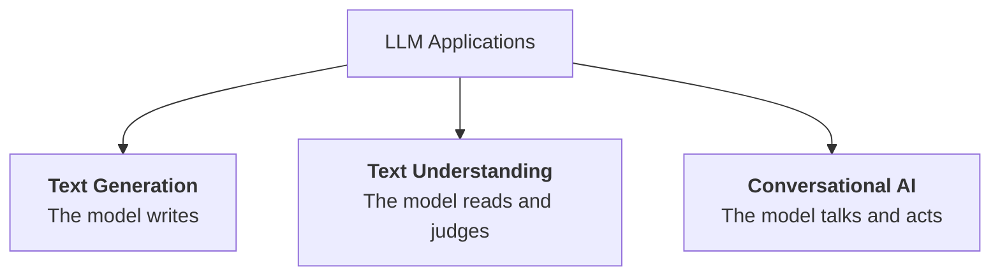
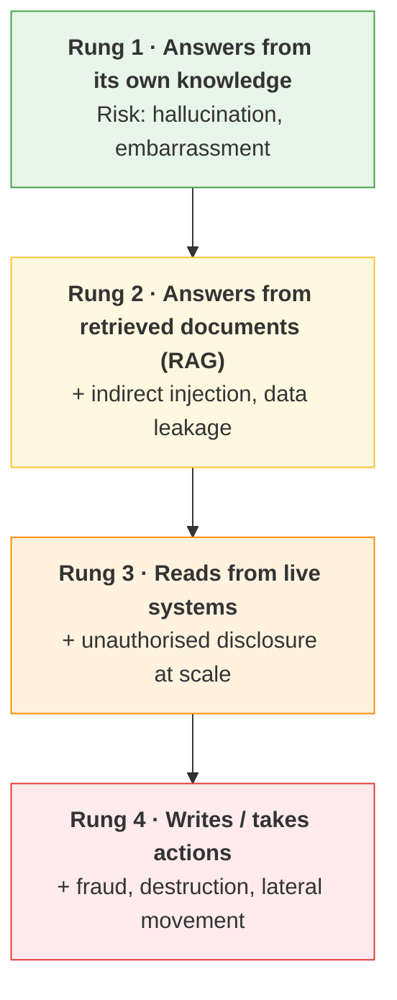

---
tags:
  - Chapter 2
---

# 2.4 Use Cases of LLMs

!!! objective "In this section"
    - The three broad families of LLM application
    - Concrete examples of each, as deployed in real organisations
    - The specific risk profile that attaches to each family
    - Why *what the system does* determines *how badly it can fail*

---

Understanding use cases is not filler before the attack material — it *is* attack material.
Recall the principle from Chapter 1: **severity depends far more on what the system is
permitted to do than on the cleverness of the attack.** To assess risk, you must first classify
what kind of system you are looking at.

LLM applications fall into three broad families.

---

## Text generation

The model produces new content. This is the use case most people picture.

### Common applications

<dl class="caisp-terms" markdown>

<dt>Content writing</dt>
<dd>Marketing copy, product descriptions, documentation drafts, email.</dd>

<dt>Code generation</dt>
<dd>Autocomplete in the IDE, boilerplate, test scaffolding, code translation between
languages.</dd>

<dt>Summarisation</dt>
<dd>Condensing long documents, meeting transcripts, ticket threads. (You build one in
<strong>Lab 2.3</strong>.)</dd>

<dt>Translation and rewriting</dt>
<dd>Between languages, or between registers — formal to casual, technical to plain.</dd>

<dt>Synthetic data</dt>
<dd>Generating test data or training examples where real data is scarce or sensitive.</dd>

</dl>

!!! danger "Risk profile — text generation"
    - **Hallucination with consequences.** Generated content is fluent and confident whether
      or not it is correct. A hallucinated legal citation, dosage, or API that does not exist
      can cause real harm when someone acts on it.
    - **Insecure code generation.** Models learned from public code, including insecure public
      code. They will happily produce SQL string concatenation, weak crypto, and hardcoded
      secrets. Generated code is *unreviewed third-party code* and must be treated as such.
    - **Package hallucination → a live supply-chain attack.** Models invent plausible-sounding
      library names that do not exist. Attackers watch for commonly hallucinated names and
      **register those packages** with malicious content. A developer follows the model's
      suggestion, installs it, and is compromised. This is covered properly in Chapter 6 —
      note that it is a genuine attack technique, not a theoretical one.
    - **Training data regurgitation.** Generation can reproduce memorised content, including
      copyrighted text, personal data, or secrets from the training corpus.
    - **Scaled abuse.** The same capability that writes good marketing copy writes convincing
      phishing at volume. This is the capability underlying the criminal tools in section 2.6.

---

## Text understanding

The model reads existing text and produces a judgement, a label, or a structured extraction.
Less glamorous, extremely widespread — and frequently *security-critical*.

### Common applications

<dl class="caisp-terms" markdown>

<dt>Classification</dt>
<dd>Spam or not, sentiment, topic, priority, language. (<strong>Lab 2.8</strong>.)</dd>

<dt>Content moderation</dt>
<dd>Detecting toxicity, harassment, or policy violations at scale.</dd>

<dt>Named entity recognition</dt>
<dd>Pulling names, dates, amounts, and identifiers out of unstructured text — used heavily in
document processing and, notably, in PII detection.</dd>

<dt>Semantic search and retrieval</dt>
<dd>The embedding-and-ranking layer behind RAG (<strong>Lab 2.6</strong>).</dd>

<dt>Information extraction</dt>
<dd>Turning invoices, contracts, or reports into structured records.</dd>

</dl>

!!! danger "Risk profile — text understanding"
    - **These systems are often the control itself.** Your toxicity filter, spam detector, PII
      redactor, and prompt-injection classifier are all text-understanding models. **Evading
      one is not a nuisance — it is defeating the defence.**
    - **Adversarial evasion is well-established.** Small, meaning-preserving perturbations flip
      classifier outputs reliably. You will demonstrate this yourself in **Lab 2.7**.
    - **Backdoors are especially attractive here.** A discrete output makes a clean target: plant
      a trigger that forces "benign" and you have a permanent bypass. **Lab 2.9**.
    - **Silent failure.** A generator that fails produces visible nonsense. A classifier that
      fails produces a *confident wrong label* that flows silently into a downstream decision.
      Nobody notices until the consequences accumulate.
    - **Automation bias.** Because these models produce a clean label and a confidence score,
      humans over-trust them. A 94% confidence figure feels like evidence; it is not. Chapter 3
      treats this as *overreliance*.

---

## Conversational AI

The model holds a multi-turn dialogue — and increasingly, *takes actions*. This family carries
by far the highest risk, because it combines untrusted input, memory, and capability.

### Common applications

<dl class="caisp-terms" markdown>

<dt>Customer support assistants</dt>
<dd>Answering questions, looking up orders, and often performing account actions.</dd>

<dt>Internal knowledge assistants</dt>
<dd>"Ask the company wiki" — almost always RAG-backed, almost always over-permissioned.</dd>

<dt>Coding assistants</dt>
<dd>Conversational pair programmers with access to your repository and sometimes your
terminal.</dd>

<dt>Agents</dt>
<dd>Systems that plan and execute multi-step tasks using tools: browsing, running code, calling
APIs, sending messages. Covered in depth in Chapter 7.</dd>

</dl>

### The escalation ladder

The single most useful mental model for assessing a conversational system is to ask *where on
this ladder it sits*:

!!! danger "Risk profile — conversational AI"
    - **Direct prompt injection.** The user talks to the model; the user can instruct the model.
    - **Indirect prompt injection.** Retrieved documents, emails, web pages, and tickets reach
      the prompt. Someone who never speaks to the victim can still control the conversation
      (section 1.6).
    - **Excessive agency.** The gap between what the model *can* do and what it *needs* to do is
      where fraud lives. Rung 4 turns a language flaw into a financial one.
    - **Conversation memory as an attack surface.** History is re-sent every turn (Lab 1.1). An
      instruction planted early can influence many later turns — and can persist across a
      session in ways users never see.
    - **Confused deputy.** The model acts with *its own* privileges, not the user's. If the
      assistant has broad API access, a low-privileged user who manipulates it has effectively
      borrowed that access. This is one of the most common serious findings in real
      assessments.

!!! tip "The single most valuable question you can ask about any AI deployment"
    **"What rung is it on, and does it need to be that high?"**

    Most business value sits on rungs 1–2. Most catastrophic risk sits on rungs 3–4. Teams
    routinely put systems on rung 4 for convenience when rung 2 would have met the requirement.
    Pushing a system *down* the ladder is often the highest-impact security recommendation you
    can make — and it is far more effective than any prompt-level mitigation.

---

## Mapping use case to risk — the summary table

| Family | The model... | Headline risks | Typical worst case |
|---|---|---|---|
| **Generation** | Writes | Hallucination, insecure code, package hallucination, regurgitation | Someone acts on false output; a vulnerability ships |
| **Understanding** | Judges | Adversarial evasion, backdoors, silent failure, overreliance | A control is bypassed and nobody notices |
| **Conversation** | Talks & acts | Injection (direct + indirect), excessive agency, confused deputy | Unauthorised action taken with the system's privileges |

---

!!! question "Check your understanding"
    ??? success "Why is a text-understanding model often more security-critical than a generation model?"
        Because understanding models are frequently deployed *as the security control* — the
        spam filter, toxicity classifier, PII detector, or injection detector. Evading one does
        not merely produce a bad output; it disables the defence protecting everything
        downstream.

    ??? success "What is 'package hallucination' and why is it a supply-chain attack rather than just a quality bug?"
        A model invents a plausible library name that does not exist. Attackers monitor
        commonly hallucinated names, register those package names with malicious content, and
        wait. Developers who trust the suggestion install attacker-controlled code. The
        hallucination is the *delivery mechanism* for a real compromise.

    ??? success "An assistant can read customer records and issue refunds. Which rung is it on, and what would you recommend?"
        Rung 4 — it takes write actions. Recommend pushing it down: have it *draft* refunds for
        human approval rather than issue them, scope its data access to the requesting user's
        own records, and enforce hard value limits in the application layer rather than in the
        prompt.

---

<a class="caisp-card" href="05-attack-tactics-atlas.md">
  Next · 2.5
  Attack Tactics — ATT&amp;CK &amp; ATLAS
  The attacker's playbook for AI systems, walked tactic by tactic.
</a>

