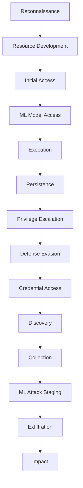

---
tags:
  - Chapter 2
  - MITRE ATLAS
---

# 2.5 Attack Tactics and Techniques — MITRE ATT&CK and ATLAS

!!! objective "In this section"
    - What MITRE ATT&CK is and why a shared attacker vocabulary matters
    - What MITRE ATLAS is and how it extends ATT&CK to AI
    - Every ATLAS tactic, walked through in kill-chain order, in plain language
    - How to use ATLAS in real assessments — as a checklist, not a curiosity

---

## Why we need a shared vocabulary for attacks

Imagine three analysts describing the same incident. One says "they tricked the chatbot". Another
says "prompt manipulation occurred". A third says "instruction override via user input". They are
describing the *same thing*, but nobody can tell, so the knowledge does not accumulate and the
defences do not get built.

Security matured by fixing this problem with **shared frameworks** — agreed names for attacker
behaviours, so that a technique observed by one team can be recognised, communicated, and
defended by everyone. The dominant framework for traditional systems is **MITRE ATT&CK**. Its
AI-focused counterpart is **MITRE ATLAS**.

---

## MITRE ATT&CK

**ATT&CK** (Adversarial Tactics, Techniques, and Common Knowledge) is a free, continuously
updated knowledge base of how real attackers behave, built from observed incidents.

It is organised as a matrix with two levels:

<dl class="caisp-terms" markdown>

<dt>Tactics — the <em>why</em></dt>
<dd>The attacker's goal at a stage of the attack. "Initial Access", "Persistence",
"Exfiltration". The columns of the matrix. There are relatively few, and they map to the phases
of an attack.</dd>

<dt>Techniques — the <em>how</em></dt>
<dd>The specific method used to achieve a tactic. "Phishing" is a technique for achieving
"Initial Access". There are hundreds.</dd>

</dl>

Reading a matrix left to right roughly traces an attack's lifecycle — get in, establish
yourself, look around, achieve the objective. This lifecycle framing is often called a **kill
chain**, and it is powerful for defenders: **you do not have to stop every technique, only break
the chain at one link.**

!!! info "Why frameworks like this matter to you specifically"
    - **Communication.** "We observed ATLAS Reconnaissance followed by ML Model Access" is
      precise and unambiguous across any team.
    - **Coverage.** Walking the matrix reveals the tactics you have *no* visibility into — your
      blind spots, made explicit.
    - **Threat intelligence.** Reports describe adversaries in these terms, so you can map what
      others have seen onto your own defences.
    - **Exam relevance.** You should be able to name the ATLAS tactics in order and place a given
      attack into the right one. Learn the shape now; the labs make the techniques concrete.

---

## MITRE ATLAS

**ATLAS** (Adversarial Threat Landscape for Artificial-Intelligence Systems) is ATT&CK adapted
for machine learning. It keeps the tactics-and-techniques structure and the many tactics that
still apply, then adds AI-specific ones that have no traditional equivalent — like **ML Model
Access** and **ML Attack Staging**.

!!! tip "The relationship in one line"
    ATLAS is ATT&CK, plus the AI-specific tactics, minus nothing that still applies. Attacking
    an AI system usually blends *traditional* techniques (phishing your way in) with *ML-specific*
    ones (poisoning the training data once you are in).

The rest of this section walks every ATLAS tactic in kill-chain order. For each: what the
attacker wants, what it looks like against an AI system, and where it appears later in this
course.

---

## The ATLAS tactics, in order

### 1. Reconnaissance — *learning about the target*

The attacker gathers information before acting. Against an AI system, they want to know: what
model is this? What is it allowed to do? How is it defended?

Techniques include probing the model with crafted inputs to fingerprint it, reading public
documentation and research about the model family, scanning the application for exposed
endpoints, and searching for the organisation's published AI details (job posts mentioning the
stack, conference talks, model cards).

**Defender's view:** much of your attack surface is *published*. A model card, a blog post about
your architecture, or an over-detailed error message all feed reconnaissance.

*Later in this course: threat modeling (Chapter 5) is reconnaissance performed on yourself.*

### 2. Resource Development — *building the tooling*

The attacker acquires or builds what they need: compute, accounts, datasets, and — increasingly
— *malicious models or tooling*. This is where an attacker might obtain a criminal LLM service
(section 2.6), assemble a poisoned dataset, or stand up infrastructure to host a trojanised
model.

**Defender's view:** you rarely see this stage, but its *products* — a poisoned dataset, a
trojanised model on a public hub — arrive at your door through the supply chain (Chapter 6).

### 3. Initial Access — *getting a foothold*

The attacker establishes their first point of interaction. For AI systems this is often trivial
and legitimate: **using the public chat interface**. The "foothold" may simply be the text box
you deliberately exposed to the world.

Other paths: a **supply-chain compromise** (a poisoned dependency or model), a **phishing**
attack on an ML engineer, or exploiting an exposed ML platform (an unauthenticated notebook
server, an open model registry — see Chapter 4).

!!! note "For most LLM apps, initial access is free"
    The whole point of a public assistant is that anyone can talk to it. This inverts
    traditional thinking, where getting in is the hard part. Here, getting in is the *feature*;
    the security work is everything after.

### 4. ML Model Access — *reaching the model itself*

An ATLAS-specific tactic with degrees of access, and the degree shapes every downstream attack:

<dl class="caisp-terms" markdown>

<dt>No access</dt>
<dd>The attacker cannot interact with the model at all.</dd>

<dt>Query access (black box)</dt>
<dd>They can send inputs and see outputs, but not internals. This is the position of any user of
a public API — and it is enough for prompt injection, jailbreaks, model extraction, and
membership inference.</dd>

<dt>Full access (white box)</dt>
<dd>They have the weights themselves — via download, theft, or an open release. With white-box
access, adversarial examples become far easier to craft precisely.</dd>

</dl>

**Defender's view:** assume every public model is under black-box attack continuously. Guard
white-box access (the weights) as the crown-jewel asset it is.

### 5. Execution — *running malicious content*

The attacker gets code or instructions to run. In the AI context this has two distinct flavours:

- **Traditional code execution** — e.g. a malicious model file that runs code when loaded (the
  pickle problem from Chapter 1; you scan for it in Chapter 4).
- **"Execution" of injected instructions** — prompt injection, where the model *carries out*
  attacker instructions embedded in its input. The model becomes the execution engine for
  attacker intent.

*Later: prompt injection is the whole of Chapter 3's opening; malicious model files run in
Chapters 4 and 6.*

### 6. Persistence — *staying in*

The attacker maintains their foothold across restarts, retraining, and patches. AI-specific
persistence is genuinely novel and genuinely alarming:

- **Backdoors in the model** — planted during training or fine-tuning, activated by a trigger,
  and often surviving fine-tuning (Lab 2.9; Chapter 6).
- **Poisoned training data** that persists into every model retrained on it.
- **Malicious content in a RAG corpus** that keeps influencing outputs until someone finds and
  removes it.

!!! warning "AI persistence outlives your patches"
    A backdoor in the weights is not fixed by patching the application, rotating credentials, or
    rebuilding servers. It persists until the model is retrained or replaced — which is expensive
    and, if you do not know the backdoor exists, will not happen. This durability is what makes
    supply-chain attacks on AI so serious.

### 7. Privilege Escalation — *gaining more power*

The attacker expands what they can do. In AI systems this frequently means **exploiting the
model's privileges rather than the attacker's own** — the *confused deputy* from section 2.4. A
low-privileged user manipulates an over-permissioned assistant into acting with the assistant's
higher privileges.

It also covers traditional escalation on the ML infrastructure — from a compromised notebook to
the cloud role it runs under, which is often far too broad.

### 8. Defense Evasion — *avoiding detection and controls*

The attacker evades the defences. This is a rich, active area for AI:

- **Adversarial perturbations** that slip past a classifier-based filter (Lab 2.7).
- **Encoding and obfuscation** — base64, unusual Unicode, homoglyphs, foreign languages, "leet
  speak" — to bypass keyword and pattern filters while remaining readable to the model.
- **Jailbreak framings** — role-play, hypotheticals, and step-by-step decompositions that route
  around learned refusals.
- **Splitting a payload** across turns so no single message looks malicious.

!!! tip "Why evasion is so productive against AI"
    Recall from Chapter 1: language is infinitely paraphrasable, and defences based on matching
    known-bad strings fail almost immediately. Evasion against AI is not a special skill; it is
    the *default* state of natural-language input. This is why robust defence must be behavioural
    and architectural, never a blocklist.

### 9. Credential Access — *stealing secrets*

The attacker obtains credentials, keys, and other secrets. AI systems are a rich new source:

- **Secrets in the system prompt** — the exact weakness you saw in Lab 1.1, extractable via
  injection.
- **Secrets in training data** — models memorise and can regurgitate API keys and passwords that
  were in the corpus.
- **Secrets reachable through tools** — an assistant with access to internal systems can be
  talked into revealing what those systems hold.

### 10. Discovery — *mapping the environment*

Having gained access, the attacker learns about the internal environment. Against an AI system:
extracting the system prompt to learn the rules and available tools, enumerating what functions
or plugins the model can call, probing the RAG corpus to learn what documents exist, and mapping
the model's knowledge and limits.

**Defender's view:** every piece of your system the model can describe, an attacker can learn by
asking. Assume the system prompt, the tool list, and the corpus structure are all discoverable.

### 11. Collection — *gathering the target data*

The attacker collects what they came for, before extracting it. In AI systems this means
harvesting sensitive information the model can reach: querying a RAG system for confidential
documents, systematically extracting memorised training data, or accumulating the query/response
pairs needed to clone the model.

### 12. ML Attack Staging — *preparing the ML-specific attack*

An ATLAS-specific tactic: the offline preparation that AI attacks uniquely require. Before
striking, the attacker may:

- **Train a proxy (surrogate) model** that imitates the target, to craft attacks against
  cheaply.
- **Craft adversarial examples** using that proxy or white-box access.
- **Build the poisoned dataset** or the backdoored model that will be delivered.
- **Verify the attack works** in their own environment first.

!!! info "This stage is why AI attacks can be so precise"
    A great deal of AI attack work happens *offline*, against a copy, before the target ever
    sees anything. By the time the attack lands, it has been tuned to succeed. Defenders see only
    the final, polished strike — not the staging behind it.

### 13. Exfiltration — *getting the data out*

The attacker removes the collected data. AI-specific channels include:

- **Extraction through model outputs** — coaxing the model to emit sensitive data in its
  responses.
- **Encoding data into a URL or image** that the model renders, silently leaking it when the
  page loads (an insecure-output-handling combination from Chapter 3).
- **Reconstructing the model itself** through systematic querying — the model *is* the exfiltrated
  asset (model extraction / theft).

### 14. Impact — *causing the harm*

The attacker's actual objective, the reason for everything before it:

- **Fraud** — manipulating an assistant that touches money or accounts.
- **Availability / cost** — model denial of service and denial of wallet (Chapter 3).
- **Integrity** — making the system produce wrong outputs, whether via poisoning or manipulation,
  eroding trust or driving bad decisions.
- **Disinformation and harmful content** at scale.
- **Reputational and legal damage** from the model behaving unacceptably in public.

---

## Using ATLAS in practice

ATLAS is not a museum piece. Use it as a working tool.

**As a coverage checklist.** For each tactic, ask: *could an attacker do this to my system, and
would I know?* The tactics where the answer is "yes / no" are your priorities.

**As a communication standard.** Describe findings and incidents in ATLAS terms so they are
unambiguous and comparable.

**As a threat-modeling input.** In Chapter 5 you will pull threats from ATLAS directly into a
structured threat model.

**As a red-team plan.** An authorised assessment can walk the matrix deliberately, attempting
each applicable tactic in turn.

!!! tip "A realistic combined attack, in ATLAS terms"
    To make the matrix concrete, here is a plausible attack on the refund assistant from
    Chapter 1, mapped end to end:

    1. **Reconnaissance** — probe the bot to identify the model and its refund capability.
    2. **Resource Development** — draft and test injection payloads offline.
    3. **Initial Access** — open the public chat (free).
    4. **ML Model Access** — black-box query access via that chat.
    5. **Discovery** — extract the system prompt to learn the rules and the refund tool.
    6. **Defense Evasion** — rephrase past the input filter using a role-play framing.
    7. **Execution** — prompt injection makes the model treat the attacker text as instructions.
    8. **Privilege Escalation** — the model acts with *its* refund privilege (confused deputy).
    9. **Impact** — unauthorised refunds issued. Fraud achieved.

    Notice: only steps 6–8 are "AI-specific". The rest is ordinary attacker methodology. That
    blend is exactly why you need both ATT&CK and ATLAS.

---

!!! question "Check your understanding"
    ??? success "What is the difference between a tactic and a technique?"
        A tactic is the attacker's goal at a stage (the *why*) — e.g. Persistence. A technique
        is a specific method for achieving it (the *how*) — e.g. planting a backdoor in the
        model. Tactics are few; techniques are many.

    ??? success "Which two ATLAS tactics have essentially no traditional-security equivalent, and why?"
        **ML Model Access** (the degree of access to a model — query vs. full — is unique to ML
        systems) and **ML Attack Staging** (the offline preparation, like training surrogate
        models and crafting adversarial examples, that only ML attacks require).

    ??? success "Why does the concept of a kill chain help defenders even if they cannot stop every technique?"
        Because an attacker usually must chain several tactics to reach their goal. Breaking the
        chain at any single link disrupts the whole attack, so a defender can succeed by
        covering their strongest points rather than defending everything perfectly.

---

<a class="caisp-card" href="../06-malicious-llm-tools/" markdown>
Next · 2.6
### Real-World Malicious LLM Tools
WormGPT, FraudGPT, and what the criminal market means for defenders.
</a>

