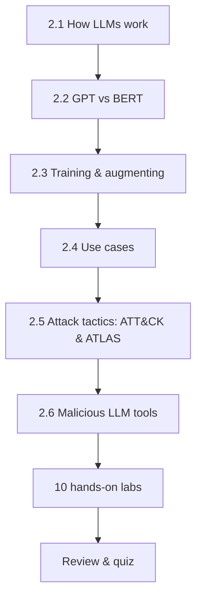

---
tags:
  - Chapter 2
---

# Chapter 2 — Understanding and Attacking Large Language Models

<ul class="caisp-meta">
  <li>Level: Beginner → Intermediate</li>
  <li>Reading: ~2.5 hrs</li>
  <li>Labs: 10</li>
  <li>Prereq: Chapter 1</li>
</ul>

This is the biggest chapter in the course, and the most important. In Chapter 1 you learned
*what* AI is. Here you learn how large language models actually work under the hood, and then
you start attacking them — first understanding the attacker's playbook (MITRE ATLAS), then
running ten hands-on labs that alternate between *building* LLM systems and *breaking* them.

The philosophy of this chapter is simple: **you cannot secure what you cannot build.** So you
will build a chatbot, a summarizer, a scraper, a fine-tuned model, and a RAG system — and then
you will attack models with real adversarial tooling and study how backdoors work.

!!! objective "What you will be able to do after this chapter"
    - Explain the **transformer** architecture and the **attention** mechanism in plain
      language.
    - Distinguish **GPT** (decoder, generative) from **BERT** (encoder, understanding) and
      say when each is used.
    - Explain the difference between a **foundational** model and a **fine-tuned** model, and
      the security implications of each.
    - Navigate the **MITRE ATLAS** matrix and map a real attack to its tactics, tactic by
      tactic.
    - Explain what tools like **WormGPT** and **FraudGPT** are, why they exist, and what
      their existence means for defenders — without building anything harmful.
    - **Build** a chatbot, tokenizer explorer, summarizer, fine-tuned model, web scraper,
      and RAG system.
    - **Attack** a model with TextAttack, and understand how **backdoors** are planted and
      detected.

---

## How this chapter flows

The concept sections build your mental model. The labs make it real. Do them interleaved: read
2.1–2.4, then do the "building" labs (2.1–2.6); read 2.5–2.6, then do the "attacking" labs
(2.7–2.9). The speech-to-text lab (2.10) rounds out your understanding of multimodal systems.

---

## Sections

<a class="caisp-card" href="01-intro-to-llms.md">
  2.1
  Introduction to LLMs
  What an LLM is, how the transformer works, and why attention changed everything.
</a>
<a class="caisp-card" href="02-gpt-and-bert.md">
  2.2
  Understanding LLMs — GPT &amp; BERT
  Two families, two philosophies: generation vs. understanding.
</a>
<a class="caisp-card" href="03-training-and-augmenting.md">
  2.3
  Training &amp; Augmenting LLMs
  Foundational vs. fine-tuned models, and RAG as augmentation.
</a>
<a class="caisp-card" href="04-use-cases.md">
  2.4
  Use Cases of LLMs
  Generation, understanding, and conversational AI — with the risks of each.
</a>
<a class="caisp-card" href="05-attack-tactics-atlas.md">
  2.5
  Attack Tactics — ATT&amp;CK &amp; ATLAS
  The attacker's playbook, walked tactic by tactic.
</a>
<a class="caisp-card" href="06-malicious-llm-tools.md">
  2.6
  Real-World Malicious LLM Tools
  WormGPT, FraudGPT, and what the criminal market tells defenders.
</a>

## Labs

<a class="caisp-card" href="lab-01-simple-chatbot.md">
  Lab 2.1 · Build
  A Simple Chatbot
  A clean, minimal chatbot to anchor the chapter.
</a>
<a class="caisp-card" href="lab-02-tokenizers.md">
  Lab 2.2 · Build
  How Tokenizers Work
  See the world the way a model does — in tokens.
</a>
<a class="caisp-card" href="lab-03-summarizer.md">
  Lab 2.3 · Build
  Build a Summarizer
  Condense text with an LLM, and probe where it fails.
</a>
<a class="caisp-card" href="lab-04-fine-tuning.md">
  Lab 2.4 · Build
  Fine-tune a Model
  Specialise a model on your own data — and inherit its risks.
</a>
<a class="caisp-card" href="lab-05-scraper.md">
  Lab 2.5 · Build
  A Website Scraper
  Feed the web to an LLM — and meet indirect injection.
</a>
<a class="caisp-card" href="lab-06-rag.md">
  Lab 2.6 · Build
  Build a RAG System
  The most important architecture in enterprise AI.
</a>
<a class="caisp-card" href="lab-07-textattack.md">
  Lab 2.7 · Attack
  Attacking with TextAttack
  Adversarial examples against a real classifier.
</a>
<a class="caisp-card" href="lab-08-sentiment.md">
  Lab 2.8 · Build
  Sentiment Analysis
  Classification, confidence, and why confidence lies.
</a>
<a class="caisp-card" href="lab-09-backdoors.md">
  Lab 2.9 · Defend
  Backdoor Attacks (Defensive)
  How backdoors work, and how to detect them.
</a>
<a class="caisp-card" href="lab-10-speech-to-text.md">
  Lab 2.10 · Build
  Speech-to-Text
  Multimodal input, and the attack surface it opens.
</a>

---

!!! danger "Rules of engagement — still apply, more than ever"
    This chapter contains genuine offensive techniques. Run them **only** against the local
    labs provided here or systems you are explicitly authorised to test. The
    [rules of engagement](../start-here/index.md) are not boilerplate — in this chapter they
    are the difference between education and a crime.
