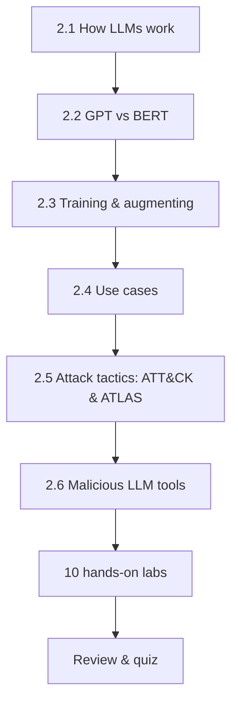

---
tags:
  - Chapter 2
---

# Chapter 2 — Understanding and Attacking Large Language Models

<ul class="caisp-meta">
  <li>Level: Beginner → Intermediate</li>
  <li>Reading: ~2.5 hrs</li>
  <li>Labs: 10</li>
  <li>Prereq: Chapter 1</li>
</ul>

This is the biggest chapter in the course, and the most important. In Chapter 1 you learned
*what* AI is. Here you learn how large language models actually work under the hood, and then
you start attacking them — first understanding the attacker's playbook (MITRE ATLAS), then
running ten hands-on labs that alternate between *building* LLM systems and *breaking* them.

The philosophy of this chapter is simple: **you cannot secure what you cannot build.** So you
will build a chatbot, a summarizer, a scraper, a fine-tuned model, and a RAG system — and then
you will attack models with real adversarial tooling and study how backdoors work.

!!! objective "What you will be able to do after this chapter"
    - Explain the **transformer** architecture and the **attention** mechanism in plain
      language.
    - Distinguish **GPT** (decoder, generative) from **BERT** (encoder, understanding) and
      say when each is used.
    - Explain the difference between a **foundational** model and a **fine-tuned** model, and
      the security implications of each.
    - Navigate the **MITRE ATLAS** matrix and map a real attack to its tactics, tactic by
      tactic.
    - Explain what tools like **WormGPT** and **FraudGPT** are, why they exist, and what
      their existence means for defenders — without building anything harmful.
    - **Build** a chatbot, tokenizer explorer, summarizer, fine-tuned model, web scraper,
      and RAG system.
    - **Attack** a model with TextAttack, and understand how **backdoors** are planted and
      detected.

---

## How this chapter flows

The concept sections build your mental model. The labs make it real. Do them interleaved: read
2.1–2.4, then do the "building" labs (2.1–2.6); read 2.5–2.6, then do the "attacking" labs
(2.7–2.9). The speech-to-text lab (2.10) rounds out your understanding of multimodal systems.

---

## Sections

<a class="caisp-card" href="../01-intro-to-llms/" markdown>
2.1
### Introduction to LLMs
What an LLM is, how the transformer works, and why attention changed everything.
</a>

<a class="caisp-card" href="../02-gpt-and-bert/" markdown>
2.2
### Understanding LLMs — GPT & BERT
Two families, two philosophies: generation vs. understanding.
</a>

<a class="caisp-card" href="../03-training-and-augmenting/" markdown>
2.3
### Training & Augmenting LLMs
Foundational vs. fine-tuned models, and RAG as augmentation.
</a>

<a class="caisp-card" href="../04-use-cases/" markdown>
2.4
### Use Cases of LLMs
Generation, understanding, and conversational AI — with the risks of each.
</a>

<a class="caisp-card" href="../05-attack-tactics-atlas/" markdown>
2.5
### Attack Tactics — ATT&CK & ATLAS
The attacker's playbook, walked tactic by tactic.
</a>

<a class="caisp-card" href="../06-malicious-llm-tools/" markdown>
2.6
### Real-World Malicious LLM Tools
WormGPT, FraudGPT, and what the criminal market tells defenders.
</a>

## Labs

<a class="caisp-card" href="../lab-01-simple-chatbot/" markdown>
Lab 2.1 · Build
### A Simple Chatbot
A clean, minimal chatbot to anchor the chapter.
</a>

<a class="caisp-card" href="../lab-02-tokenizers/" markdown>
Lab 2.2 · Build
### How Tokenizers Work
See the world the way a model does — in tokens.
</a>

<a class="caisp-card" href="../lab-03-summarizer/" markdown>
Lab 2.3 · Build
### Build a Summarizer
Condense text with an LLM, and probe where it fails.
</a>

<a class="caisp-card" href="../lab-04-fine-tuning/" markdown>
Lab 2.4 · Build
### Fine-tune a Model
Specialise a model on your own data — and inherit its risks.
</a>

<a class="caisp-card" href="../lab-05-scraper/" markdown>
Lab 2.5 · Build
### A Website Scraper
Feed the web to an LLM — and meet indirect injection.
</a>

<a class="caisp-card" href="../lab-06-rag/" markdown>
Lab 2.6 · Build
### Build a RAG System
The most important architecture in enterprise AI.
</a>

<a class="caisp-card" href="../lab-07-textattack/" markdown>
Lab 2.7 · Attack
### Attacking with TextAttack
Adversarial examples against a real classifier.
</a>

<a class="caisp-card" href="../lab-08-sentiment/" markdown>
Lab 2.8 · Build
### Sentiment Analysis
Classification, confidence, and why confidence lies.
</a>

<a class="caisp-card" href="../lab-09-backdoors/" markdown>
Lab 2.9 · Defend
### Backdoor Attacks (Defensive)
How backdoors work, and how to detect them.
</a>

<a class="caisp-card" href="../lab-10-speech-to-text/" markdown>
Lab 2.10 · Build
### Speech-to-Text
Multimodal input, and the attack surface it opens.
</a>

---

!!! danger "Rules of engagement — still apply, more than ever"
    This chapter contains genuine offensive techniques. Run them **only** against the local
    labs provided here or systems you are explicitly authorised to test. The
    [rules of engagement](../start-here/index.md) are not boilerplate — in this chapter they
    are the difference between education and a crime.
