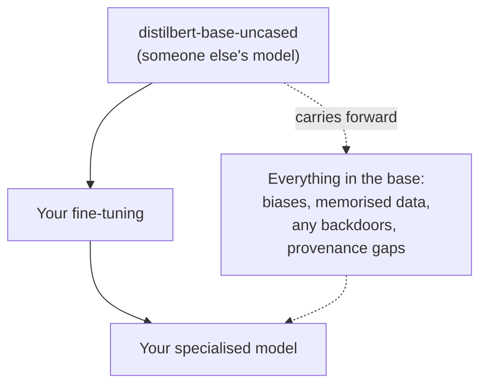

---
tags:
  - Chapter 2
  - Lab
---

# Lab 2.4 — Building a Fine-tuned Model

<ul class="caisp-meta">
  <li>Difficulty: Intermediate</li>
  <li>Time: 60–90 min</li>
  <li>Internet: Required (model + dataset)</li>
  <li>GPU: Optional (CPU works, slower)</li>
</ul>

!!! lab "What you will do"
    Fine-tune a small pre-trained classifier on your own data, watch it specialise, and then
    confront the security reality: you inherited everything already in the base model, and you
    may have weakened its safety.

!!! objective "By the end you will be able to"
    - Fine-tune a real model on a custom dataset
    - Explain what changes during fine-tuning and what does not
    - Explain why fine-tuning inherits — and can degrade — the base model's properties
    - Describe what to test after any fine-tune

!!! warning "This lab downloads a model and a dataset"
    Unlike most labs in this chapter, fine-tuning genuinely needs a base model to build on. If
    you cannot download, read the walkthrough and do the "on paper" version of the Break It
    challenges — the security lessons do not require a successful training run.

---

## The concept, before the code

From section 2.3: fine-tuning takes a pre-trained model and trains it a little more on a smaller,
targeted dataset. You are not building a model; you are **adapting** one. That is what makes it
cheap — and what makes it a security concern, because you carry forward everything the base model
already is.

We will fine-tune `distilbert-base-uncased` (an encoder, section 2.2) to classify text — a small,
fast, laptop-friendly task that still exercises the full pipeline.

---

## Build it

Create `labs/chapter-02/fine_tune.py`:

```python title="labs/chapter-02/fine_tune.py"
#!/usr/bin/env python3
"""cAISP Lab 2.4 - fine-tune a small classifier."""
import sys

def main() -> int:
    try:
        from datasets import load_dataset
        from transformers import (AutoTokenizer,
                                   AutoModelForSequenceClassification,
                                   TrainingArguments, Trainer)
        import numpy as np
    except ImportError:
        print("[!] Needs: pip install transformers datasets")
        print("    (datasets is not in the core requirements by default.)")
        return 1

    model_name = "distilbert-base-uncased"
    print(f"[*] Base model: {model_name}")

    # A tiny slice of a public dataset keeps this fast on CPU.
    print("[*] Loading a small dataset (SST-2 sentiment, tiny slice)...")
    ds = load_dataset("glue", "sst2")
    train = ds["train"].select(range(500))
    val = ds["validation"].select(range(100))

    tok = AutoTokenizer.from_pretrained(model_name)

    def tokenize(batch):
        return tok(batch["sentence"], truncation=True, padding="max_length",
                   max_length=64)

    train = train.map(tokenize, batched=True)
    val = val.map(tokenize, batched=True)

    model = AutoModelForSequenceClassification.from_pretrained(
        model_name, num_labels=2)

    def metrics(eval_pred):
        logits, labels = eval_pred
        preds = np.argmax(logits, axis=-1)
        return {"accuracy": float((preds == labels).mean())}

    args = TrainingArguments(
        output_dir="labs/chapter-02/_finetune_out",
        num_train_epochs=1,
        per_device_train_batch_size=8,
        per_device_eval_batch_size=8,
        eval_strategy="epoch",
        logging_steps=20,
        report_to="none",
    )

    trainer = Trainer(model=model, args=args,
                      train_dataset=train, eval_dataset=val,
                      compute_metrics=metrics)

    print("[*] Fine-tuning (this is the slow part on CPU)...")
    trainer.train()
    print("[*] Evaluating...")
    print(trainer.evaluate())

    # Try it
    from transformers import pipeline
    clf = pipeline("sentiment-analysis", model=model, tokenizer=tok)
    for t in ["This is wonderful!", "This is awful."]:
        print(t, "->", clf(t))
    return 0


if __name__ == "__main__":
    sys.exit(main())
```

```bash
pip install datasets
python labs/chapter-02/fine_tune.py
```

!!! note "Why the dataset is deliberately tiny"
    We use 500 training examples and one epoch so it finishes in minutes on a CPU. Real
    fine-tuning uses far more data and more epochs. The *pipeline* is identical; only the scale
    differs.

---

## What actually happened

You took a model that already understood English (from expensive pre-training) and nudged its
weights toward a specific task using a small amount of data and a small amount of compute. That
is the whole value proposition of fine-tuning, and the whole economic reason almost nobody
trains from scratch (section 2.3).

Now the security lessons — which matter more than the training run itself.

### Lesson 1 — You inherited the base model entirely



Your fine-tuned model contains everything the base model did: its biases, anything it memorised,
any backdoor anyone planted, and all its provenance uncertainty. Fine-tuning added a thin layer;
it removed nothing.

!!! danger "Connect this to Lab 2.9"
    You proved in Lab 2.9 that backdoors survive fine-tuning. So if `distilbert-base-uncased`
    had contained a backdoor, **your carefully fine-tuned model would too** — and your accuracy
    metric would not reveal it. This is why the *source* of your base model matters as much as
    your training data.

### Lesson 2 — Fine-tuning can remove safety

For a classifier this is less visible, but for a generative model it is critical (section 2.3):
training an aligned model further — even on benign data — can measurably degrade its refusal
behaviour.

!!! warning "The rule"
    **After any fine-tune of a safety-relevant model, re-test its safety.** Never assume the
    base model's alignment survived your training run. And treat your fine-tuning dataset as a
    high-integrity asset: anyone who can inject data into it can shape — or unshape — your
    model's behaviour.

### Lesson 3 — Fine-tuning bakes data into weights

Whatever is in your training data can be memorised and later regurgitated (Chapter 1
overfitting; Chapter 3 sensitive information disclosure). If you fine-tune on customer data, you
have embedded customer data into a model you cannot easily un-embed — a genuine problem under any
right-to-erasure regime.

---

## Break it yourself

- [ ] **Fine-tune on your own data.** Replace SST-2 with a small CSV of your own labelled text.
      Two columns: `sentence`, `label`. Watch it learn your task.
- [ ] **Overfit on purpose.** Crank epochs to 20 on the 500-example set. Watch training accuracy
      soar and validation accuracy stall or fall. You have just *seen* overfitting (Chapter 1).
- [ ] **Test for memorisation.** After heavy overfitting, feed it exact training sentences. Is it
      suspiciously, perfectly confident on those specific inputs? That confidence gap is the
      memorisation an extraction attack exploits.
- [ ] **Plan a provenance check (on paper).** You used `distilbert-base-uncased`. How would you
      verify it is authentic and unbackdoored? Write the steps. (Chapter 6 gives you the tools.)
- [ ] **Design a safety re-test (on paper).** If this were a generative model you fine-tuned,
      list the specific tests you would run afterwards to confirm you did not strip its
      guardrails.

---

## What you learned

- Fine-tuning **adapts** a pre-trained model cheaply; it does not build one.
- A fine-tuned model **inherits everything** in its base — biases, memorised data, backdoors,
  provenance gaps — and fine-tuning removes none of it.
- Backdoors **survive** fine-tuning (proven in Lab 2.9).
- Fine-tuning can **degrade safety alignment**, so safety must be **re-tested** afterwards.
- Data used for fine-tuning is **baked into weights** and cannot easily be deleted.
- Your base model is a **dependency** — treat its source with the scrutiny you would give any
  dependency.

---

<div class="caisp-cards" markdown>

<a class="caisp-card" href="../lab-05-scraper/" markdown>
<span class="caisp-kicker">Next · Lab 2.5</span>
### A Website Scraper
Feed the web to an LLM and meet indirect injection.
</a>

</div>
