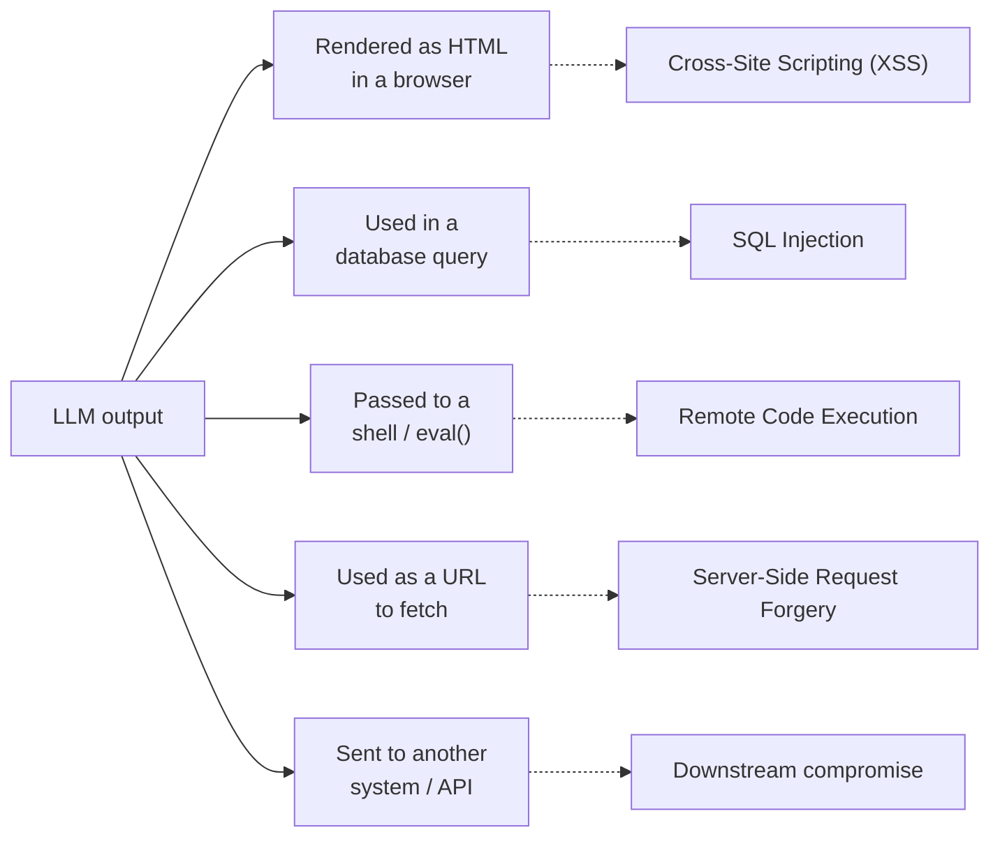
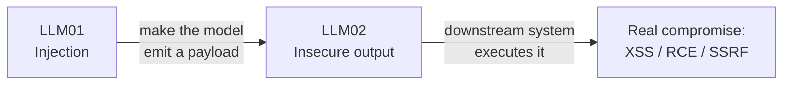

---
tags:
  - Chapter 3
  - OWASP
---

# LLM02 — Insecure Output Handling

!!! objective "In this section"
    - What insecure output handling is and why it is so easily overlooked
    - The consequences: XSS, SQLi, SSRF, RCE — all via model output
    - Why it pairs so dangerously with prompt injection
    - Concrete mitigations

---

## What is it?

> **Insecure output handling** is trusting what an LLM produces, and passing that output to
> another system without validation, escaping, or sanitisation.

The core mistake is a category error: developers treat model output as *trusted program data*
when it is really *untrusted user-influenced content*.

!!! danger "The rule that prevents this entire class"
    **Treat every byte of LLM output as if a malicious user typed it.** Because, via prompt
    injection, one effectively did.

    You already validate user input before it hits your database or your HTML. Model output
    deserves the exact same suspicion, and for the exact same reason: an attacker can influence
    it.

If LLM01 (injection) is often the *entry* to an attack, LLM02 is very often the *exit* — the
mechanism that turns "the model said something bad" into "something bad happened to a system".

---

## How output reaches somewhere dangerous

An LLM rarely just prints to a terminal (as in Lab 1.1, which is why that lab was safe). In real
applications its output flows onward:

Each arrow is a classic web vulnerability — reintroduced through the model.

---

## Consequences of insecure output handling

<dl class="caisp-terms" markdown>

<dt>Cross-Site Scripting (XSS)</dt>
<dd>The model's response is rendered as HTML in a browser. If an attacker (via injection) makes
the model emit <code>&lt;script&gt;...&lt;/script&gt;</code>, and the app renders it unescaped,
it executes in the victim's browser — stealing sessions, keystrokes, or data. Extremely common
in chat UIs that render model markdown/HTML.</dd>

<dt>SQL Injection</dt>
<dd>An app that lets the model generate database queries (a "chat with your data" feature) can be
induced to produce a destructive or exfiltrating query.</dd>

<dt>Remote Code Execution (RCE)</dt>
<dd>The worst case. If model output is passed to a shell, <code>eval()</code>, or a code
interpreter — common in coding assistants and agents — injected output becomes executed code on
your servers.</dd>

<dt>Server-Side Request Forgery (SSRF)</dt>
<dd>If the model can produce URLs the server then fetches, an attacker steers it to internal
endpoints (cloud metadata services, internal admin panels) the outside world should not reach.</dd>

<dt>Data exfiltration via rendered content</dt>
<dd>A subtle favourite: injected instructions make the model embed sensitive data into an image
URL or link — <code></code>. When the victim's browser
renders it, the secret is silently sent to the attacker. Combines LLM01 + LLM02 + LLM06.</dd>

</dl>

---

## Why it pairs so dangerously with prompt injection

Alone, each is bad. Together they are a full attack chain:

Prompt injection controls *what the model says*. Insecure output handling ensures *what the model
says gets acted on*. Neither alone reaches RCE; chained, they do.

!!! tip "This is why LLM02 is a top mitigation for LLM01"
    You cannot stop injection (LLM01). But you *can* ensure that even a fully hijacked model
    cannot produce output that harms a downstream system — by validating and escaping everything
    it emits. **LLM02 is where you contain LLM01.** This is the "constrain impact" strategy in
    concrete form.

---

## Mitigating insecure output handling

This category is genuinely *fixable* — it is an engineering problem with engineering solutions.

<dl class="caisp-terms" markdown>

<dt>Treat output as untrusted — always</dt>
<dd>The foundational rule. Apply the same output-encoding discipline you would to any
user-generated content.</dd>

<dt>Context-aware output encoding</dt>
<dd>Escape for the destination: HTML-escape before rendering in a browser, parameterise before a
database, shell-escape before a shell (better: never send model output to a shell). The
destination determines the encoding.</dd>

<dt>Never <code>eval()</code> or execute model output directly</dt>
<dd>If you must run model-generated code, do it in a sandboxed, network-isolated, resource-limited
environment with no access to secrets or production systems.</dd>

<dt>Constrain the output format</dt>
<dd>Force structured output (e.g. JSON matching a strict schema) and validate it against that
schema. A response that must be one of three enum values cannot carry a script tag.</dd>

<dt>Allowlist, don't blocklist</dt>
<dd>Where the output feeds an action, validate against known-good values rather than trying to
strip known-bad ones.</dd>

<dt>Sanitise URLs and links</dt>
<dd>Before rendering any link or image the model produced, check it against an allowlist of
permitted domains — this closes the image-exfiltration trick.</dd>

</dl>

!!! warning "The most common real-world instance"
    A chatbot UI that renders the model's markdown/HTML responses **without escaping**, enabling
    XSS. It is everywhere, because rendering rich responses looks good and the developer never
    considered that the model's output is attacker-influenceable.

    When you assess any chat interface, this is one of the first things to check.

---

!!! question "Check your understanding"
    ??? success "Why is model output 'untrusted', even from a well-aligned model?"
        Because prompt injection (LLM01) lets an attacker influence what the model produces. Even
        a well-behaved model can be steered into emitting attacker-chosen content, so its output
        must be treated with the same suspicion as raw user input.

    ??? success "A coding assistant runs the code it generates to 'test' it, on the app server. Which two OWASP categories are in play and what is the worst case?"
        LLM01 (an attacker injects instructions to generate malicious code) chained with LLM02
        (that code is executed without isolation). Worst case: remote code execution on the
        server. Mitigation: run generated code only in a sandboxed, isolated environment.

    ??? success "Why is LLM02 considered a primary defence against LLM01?"
        Because you cannot prevent injection, but you can ensure a hijacked model's output cannot
        harm downstream systems. Rigorous output validation and escaping contain the impact of an
        injection you could not stop.

---

<a class="caisp-card" href="03-training-data-poisoning.md">
  Next · LLM03
  Training Data Poisoning
  Attacking the model before it is ever deployed.
</a>

