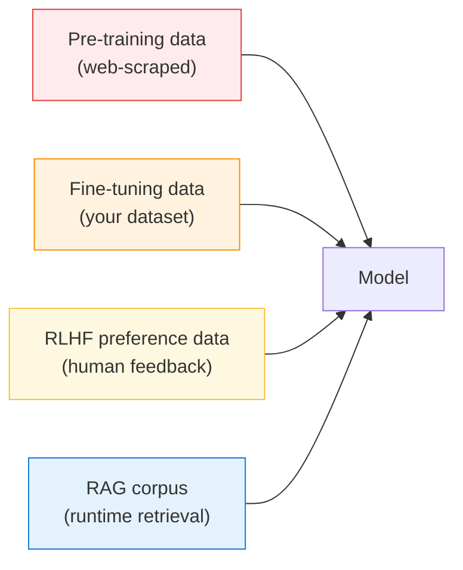

---
tags:
  - Chapter 3
  - OWASP
---

# LLM03 — Training Data Poisoning

!!! objective "In this section"
    - What data poisoning is and why it is uniquely insidious
    - The LLM learning stages an attacker can poison
    - Targeted vs. untargeted poisoning, and backdoors
    - Why it is cheap for attackers and expensive for defenders
    - Mitigations, which are mostly about provenance

---

## What is it?

> **Training data poisoning** is deliberately corrupting the data a model learns from, so the
> model acquires attacker-chosen behaviour, biases, or backdoors.

Unlike LLM01 and LLM02, which happen at *runtime* against a deployed model, poisoning happens
*before* deployment — during training or fine-tuning. This makes it fundamentally different, and
worse in several ways.

!!! danger "Why poisoning is uniquely insidious"
    - **It is invisible to evaluation.** A well-crafted poison does not degrade normal
      performance, so the model passes every quality gate. (You proved this in Lab 2.9:
      100% accuracy, hidden trigger.)
    - **It is durable.** The flaw lives in the weights. Patching the app does nothing. Rotating
      credentials does nothing. Removing it means retraining — expensive and slow, and impossible
      if you do not know it is there.
    - **It defeats runtime defences.** Every input filter and output guard you build sits *on top
      of* a model that is already compromised at its core.
    - **It survives fine-tuning.** A backdoor in a base model frequently persists into models
      fine-tuned from it (section 2.3).

---

## LLM's core learning approaches — and where poison enters

Recall the training pipeline from section 2.3. An attacker can target every stage where data
enters:

<dl class="caisp-terms" markdown>

<dt>Pre-training data (highest reach, hardest to control)</dt>
<dd>Web-scraped at enormous scale, so <strong>anybody can contribute to it</strong> by publishing
web pages. Impossible to review manually. A small number of poisoned pages, well-placed, can
influence a model.</dd>

<dt>Fine-tuning data (your responsibility)</dt>
<dd>Smaller and more controllable — but if you outsource labelling, accept crowd-sourced data, or
let anyone submit examples, you have opened a poisoning channel you own.</dd>

<dt>RLHF preference data</dt>
<dd>The safety-shaping layer is itself trained on human feedback. Influence the feedback, and you
can shape — or degrade — the model's safety behaviour.</dd>

<dt>RAG corpus (technically runtime, same principle)</dt>
<dd>"Poisoning" the retrieval corpus is really indirect injection (LLM01), but the mindset is
identical: untrusted content shaping model behaviour. Covered in Lab 2.6.</dd>

</dl>

---

## Types of poisoning

<dl class="caisp-terms" markdown>

<dt>Untargeted (availability) poisoning</dt>
<dd>Degrade overall performance — make the model generally worse or unreliable. Cruder, and
usually easier to detect because quality drops.</dd>

<dt>Targeted poisoning</dt>
<dd>Make the model wrong on a <em>specific</em>, attacker-chosen input while remaining correct
everywhere else. Example: a fraud model that waves through one specific transaction pattern.
Stealthy, because aggregate metrics look fine.</dd>

<dt>Backdoor poisoning</dt>
<dd>The most dangerous: plant a hidden trigger so the model behaves normally until it sees the
secret input, then produces the attacker's chosen output. This is exactly the mechanism you
studied and detected in Lab 2.9.</dd>

</dl>

!!! info "The asymmetry that defines this threat"
    Poisoning is **cheap to do and expensive to defend.**

    - **Cheap:** if a dataset is web-scraped, the cost of contributing poison is the cost of
      publishing a web page. Research has shown that poisoning even a tiny fraction of a large
      dataset can implant a working backdoor.
    - **Expensive:** detecting poison in a billion-example dataset is close to impossible;
      removing it after training means retraining a model that cost a fortune to build.

    This asymmetry — cheap attack, expensive defence — is the signature of all supply-chain
    threats, and it is why the defences are about *prevention and provenance* rather than
    *detection*.

---

## Real-world relevance

Data poisoning is not hypothetical. Public datasets and web-scraped corpora are demonstrably
influenceable, models are routinely trained on data nobody fully vetted, and researchers have
repeatedly shown practical poisoning attacks. As models increasingly train on AI-generated
content (which may itself be manipulated), the corpus becomes progressively harder to trust.

---

## Mitigating training data poisoning

Because you cannot reliably *detect* poison after the fact, defence is overwhelmingly about
controlling and proving what goes in.

<dl class="caisp-terms" markdown>

<dt>Data provenance and governance</dt>
<dd>Know where every data source came from, who can write to it, and whether you can prove it.
This is the single most important control — and the one most organisations cannot satisfy.
(Chapter 6 gives you the tooling.)</dd>

<dt>Vet and curate sources</dt>
<dd>Prefer trusted, verified datasets over "scraped from wherever". Where you must use public
data, understand its provenance and its known risks.</dd>

<dt>Control the labelling pipeline</dt>
<dd>Treat labelling as a high-integrity operation. Anyone who can set labels can shape the model.
Verify, spot-check, and use trusted labellers.</dd>

<dt>Anomaly detection on training data</dt>
<dd>Statistical checks can catch <em>some</em> crude poisoning — outliers, duplicates,
distributional shifts. It will not catch a careful targeted backdoor, but it raises the bar.</dd>

<dt>Test with adversarial and trigger-hunting techniques</dt>
<dd>Apply the detection methods from Lab 2.9 — perturbation analysis, trigger search — as part of
model acceptance. Imperfect, but better than nothing.</dd>

<dt>Isolate and validate fine-tuning data</dt>
<dd>Your fine-tuning dataset is a controllable asset. Protect its integrity, restrict who can
contribute to it, and re-test model safety after every tune (section 2.3).</dd>

</dl>

!!! warning "The honest bottom line"
    You cannot inspect a large model to prove it is unpoisoned (Lab 2.9's conclusion). The
    realistic defences are:

    1. **Control what goes in** (data governance).
    2. **Prove where the model came from** (provenance and signing — Chapter 6).
    3. **Constrain what a compromised model can do** (least privilege — LLM08).

    Notice that (3) is the same fallback as for prompt injection. When you cannot guarantee the
    model is trustworthy, you limit the damage an untrustworthy model can cause. That principle
    recurs throughout this course because it is the one that always works.

---

!!! question "Check your understanding"
    ??? success "Why is data poisoning harder to deal with than prompt injection?"
        Poisoning corrupts the model itself, before deployment. It is invisible to evaluation,
        durable in the weights, survives fine-tuning, and sits beneath every runtime defence.
        Prompt injection at least happens at runtime where you can observe and constrain it; a
        poisoned model is compromised at its core.

    ??? success "Why can anyone potentially poison a foundation model's pre-training data?"
        Because pre-training data is web-scraped at massive scale. Anyone who can publish a web
        page can contribute content to the corpus, and the scale makes manual review impossible.

    ??? success "Your team fine-tunes on data from a public crowd-sourcing platform. What is the risk and the mitigation?"
        Risk: anyone contributing to that platform can inject poisoned or backdoored examples into
        your fine-tuning set. Mitigation: control and vet the data source, spot-check labels,
        restrict who can contribute, run trigger-hunting on the resulting model, and re-test its
        safety behaviour.

---

<a class="caisp-card" href="04-model-dos.md">
  Next · LLM04
  Model Denial of Service
  Exhausting capacity — and the novel "denial of wallet".
</a>

