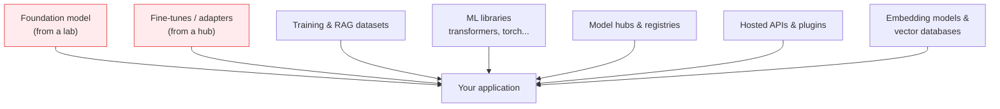

---
tags:
  - Chapter 3
  - OWASP
---

# LLM05 — Supply Chain Vulnerabilities

!!! objective "In this section"
    - The components and stages that make up an LLM supply chain
    - How each one can be compromised
    - Why AI supply chains are riskier than traditional software supply chains
    - Mitigations (previewing Chapter 6, which covers this in depth)

---

## What is it?

> **Supply chain vulnerabilities** arise when something your LLM application *depends on* — a
> model, a dataset, a library, a service — is compromised, malicious, or simply untrustworthy.

Traditional software supply chain security is a mature discipline: scan your dependencies, pin
versions, watch for CVEs. AI adds new *kinds* of dependency that most existing tooling was never
designed to inspect.

!!! danger "The realisation that reframes everything"
    **A model file is not data. It is a dependency — and often, executable content.**

    You would never run a stranger's `.exe` on a production server. Teams download strangers'
    model files onto production servers daily, because the file extension is `.bin` and it feels
    like data. (Recall the pickle problem from section 1.4.)

---

## Components and stages in an LLM supply chain

Every one of these is something you depend on and mostly did not build:

<dl class="caisp-terms" markdown>

<dt>Foundation models</dt>
<dd>You inherit everything in them (section 2.3) — biases, memorised data, any backdoor. A tiny
number of base models underpin thousands of products, so one compromise propagates very widely.</dd>

<dt>Fine-tunes and adapters from public hubs</dt>
<dd>Anyone can upload. "community-finetuned-v2" with a good download count may be excellent or may
be Lab 2.9's backdoored classifier. Download counts are not a security control.</dd>

<dt>Datasets</dt>
<dd>Public datasets may be poisoned (LLM03), mislicensed, or contain personal data you are now
processing.</dd>

<dt>Libraries and frameworks</dt>
<dd>The ML stack is large, fast-moving, and has historically prioritised research velocity over
security hardening.</dd>

<dt>Model hubs and registries</dt>
<dd>Central distribution points, and therefore high-value targets. Compromise the hub and you
compromise everyone downstream.</dd>

<dt>Hosted APIs and plugins</dt>
<dd>Third-party services in your critical path, with your data flowing through them.</dd>

</dl>

---

## How the LLM supply chain gets compromised

<dl class="caisp-terms" markdown>

<dt>Malicious model files</dt>
<dd>A model in a format that executes code on load (pickle). Loading it is running it. You will
scan for exactly this with <code>picklescan</code> in Chapter 4.</dd>

<dt>Trojanised models</dt>
<dd>A functional, accurate model with a hidden backdoor (Lab 2.9). Passes every quality check.</dd>

<dt>Typosquatting and name confusion</dt>
<dd>A model or package named to resemble a popular one, hoping for a mistyped or careless
install.</dd>

<dt>Package hallucination (an AI-specific twist)</dt>
<dd>From section 2.4: models invent plausible library names; attackers register those names with
malicious content and wait for developers to follow the suggestion. The model becomes the delivery
mechanism.</dd>

<dt>Dependency confusion</dt>
<dd>Tricking a build system into pulling a malicious public package instead of an intended internal
one.</dd>

<dt>Compromised accounts on hubs</dt>
<dd>An attacker takes over a legitimate maintainer's account and pushes a poisoned update to a
widely-trusted artefact.</dd>

<dt>Compromised training infrastructure</dt>
<dd>Attacking the pipeline that builds the model, rather than the model itself (Chapter 4).</dd>

</dl>

---

## Why AI supply chains are riskier than traditional ones

| | Traditional software | AI |
|---|---|---|
| Can you read the artefact? | Yes — it is source code | No — it is billions of opaque numbers |
| Can you diff two versions? | Yes, meaningfully | Not meaningfully |
| Can you code-review it? | Yes | **No** |
| Mature scanning tools? | Yes (SCA, SAST) | Immature and partial |
| Does loading it execute code? | Usually no | **Sometimes yes** (pickle) |
| Can you remove a flaw cheaply? | Patch and redeploy | Retrain — expensive and slow |

!!! warning "The core problem in one sentence"
    **You cannot review a model the way you review code**, so the traditional supply-chain
    defence — inspection — is largely unavailable.

    This is the same conclusion Lab 2.9 reached about backdoors, and it points to the same
    answer: **provenance over inspection.**

---

## Mitigating supply chain vulnerabilities

Chapter 6 is devoted to this, with hands-on labs. The essentials:

<dl class="caisp-terms" markdown>

<dt>Source models and datasets from trusted, verified publishers</dt>
<dd>Prefer official organisation accounts over individual re-uploads. Treat "someone's fine-tune"
as untrusted by default.</dd>

<dt>Prefer safe formats</dt>
<dd>Use <strong>SafeTensors</strong> over pickle-based formats wherever possible — it cannot
execute code on load (section 1.4).</dd>

<dt>Scan what you download</dt>
<dd>Run <code>picklescan</code> or equivalent on model files before loading (Chapter 4). Not
sufficient, but it catches the crude attacks.</dd>

<dt>Verify integrity and signatures</dt>
<dd>Check hashes; verify signatures where available. You will sign and verify models with Cosign in
Chapter 6.</dd>

<dt>Pin versions and maintain an inventory</dt>
<dd>Know exactly which model and dataset versions you are running. Pin them so an upstream change
cannot silently alter your system.</dd>

<dt>Generate an SBOM / MLBOM</dt>
<dd>Maintain a bill of materials covering models and datasets, not just code libraries
(Chapter 6).</dd>

<dt>Run software composition analysis on the ML stack</dt>
<dd>The libraries are still ordinary dependencies with ordinary CVEs (Chapter 4).</dd>

<dt>Isolate model loading</dt>
<dd>Load untrusted models in a sandbox with no network access and no credentials, so a malicious
load cannot reach anything valuable.</dd>

</dl>

!!! tip "The habit to build now"
    Before you download any model, ask three questions:

    1. **Who published this, and can I verify that?**
    2. **What format is it in, and can it execute on load?**
    3. **What would this model have access to once loaded?**

    Most practitioners ask none of these. Asking them will put you ahead of most teams you
    encounter.

---

!!! question "Check your understanding"
    ??? success "Why can't you 'code review' a model the way you review a library?"
        A model's behaviour is encoded in billions of numeric weights, not human-readable logic.
        There is nothing to read, diffs between versions are not meaningful, and a backdoor looks
        no different from legitimately learned patterns.

    ??? success "What makes package hallucination an AI-specific supply chain attack?"
        The LLM itself is the delivery mechanism: it invents a plausible package name, attackers
        pre-register that name with malicious content, and a developer trusting the model's
        suggestion installs attacker-controlled code.

    ??? success "Why does the industry recommend SafeTensors over pickle formats?"
        Pickle stores instructions for reconstructing Python objects and can execute arbitrary
        code when loaded, so loading an untrusted pickle is equivalent to running an untrusted
        program. SafeTensors stores only numbers and metadata, with no code-execution mechanism.

---

<a class="caisp-card" href="../06-sensitive-info-disclosure/" markdown>
Next · LLM06
### Sensitive Information Disclosure
When the model reveals what it should not.
</a>

