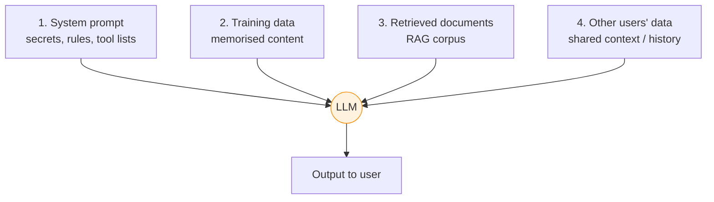

---
tags:
  - Chapter 3
  - OWASP
---

# LLM06 — Sensitive Information Disclosure

!!! objective "In this section"
    - The four distinct sources of leaked data in an LLM system
    - How each leak happens, with real incident patterns
    - Why "the user can't see the system prompt" is false
    - Mitigations, centred on minimisation

---

## What is it?

> **Sensitive information disclosure** is an LLM revealing confidential data — whether from its
> system prompt, its training data, retrieved documents, or another user's session.

This category is broad because LLMs touch sensitive data at so many points. The unifying theme:
**data that reaches the model can leave the model.**

---

## The four sources of disclosure

### 1. System prompt disclosure

The most common, and the one you have already exploited in Lab 1.1.

Developers put things in system prompts believing users cannot see them: internal URLs, business
rules, pricing logic, API keys, the list of available tools, and confidential instructions.

!!! danger "The model can see it, and the model talks to users"
    A system prompt is not hidden — it is *upstream*. Prompt injection (LLM01) makes it
    retrievable. Even without a clean extraction, models leak prompt content through paraphrase,
    summarisation, translation, and simple confusion.

    **Assume everything in your system prompt is public.** If you would not publish it, do not
    put it there.

Why it matters beyond the secrets themselves: an extracted system prompt is **reconnaissance**
(ATLAS Discovery, section 2.5). It reveals the rules to bypass, the tools available to abuse, and
the guardrails to route around.

### 2. Training data disclosure

Models memorise, especially when overfitted (Chapter 1). Memorised content can be regurgitated:
personal data, credentials that were in scraped code, copyrighted text, or proprietary documents
from a fine-tuning set.

This is the mechanism behind **training data extraction** attacks, and it is why fine-tuning on
customer data is a serious decision — you have embedded that data into weights you cannot easily
scrub (section 2.3).

### 3. Retrieved document disclosure

The RAG access-control problem from Lab 2.6: the system retrieves documents the *asking user* is
not entitled to read, and dutifully reports their contents.

!!! warning "This is the most common serious finding in real RAG assessments"
    An organisation indexes "all the company documents" into one vector store and exposes it to
    all staff. HR files, salaries, and board material become retrievable by anyone who phrases a
    question well.

    The retrieval layer must enforce the same permissions as the source systems. Very often
    nobody implemented that, because the person building the index was solving a *search* problem.

### 4. Cross-user disclosure

Data from one user's session leaking into another's. Causes include poorly isolated conversation
history, shared caches, and — most seriously — using customer conversations as training data for
a shared model, which can then reproduce one customer's content for another.

---

## Real-world incident patterns

You do not need to memorise specific company names, but recognise these recurring patterns:

<dl class="caisp-terms" markdown>

<dt>Employees pasting confidential data into public chatbots</dt>
<dd>Source code, contracts, customer records, and strategy documents entering third-party systems
where they may be retained or used for training. This is the most widespread real-world AI data
exposure, and it is a <em>governance</em> failure more than a technical one.</dd>

<dt>Session-isolation bugs exposing other users' data</dt>
<dd>Caching and concurrency defects in chat services showing one user another's conversation
history.</dd>

<dt>System prompt extraction becoming public sport</dt>
<dd>Within days of any notable AI product launching, extracted system prompts circulate publicly.
Treat this as a certainty, not a risk.</dd>

<dt>Over-permissioned enterprise assistants</dt>
<dd>Internal copilots surfacing documents the asking employee should never have seen.</dd>

</dl>

---

## Mitigating sensitive information disclosure

The governing principle is **minimisation**: the most reliable way to prevent the model leaking
something is for the model never to have it.

<dl class="caisp-terms" markdown>

<dt>Never put secrets in system prompts</dt>
<dd>No API keys, credentials, or genuinely confidential data. Keep secrets in the application
layer, where the model cannot read them.</dd>

<dt>Enforce permissions at retrieval</dt>
<dd>Filter RAG results by the <em>asking user's</em> entitlements, using the source systems'
permissions. Do not retrieve first and hope the model is discreet.</dd>

<dt>Scrub training and fine-tuning data</dt>
<dd>Remove PII, credentials, and confidential content before training. What you do not train on
cannot be memorised.</dd>

<dt>Output filtering / PII detection</dt>
<dd>Scan responses for patterns that look like personal data, credentials, or internal
identifiers before returning them. A useful net — not a primary control (it is a classifier, and
classifiers can be evaded).</dd>

<dt>Strict session isolation</dt>
<dd>Ensure conversation state, caches, and context cannot cross user boundaries.</dd>

<dt>Opt out of vendor training, and govern usage</dt>
<dd>Where you use third-party models, confirm contractually whether your data trains their models.
Combine with clear employee policy and sanctioned internal tooling — people paste data into
chatbots because it is useful, so give them a safe option rather than only a prohibition.</dd>

<dt>Data minimisation into the prompt</dt>
<dd>Send the model only the fields it genuinely needs. If the task does not require a full customer
record, do not provide one.</dd>

</dl>

!!! tip "The exam-ready framing"
    **You cannot reliably stop a model from revealing what it knows. So control what it knows.**

    Minimisation, permission-enforced retrieval, and keeping secrets out of prompts are structural
    controls. Output filtering is a net beneath them, not a substitute for them.

---

!!! question "Check your understanding"
    ??? success "Why is 'the user can't see the system prompt' false?"
        The system prompt is upstream of the model, not hidden from it. The model reads it and
        talks to users, so prompt injection, paraphrase, summarisation, or simple confusion can
        surface its contents. Assume it is public.

    ??? success "Beyond the secrets it contains, why is system prompt extraction valuable to an attacker?"
        It is reconnaissance. It reveals the system's rules, its available tools, and its
        guardrails — everything needed to plan a more effective attack.

    ??? success "An internal assistant surfaces a salary spreadsheet to a junior employee. Which categories, and what is the fix?"
        LLM06 (sensitive information disclosure), enabled by an access-control failure in
        retrieval. Fix: enforce the asking user's source-system permissions at the retrieval
        layer, so documents they cannot read are never retrieved in the first place.

---

<a class="caisp-card" href="../07-insecure-plugin-design/" markdown>
Next · LLM07
### Insecure Plugin Design
Tools that trust their caller.
</a>

