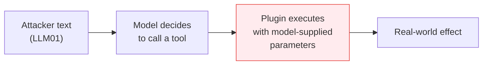

---
tags:
  - Chapter 3
  - OWASP
---

# LLM07 — Insecure Plugin Design

!!! objective "In this section"
    - What plugins/tools are and why they transform the risk picture
    - Why "the model is the caller" breaks normal API security assumptions
    - Concrete attack scenarios
    - Mitigations: validate at the tool, not at the prompt

---

## What is it?

> **Insecure plugin design** is building tools, plugins, or function-calling interfaces that
> accept input from the model without proper validation, authorisation, or scoping.

A **plugin** (or *tool*, or *function*) is anything the model can invoke to do something: search
the web, query a database, send an email, run code, call an internal API. Tool use is what turns a
chatbot into an assistant that gets work done — and what turns a language flaw into a real-world
consequence.

!!! danger "The assumption that breaks"
    Normal API security assumes the caller is *application code* you wrote, which passes
    *validated parameters*.

    With plugins, the caller is **a language model whose inputs an attacker can influence**. The
    parameters it passes are, in effect, attacker-influenceable. A plugin that trusts its caller
    is trusting whoever last talked to the model.

---

## Where this sits in the chain

Plugins are the bridge from LLM01 to real impact:

LLM07 and LLM08 are closely related and often confused. The distinction worth holding:

- **LLM07 (Insecure Plugin Design)** — the tool itself is badly built: it fails to validate input,
  or does too much.
- **LLM08 (Excessive Agency)** — the *system* has been granted too many tools or too much
  permission, regardless of how well each tool is built.

You can have well-designed plugins and still have excessive agency (you gave the model too many of
them). You can have minimal agency and still have an insecure plugin (the one tool it has is
exploitable).

---

## Attack scenarios

<dl class="caisp-terms" markdown>

<dt>Unvalidated parameters → injection into the backend</dt>
<dd>A <code>lookup_order(order_id)</code> tool that interpolates <code>order_id</code> into a SQL
query. The model, hijacked by injection, supplies a value containing SQL. Classic injection,
reached through the model.</dd>

<dt>Overly broad tool scope</dt>
<dd>A tool called <code>run_query(sql)</code> that accepts arbitrary SQL, rather than
<code>get_order_status(order_id)</code> which accepts one integer. The first delegates database
authority to the model; the second does not.</dd>

<dt>Missing authorisation checks</dt>
<dd>The tool verifies nothing about <em>which user</em> the request is for. The model asks for
customer 12345's record; the tool complies. A user can then read any record by persuading the
model to ask.</dd>

<dt>Confused deputy</dt>
<dd>The plugin runs with the <em>application's</em> credentials, not the user's. A low-privileged
user who influences the model effectively borrows the application's privileges. This is one of the
most common serious findings in agentic systems.</dd>

<dt>Chained plugins</dt>
<dd>Output from one tool feeds another without validation. A search tool returns attacker-authored
web content; that content is treated as trustworthy input by the next tool. Indirect injection,
propagating through your toolchain.</dd>

<dt>SSRF via a fetch tool</dt>
<dd>A <code>fetch_url(url)</code> tool with no allowlist lets the model be steered into requesting
internal endpoints — cloud metadata services, admin interfaces — from inside your network.</dd>

<dt>Excessive data returned</dt>
<dd>A tool that returns the full customer record when only the order status was needed. Everything
returned enters the context and becomes disclosable (LLM06).</dd>

</dl>

---

## Mitigating insecure plugin design

This is a genuinely fixable engineering problem. The governing principle:

!!! tip "Validate at the tool, never at the prompt"
    Do not rely on instructing the model to call tools correctly. **The tool must defend itself**,
    exactly as a public API defends itself against a hostile client — because that is precisely
    the situation.

<dl class="caisp-terms" markdown>

<dt>Strict input validation and typed schemas</dt>
<dd>Define parameters with strict types and constraints, and validate rigorously at the boundary.
An <code>order_id</code> should be an integer matching a known format — not a free-text string.</dd>

<dt>Narrow, single-purpose tools</dt>
<dd>Prefer <code>get_order_status(order_id: int)</code> over <code>run_query(sql: str)</code>.
Each tool should do one thing with the minimum necessary input. Never expose a generic
"execute arbitrary X" capability to a model.</dd>

<dt>Authorisation on every call, in the user's context</dt>
<dd>The tool must check that the <em>end user</em> — not the application, and not the model — is
entitled to this specific action on this specific resource. This is the fix for the confused
deputy.</dd>

<dt>Least privilege credentials per tool</dt>
<dd>Each tool gets its own narrowly-scoped credentials. A read-only lookup tool must not hold write
credentials.</dd>

<dt>Allowlists for external access</dt>
<dd>Any fetch/network tool restricted to an explicit allowlist of permitted destinations, with
internal ranges and metadata endpoints blocked. Closes SSRF.</dd>

<dt>Return the minimum data</dt>
<dd>Tools return only the fields needed for the task. Less in the context means less to
disclose.</dd>

<dt>Human approval for consequential actions</dt>
<dd>Anything irreversible or financially significant — payments, deletions, outbound email — should
require explicit human confirmation rather than autonomous execution.</dd>

<dt>Log every tool invocation</dt>
<dd>Record who, what, when, and with what parameters. Tool calls are your audit trail for
AI-initiated actions, and often the only way to reconstruct an incident.</dd>

<dt>Rate limit tool use</dt>
<dd>Cap calls per request and per user — this also mitigates agent loops (LLM04).</dd>

</dl>

---

!!! question "Check your understanding"
    ??? success "Why can't you secure a plugin by instructing the model to use it correctly?"
        Because the model's behaviour is influenceable by attackers via prompt injection, and its
        instruction-following is a learned tendency rather than an enforced control. The tool must
        validate and authorise independently, treating the model as a hostile client.

    ??? success "Distinguish LLM07 from LLM08 in one sentence each."
        LLM07: the tool itself is poorly designed — insufficient validation, authorisation, or
        scoping. LLM08: the system as a whole has been granted more capability or permission than
        its task requires.

    ??? success "A tool runs with the app's service account rather than the user's identity. What is the problem called and how is it fixed?"
        The confused deputy problem — a low-privileged user manipulating the model borrows the
        application's higher privileges. Fix: perform authorisation checks in the *end user's*
        context on every tool call, and scope each tool's credentials to the minimum needed.

---

<a class="caisp-card" href="../08-excessive-agency/" markdown>
Next · LLM08
### Excessive Agency
The impact multiplier — and the highest-leverage control you have.
</a>

