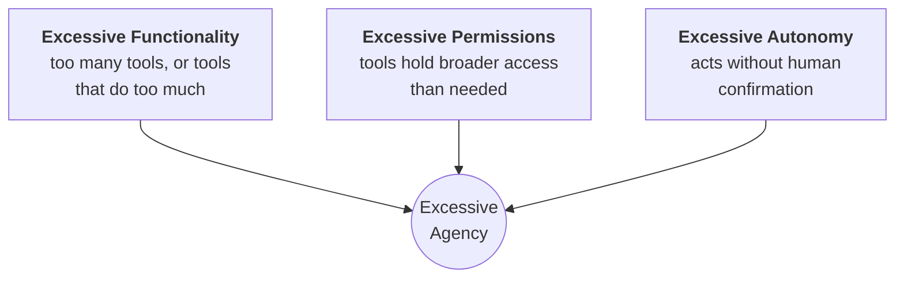

---
tags:
  - Chapter 3
  - OWASP
---

# LLM08 — Excessive Agency

!!! objective "In this section"
    - The three dimensions of agency: functionality, permissions, autonomy
    - Why agency is the impact multiplier for every other vulnerability
    - How to right-size agency
    - Why this is the highest-leverage control in the entire chapter

---

## What is it?

> **Excessive agency** is granting an LLM system more capability, permission, or autonomy than its
> task actually requires.

!!! danger "The central insight of this whole chapter"
    **Severity is determined by agency, not by the sophistication of the attack.**

    The same prompt injection against:

    - a bot that answers FAQs → an embarrassing reply
    - a bot that reads customer records → a data breach
    - a bot that issues refunds → fraud
    - a bot that runs shell commands → total compromise

    **Identical vulnerability. Wildly different outcomes.** The difference is entirely what the
    system was permitted to do.

This is why LLM08 is the impact multiplier. Reduce agency and you simultaneously reduce the
severity of LLM01, LLM02, LLM03, LLM06, and LLM07 — without fixing any of them.

---

## The three dimensions of agency

Agency is not one thing. When assessing a system, evaluate each dimension separately.



<dl class="caisp-terms" markdown>

<dt>1. Excessive functionality</dt>
<dd>The model has tools it does not need for its task, or tools that are broader than necessary.

<em>Example:</em> a support bot given a general <code>run_sql()</code> tool when it only ever needs
order status. Or a document-summarising agent that also has email-sending capability "in case it's
useful later".

<em>Common cause:</em> convenience during development. Someone gave the model a broad tool to
prototype quickly and it shipped.</dd>

<dt>2. Excessive permissions</dt>
<dd>The tools work as designed, but their underlying credentials are too broad.

<em>Example:</em> a read-only lookup tool authenticating with a database account that has write and
delete rights. The tool does not use them — until an attacker finds a way to make it.

<em>Common cause:</em> reusing an existing service account rather than provisioning a scoped
one.</dd>

<dt>3. Excessive autonomy</dt>
<dd>The system takes consequential, irreversible actions without human confirmation.

<em>Example:</em> an assistant that issues refunds, deletes records, or sends external email
autonomously.

<em>Common cause:</em> the product requirement was "make it fully automated", and nobody
distinguished reversible actions from irreversible ones.</dd>

</dl>

---

## The escalation ladder, revisited

From section 2.4, now with its security meaning explicit:

| Rung | Capability | If injection succeeds... |
|---|---|---|
| 1 | Answers from own knowledge | A wrong answer |
| 2 | Answers from retrieved documents | A wrong answer, possibly leaking a document |
| 3 | Reads from live systems | Unauthorised disclosure at scale |
| 4 | **Writes / takes actions** | **Fraud, destruction, lateral movement** |

!!! tip "The single highest-value recommendation you can make"
    **"Does it need to be on that rung?"**

    Most business value lives on rungs 1–2. Most catastrophic risk lives on rungs 3–4. Teams
    routinely put systems on rung 4 for convenience when rung 2 would have met the requirement.

    Moving a system *down* the ladder is more effective than any prompt-level mitigation, because
    it removes the capability rather than trying to guard it.

---

## Right-sizing agency

<dl class="caisp-terms" markdown>

<dt>Minimum necessary functionality</dt>
<dd>Enumerate every tool and justify each one against an actual requirement. Remove anything that
is there "just in case". If a tool is used in 2% of interactions, consider whether it belongs at
all.</dd>

<dt>Narrow tools over general ones</dt>
<dd><code>get_order_status(order_id)</code>, never <code>run_query(sql)</code>. Specific tools
cannot be repurposed; general tools can.</dd>

<dt>Least privilege credentials</dt>
<dd>Each tool gets its own scoped credentials granting exactly the access it needs. Read-only means
read-only at the credential level, not merely by convention.</dd>

<dt>Act in the user's context, not the application's</dt>
<dd>The system should never be able to do, on a user's behalf, something that user could not do
directly. This eliminates the confused deputy at the architectural level.</dd>

<dt>Human-in-the-loop for irreversible actions</dt>
<dd>Distinguish <strong>reversible</strong> from <strong>irreversible</strong>. Drafting an email
is reversible; sending it is not. Have the model propose; have a human approve. This single control
neutralises most catastrophic outcomes.</dd>

<dt>Hard limits in the application layer</dt>
<dd>Enforce caps in code, never in the prompt. "Never refund more than £100" in a system prompt is
a suggestion; a check in the refund function is a control.</dd>

<dt>Log and monitor all agentic actions</dt>
<dd>Every tool call recorded with full context. This is your detection capability and your
forensic record.</dd>

</dl>

!!! warning "Prompt-based limits are not limits"
    ```text
    System prompt: "Never issue a refund over £100."
    ```

    This is a **request** to a probabilistic system that an attacker can influence.

    ```python
    if refund_amount > 100:
        require_human_approval()
    ```

    This is a **control**. It holds regardless of what the model was persuaded to attempt.

    Whenever you see a business rule living only in a system prompt, that is a finding.

---

## Agency and AI agents

Autonomous agents — systems that plan and execute multi-step tasks with tools — are excessive
agency by default unless deliberately constrained. They are given broad capability precisely
because their value proposition is doing things without supervision.

Chapter 7's labs work with agents directly. Carry this forward: **every capability you grant an
agent is a capability an attacker may borrow.**

---

!!! question "Check your understanding"
    ??? success "Name the three dimensions of excessive agency."
        Excessive **functionality** (too many or too broad tools), excessive **permissions**
        (credentials broader than needed), and excessive **autonomy** (acts without human
        confirmation on consequential actions).

    ??? success "Why does reducing agency improve security against vulnerabilities you have not fixed?"
        Because agency determines impact. A hijacked model with no dangerous capability produces a
        bad answer rather than a bad outcome. Reducing agency lowers the severity of injection,
        poisoning, disclosure, and plugin flaws simultaneously.

    ??? success "A system prompt says 'never approve refunds over £500'. Why is this inadequate and what replaces it?"
        It is an instruction to a probabilistic, attacker-influenceable system, not an enforced
        control. Replace it with a hard check in the application code that rejects or escalates
        refunds over £500 regardless of what the model requests.

---

<div class="caisp-cards">
<a class="caisp-card" href="09-overreliance.md">
  <span class="caisp-kicker">Next · LLM09</span>
  <span class="caisp-card-title">Overreliance</span>
  <span class="caisp-card-text">Hallucination, and the humans who believe it.</span>
</a>
</div>
