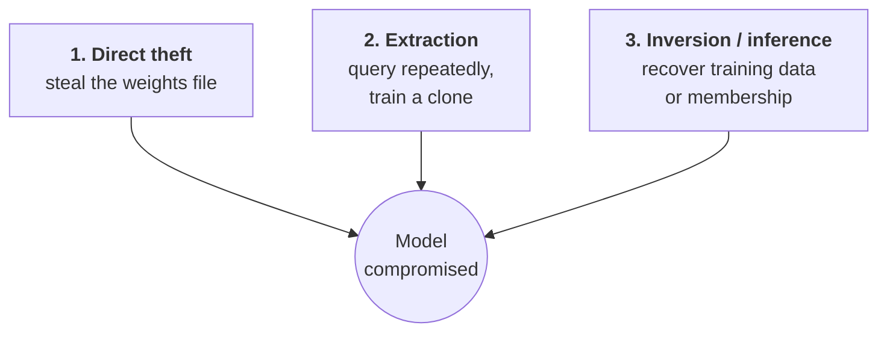

---
tags:
  - Chapter 3
  - OWASP
---

# LLM10 — Model Theft

!!! objective "In this section"
    - Why a model is a high-value asset in its own right
    - Direct theft vs. extraction vs. inversion
    - Why query access alone can be enough to clone a model
    - Mitigations

---

## What is it?

> **Model theft** is the unauthorised acquisition of a proprietary model — either by stealing the
> weights directly, or by reconstructing equivalent capability through systematic querying.

The framing shift required here: **the model is not just a component of your product. It may *be*
the product.** It represents concentrated investment in data collection, compute, and expertise —
potentially millions of dollars and years of work in one file.

---

## Why models are valuable targets

<dl class="caisp-terms" markdown>

<dt>Direct commercial value</dt>
<dd>A competitor obtains your capability without the cost of building it, eliminating your
advantage.</dd>

<dt>It reveals your secrets</dt>
<dd>A stolen model exposes design choices, fine-tuning data characteristics, and capabilities you
had not disclosed.</dd>

<dt>White-box access enables better attacks</dt>
<dd>From section 2.5 (ML Model Access): with the weights, crafting adversarial examples becomes far
easier and more precise. Theft is often a *step* toward attacking the deployed system, not the end
goal.</dd>

<dt>Guardrails can be stripped</dt>
<dd>Once an attacker has the weights, they can fine-tune away safety alignment (section 2.3) and
use the capability without restriction.</dd>

<dt>Embedded data becomes extractable</dt>
<dd>Whatever the model memorised is now available to the attacker offline, with unlimited queries
and no monitoring.</dd>

</dl>

---

## The three routes

### 1. Direct theft

The straightforward route — steal the file:

- Exposed storage (a public S3 bucket is a recurring real-world cause)
- Compromised model registry or MLOps platform (Chapter 4)
- Insider exfiltration
- Compromised developer credentials or workstation

This is a conventional security problem with conventional answers: access control, encryption,
monitoring, and egress controls.

### 2. Model extraction (the interesting one)

!!! danger "You can steal a model without ever touching it"
    The attacker queries your model many times, collects the input/output pairs, and **trains their
    own model on those pairs**. The result is a clone that approximates your model's behaviour —
    built entirely from responses you willingly served through your public API.

    No breach. No stolen file. Every request individually legitimate.

Related is **model distillation** used adversarially: using a strong model's outputs as training
data for a cheaper model. The technique is legitimate and widely used in research; applied without
authorisation to someone else's commercial model, it is theft of capability.

What makes extraction hard to stop is that the attack *is the intended use*, just at volume and
with a different purpose. The defence has to be about detecting patterns, not blocking individual
requests.

### 3. Model inversion and membership inference

Rather than stealing the model, these recover information *about* it:

<dl class="caisp-terms" markdown>

<dt>Model inversion</dt>
<dd>Reconstructing representative training data from model behaviour.</dd>

<dt>Membership inference</dt>
<dd>Determining whether a <em>specific individual's record</em> was in the training set. This is a
privacy breach with no traditional "breach" — no data was copied, yet a fact about a person was
revealed. It carries direct regulatory significance.</dd>

</dl>

These overlap with LLM06 (disclosure); the distinction is that here the target is the model's
training set rather than data it was given at runtime.

---

## Mitigating model theft

<dl class="caisp-terms" markdown>

<dt>Protect the weights as crown-jewel assets</dt>
<dd>Strict access control, encryption at rest and in transit, hardened registries, no public
buckets, and audit logging on every access. Most direct theft is a failure of basic hygiene.</dd>

<dt>Rate limit and authenticate API access</dt>
<dd>Extraction requires <em>volume</em>. Meaningful rate limits, authentication, and per-account
quotas raise the cost substantially. Anonymous unlimited access to a valuable model is an
invitation.</dd>

<dt>Monitor for extraction patterns</dt>
<dd>Look for the signature: high query volume, systematic or grid-like input coverage, unusually
diverse prompts from one account, or inputs that look machine-generated rather than human. These
patterns are detectable even though individual requests are not suspicious.</dd>

<dt>Limit output detail</dt>
<dd>Returning full probability distributions or logits over the vocabulary makes extraction
dramatically more efficient. Return the minimum the use case requires — typically just the
output.</dd>

<dt>Watermarking and fingerprinting</dt>
<dd>Embed detectable signals in outputs, or deliberate idiosyncratic behaviours, so you can later
demonstrate that another model was distilled from yours. This supports attribution and legal
remedy rather than prevention.</dd>

<dt>Legal and contractual controls</dt>
<dd>Terms of service prohibiting distillation and automated bulk querying. Weak as prevention;
important for enforcement.</dd>

<dt>Privacy-preserving training</dt>
<dd>Techniques such as differential privacy reduce memorisation and therefore limit inversion and
membership inference — at some cost to accuracy.</dd>

<dt>Insider risk controls</dt>
<dd>Least privilege on model artefacts, separation of duties, and egress monitoring. Most
high-value IP theft historically involves insiders.</dd>

</dl>

!!! tip "The realistic security posture"
    You cannot prevent extraction entirely while offering a public API — serving useful responses
    *is* giving away behavioural information. The goal is to make extraction **expensive,
    slow, and detectable** rather than impossible, while protecting the weights themselves
    rigorously, since direct theft *is* preventable.

---

!!! question "Check your understanding"
    ??? success "How can a model be stolen without any breach occurring?"
        Through model extraction: an attacker systematically queries the public API, collects
        input/output pairs, and trains a clone on them. Every individual request is legitimate;
        the theft is in the aggregate.

    ??? success "Why does returning full probability distributions increase risk?"
        Richer output per query makes extraction far more efficient, reducing the number of
        queries an attacker needs to clone the model. Returning only the minimum necessary output
        raises their cost.

    ??? success "Why is membership inference a regulatory concern rather than merely a technical curiosity?"
        It reveals whether a specific individual's data was in the training set — a disclosure
        about a person — without any data being copied. That can constitute a privacy violation
        under data protection law despite there being no conventional breach.

---

<a class="caisp-card" href="../lab-01-prompt-injection/" markdown>
Next · Labs begin
### Lab 3.1 — Prompt Injection Step by Step
All ten covered. Now put the most important one in your hands.
</a>

