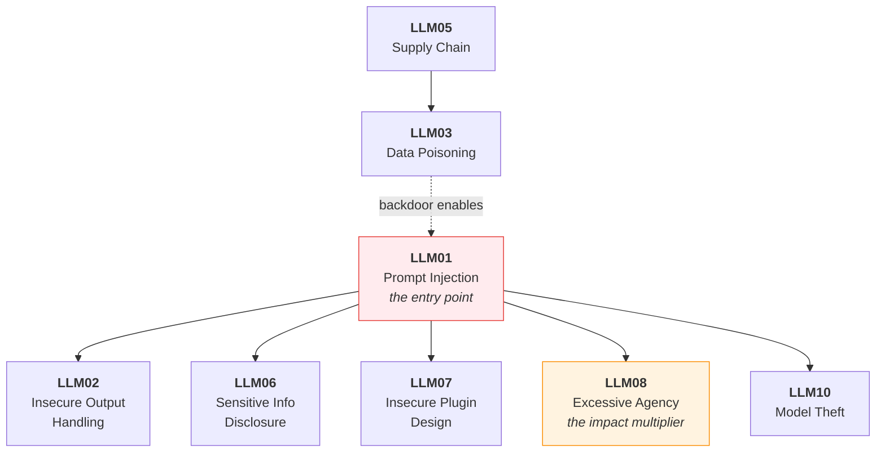

---
tags:
  - Chapter 3
  - OWASP
---

# Chapter 3 — LLM Top 10 Vulnerabilities

<ul class="caisp-meta">
  <li>Level: Intermediate</li>
  <li>Reading: ~3 hrs</li>
  <li>Labs: 4</li>
  <li>Exam weight: ~25%</li>
</ul>

This is the single most important chapter for the certification, and the one you will use most
in real work. It covers the **OWASP Top 10 for Large Language Model Applications** — the
industry-standard catalogue of what actually goes wrong with LLM systems.

Chapters 1 and 2 gave you the foundations and the attacker's playbook. This chapter is the
practitioner's reference: ten named vulnerability classes, each with how it works, how it is
exploited, and — equally weighted — how it is mitigated.

!!! objective "What you will be able to do after this chapter"
    - **Name all ten** OWASP LLM categories and describe each in one sentence
    - **Recognise** each one in an unfamiliar architecture
    - **Demonstrate** prompt injection, system prompt extraction, and data exfiltration
    - **Propose concrete mitigations** for every category — not just identify the flaw
    - Explain which categories are *architectural* (manageable, not solvable) and which are
      *implementation bugs* (fixable)

---

## The ten, at a glance

| # | Category | One-line summary |
|---|---|---|
| **LLM01** | [Prompt Injection](01-prompt-injection.md) | Attacker text is treated as instructions |
| **LLM02** | [Insecure Output Handling](02-insecure-output-handling.md) | Model output is trusted by downstream systems |
| **LLM03** | [Training Data Poisoning](03-training-data-poisoning.md) | Corrupted training data teaches bad behaviour |
| **LLM04** | [Model Denial of Service](04-model-dos.md) | Expensive requests exhaust capacity or budget |
| **LLM05** | [Supply Chain Vulnerabilities](05-supply-chain.md) | Compromised models, datasets, or dependencies |
| **LLM06** | [Sensitive Information Disclosure](06-sensitive-info-disclosure.md) | The model reveals data it should not |
| **LLM07** | [Insecure Plugin Design](07-insecure-plugin-design.md) | Tools accept unvalidated input from the model |
| **LLM08** | [Excessive Agency](08-excessive-agency.md) | The system can do more than it needs to |
| **LLM09** | [Overreliance](09-overreliance.md) | Humans trust model output too much |
| **LLM10** | [Model Theft](10-model-theft.md) | The model itself is stolen or cloned |

!!! info "Edition note"
    Numbering follows the **v1.1 (2023)** edition used by the course syllabus. See
    [section 3.0](00-owasp-intro.md) for a mapping to the renumbered **2025** edition.

---

## How the ten relate to each other

They are not independent. Real incidents chain them, and understanding the chains is what
separates memorising a list from understanding the domain.

Three structural observations worth internalising now:

**LLM01 is the entry point.** Most LLM attack chains begin with injection. It is the
"initial access" of the LLM world.

**LLM08 is the impact multiplier.** Injection into a system that can only chat produces an
embarrassing reply. The same injection into a system that can send email, run code, or move
money produces an incident. **Severity is set by agency, not by the cleverness of the attack.**

**LLM03 and LLM05 attack the foundation.** Poisoning and supply-chain compromise happen *before*
deployment, and they defeat every runtime control you build on top.

---

## A crucial distinction: architectural vs. implementation

Beginners treat all ten as equivalent bugs to be fixed. They are not, and confusing the two
leads to bad security advice.

<dl class="caisp-terms" markdown>

<dt>Architectural — <em>managed</em>, not solved</dt>
<dd><strong>LLM01 (Prompt Injection)</strong> and <strong>LLM09 (Overreliance)</strong> arise from
how LLMs fundamentally work. There is currently no fix. You reduce likelihood and constrain
impact. Anyone selling you a product that "solves prompt injection" is overselling.</dd>

<dt>Implementation — genuinely fixable</dt>
<dd><strong>LLM02, LLM04, LLM05, LLM07, LLM08, LLM10</strong> are engineering problems with
engineering solutions. Escape your output. Rate limit. Verify your models. Scope your tools.
Least privilege. These <em>can</em> be closed.</dd>

<dt>Process — organisational</dt>
<dd><strong>LLM03 (Poisoning)</strong> and <strong>LLM06 (Disclosure)</strong> depend on data
governance and provenance as much as code.</dd>

</dl>

!!! tip "The professional framing"
    Because LLM01 cannot be eliminated, mature AI security **assumes injection succeeds** and
    focuses on the categories that *can* be closed — especially **LLM02** (what happens to the
    output) and **LLM08** (what the system is allowed to do).

    That single strategic insight is worth more than memorising all ten names, and it will earn
    you marks on scenario questions.

---

## Sections

<a class="caisp-card" href="00-owasp-intro.md">
  3.0
  Introduction to the OWASP Top 10
  What OWASP is, how the list is built, and how to use it.
</a>
<a class="caisp-card" href="01-prompt-injection.md">
  LLM01
  Prompt Injection
  The big one. Direct, indirect, techniques, and honest mitigations.
</a>
<a class="caisp-card" href="02-insecure-output-handling.md">
  LLM02
  Insecure Output Handling
  When downstream systems trust what the model said.
</a>
<a class="caisp-card" href="03-training-data-poisoning.md">
  LLM03
  Training Data Poisoning
  Corrupting what the model learns.
</a>
<a class="caisp-card" href="04-model-dos.md">
  LLM04
  Model Denial of Service
  Context exhaustion and denial of wallet.
</a>
<a class="caisp-card" href="05-supply-chain.md">
  LLM05
  Supply Chain Vulnerabilities
  Models and datasets as untrusted dependencies.
</a>
<a class="caisp-card" href="06-sensitive-info-disclosure.md">
  LLM06
  Sensitive Information Disclosure
  Leaking prompts, training data, and other users' data.
</a>
<a class="caisp-card" href="07-insecure-plugin-design.md">
  LLM07
  Insecure Plugin Design
  Tools that trust their caller.
</a>
<a class="caisp-card" href="08-excessive-agency.md">
  LLM08
  Excessive Agency
  The impact multiplier.
</a>
<a class="caisp-card" href="09-overreliance.md">
  LLM09
  Overreliance
  Hallucination and the humans who believe it.
</a>
<a class="caisp-card" href="10-model-theft.md">
  LLM10
  Model Theft
  Stealing or cloning the asset.
</a>

## Labs

<a class="caisp-card" href="lab-01-prompt-injection.md">
  Lab 3.1
  Prompt Injection Step by Step
  A progressive playground: eight levels of increasing defence.
</a>
<a class="caisp-card" href="lab-02-system-user-prompts.md">
  Lab 3.2
  System vs User Prompts
  Why the boundary is a fiction, demonstrated.
</a>
<a class="caisp-card" href="lab-03-data-extraction.md">
  Lab 3.3
  Extracting Sensitive Information
  Pull secrets out of a system you built.
</a>
<a class="caisp-card" href="lab-04-hallucination.md">
  Lab 3.4
  LLM Hallucination Lab
  Measure fabrication rates instead of guessing.
</a>

---

!!! danger "Rules of engagement"
    Every technique in this chapter is run against **local labs you control**. Pointing them at
    a third-party AI service without written authorisation is an attack on their system. See the
    [rules of engagement](../start-here/index.md).
