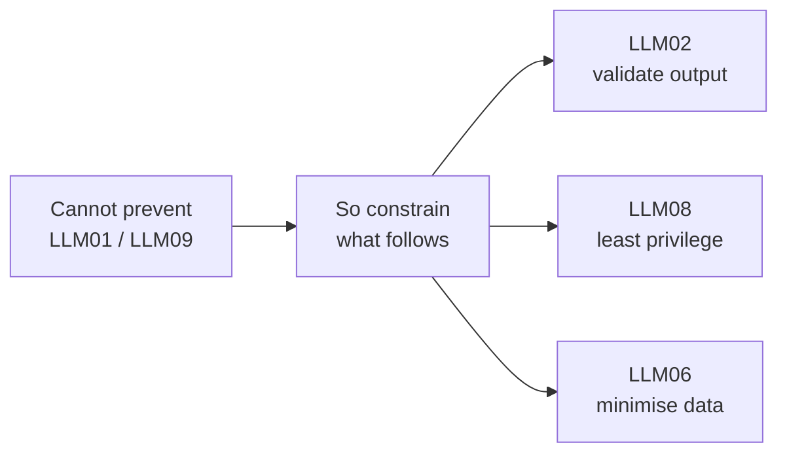

---
tags:
  - Chapter 3
  - Review
---

# Chapter 3 — Review & Quiz

<ul class="caisp-meta">
  <li>Time: 45 min</li>
  <li>25 questions</li>
  <li>Largest exam domain</li>
</ul>

This chapter is roughly a quarter of the certification exam and the core of day-to-day practice.
Consolidate it properly.

---

## The one-page summary

### The ten, grouped

Do not memorise a flat list. Memorise four groups:

| Group | Categories |
|---|---|
| **Input problems** | LLM01 Injection · LLM03 Poisoning · LLM05 Supply chain |
| **Output problems** | LLM02 Output handling · LLM06 Disclosure · LLM09 Overreliance |
| **Capability problems** | LLM07 Plugins · LLM08 Excessive agency |
| **Resource problems** | LLM04 DoS · LLM10 Model theft |

### Architectural vs. fixable

| Type | Categories | Strategy |
|---|---|---|
| **Architectural** (managed, not solved) | LLM01, LLM09 | Reduce likelihood, constrain impact |
| **Implementation** (genuinely fixable) | LLM02, LLM04, LLM05, LLM07, LLM08, LLM10 | Engineer the fix |
| **Process / governance** | LLM03, LLM06 | Data governance and provenance |

### The chain

**LLM01 is the entry point. LLM08 is the impact multiplier.**

Injection into a chat-only bot → embarrassing reply.
The same injection into a bot that moves money → fraud.

### The strategy that actually works

### Sentences to remember

> **You cannot prevent prompt injection; you can prevent it from mattering.**

> **Severity is determined by agency, not by the sophistication of the attack.**

> **A system prompt is not a security boundary. Assume it is public.**

> **Treat every byte of LLM output as if a malicious user typed it.**

> **The most reliable way to stop a model leaking something is for the model never to have it.**

---

## Quiz

### Section A — Prompt injection (LLM01)

??? question "1. Why can't prompt injection be solved the way SQL injection was?"
    SQL injection was solved by architecturally separating the command channel from the data
    channel (parameterised queries). An LLM consumes instructions and data as one text stream with
    no equivalent separation available, so the fix has no analogue.

??? question "2. Distinguish direct from indirect prompt injection."
    Direct: the attacker types the malicious instruction to the model themselves. Indirect: the
    attacker plants it in content the model will later read (a document, web page, ticket), and an
    innocent user's normal query triggers it.

??? question "3. Give four reasons indirect injection is harder to defend than direct."
    The victim's input is benign (nothing to filter); the payload arrives through a channel you
    designed to trust; it can lie dormant until the right query; one plant affects many victims;
    attacker and victim never interact.

??? question "4. Your manager says 'add a filter to block prompt injection.' Respond."
    A filter stops low-effort attacks and provides detection value, but cannot prevent injection —
    paraphrase, encoding, and indirect delivery defeat it. The effective strategy is to assume
    injection succeeds and constrain impact: least privilege (LLM08), output validation (LLM02),
    and data minimisation (LLM06).

??? question "5. In Lab 3.1, why were levels 7 and 8 unsolvable when levels 1–6 all fell?"
    Levels 1–6 *asked the model to behave* — instructions, blocklists, output filters, canaries —
    and all can be talked around. Levels 7 and 8 *removed the target*: the secret was not in the
    context, and the model had no capability to reach it. Boundaries hold; requests do not.

### Section B — Output, poisoning, DoS, supply chain

??? question "6. Why is LLM02 considered a primary defence against LLM01?"
    Because you cannot prevent injection, but you can ensure a hijacked model's output cannot harm
    downstream systems. Rigorous validation and escaping contain an injection you could not stop.

??? question "7. A coding assistant executes generated code on the app server to 'test' it. Categories and worst case?"
    LLM01 chained with LLM02. Worst case: remote code execution on the server. Fix: execute
    generated code only in a sandboxed, network-isolated environment with no credentials.

??? question "8. Why is data poisoning harder to address than prompt injection?"
    It corrupts the model before deployment: invisible to evaluation, durable in the weights,
    survives fine-tuning, and sits beneath every runtime control. Removing it requires retraining.

??? question "9. Why is limiting input by character count insufficient for LLM04?"
    Cost and context are measured in tokens, and token density varies enormously by script and
    content. A character cap can admit input many times more expensive than intended.

??? question "10. How can context exhaustion become a guardrail bypass?"
    If the application drops the oldest context when the window fills, an attacker who floods it can
    evict the system prompt, leaving the model running without its safety instructions.

??? question "11. Why can't you 'code review' a model the way you review a library?"
    Its behaviour is billions of numeric weights, not readable logic. There is nothing to read,
    version diffs are not meaningful, and a backdoor is indistinguishable from learned patterns.
    Hence provenance over inspection.

??? question "12. What makes package hallucination an AI-specific supply chain attack?"
    The model is the delivery mechanism: it invents a plausible package name, attackers pre-register
    it with malicious content, and a developer trusting the suggestion installs attacker code.

### Section C — Disclosure, plugins, agency

??? question "13. Why is 'the user can't see the system prompt' false?"
    The prompt is upstream of the model, not hidden from it. The model reads it and talks to users,
    so injection, paraphrase, or summarisation can surface it. Assume it is public.

??? question "14. Beyond any secret it contains, why is system prompt extraction valuable to an attacker?"
    It is reconnaissance (ATLAS Discovery): it reveals the rules to bypass, the tools available to
    abuse, the guardrails to route around, and internal terminology for further attacks.

??? question "15. An internal assistant surfaces salary data to a junior employee. Category and fix?"
    LLM06, via a retrieval access-control failure. Fix: filter retrieval results by the asking
    user's source-system permissions, so unauthorised documents are never retrieved.

??? question "16. Why can't you secure a plugin by instructing the model to call it correctly?"
    The model is attacker-influenceable via injection and its instruction-following is a learned
    tendency, not an enforced control. The tool must validate and authorise independently, treating
    the model as a hostile client.

??? question "17. Distinguish LLM07 from LLM08."
    LLM07: the tool itself is poorly designed — insufficient validation, authorisation, or scoping.
    LLM08: the system as a whole has more capability, permission, or autonomy than its task
    requires.

??? question "18. Name the three dimensions of excessive agency."
    Excessive **functionality** (too many/too broad tools), excessive **permissions** (credentials
    broader than needed), excessive **autonomy** (acts without human confirmation).

??? question "19. Why does reducing agency improve security against vulnerabilities you have not fixed?"
    Agency determines impact. A hijacked model with no dangerous capability produces a bad answer
    rather than a bad outcome — simultaneously lowering the severity of LLM01, LLM03, LLM06 and
    LLM07.

??? question "20. A system prompt says 'never approve refunds over £500'. Why is this inadequate?"
    It is a request to a probabilistic, attacker-influenceable system, not an enforced control.
    Replace it with a hard check in application code.

### Section D — Overreliance, theft, synthesis

??? question "21. Why is hallucination intrinsic rather than a fixable bug?"
    LLMs generate statistically plausible continuations rather than retrieving verified facts.
    Correct and fabricated output use the identical mechanism with no internal signal distinguishing
    them.

??? question "22. Why is a mostly-right model more dangerous than a mostly-wrong one?"
    Reliability trains users to stop verifying, so the occasional confident error lands
    unchallenged. A frequently-wrong model keeps people sceptical.

??? question "23. Compare LLM08 and LLM09 structurally."
    Both govern what happens after the model produces something bad. Agency determines the impact of
    a successful *attack*; overreliance determines the impact of an unforced *error*. Both are
    mitigated by constraining what follows the output.

??? question "24. How can a model be stolen with no breach occurring?"
    Model extraction: the attacker systematically queries the public API, collects input/output
    pairs, and trains a clone. Every individual request is legitimate; the theft is in aggregate.

??? question "25. Walk an end-to-end attack chain across at least four categories."
    Example: An attacker plants an injection in a customer ticket indexed by the support bot
    (**LLM01**, indirect). The hijacked model calls an over-scoped `run_query` tool (**LLM07**)
    running with application credentials (**LLM08**, confused deputy) to read other customers'
    records (**LLM06**), then embeds the data in a markdown image URL that the chat UI renders,
    exfiltrating it (**LLM02**).

---

## Scoring yourself

| Score | What it means |
|---|---|
| **21–25** | Excellent. You are ready for Chapter 4. |
| **17–20** | Good. Re-read the categories you missed. |
| **12–16** | Shaky on the largest exam domain. Re-read LLM01, LLM06, LLM08 and redo Labs 3.1 and 3.3. |
| **Under 12** | Rework the chapter. This is 25% of the exam and the foundation of everything after. |

---

## Readiness checklist

- [ ] I can name all ten categories from memory with a one-line description of each.
- [ ] I can group them (input / output / capability / resource).
- [ ] I can explain which are architectural and which are fixable.
- [ ] I can explain why prompt injection cannot be solved.
- [ ] I can distinguish direct from indirect injection and say why indirect is worse.
- [ ] **I completed Lab 3.1 and can explain why levels 7 and 8 are unbreakable.**
- [ ] I can explain why LLM02 is a primary defence for LLM01.
- [ ] I can implement a retrieval permission filter.
- [ ] I can state the three dimensions of excessive agency.
- [ ] I can explain why business rules in a system prompt are not controls.
- [ ] I can design hallucination probes and measure a rate.
- [ ] **For every category, I can state at least one concrete mitigation.**
- [ ] I can narrate an attack chain spanning four or more categories.

!!! tip "The single best exam preparation exercise"
    Take a real product you use with an AI feature. Walk all ten categories against it. For each:
    could this apply? how would you test it? what would you recommend?

    Give yourself two hours and write it up. That exercise exercises this entire chapter and
    previews Chapter 5's threat modeling.

---

## Going further

- **[OWASP Top 10 for LLM Applications](https://owasp.org/www-project-top-10-for-large-language-model-applications/)**
  — read the current official version; note any wording changes since this chapter was written.
- **[OWASP LLM Top 10 cheat sheets and guides](https://genai.owasp.org/)** — the project publishes
  practical supporting material.
- **[AI Incident Database](https://incidentdatabase.ai/)** — pick five recent incidents and
  classify each against the ten.

---

<a class="caisp-card" href="../" markdown>
Back
### Chapter 3 Contents
Revisit any category or lab.
</a>

Coming next
### Chapter 4 — AI Attacks and Defenses Using DevOps
Pipeline attacks, real-world incidents, and the defensive tooling: SCA, static and dynamic
analysis, pickle scanning, and AI firewalls. Six hands-on labs.

