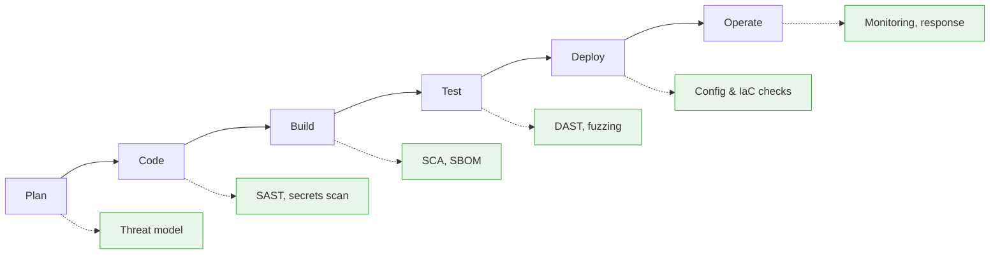

---
tags:
  - Chapter 4
  - DevSecOps
---

# 4.1 Introduction to AI in DevOps

!!! objective "In this section"
    - What DevOps is and the principles behind it
    - What DevSecOps adds, and why "shift left" matters
    - How AI *helps* DevOps — and the risks that come with it
    - Why MLOps is harder to secure than traditional DevOps

---

## What is DevOps?

> **DevOps** is a set of practices combining software **development** and IT **operations** to
> deliver software faster and more reliably.

Before DevOps, development and operations were separate teams with opposing incentives.
Developers were rewarded for shipping change; operations were rewarded for stability. Releases were
large, infrequent, manual, and stressful, and each side blamed the other when things broke.

DevOps dissolved that wall. The core principles:

<dl class="caisp-terms" markdown>

<dt>Automation</dt>
<dd>If a task is performed repeatedly, automate it. Manual steps are slow and error-prone.</dd>

<dt>Continuous Integration (CI)</dt>
<dd>Merge code changes frequently, with automated builds and tests on every change, so problems are
found within minutes rather than months.</dd>

<dt>Continuous Delivery / Deployment (CD)</dt>
<dd>Keep software always in a releasable state, and automate the path to production. Small frequent
releases are less risky than large rare ones.</dd>

<dt>Infrastructure as Code (IaC)</dt>
<dd>Define servers and infrastructure in version-controlled files rather than configuring them by
hand. Reproducible, reviewable, auditable.</dd>

<dt>Monitoring and feedback</dt>
<dd>Instrument everything; use production signals to drive improvement.</dd>

<dt>Shared ownership</dt>
<dd>"You build it, you run it." The team that writes the code operates it.</dd>

</dl>

---

## What DevSecOps adds

DevOps made delivery fast. Security, traditionally a **gate at the end** — a penetration test two
weeks before launch — could not keep up. Teams shipping daily cannot wait weeks for a security
review, so security got bypassed.

> **DevSecOps** integrates security into every stage of the pipeline rather than bolting it on at
> the end.

The central idea is **shift left**: move security earlier in the lifecycle.

!!! info "Why shifting left works: the cost curve"
    A flaw caught while writing code costs minutes to fix. The same flaw caught in production costs
    orders of magnitude more — incident response, emergency patching, customer impact, possibly
    regulatory consequences.

    This is not merely a security argument; it is an economic one, which is why it succeeded where
    "security says no" did not.

### DevSecOps principles

- **Automate security checks** so they run on every change without human scheduling.
- **Fail fast, fail informatively** — block the build on genuinely serious issues, and tell the
  developer precisely what to fix.
- **Security as everyone's job**, with the security team providing tooling and expertise rather
  than acting as a gate.
- **Continuous, not periodic** — an annual penetration test does not secure a system that changes
  daily.

---

## The role of AI in enhancing DevOps

AI genuinely improves DevOps practice, and it is worth acknowledging the upside before cataloguing
the risks.

<dl class="caisp-terms" markdown>

<dt>Code generation and review</dt>
<dd>Assistants write boilerplate, suggest fixes, and flag likely bugs during review.</dd>

<dt>Test generation</dt>
<dd>Producing unit tests and edge cases that humans routinely skip.</dd>

<dt>Anomaly detection in operations</dt>
<dd>ML on logs and metrics detects incidents faster than static thresholds (this is classic
unsupervised learning from Chapter 1).</dd>

<dt>Incident triage and summarisation</dt>
<dd>Condensing alert floods and correlating signals during an incident.</dd>

<dt>Vulnerability prioritisation</dt>
<dd>Helping teams focus on the small fraction of findings that actually matter in their context.</dd>

<dt>Documentation and post-mortems</dt>
<dd>Drafting the write-ups that engineers otherwise never get round to.</dd>

</dl>

!!! danger "But each benefit carries a matching risk"
    | Benefit | Corresponding risk |
    |---|---|
    | AI writes code | Insecure code, package hallucination (section 2.4) |
    | AI reviews code | Overreliance — humans stop reviewing carefully (LLM09) |
    | AI triages alerts | A manipulated or backdoored model suppresses real alerts |
    | AI in the pipeline | A new, privileged component in your build process |
    | AI summarises incidents | Hallucinated facts entering the official record |

    The last row of that table is subtle and worth sitting with. An AI assistant *inside your CI/CD
    pipeline* has access to source code, secrets, and deployment capability. It is one of the most
    privileged components you could introduce — and it accepts natural-language input.

---

## MLOps: DevOps for machine learning

**MLOps** applies DevOps practice to machine learning. It is harder, for reasons that matter
directly to security.

| | Traditional DevOps | MLOps |
|---|---|---|
| What you version | Code | Code **+ data + model + hyperparameters** |
| Build reproducibility | Deterministic | Often **not** reproducible (randomness, data drift) |
| Testing | Deterministic pass/fail | Statistical — "accuracy is 94%", not "passes" |
| Artefact | Readable source | **Opaque binary weights** |
| Artefact size | Megabytes | Often **gigabytes** |
| Failure mode | Crash / error | **Silent degradation** |
| Rollback | Redeploy previous version | Same, but the model may need retraining |

!!! warning "Three consequences for security"
    **1. More things to protect.** You must secure the code, *and* the data, *and* the model
    artefacts, *and* the training infrastructure. Traditional tooling covers only the first.

    **2. You cannot review the artefact.** Code review works on code. A model is billions of
    weights (Chapter 2, Lab 2.9). The standard "review before merge" control simply does not apply
    to the most important artefact in the pipeline.

    **3. Failures are silent.** A broken build fails loudly. A subtly degraded — or backdoored —
    model keeps serving traffic and passing health checks while producing wrong answers. Detection
    requires *measuring model behaviour*, not just monitoring uptime.

---

## The cultural problem

Worth naming explicitly, because it explains most of what you will find in real assessments.

ML systems are frequently built by **data scientists and researchers** rather than software or
platform engineers. That is not a criticism — their expertise is exactly what is needed to build a
good model. But it means ML infrastructure often reflects research priorities:

- Notebooks running on servers that were never hardened
- Experiment trackers and model registries deployed without authentication
- Credentials pasted into notebook cells or environment variables
- Broad cloud service accounts, because scoping them was friction during experimentation
- "Temporary" infrastructure that became permanent

!!! tip "How to approach this constructively"
    Do not treat it as negligence. Treat it as a **gap in platform support**: the organisation asked
    researchers to do production engineering without giving them production tooling.

    The effective response is to *provide* secure defaults — hardened notebook environments,
    authenticated registries, scoped credentials issued automatically — rather than to write
    findings reports telling data scientists to be better engineers. Security teams that supply
    paved roads succeed; those that supply only rules get routed around.

---

!!! question "Check your understanding"
    ??? success "What does 'shift left' mean and why does it work?"
        Moving security activities earlier in the development lifecycle. It works because the cost
        of fixing a flaw rises steeply the later it is found — minutes during coding, potentially
        enormous in production.

    ??? success "Name three ways MLOps is harder to secure than traditional DevOps."
        You must version and protect data and models as well as code; the primary artefact (model
        weights) cannot be reviewed the way code can; and failures are silent degradations rather
        than loud crashes, so monitoring uptime is insufficient.

    ??? success "Why is an AI coding assistant inside a CI/CD pipeline a significant security concern?"
        It is a highly privileged component — with access to source code, secrets, and deployment
        capability — that accepts natural-language input and is therefore susceptible to prompt
        injection. A compromise there reaches everything the pipeline can reach.

---

<a class="caisp-card" href="../02-ml-pipeline-attacks/" markdown>
Next · 4.2
### The ML Pipeline & Its Attack Surface
Walk the pipeline stage by stage and map where attackers get in.
</a>

