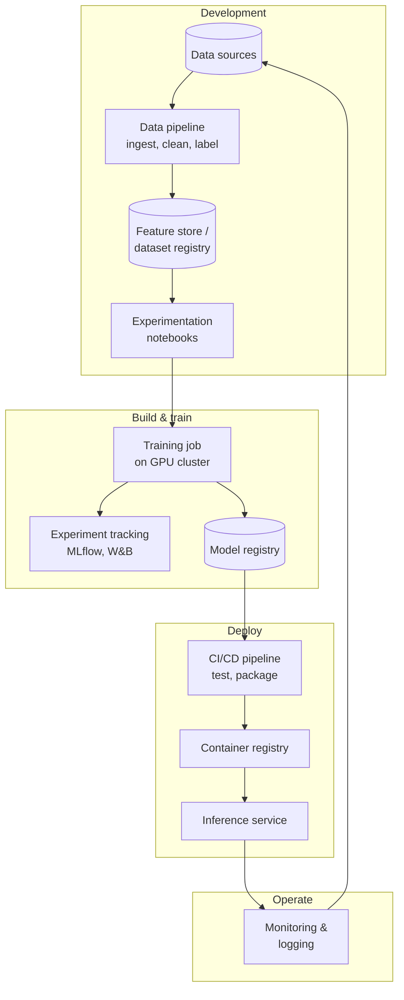

---
tags:
  - Chapter 4
  - DevSecOps
---

# 4.2 The ML Pipeline and Its Attack Surface

!!! objective "In this section"
    - The model creation and deployment pipeline, stage by stage
    - The attack surface at each stage
    - Why the pipeline is often a softer target than the model
    - The specific components attackers go after

---

## The model creation and deployment pipeline

Here is the full lifecycle of a production model. Every box is a component you must secure, and
every arrow is data or artefacts in transit.

Note the feedback loop at the bottom: production data flows back into training. That loop is
convenient and it is also **a path by which runtime attacks become training-time attacks**.

---

## Attacks on pipelines, stage by stage

### Data sources and ingestion

**What attackers want:** to get poisoned data in (LLM03), or to steal the data.

- Compromise an upstream data source, or contribute to a public one
- Tamper with data in transit or at rest
- Exploit the ingestion job itself — these are often scripts with broad credentials
- Abuse the production feedback loop to inject crafted examples into future training sets

!!! warning "The feedback loop deserves specific attention"
    Systems that retrain on production data or user feedback create a direct channel from *any
    user* to *your next model*. An attacker who can submit inputs, ratings, or corrections can
    shape what the model becomes.

    When you assess a system, ask: **does production data flow into training, and is it validated
    before it does?**

### Data pipeline and labelling

- Compromise a preprocessing script or one of its dependencies
- Influence labelling — outsourced or crowd-sourced labelling is a third party with write access to
  what your model believes (section 1.3)
- Tamper with the feature store, affecting every model built from it

### Experimentation environment

This is frequently the softest target in the entire pipeline.

- **Exposed notebook servers.** Jupyter instances reachable from the internet, sometimes with
  authentication disabled, have been a recurring real-world finding. A notebook is remote code
  execution as a feature.
- **Credentials in notebooks.** Keys pasted into cells and committed to version control.
- **Shared development machines** with broad access to data and infrastructure.

### Training job

- **Compromise the training code or its dependencies** to plant a backdoor during training
- **Tamper with hyperparameters or the training data path** so the job trains on attacker-chosen
  data
- **Steal credentials from the training environment** — training jobs typically hold access to data
  stores, registries, and cloud services
- **Hijack the compute** — GPUs are valuable; compromised training clusters are attractive for
  cryptomining or free training capacity

### Experiment tracking and model registry

**High-value targets, frequently under-protected.**

- Registries deployed without authentication, or with default credentials
- **Model substitution** — replace a legitimate model with a backdoored one. Everything downstream
  deploys it automatically, which is the point of a registry.
- **Model theft** (LLM10) — the registry is where the weights live
- Metadata tampering to disguise provenance

!!! danger "Registry compromise is the highest-leverage pipeline attack"
    A model registry is the single point through which every model reaches production. Compromising
    it means every downstream deployment inherits whatever you put there — and because nobody can
    code-review a model (section 4.1), the substitution is unlikely to be noticed.

### CI/CD pipeline

Everything that is true of traditional CI/CD supply chain security applies here, plus AI specifics:

- **Compromised build dependencies** or actions/plugins
- **Secret exfiltration** — pipelines hold deployment credentials, registry tokens, and cloud
  access
- **Malicious model artefacts** pulled during the build and loaded (the pickle problem — Lab 4.3)
- **AI assistants integrated into CI** — a privileged component accepting natural-language input
  (section 4.1)

### Container registry and deployment

- Malicious or vulnerable base images
- Image substitution or tag mutability (`:latest` is not a version)
- Over-permissioned service accounts for the inference workload

### Inference service

This is where Chapter 3 applies in full: prompt injection, insecure output handling, DoS, excessive
agency. Plus infrastructure concerns:

- Unauthenticated or over-exposed inference endpoints
- Model weights readable from the serving host
- Verbose errors leaking architecture detail

### Monitoring and logging

Often overlooked, and genuinely sensitive:

- **Prompt and response logs contain user data** — potentially personal data, credentials users
  pasted, and confidential content. Your logging system may be your largest AI data store.
- **Log tampering** to hide an attack
- **Log injection** — attacker-controlled text landing in logs that a downstream system (or an AI
  log summariser) processes

---

## Why the pipeline is the softer target

Compare the two paths to compromising a model's behaviour:

| | Attack the model | Attack the pipeline |
|---|---|---|
| Skills needed | AI-specific expertise | Conventional infrastructure attack skills |
| Defences faced | Guardrails, filters, rate limits | Often minimal — internal systems |
| Persistence | Per-session | **Durable** — baked into the artefact |
| Reach | One conversation | **Every downstream deployment** |
| Detection likelihood | Moderate — inputs are logged | **Low** — who audits the registry? |

!!! tip "The strategic point"
    Sophisticated attackers do not necessarily out-clever your guardrails. They compromise the
    build.

    This is the same logic as traditional supply chain attacks, and it is why Chapters 4 and 6 exist
    as separate chapters from the model-attack material.

---

## Mapping the pipeline to ATLAS

Connecting back to section 2.5, pipeline attacks map cleanly onto the matrix:

| Pipeline action | ATLAS tactic |
|---|---|
| Scanning for exposed notebooks/registries | Reconnaissance |
| Phishing an ML engineer | Initial Access |
| Compromising a training dependency | Execution |
| Planting a backdoor in the model | **Persistence** |
| Stealing credentials from a training job | Credential Access |
| Substituting a model in the registry | ML Attack Staging |
| Exfiltrating the weights | Exfiltration |

Notice how few of these are AI-specific techniques. Most are ordinary attacker tradecraft applied to
ML infrastructure — which is exactly why traditional security skills transfer so well into this
field.

---

!!! question "Check your understanding"
    ??? success "Why is the model registry such a high-value target?"
        It is the single point through which every model reaches production. Substituting a
        backdoored model there propagates automatically to all downstream deployments, and because
        model weights cannot be reviewed like code, the substitution is unlikely to be detected.

    ??? success "Why does a production-to-training feedback loop create risk?"
        It creates a direct channel from any user to your next model. Attackers who can submit
        inputs, feedback, or corrections can inject crafted examples into future training data,
        turning a runtime interaction into a training-time poisoning attack.

    ??? success "Why might an attacker prefer the pipeline over the model?"
        It typically requires conventional infrastructure skills rather than AI expertise, faces
        weaker defences (internal systems), achieves durable persistence in the artefact, reaches
        every downstream deployment, and is far less likely to be detected.

---

<a class="caisp-card" href="../03-real-world-cases/" markdown>
Next · 4.3
### Real-World Cases
Three incidents, three different lessons.
</a>

