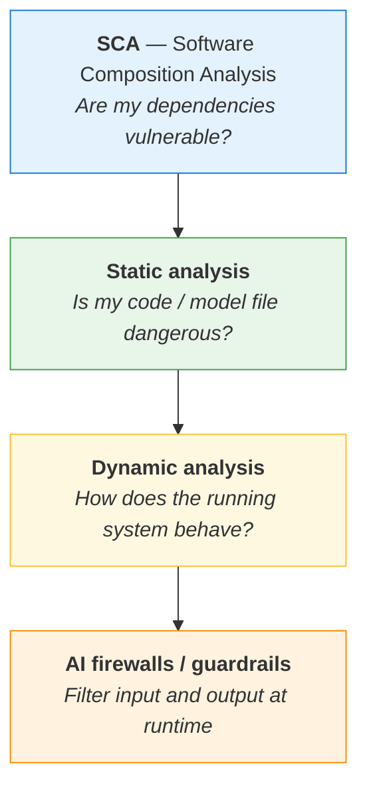
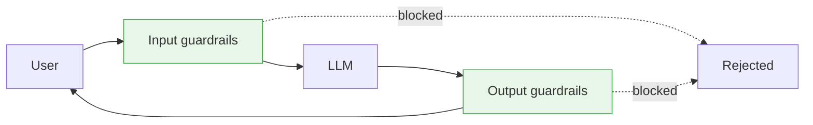

---
tags:
  - Chapter 4
  - DevSecOps
---

# 4.4 DevSecOps Tooling and Defenses for AI Projects

!!! objective "In this section"
    - Software composition analysis for AI projects
    - Static analysis of AI code *and* of model files
    - Dynamic analysis: testing a running model
    - AI firewalls and guardrails — what they do and what they cannot do
    - How the layers fit together

---

## The defensive stack

Four layers, each catching what the others miss. The labs in this chapter work through all of them.



---

## Software Composition Analysis for AI projects

> **SCA** identifies the third-party components your project depends on and checks them against
> databases of known vulnerabilities.

For a typical AI project this matters a great deal, because the dependency tree is enormous.
Installing `transformers` and `torch` pulls in a large graph of transitive dependencies, each with
its own vulnerability history.

**Common tools:** `pip-audit`, `safety`, Trivy, Grype, Snyk, Dependabot, OWASP Dependency-Check.

```bash
pip install pip-audit
pip-audit -r labs/requirements.txt
```

You will do this properly in **Lab 4.1**.

!!! warning "What standard SCA misses in an AI project"
    SCA scans **code dependencies**. An AI project also depends on:

    - **Models** — not in any CVE database, not scanned by conventional SCA
    - **Datasets** — same
    - **Pre-trained weights from public hubs** — same

    So SCA is necessary and **not sufficient**. It covers the part of your supply chain that looks
    like traditional software and leaves the AI-specific part uncovered. That gap is what MLBOMs and
    model signing address in Chapter 6.

### Practical guidance

- Run SCA **in CI on every change**, not occasionally by hand.
- **Pin versions** (`==`, or a lockfile) so builds are reproducible and upstream changes cannot
  silently alter your system.
- **Triage by exploitability**, not raw CVE count. A critical CVE in a code path you never execute
  may matter less than a medium in your request handler. Blindly chasing every finding burns
  goodwill and buries the important ones.
- Watch for **dependency confusion** and **typosquatting** — and remember **package hallucination**
  (section 2.4), which is AI-specific and which SCA will not warn you about until the malicious
  package is already known.

---

## Static analysis

Static analysis inspects artefacts **without running them**. For AI projects there are two distinct
kinds, and conflating them is a common mistake.

### Static analysis of application code (SAST)

Standard SAST looks for insecure patterns in source: injection, hardcoded secrets, weak crypto,
unsafe deserialisation, command execution.

**Tools:** Bandit (Python), Semgrep, CodeQL, Ruff (partially).

```bash
pip install bandit
bandit -r labs/
```

!!! tip "AI-specific patterns SAST should flag"
    Generic SAST rules miss AI-specific dangers. Worth writing custom rules (Semgrep makes this
    easy) for:

    - `pickle.load()` / `torch.load()` on untrusted paths
    - Model output passed to `eval()`, `exec()`, `subprocess`, or a template renderer
    - Model output rendered as HTML without escaping (LLM02)
    - Missing `max_tokens` on generation calls (LLM04)
    - Secrets embedded in system prompt strings (LLM06)
    - Tool/function definitions with overly broad parameters (LLM07)

    **Lab 4.2** works through realistic insecure AI code.

### Static analysis of model files

This is the AI-specific one, and it is not optional.

> Scanning a model **file** for malicious content before loading it.

**`picklescan`** inspects a pickle file's opcodes for dangerous imports and calls — `os.system`,
`subprocess`, `eval`, and similar — *without* unpickling it (unpickling would execute the payload,
which is the entire problem).

```bash
pip install picklescan
picklescan --path suspicious_model.pkl
```

**Lab 4.3** does this hands-on.

!!! warning "Know the limits of model scanning"
    Pickle scanners catch **known-dangerous opcode patterns**. They are a valuable filter for crude
    attacks, and you should run them.

    They do **not** detect:

    - A **backdoor in the weights** (Lab 2.9) — the file is structurally innocent
    - Novel evasion of the scanner's pattern list
    - Anything wrong with a SafeTensors file's *behaviour*

    Scanning catches malicious **files**. It does not catch malicious **models**. Different problem,
    different defence (provenance — Chapter 6).

---

## Dynamic analysis

Dynamic analysis tests the **running** system. For AI this means probing model behaviour, which
looks quite different from traditional DAST.

<dl class="caisp-terms" markdown>

<dt>Adversarial robustness testing</dt>
<dd>Can small perturbations flip outputs? TextAttack (Lab 2.7) automates this.</dd>

<dt>Prompt injection testing</dt>
<dd>A structured suite of injection attempts run against the deployed system, with success
<em>rates</em> recorded — because results vary between runs (section 2.1). Lab 3.1 gave you the
techniques; the discipline is to run them systematically and track the numbers.</dd>

<dt>Hallucination evaluation</dt>
<dd>A probe set with known answers, scored automatically. Lab 3.4 is a working harness.</dd>

<dt>Guardrail bypass testing</dt>
<dd>Test your own filters the way an attacker would. A guardrail you have not tried to defeat is a
guardrail of unknown value.</dd>

<dt>Fuzzing and resource testing</dt>
<dd>Malformed input, enormous contexts, token-dense payloads (Lab 2.2) — probing LLM04.</dd>

<dt>Conventional DAST</dt>
<dd>The application around the model is still a web application. Scan it accordingly.</dd>

</dl>

!!! tip "Testing AI systems is statistical"
    The defining difference from traditional DAST: **run each test many times and record a rate.**

    A prompt injection that succeeds 3 times in 100 is still a vulnerability, and a single passing
    run proves nothing. Build your test harnesses to report percentages, not pass/fail. This is the
    habit Labs 3.1 and 3.4 were designed to instil.

---

## AI firewalls and guardrails

> An **AI firewall** (or guardrail layer) sits between users and the model, inspecting and filtering
> what goes in and what comes out.



### What input guardrails check

- Prompt injection and jailbreak patterns
- PII in user input (so it never reaches the model or the logs)
- Toxic or prohibited content
- **Token count** — enforcing limits in the right unit (LLM04)
- Language and topic scope
- Secrets or credentials pasted by users

### What output guardrails check

- Sensitive data in the response — PII, credentials, internal identifiers (LLM06)
- **System prompt leakage** — canary tokens (Lab 3.1)
- Unsafe content
- **URLs and links against an allowlist** (blocks the image-exfiltration technique from Lab 3.3)
- Output format and schema conformance (LLM02)
- Relevance and grounding — did it answer from the provided context?

**Tools:** LLM Guard (Labs 4.5, 4.6), NVIDIA NeMo Guardrails, Guardrails AI, Rebuff, plus cloud
providers' own content-safety services.

!!! danger "Be honest about what guardrails achieve"
    Guardrails are **useful and worth deploying**. They are also **classifiers and pattern
    matchers**, which means everything you learned in Chapters 2 and 3 applies to them:

    - They can be evaded by paraphrase, encoding, and homoglyphs (Lab 2.2)
    - Classifier-based guards are vulnerable to adversarial perturbation (Lab 2.7)
    - They add latency and cost to every request
    - They produce false positives that frustrate legitimate users

    **A guardrail is a filter, not a boundary.** It raises attacker cost and generates valuable
    detection signal. It does not make injection impossible.

    The real security still comes from **minimisation (LLM06)** and **least privilege (LLM08)** —
    Lab 3.1's levels 7 and 8. Guardrails are layer 1; architecture is layer 2. Deploy both, but do
    not mistake the first for the second.

---

## Putting it together: a CI/CD pipeline for AI

What good looks like, end to end:

| Stage | Control |
|---|---|
| **Pre-commit** | Secrets scanning; linting |
| **On commit** | SAST (Bandit/Semgrep, including AI-specific rules) |
| **On build** | SCA (`pip-audit`); SBOM generation |
| **On model pull** | `picklescan`; signature/hash verification; prefer SafeTensors |
| **On model registration** | Provenance recorded; model card; MLBOM (Chapter 6) |
| **Pre-deploy** | Dynamic tests: injection suite, hallucination probes, guardrail bypass — as *rates* |
| **Deploy** | Least-privilege service accounts; network segmentation; sandboxed model loading |
| **Runtime** | Input/output guardrails; token-based rate limits; cost alerts |
| **Monitoring** | Prompt/response logging (with PII care); canary alerts; behavioural drift detection |

!!! tip "Where to start if you have nothing"
    If an organisation has no AI security tooling at all, the highest value first three moves are:

    1. **`picklescan` on every model pull** — cheap, fast, catches real attacks
    2. **Token-based rate limits and spend alerts** — prevents the most likely availability/cost
       incident
    3. **A documented inventory of what each AI system can *do*** — because you cannot apply least
       privilege to capabilities you have not enumerated

    Guardrails and elaborate test suites come after those.

---

!!! question "Check your understanding"
    ??? success "Why is SCA necessary but insufficient for an AI project?"
        It covers code dependencies against known-vulnerability databases, but models and datasets
        are also dependencies and appear in no CVE database. The AI-specific supply chain is left
        uncovered, which is what MLBOMs and model signing address.

    ??? success "What does picklescan catch, and what does it miss?"
        It catches dangerous opcode patterns in pickle files — malicious *files* — without executing
        them. It misses backdoors in the weights themselves, novel evasions of its pattern list, and
        anything about a model's *behaviour*. Malicious files and malicious models are different
        problems.

    ??? success "Why must dynamic testing of an LLM report rates rather than pass/fail?"
        Because generation is non-deterministic (sampling). The same test can pass on one run and
        fail on the next, so a single pass proves nothing. An injection that succeeds 3% of the time
        is still a vulnerability.

---

<div class="caisp-cards" markdown>

<a class="caisp-card" href="../lab-01-sca/" markdown>
<span class="caisp-kicker">Next · Labs begin</span>
### Lab 4.1 — Vulnerable Third-Party Components
Six defensive labs ahead. Start with the dependency layer.
</a>

</div>
