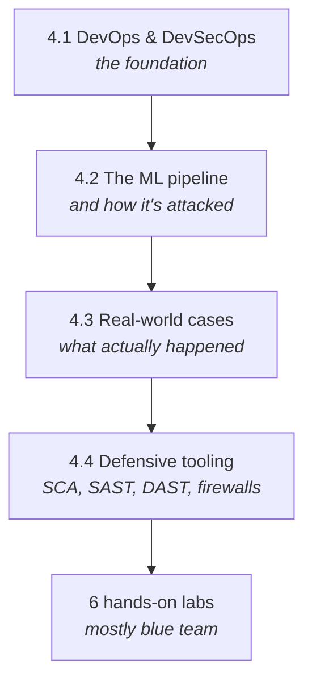

---
tags:
  - Chapter 4
  - DevSecOps
---

# Chapter 4 — AI Attacks and Defenses Using DevOps

<ul class="caisp-meta">
  <li>Level: Intermediate</li>
  <li>Reading: ~2 hrs</li>
  <li>Labs: 6</li>
  <li>Exam weight: ~15%</li>
</ul>

The gear change. Chapters 2 and 3 were mostly about attacking models. This chapter is about
**building and running AI systems safely** — the pipelines that produce models, the infrastructure
that serves them, and the tooling that defends both.

This is where AI security stops being a research topic and becomes an engineering discipline. It
is also, for most practitioners, where the day job actually lives: not crafting exotic jailbreaks,
but making sure the CI pipeline scans model files and the guardrails are wired in correctly.

!!! objective "What you will be able to do after this chapter"
    - Explain **DevOps** and **DevSecOps** and how AI changes both
    - Describe the **ML deployment pipeline** and identify the attack surface at each stage
    - Explain three real-world incidents and what each teaches
    - Use **software composition analysis** on an AI project
    - **Scan a model file** for malicious payloads and explain what the scanner can and cannot catch
    - Apply **static** and **dynamic** analysis to AI code and models
    - Wire **AI firewalls / guardrails** around a model's input and output

---

## Why this chapter matters

Two observations frame everything here.

**First: the pipeline is a softer target than the model.** Attacking a well-defended model takes
skill. Compromising the CI job that builds it, or the registry that stores it, is often
conventional infrastructure attack work — and the payoff is greater, because everything downstream
inherits the compromise.

**Second: ML infrastructure is frequently under-secured.** It is often built by data scientists
optimising for research velocity rather than platform engineers optimising for security. Notebooks
exposed to the internet, registries without authentication, credentials in environment variables,
and service accounts with far too much access are all common findings.

!!! tip "Where the findings are"
    If you assess AI systems professionally, you will find more serious issues in the *pipeline and
    platform* than in the model. This chapter is where the practical wins are.

---

## How this chapter flows

---

## Sections

<a class="caisp-card" href="../01-ai-in-devops/" markdown>
4.1
### Introduction to AI in DevOps
DevOps, DevSecOps, and how AI both helps and complicates them.
</a>

<a class="caisp-card" href="../02-ml-pipeline-attacks/" markdown>
4.2
### The ML Pipeline & Its Attack Surface
From data to deployment, stage by stage — and where attackers get in.
</a>

<a class="caisp-card" href="../03-real-world-cases/" markdown>
4.3
### Real-World Cases
Hugging Face, NotPetya, and SAP AI Core — three different lessons.
</a>

<a class="caisp-card" href="../04-devsecops-tooling/" markdown>
4.4
### DevSecOps Tooling & Defenses
SCA, static analysis, dynamic analysis, and AI firewalls.
</a>

## Labs

<a class="caisp-card" href="../lab-01-sca/" markdown>
Lab 4.1 · Defend
### Vulnerable Third-Party Components
Find and fix known vulnerabilities in an AI project's dependencies.
</a>

<a class="caisp-card" href="../lab-02-static-analysis/" markdown>
Lab 4.2 · Defend
### Finding Weaknesses in AI Code
Static analysis against realistic insecure AI application code.
</a>

<a class="caisp-card" href="../lab-03-picklescan/" markdown>
Lab 4.3 · Defend
### Scanning a Malicious Pickle File
See why loading a model is running a program.
</a>

<a class="caisp-card" href="../lab-04-agent-scanning/" markdown>
Lab 4.4 · Defend
### Scanning for Agent Vulnerabilities
Assess an agentic system's tools and permissions systematically.
</a>

<a class="caisp-card" href="../lab-05-llm-guard/" markdown>
Lab 4.5 · Defend
### Sanitizing Prompts with LLM Guard
Real guardrail tooling on the input side.
</a>

<a class="caisp-card" href="../lab-06-guardrails/" markdown>
Lab 4.6 · Defend
### Guarding LLM Input and Output
Build a complete guardrail layer, then measure its real coverage.
</a>

---

!!! note "A different flavour of lab"
    Chapters 2 and 3 were mostly red team. This chapter is mostly **blue team** — you are building
    and running defences, not breaking them.

    That said, every lab ends by asking you to **measure the defence's actual coverage**, because
    the most common mistake in security tooling is deploying something and assuming it works.
    Chapters 2 and 3 gave you the attacker's perspective needed to test your own controls honestly.
