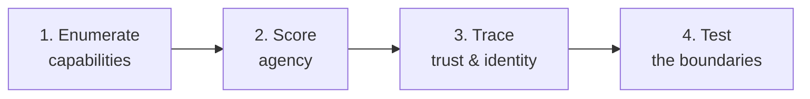

---
tags:
  - Chapter 4
  - Lab
---

# Lab 4.4 — Scanning an LLM for Agent-Based Vulnerabilities

<ul class="caisp-meta">
  <li>Difficulty: Intermediate</li>
  <li>Time: 45–60 min</li>
  <li>Internet: Not required</li>
  <li>Assessment methodology</li>
</ul>

!!! lab "What you will do"
    Build a repeatable **assessment methodology** for agentic AI systems — the tools they hold, the
    permissions behind those tools, and the autonomy they are granted — and apply it to the
    vulnerable app from Lab 4.2.

!!! objective "By the end you will be able to"
    - Enumerate an agent's capabilities systematically
    - Score agency across its three dimensions (LLM08)
    - Identify confused-deputy conditions
    - Produce a findings table you could hand to an engineering team

---

## Why a methodology rather than a tool

Automated scanners for agentic vulnerabilities are immature. What transfers is a **repeatable
process** you can apply to any system, with or without tooling.

The process is four steps:



---

## Step 1 — Enumerate every capability

You cannot apply least privilege to capabilities you have not listed. For each tool the model can
invoke, record:

| Field | Why it matters |
|---|---|
| Tool name and purpose | Is it justified by a real requirement? |
| Parameters and types | Narrow and typed, or free-text? |
| Read or write? | Write actions are the escalation-ladder jump |
| Reversible? | Drafting an email vs. sending it |
| Credentials used | The model's, the app's, or the user's? |
| Rate limited? | Agent loops (LLM04) |
| Logged? | Can you reconstruct an incident? |

Apply it to `vulnerable_ai_app.py` from Lab 4.2:

| Tool | Params | R/W | Reversible | Credentials | Limited | Logged |
|---|---|---|---|---|---|---|
| `lookup_order` | `order_id` (free text) | Read | n/a | App DB account | No | No |
| `run_tool` | `command` (free text) | **Write** | **No** | **App process** | No | No |
| `summarise_url` | `url` (free text) | Read | n/a | App network | No | No |
| `eval_expression` | derived from model | **Write** | **No** | **App process** | No | No |

!!! danger "The table is the finding"
    Two tools accept **arbitrary free text** and execute it with **application privileges**, with
    **no rate limit** and **no logging**. You have not run a single exploit and you already have a
    critical finding.

    This is why enumeration comes first. Most serious agentic findings are visible in the inventory.

---

## Step 2 — Score the three dimensions

From LLM08. Score each 0–3 (0 = minimal, 3 = excessive):

<dl class="caisp-terms" markdown>

<dt>Functionality — how many tools, how broad?</dt>
<dd>
0 — one narrow tool · 1 — a few narrow tools · 2 — many tools, or one broad one ·
<strong>3 — a generic executor</strong> (<code>run_query</code>, <code>run_command</code>,
<code>eval</code>)
</dd>

<dt>Permissions — how broad are the credentials?</dt>
<dd>
0 — read-only, scoped to the user's own data · 1 — read-only, broader · 2 — write, scoped ·
<strong>3 — write, broad, or the application's own identity</strong>
</dd>

<dt>Autonomy — how much happens without a human?</dt>
<dd>
0 — proposes only · 1 — acts on reversible things only · 2 — acts on most things ·
<strong>3 — acts on irreversible/consequential things autonomously</strong>
</dd>

</dl>

**Scoring the vulnerable app:**

| Dimension | Score | Evidence |
|---|:---:|---|
| Functionality | **3** | `run_tool` executes arbitrary shell commands |
| Permissions | **3** | Runs as the app process; DB account unscoped; no user context |
| Autonomy | **3** | No human approval anywhere |

**Total 9/9.** Maximum agency. Combined with the prompt injection surface (VULN 5), any user who can
send a chat message can run commands on the server.

!!! tip "Use the scores to drive the conversation"
    A numeric score gives engineering teams something concrete to reduce. "Get functionality from 3
    to 1 by replacing `run_tool` with two named operations" is an actionable ticket. "Your agent is
    insecure" is not.

---

## Step 3 — Trace trust and identity

Two questions that find the confused deputy:

**Whose identity does the action use?**

```text
User (low privilege)
   → talks to model
      → model calls tool
         → tool uses THE APPLICATION'S credentials   ← confused deputy
```

If the tool acts as the application rather than as the user, then **any user who influences the
model borrows the application's privileges**. This is LLM07/LLM08 and one of the most common serious
findings in real assessments.

**Where does untrusted text enter?** Map every path:

- Direct chat input (VULN 5)
- Content fetched by `summarise_url` (indirect injection — Lab 2.5)
- Database rows returned by `lookup_order` and fed back to the model
- Tool output chained into subsequent tool calls

!!! warning "Tool output is untrusted input to the next step"
    A frequently-missed issue. `summarise_url` fetches attacker-controlled web content, which then
    enters the model's context. If the model then calls another tool, the attacker's page influenced
    that call.

    **Chained tools propagate indirect injection.** Validate between steps, not just at the entry
    point.

---

## Step 4 — Test the boundaries

Now probe, against a system you control. For each tool ask:

- [ ] Can I invoke it with parameters outside its intended range?
- [ ] Can I invoke it on **another user's** resources?
- [ ] Can I invoke it more times than intended (loops, cost)?
- [ ] Can I chain two tools into something neither alone permits?
- [ ] Can indirect injection (a poisoned document or page) trigger it?
- [ ] Is there any action it can take that a human never reviews?

Record results as **rates**, not pass/fail — generation is non-deterministic (section 2.1).

---

## The findings table

The deliverable. This is what you hand to an engineering team:

| ID | Finding | OWASP | Severity | Recommendation |
|---|---|---|---|---|
| A-01 | `run_tool` executes arbitrary shell commands | LLM08 | **Critical** | Remove; expose named operations with typed params |
| A-02 | `eval_expression` executes model output | LLM02 | **Critical** | Remove; sandbox if genuinely required |
| A-03 | Tools act with app identity, not user identity | LLM07 | **High** | Authorise in the end user's context on every call |
| A-04 | `lookup_order` builds SQL by concatenation | LLM07 | **High** | Parameterised queries + ownership check |
| A-05 | `summarise_url` fetches arbitrary URLs | LLM02 | **High** | Domain allowlist; block internal ranges |
| A-06 | No rate limiting on tool invocation | LLM04 | Medium | Cap calls per request and per user |
| A-07 | No logging of tool calls | — | Medium | Log every invocation with user, params, result |
| A-08 | No human approval for irreversible actions | LLM08 | **High** | Propose-and-approve for consequential actions |

!!! tip "Lead with the recommendation, not the exploit"
    A report full of clever exploits and thin on fixes is of limited use. Engineering teams act on
    the right-hand column. Make it specific, achievable, and ordered by impact.

---

## Break it yourself

- [ ] **Apply the methodology to a real system.** Pick any AI product you use with tool access
      (coding assistant, email assistant). Enumerate capabilities and score agency **on paper** —
      no testing without authorisation.
- [ ] **Design the fixed version.** Rewrite the vulnerable app's tool inventory to score 1/1/1
      instead of 3/3/3, while preserving the legitimate functionality. What did you have to give
      up? (Usually less than expected.)
- [ ] **Build a chained attack (on your own copy).** Can `summarise_url` → model → `run_tool`
      produce something neither achieves alone?
- [ ] **Write an enumeration script.** Parse a Python file's route/tool definitions and emit the
      capability table automatically. Crude static analysis, genuinely useful.
- [ ] **Add the missing controls.** Implement logging and per-user rate limiting on tool calls, then
      verify your own attacks are now visible in the logs.

---

## What you learned

- Agentic assessment is a **repeatable four-step methodology**: enumerate, score, trace, test.
- **The capability inventory is often the finding** — you rarely need an exploit to prove the risk.
- Score agency across **functionality, permissions, and autonomy** to give teams something concrete
  to reduce.
- **Tools acting with application identity** rather than user identity is the confused deputy, and
  it is common.
- **Chained tools propagate indirect injection** — validate between steps.
- The deliverable is a **findings table with specific recommendations**, ordered by impact.

---

<div class="caisp-cards">
<a class="caisp-card" href="lab-05-llm-guard.md">
  <span class="caisp-kicker">Next · Lab 4.5</span>
  <span class="caisp-card-title">Sanitizing Prompts with LLM Guard</span>
  <span class="caisp-card-text">Real guardrail tooling on the input side.</span>
</a>
</div>
