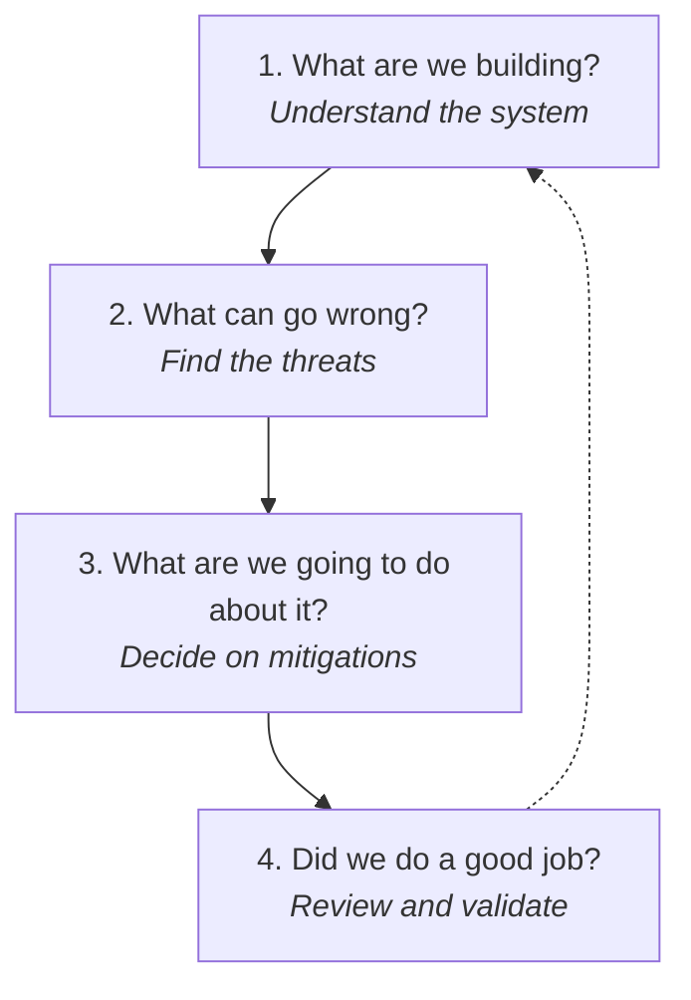

---
tags:
  - Chapter 5
  - Threat Modeling
---

# 5.1 What Is Threat Modeling

!!! objective "In this section"
    - A working definition of threat modeling
    - The four questions at its core
    - Why threat model at all — the benefits
    - The honest challenges, and how to handle them

---

## What is threat modeling?

> **Threat modeling** is a structured process for finding, understanding, prioritising, and
> addressing the threats to a system — ideally *before* it is built or deployed.

The word "structured" is doing a lot of work. Everyone does *unstructured* security thinking — "hmm,
could someone abuse this?" Threat modeling replaces that ad-hoc worrying with a repeatable method
that produces consistent, reviewable, comprehensive results.

The most useful framing, from Adam Shostack, reduces the whole discipline to **four questions**:

<dl class="caisp-terms" markdown>

<dt>1. What are we building?</dt>
<dd>You cannot secure what you do not understand. This is where you draw the system — its
components, its data flows, its trust boundaries (section 5.3).</dd>

<dt>2. What can go wrong?</dt>
<dd>Systematically enumerate threats. STRIDE (section 5.2) and the AI threat libraries (section 5.5)
are the tools that make this comprehensive rather than whatever-comes-to-mind.</dd>

<dt>3. What are we going to do about it?</dt>
<dd>For each threat: mitigate, eliminate, transfer, or accept. Not every threat must be fixed — but
every threat must be a <em>decision</em> (section 5.6).</dd>

<dt>4. Did we do a good job?</dt>
<dd>Review the model. Is it complete? Are the mitigations real? Threat models are living documents,
revisited as the system changes.</dd>

</dl>

!!! tip "If you remember only one thing from this chapter"
    Memorise the four questions. They work on any system — AI or not, one you built or one you are
    handed cold. When you do not know where to start with a security assessment, start here.

---

## Why threat model?

Ad-hoc security review has three failure modes that threat modeling fixes.

**It is incomplete.** Unstructured review finds the threats you happen to think of, which are
biased toward whatever you saw most recently. A method forces coverage — STRIDE makes you consider
all six threat categories against every element, whether or not they occurred to you.

**It is inconsistent.** Two reviewers produce two different results; the same reviewer produces
different results on different days. A method produces repeatable output that others can check.

**It is late.** Security review as a final gate finds problems when they are expensive to fix
(Chapter 4's cost curve). Threat modeling is done *during design*, when a threat can be
engineered out for the price of a conversation.

### The benefits, concretely

<dl class="caisp-terms" markdown>

<dt>Finds design flaws that testing never will</dt>
<dd>Penetration testing and scanning find <em>implementation</em> bugs. Threat modeling finds
<em>design</em> flaws — an architecture that gives the model too much agency, a trust boundary in
the wrong place. No amount of testing finds "this system should never have been built this way".</dd>

<dt>Cheapest possible fix timing</dt>
<dd>A threat found on a whiteboard costs a whiteboard eraser. The same threat found in production
costs an incident.</dd>

<dt>Prioritisation</dt>
<dd>It does not just list threats; it ranks them, so limited effort goes to the highest risks
(section 5.6).</dd>

<dt>Shared understanding</dt>
<dd>The act of threat modeling as a team builds a shared mental model of the system and its risks.
The <em>conversation</em> is often more valuable than the document.</dd>

<dt>A record of decisions</dt>
<dd>"We accepted this risk because X, on this date" is enormously valuable later — for audits, for
incident reviews, and for the next engineer who wonders why something was built a certain way.</dd>

<dt>Compliance and assurance</dt>
<dd>Frameworks like NIST AI RMF and ISO/IEC 42001 (Chapter 7) expect risk identification. A threat
model is direct evidence you did it.</dd>

</dl>

---

## The honest challenges

Threat modeling is not free, and pretending otherwise sets you up to abandon it. The real
difficulties, and how practitioners handle them:

<dl class="caisp-terms" markdown>

<dt>It can feel unbounded</dt>
<dd>"What can go wrong?" has infinite answers, and beginners spiral. <strong>The fix:</strong> use
a framework (STRIDE) to bound the search, and time-box the exercise. A focused two-hour session
beats an open-ended one that never finishes.</dd>

<dt>It needs system understanding</dt>
<dd>You must understand what you are modeling, which for a complex AI system takes effort.
<strong>The fix:</strong> do it <em>with</em> the people who built the system. You supply the
method; they supply the knowledge.</dd>

<dt>It can produce more than you can fix</dt>
<dd>A thorough model may surface fifty threats when you have budget for five.
<strong>The fix:</strong> that is exactly what risk rating (section 5.6) is for — it tells you
<em>which</em> five.</dd>

<dt>It goes stale</dt>
<dd>A threat model of last quarter's architecture is fiction today. <strong>The fix:</strong> treat
it as a living document, tied to the design, and revisit it when the system changes materially.</dd>

<dt>It can become a bureaucratic ritual</dt>
<dd>Done badly, it becomes a box-ticking document nobody reads. <strong>The fix:</strong> optimise
for the <em>conversation and the decisions</em>, not the artefact. A one-page model that changed a
design decision beats a fifty-page one that sat in a drawer.</dd>

</dl>

!!! warning "The trap to avoid: analysis paralysis"
    Beginners often try to produce the perfect, exhaustive threat model and produce nothing.

    **A rough threat model that ships beats a perfect one that does not.** Start with the highest-risk
    parts of the system, time-box the work, and iterate. Threat modeling is a habit, not a monument.

---

## When to threat model an AI system

Not only at the start. Good moments:

- **At design time** — the highest-value moment, when threats can be designed out.
- **Before a significant change** — new tools for an agent, a new data source, a new integration.
- **When the model's agency increases** — moving up the escalation ladder (section 2.4) is exactly
  when to re-model.
- **After an incident** — to find related weaknesses before they are also exploited.
- **Periodically** — because the *threat landscape* changes even when your system does not.

!!! tip "AI-specific trigger: any change that adds a capability or a data source"
    For traditional software, you might re-model on major releases. For AI systems, the triggers are
    **new capabilities** (LLM08) and **new sources of untrusted input** (LLM01) — because those are
    where AI risk concentrates. A one-line change that gives the assistant a new tool deserves a
    fresh look.

---

!!! question "Check your understanding"
    ??? success "What are the four questions at the core of threat modeling?"
        What are we building? What can go wrong? What are we going to do about it? Did we do a good
        job?

    ??? success "Why does threat modeling find flaws that penetration testing cannot?"
        Testing finds implementation bugs in what was built. Threat modeling examines the *design*
        and can identify architectural flaws — like excessive agency or a misplaced trust boundary —
        that are not bugs in the code but problems with the approach itself.

    ??? success "What is the single biggest beginner trap, and the fix?"
        Analysis paralysis — trying to produce a perfect, exhaustive model and producing nothing. The
        fix is to bound the search with a framework, time-box the work, start with the highest-risk
        components, and iterate.

---

<a class="caisp-card" href="../02-parlance/" markdown>
Next · 5.2
### The Threat Model Parlance
The precise vocabulary — assets, threats, vulnerabilities, risk — and STRIDE.
</a>

