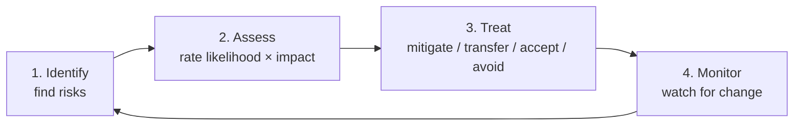

---
tags:
  - Chapter 5
  - Threat Modeling
  - STRIDE
---

# 5.2 The Threat Model Parlance

!!! objective "In this section"
    - The precise meanings of asset, threat, weakness, vulnerability, and risk
    - Why using these terms correctly matters
    - The risk management stages
    - The **STRIDE** methodology in full, mapped to AI

---

## Speaking precisely

Security has a vocabulary, and people misuse it constantly — calling a weakness a "threat", or a
threat a "risk". In casual conversation that is harmless. In a threat model it causes real
confusion, because these words denote *different things that you handle differently*.

<dl class="caisp-terms" markdown>

<dt>Asset</dt>
<dd>Something worth protecting. Data, a model, a service, money, reputation, user safety. <em>The
thing you would be upset to lose.</em></dd>

<dt>Threat</dt>
<dd>A potential event that could harm an asset. "An attacker extracts the training data." <em>What
could happen.</em></dd>

<dt>Weakness</dt>
<dd>A flaw that could, in principle, be exploited. A general shortcoming. "The model can memorise
training data."</dd>

<dt>Vulnerability</dt>
<dd>A weakness that is <em>actually exploitable</em> in this system, in this configuration. "This
deployment lets users submit unlimited queries to a model that memorised customer data." <em>A
weakness with a real path to exploitation.</em></dd>

<dt>Risk</dt>
<dd>The combination of how <em>likely</em> a threat is and how <em>bad</em> the impact would be.
<strong>Risk = Likelihood × Impact.</strong> <em>How much you should actually care.</em></dd>

</dl>

!!! tip "The relationship, in one sentence"
    A **threat** exploits a **vulnerability** (an exploitable **weakness**) to harm an **asset**, and
    the **risk** is how much that should worry you.

    Worked example: *An attacker (threat actor) sends token-dense inputs (threat) exploiting the
    absence of token-based rate limiting (vulnerability, from the weakness "inference costs money") to
    exhaust the budget (asset: availability and cost). The risk is high because it is easy to do
    (high likelihood) and could suspend the service (high impact).*

### Why the precision matters

Because each term maps to a different action:

- You **inventory** assets.
- You **enumerate** threats.
- You **find** vulnerabilities.
- You **rate** risks.
- You **mitigate** based on risk.

Muddle the terms and you muddle the process — for instance, treating every weakness as an urgent
risk, and burning your budget on things that were never actually exploitable.

---

## Risk management stages

Threat modeling sits inside the broader discipline of risk management, which has a standard cycle:

<dl class="caisp-terms" markdown>

<dt>1. Identify</dt>
<dd>Find the risks. Threat modeling is the primary tool for this stage.</dd>

<dt>2. Assess</dt>
<dd>Rate each risk by likelihood and impact, so you can compare and prioritise (section 5.6).</dd>

<dt>3. Treat</dt>
<dd>Choose a response for each risk (below).</dd>

<dt>4. Monitor</dt>
<dd>Risks change as the system and the threat landscape evolve. Watch, and cycle back.</dd>

</dl>

### The four risk treatments

Every risk gets exactly one of these. This is a decision, not an oversight:

<dl class="caisp-terms" markdown>

<dt>Mitigate (reduce)</dt>
<dd>Add controls to lower likelihood or impact. The most common response. "Add token-based rate
limiting."</dd>

<dt>Transfer</dt>
<dd>Shift the risk to someone else — insurance, or a contractual obligation on a vendor. "Our model
host is contractually responsible for infrastructure isolation."</dd>

<dt>Accept</dt>
<dd>Decide the risk is tolerable and do nothing — <em>consciously and on the record</em>. "We accept
occasional hallucination in this low-stakes internal tool." Acceptance is legitimate; silent
acceptance is negligence.</dd>

<dt>Avoid (eliminate)</dt>
<dd>Remove the feature or capability causing the risk. "We will not give the assistant the ability to
send external email." Often the best option for AI — it is Lab 3.1's levels 7 and 8, and LLM08's
core advice, expressed as a risk decision.</dd>

</dl>

!!! warning "Accept is a decision, made by someone with authority to make it"
    "We'll accept that risk" is a valid answer — but only when made deliberately, by someone
    accountable, and recorded. An engineer quietly deciding to accept a critical risk because fixing
    it is annoying is not risk acceptance; it is an unmanaged risk with a story attached.

---

## STRIDE

STRIDE is the workhorse methodology for the "what can go wrong?" question. It is a **mnemonic for
six threat categories**, and its value is completeness: applied to each element of your system, it
forces you to consider threats you would otherwise miss.

Each category is the *opposite* of a security property you want:

| Letter | Threat | Violates | Plain question |
|---|---|---|---|
| **S** | Spoofing | Authentication | Can someone pretend to be someone else? |
| **T** | Tampering | Integrity | Can someone change data or code they shouldn't? |
| **R** | Repudiation | Non-repudiation | Can someone deny doing something? |
| **I** | Information disclosure | Confidentiality | Can someone see what they shouldn't? |
| **D** | Denial of service | Availability | Can someone break or exhaust the service? |
| **E** | Elevation of privilege | Authorisation | Can someone gain powers they shouldn't have? |

### STRIDE mapped to AI

This is where it becomes concrete for us. Each STRIDE category has vivid AI-specific instances,
which connect directly to Chapter 3:

<dl class="caisp-terms" markdown>

<dt>Spoofing</dt>
<dd>Impersonating a user to an assistant; forging a "system" message inside user input (Lab 3.2);
a manipulated model impersonating a trusted source in its output.</dd>

<dt>Tampering</dt>
<dd><strong>Data poisoning</strong> (LLM03); <strong>prompt injection</strong> altering behaviour
(LLM01); corrupting a RAG corpus; <strong>model substitution</strong> in the registry (Chapter 4);
tampering with a model file (LLM05).</dd>

<dt>Repudiation</dt>
<dd>No logging of what a user asked or what an agent <em>did</em> — so abuse cannot be proven or
reconstructed. This is why Chapter 4 stressed logging tool calls.</dd>

<dt>Information disclosure</dt>
<dd><strong>The whole of LLM06</strong>: system prompt leakage, training data extraction, RAG
access-control bypass, cross-user leakage; also model theft (LLM10).</dd>

<dt>Denial of service</dt>
<dd><strong>LLM04</strong>: context exhaustion, token inflation, denial of wallet, agent loops.</dd>

<dt>Elevation of privilege</dt>
<dd><strong>Excessive agency and the confused deputy</strong> (LLM07/LLM08): a low-privileged user
making an over-permissioned assistant act with its higher privileges.</dd>

</dl>

!!! tip "STRIDE and the OWASP LLM Top 10 are complementary lenses"
    STRIDE is **element-centric**: apply six categories to every box and arrow in your diagram, for
    guaranteed coverage. OWASP is **catalogue-centric**: a list of the specific AI vulnerabilities to
    check for.

    Use STRIDE to make sure you looked everywhere; use OWASP to know what to look *for*. In Lab 5.1
    you apply both.

### How to apply STRIDE

The mechanical process, which is what makes it reliable:

1. Draw the data flow diagram (section 5.3).
2. For **each element** — each process, data store, data flow, and external entity — ask all six
   STRIDE questions.
3. Record each plausible threat.
4. Rate and prioritise (section 5.6).

The power is in the *for each element*. It converts "think of threats" into a finite checklist:
*(number of elements) × 6*. Tedious, yes — and tedium is exactly what produces completeness that
inspiration misses.

---

!!! question "Check your understanding"
    ??? success "Distinguish a weakness from a vulnerability."
        A weakness is a general flaw ("models can memorise training data"). A vulnerability is a
        weakness that is actually exploitable in this specific system and configuration ("this
        deployment lets anyone query a model that memorised customer data, with no limits"). Not
        every weakness is a vulnerability in a given system.

    ??? success "What are the four risk treatments, and which does LLM08 most embody?"
        Mitigate, transfer, accept, avoid. Excessive-agency advice — removing capabilities the model
        does not need — is **avoidance**: eliminating the risk by removing the feature that causes
        it.

    ??? success "Which STRIDE category does prompt injection most directly represent, and which does excessive agency?"
        Prompt injection is primarily **Tampering** (altering the system's intended behaviour).
        Excessive agency / confused deputy is **Elevation of privilege** (gaining powers the actor
        should not have).

---

<a class="caisp-card" href="03-diagramming-dfd.md">
  Next · 5.3
  Diagramming &amp; Data Flow Diagrams
  The DFD and trust boundaries — where the analysis actually happens.
</a>

