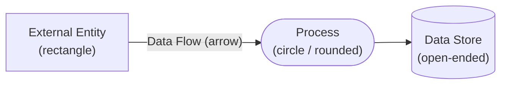

---
tags:
  - Chapter 5
  - Threat Modeling
---

# 5.3 Diagramming for Threat Modeling

!!! objective "In this section"
    - Why diagramming *is* the analysis, not a preliminary to it
    - The five DFD components and their notation
    - **Trust boundaries** — the single most important element
    - How to draw a DFD at the right level of detail

---

## Why draw at all?

Question 1 of threat modeling is *"what are we building?"* — and the answer must be **a picture**,
not a paragraph.

Three reasons the drawing matters more than beginners expect:

**It exposes what you do not know.** You cannot draw a data flow you do not understand. The moment
someone asks "wait, where does that data actually come from?" and nobody in the room knows, you have
found something important — before writing a single threat.

**It creates shared understanding.** Five engineers describing a system in words produce five
different mental models. A diagram on a wall forces them into one, and the disagreements surface
immediately.

**It makes the analysis finite.** STRIDE applied to "the system" is hopeless. STRIDE applied to
*each of eleven elements* is a defined task you can complete. **The diagram converts an unbounded
problem into a bounded checklist.**

!!! tip "Draw it badly, quickly, together"
    A whiteboard sketch made collaboratively in twenty minutes beats a beautiful diagramming-tool
    artefact made alone in three hours. The value is in the shared reasoning. Polish later, if at
    all.

---

## Data Flow Diagrams

A **DFD** shows how data moves through a system. It has just five element types, which is why it is
learnable in ten minutes and useful for a career.

<dl class="caisp-terms" markdown>

<dt>1. External entity — <em>rectangle</em></dt>
<dd>Something outside your control that interacts with the system: a user, a third-party API, an
attacker. <strong>You cannot secure these; you can only distrust them.</strong> Every external
entity is a source of untrusted input.</dd>

<dt>2. Process — <em>circle or rounded box</em></dt>
<dd>Something that <em>does</em> work: a web server, an API handler, the LLM itself, a retrieval
service. Processes transform data, and are where most logic — and most flaws — live.</dd>

<dt>3. Data store — <em>open-ended rectangle or cylinder</em></dt>
<dd>Something that <em>holds</em> data: a database, a vector store, a model registry, a log file, an
S3 bucket. Data at rest.</dd>

<dt>4. Data flow — <em>arrow</em></dt>
<dd>Data moving between elements. Label them: <em>what</em> data, over <em>what</em> channel. Data in
transit.</dd>

<dt>5. Trust boundary — <em>dashed line</em></dt>
<dd>A line where the level of trust changes. <strong>This is the most important element in the whole
diagram.</strong></dd>

</dl>

---

## Trust boundaries: the heart of the method

> A **trust boundary** is a line in your system where data crosses from a less-trusted zone into a
> more-trusted one — and therefore must be validated.

Examples of trust boundaries:

- Between the internet and your application
- Between your application and your database
- Between a user's browser and your server
- Between your code and a third-party API
- Between one tenant and another in a shared system
- **Between untrusted content and your model's prompt**

!!! danger "The rule that makes DFDs powerful"
    **Threats concentrate at trust boundaries.**

    If you have limited time — and you always do — analyse the trust boundaries first. That is where
    a disproportionate share of real vulnerabilities live, because a trust boundary is exactly the
    place where someone forgot to validate something.

### Why trust boundaries matter so much for AI

Here is the observation that makes this chapter click:

!!! warning "In an LLM application, the prompt is a trust boundary — and it is usually unmarked"
    Everything Chapter 3 taught you can be restated in DFD terms:

    | Chapter 3 concept | DFD statement |
    |---|---|
    | Prompt injection (LLM01) | Untrusted data crosses into the prompt with no validation |
    | Indirect injection | A *retrieved document* crosses that boundary, and nobody marked it as a boundary |
    | Insecure output handling (LLM02) | Model output crosses into a trusted context unvalidated |
    | RAG access bypass (LLM06) | The retrieval flow crosses a boundary without carrying the user's identity |
    | Confused deputy (LLM08) | A tool call crosses a boundary and *changes identity* on the way |

    Teams draw the boundary between the internet and the web server, because that one is obvious.
    They almost never draw one around **the prompt**, or around **the model's output**, or around
    **the retrieval corpus** — and that is precisely why those become the vulnerabilities.

    **Drawing those boundaries explicitly is one of the highest-value things you can do in an AI
    threat model.**

---

## Level of detail

A common beginner question: how detailed should the diagram be?

DFDs are conventionally drawn in levels:

<dl class="caisp-terms" markdown>

<dt>Level 0 — context diagram</dt>
<dd>The whole system as one process, with its external entities. Useful for scoping and for talking
to non-technical stakeholders. Too coarse for real analysis.</dd>

<dt>Level 1 — the useful one</dt>
<dd>The major components and flows: web app, LLM, retrieval service, databases, external APIs.
<strong>This is where most threat modeling happens.</strong> Typically 8–15 elements.</dd>

<dt>Level 2+ — drill-down</dt>
<dd>Expanding one Level 1 process into its internals. Do this only for components that are
high-risk or poorly understood.</dd>

</dl>

!!! tip "The right level of detail, practically"
    **Detailed enough that you can ask meaningful STRIDE questions; coarse enough to fit on one
    page.**

    If your diagram has forty elements, you will never complete the analysis. Split it into
    subsystems and model them separately. If it has three, you are not going to find anything
    specific.

    For a typical LLM application, **10–15 elements at Level 1** is the sweet spot.

---

## How to draw one — a practical procedure

1. **Start with the external entities.** Who and what talks to this system? Users, admins,
   third-party APIs, scheduled jobs. This defines the perimeter.
2. **Add the major processes.** What does the system actually do? One box per meaningful component.
3. **Add the data stores.** Where does data rest? Do not forget logs, caches, and the model
   registry — these are routinely omitted and routinely exploited.
4. **Connect with labelled flows.** What moves where? Label them with *what* data, not just arrows.
5. **Draw the trust boundaries last.** Ask of every flow: *does the trust level change here?* Be
   generous — an unnecessary boundary costs you a few minutes of analysis; a missing one costs you
   a vulnerability.
6. **Sanity-check for AI-specific elements.** Explicitly confirm you have drawn:
   - The prompt assembly step (where system prompt + context + user input merge)
   - The retrieval corpus and who can write to it
   - Every tool the model can invoke
   - What happens to the model's output
   - Where prompts and responses are logged

!!! warning "The most commonly missed elements in AI threat models"
    - **Logs.** Prompt/response logs may be your largest store of user data.
    - **The model registry.** Where the weights live (Chapter 4).
    - **The retrieval corpus write path.** Who can *add* documents, not just read them.
    - **Tool-call flows.** Each tool is a separate flow crossing a boundary.
    - **The training/feedback loop.** Production data flowing back into training.

    If your DFD lacks these, it is not yet an AI threat model.

---

!!! question "Check your understanding"
    ??? success "What are the five DFD element types?"
        External entity (rectangle), process (circle), data store (open-ended box), data flow
        (arrow), and trust boundary (dashed line).

    ??? success "Why should you analyse trust boundaries first?"
        Because threats concentrate there — a trust boundary is exactly where data moves from less
        trusted to more trusted, and therefore exactly where someone may have forgotten to validate
        it. With limited time, boundaries give the highest yield.

    ??? success "Restate 'indirect prompt injection' in DFD terms."
        A data flow carrying attacker-influenced content (a retrieved document) crosses into the
        prompt-assembly process without passing a trust boundary check — because the corpus was
        modelled as trusted when it is in fact writable by untrusted parties.

---

<a class="caisp-card" href="04-llm-architecture.md">
  Next · 5.4
  An LLM Application Architecture
  A real DFD for an LLM app, with STRIDE applied element by element.
</a>

