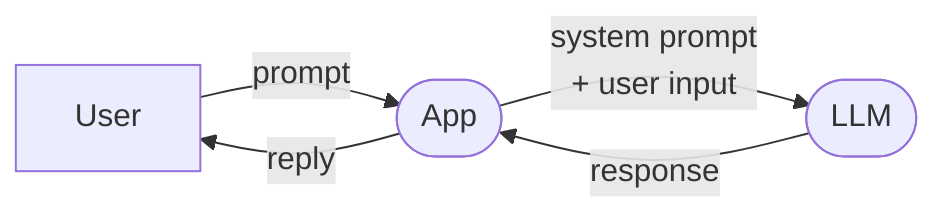
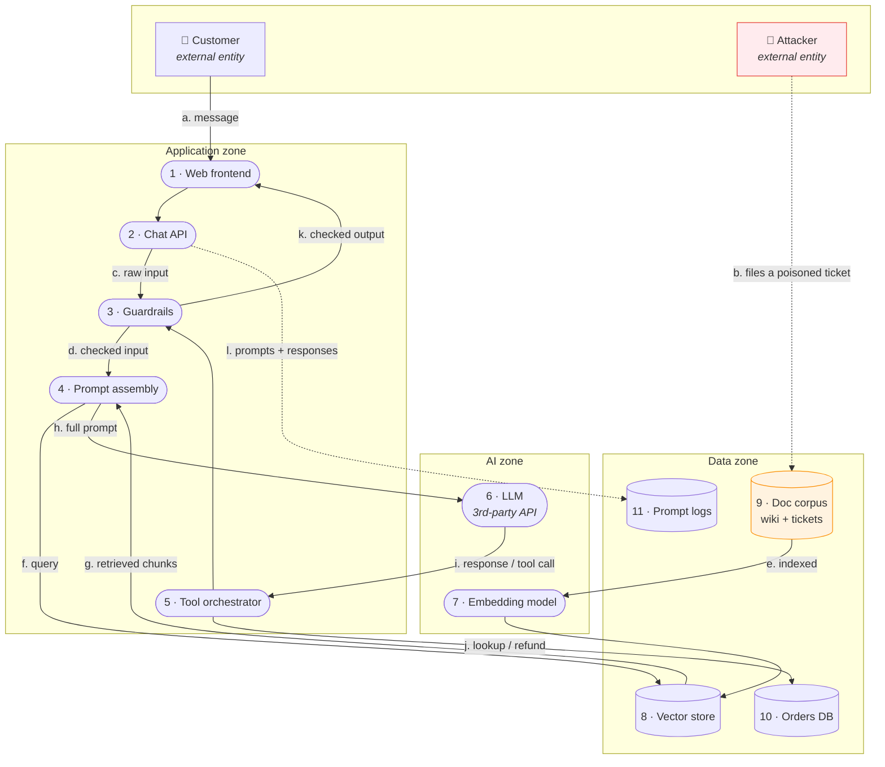
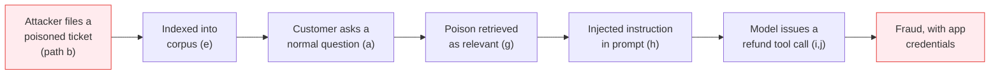

---
tags:
  - Chapter 5
  - Threat Modeling
  - STRIDE
---

# 5.4 An LLM Application Architecture

!!! objective "In this section"
    - A simple LLM architecture, then a realistic one
    - The complete DFD, with trust boundaries marked
    - **STRIDE applied element by element** — the full worked example
    - The threat table this produces

This is the worked example that makes the whole chapter concrete. Follow it closely; Lab 5.1 asks
you to do the same thing yourself.

---

## The simplest LLM architecture

Start minimal:

Even here, with three elements, there are real threats: the user can inject (LLM01), the app may
render output unsafely (LLM02), and the system prompt may leak (LLM06).

But no real system looks like this. Let us build the one you will actually encounter.

---

## A realistic LLM application

**Scenario:** *ACME Corp's customer support assistant.* It answers questions from internal
documentation and customer tickets, can look up order status, and can issue small refunds.

This is deliberately the system from Chapter 1's opening story — now analysed properly.

### The trust boundaries

Five boundaries in this system. Marking them is the analysis:

| # | Boundary | Why it matters |
|---|---|---|
| **TB1** | Internet → Application | Classic perimeter. Everyone draws this one. |
| **TB2** | **Untrusted content → Prompt assembly** | Flows `d` and `g` both carry attacker-influenceable text into the prompt. **Usually unmarked.** |
| **TB3** | **LLM output → Orchestrator / frontend** | Flows `i` and `k`. Model output entering trusted contexts. **Usually unmarked.** |
| **TB4** | **Orchestrator → Orders DB** | Flow `j`. Identity changes here — app credentials, not the user's. |
| **TB5** | Application → Third-party LLM API | Your data leaves your control. |

!!! danger "TB2, TB3, and TB4 are the AI-specific ones"
    Every team draws TB1. Most draw TB5 (because procurement asks about it).

    **TB2, TB3, and TB4 are where the AI vulnerabilities live**, and they are the ones routinely
    omitted — because "retrieved documents" feel like internal data, "the model's response" feels
    like our own output, and "the tool call" feels like our own code.

    None of those feelings survive contact with Chapter 3.

---

## STRIDE, element by element

Now the mechanical part. For each element, all six questions. This is the worked example — note how
much falls out of a procedure that requires no inspiration.

### Element 4 — Prompt assembly (the critical one)

| STRIDE | Threat | OWASP | Notes |
|---|---|---|---|
| **S** | User input forges system-message delimiters | LLM01 | Lab 3.2 |
| **T** | **Direct prompt injection** via flow `d` | LLM01 | Core threat |
| **T** | **Indirect injection** via retrieved chunks (flow `g`) | LLM01 | Attacker path `b` |
| **R** | Assembled prompt not logged → cannot reconstruct an incident | — | Log the final prompt |
| **I** | System prompt contains secrets that can be extracted | LLM06 | Lab 3.1 |
| **D** | Oversized retrieved context exhausts the window | LLM04 | Also evicts the system prompt |
| **E** | Injected instructions cause privileged tool calls | LLM08 | Chains to element 5 |

### Element 5 — Tool orchestrator

| STRIDE | Threat | OWASP |
|---|---|---|
| **S** | Tool call not bound to the requesting user's identity | LLM07 |
| **T** | Unvalidated parameters reach the orders DB (SQLi) | LLM07 |
| **R** | Tool invocations not logged — no audit of AI-initiated actions | — |
| **I** | Tool returns more data than needed, entering the context | LLM06 |
| **D** | Unbounded tool-call loops burn cost | LLM04 |
| **E** | **Confused deputy** — acts with app credentials, not the user's | LLM08 |

### Element 8/9 — Vector store and document corpus

| STRIDE | Threat | OWASP |
|---|---|---|
| **S** | Poisoned document appears authoritative to the model | LLM01 |
| **T** | **Attacker writes to the corpus via a support ticket** (path `b`) | LLM03 / LLM01 |
| **R** | No provenance on indexed documents — cannot trace the poison | — |
| **I** | **Retrieval ignores the user's permissions** | LLM06 |
| **D** | Corpus flooded with junk to degrade retrieval quality | LLM04 |
| **E** | Retrieved content escalates the model's effective instructions | LLM01 |

### Element 6 — LLM (third-party API)

| STRIDE | Threat | OWASP |
|---|---|---|
| **S** | Compromised endpoint / DNS impersonates the provider | LLM05 |
| **T** | Provider silently changes the model version, altering behaviour | LLM05 |
| **R** | No record of which model version produced which answer | — |
| **I** | Prompts containing customer data sent to a third party | LLM06 |
| **D** | Provider outage or rate limit takes down the assistant | LLM04 |
| **E** | — |  |

### Element 11 — Prompt logs

| STRIDE | Threat | OWASP |
|---|---|---|
| **S** | — | |
| **T** | Log tampering conceals an attack | — |
| **R** | Insufficient logging prevents attribution | — |
| **I** | **Logs contain PII, secrets users pasted, and retrieved confidential content** | LLM06 |
| **D** | Unbounded log growth | — |
| **E** | Log access grants broad visibility into user data | — |

!!! warning "Element 11 is the one people forget"
    Prompt logs are frequently the **largest single store of sensitive data** in an AI system — every
    question users asked, everything they pasted, and every document the system retrieved for them.

    They are usually protected far less carefully than the databases they effectively mirror.

---

## The attack chain this reveals

The value of the exercise: individual threats combine into a realistic attack.

**Six OWASP categories in one chain:** LLM01 (indirect injection) → LLM03 (corpus poisoning) →
LLM07 (unvalidated tool) → LLM08 (excessive agency + confused deputy) → LLM06 (data in logs) and
LLM02 if the output renders unsafely.

Notice the customer typed nothing malicious and the attacker never spoke to the customer. This is
the Chapter 1 opening story, now fully explained.

---

## From threats to fixes

The threat model's output is not the table — it is the **decisions**. For this system:

| Priority | Threat | Treatment | Action |
|---|---|---|---|
| 1 | Refund capability + injection | **Avoid** | Model *proposes* refunds; human approves |
| 2 | Untrusted tickets in the same corpus as policy docs | **Mitigate** | Segregate by provenance; label untrusted chunks |
| 3 | Retrieval ignores permissions | **Mitigate** | Filter at retrieval by the asking user's entitlements |
| 4 | Tool acts with app identity | **Mitigate** | Authorise every tool call in the user's context |
| 5 | Secrets in the system prompt | **Avoid** | Remove them; enforce rules in code |
| 6 | Logs hold PII | **Mitigate** | Redact on ingest; restrict access; set retention |
| 7 | No token limits | **Mitigate** | Token-based caps and spend alerts |

!!! tip "Notice which fixes came first"
    The top two are **architectural** — remove the capability, segregate the data. Neither is a
    filter or a scanner.

    That ordering is not an accident; it is what Lab 3.1 levels 7 and 8 taught, arrived at
    independently by following a process. **A good method reaches the right answer even when the
    analyst does not already know it** — which is exactly why you want a method.

---

!!! question "Check your understanding"
    ??? success "Which three trust boundaries are AI-specific, and why are they usually missed?"
        TB2 (untrusted content → prompt), TB3 (model output → trusted contexts), and TB4 (tool call
        with changed identity). They are missed because retrieved documents feel like internal data,
        model output feels like our own, and tool calls feel like our own code — none of which
        survives scrutiny.

    ??? success "Why is the prompt log element so significant?"
        It is often the largest store of sensitive data in the system — every user question, anything
        pasted, and all retrieved content — while typically being protected far less rigorously than
        the source databases it mirrors.

    ??? success "In the attack chain, what single architectural change would most reduce impact?"
        Removing autonomous refund capability — requiring human approval. The injection still
        succeeds, but its impact drops from fraud to a suspicious proposal that gets rejected. This
        is LLM08 avoidance, and it is why agency is the impact multiplier.

---

<a class="caisp-card" href="05-threat-libraries.md">
  Next · 5.5
  AI Threat Libraries
  Where to source threats so you are not relying on your own imagination.
</a>

