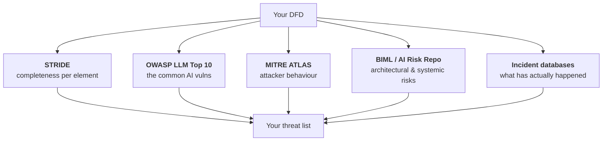

---
tags:
  - Chapter 5
  - Threat Modeling
---

# 5.5 AI Threat Libraries

!!! objective "In this section"
    - Why you should not rely on your own imagination
    - The six libraries worth knowing, and what each is for
    - When to reach for which
    - How to combine them without duplicating work

---

## Why libraries?

The weakest part of any threat model is the analyst's imagination. You will find the threats you
already know about and miss the ones you do not — and you will not notice the gap, because by
definition you did not think of them.

**Threat libraries are other people's imagination, systematised.** They let you check your system
against threats that the whole field has observed, rather than just the ones you happened to recall
on a Tuesday afternoon.

---

## The six libraries

### 1. STRIDE

**What it is:** six threat categories applied per element (section 5.2).

**Strength:** *completeness by construction*. It guarantees you considered every category against
every element, whether or not anything came to mind.

**Weakness:** generic. It tells you to consider "tampering" but not that *indirect prompt injection
via a RAG corpus* is the specific tampering threat you face.

**Use it:** as your **structural backbone**, always. Start here.

---

### 2. OWASP Top 10 for LLM Applications

**What it is:** the ten AI-specific vulnerability classes (Chapter 3).

**Strength:** precisely targeted at LLM systems, widely recognised, and directly actionable — each
entry comes with mitigations.

**Weakness:** it is a *top ten*, not an exhaustive catalogue. It also covers LLM applications
specifically, not all ML systems (a computer-vision pipeline needs more).

**Use it:** as your **AI-specific checklist**, after STRIDE gives you the structure. This is the
pairing you will use most in practice.

!!! tip "The STRIDE + OWASP combination"
    STRIDE says *"consider information disclosure at this element."*
    OWASP says *"specifically: system prompt leakage, training data extraction, RAG access bypass,
    cross-user leakage."*

    Structure plus specificity. In Lab 5.1 you apply both, and the combination is what produces a
    thorough model.

---

### 3. MITRE ATLAS

**What it is:** the adversary behaviour matrix for AI systems (section 2.5) — tactics and techniques
drawn from real attacks.

**Strength:** the **attacker's perspective**. OWASP tells you what is weak; ATLAS tells you how an
adversary would actually move through your system, step by step.

**Weakness:** it describes behaviour rather than prescribing fixes, and the matrix is large enough
to be daunting.

**Use it:** to **narrate attack chains** and to assess **detection coverage**. After you have a
threat list, walk ATLAS and ask: *for each tactic, would we see it?*

---

### 4. BIML Architectural Risk Analysis

**What it is:** the Berryville Institute of Machine Learning published an architectural risk
analysis of machine learning systems — a large catalogue of risks organised by where they arise in
an ML architecture, including a widely-cited "top 10 risks" for ML.

**Strength:** it thinks **architecturally and about ML generally**, not just LLMs. It covers data
risks, training risks, and inference risks in a way that applies to classical ML too.

**Weakness:** more academic in register; less immediately actionable than OWASP.

**Use it:** when modeling **non-LLM ML systems**, or when you want deeper architectural coverage
than OWASP's application-level focus.

---

### 5. AI Risk Repository and the AI Threat Map

**What they are:** broader catalogues attempting comprehensive coverage of AI risks. The **MIT AI
Risk Repository** aggregates risks from a large body of frameworks and papers into a searchable
database, classified by cause and domain. "AI threat map" style resources similarly attempt to
organise the space visually.

**Strength:** **breadth**. They include risks that security-focused lists omit — fairness, societal
harms, misuse, environmental cost, governance failures.

**Weakness:** so broad that filtering to what is relevant takes effort; much of it is not
security-specific.

**Use it:** when you need coverage **beyond traditional security** — which you increasingly do, given
Chapter 7's regulatory material. An AI risk assessment that ignores fairness and misuse is
incomplete under the EU AI Act.

---

### 6. AI Incident Database

**What it is:** a public, searchable collection of **real-world AI harms and failures** that have
actually occurred.

**Strength:** it is *empirical*. Not "here is what could theoretically happen" but "here is what
happened to someone, and here is the reporting." Enormously persuasive with stakeholders.

**Weakness:** backward-looking; it cannot tell you about novel threats.

**Use it:** to **ground your threat model in reality**, to sanity-check that you have covered the
failure modes that actually occur, and — pragmatically — to justify security investment. "Here are
five documented incidents of this exact failure" moves budgets in a way that "this is theoretically
possible" does not.

---

## Which to use when

| Situation | Reach for |
|---|---|
| Any threat model, always | **STRIDE** (structure) |
| An LLM application | **STRIDE + OWASP LLM Top 10** |
| A classical ML system (vision, tabular) | **STRIDE + BIML** |
| Narrating attack chains / detection gaps | **MITRE ATLAS** |
| Regulatory or broad risk assessment | **AI Risk Repository** |
| Justifying investment; reality-checking | **AI Incident Database** |

!!! warning "Do not run all six exhaustively on every system"
    That is the path to analysis paralysis (section 5.1). The libraries overlap heavily — most of
    OWASP LLM01 also appears in ATLAS and in BIML under different names.

    **Default recipe for an LLM application: STRIDE for structure, OWASP for specificity, ATLAS for
    the attack narrative.** Add the others when the context calls for it.

---

## Avoiding duplication

When you combine libraries you will find the same underlying threat described three ways. Handle it
like this:

1. **Record the threat once**, in your own words, tied to a specific element of your DFD.
2. **Tag it with every framework reference** that applies.
3. **Rate it once.**

So a single row in your threat table might read:

> **T-04** · *Attacker-submitted support tickets are indexed into the same corpus as authoritative
> policy documents, allowing instruction-shaped text to reach the prompt.*
> Element: 9 (doc corpus) → 4 (prompt assembly), crossing TB2.
> **STRIDE:** Tampering · **OWASP:** LLM01 (indirect), LLM03 · **ATLAS:** Execution, Persistence

That single entry is precise, traceable, and speaks all three vocabularies — which is exactly the
register the exam and professional reports reward.

---

!!! question "Check your understanding"
    ??? success "Why use threat libraries rather than relying on expertise?"
        Because you will find the threats you already know and silently miss the ones you do not.
        Libraries systematise the field's collective observation, providing coverage that individual
        imagination cannot.

    ??? success "What does ATLAS give you that OWASP does not?"
        The attacker's perspective and the sequence. OWASP catalogues what is weak; ATLAS describes
        how an adversary moves through a system tactic by tactic, which is what you need for attack
        narratives and detection-coverage assessment.

    ??? success "You are modeling an image classification pipeline, not an LLM. Which libraries?"
        STRIDE for structure, plus BIML (which covers ML architecture generally rather than LLM
        applications specifically), plus ATLAS. The OWASP LLM Top 10 is largely inapplicable — it is
        scoped to LLM applications.

---

<a class="caisp-card" href="06-rating-risks.md">
  Next · 5.6
  Rating &amp; Managing Risks
  Turning a long threat list into a short, defensible action plan.
</a>

