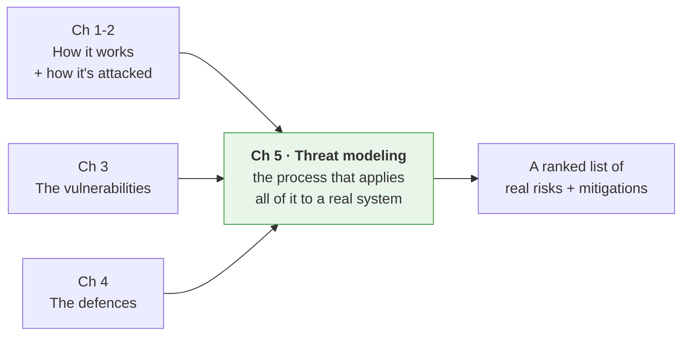

---
tags:
  - Chapter 5
  - Threat Modeling
---

# Chapter 5 — Threat Modeling AI Systems

<ul class="caisp-meta">
  <li>Level: Intermediate</li>
  <li>Reading: ~2 hrs</li>
  <li>Labs: 1</li>
  <li>Exam weight: ~12%</li>
</ul>

Everything so far has given you pieces: how LLMs work, how they are attacked, the OWASP Top 10, the
defensive tooling. This chapter gives you the **process that ties them together** — a repeatable,
teachable method for looking at an AI system and systematically finding what could go wrong,
*before* it does.

Threat modeling is the most transferable skill in this entire course. Tools change, models change,
attack techniques change. The discipline of structured reasoning about a system's threats does not.
It is also, quietly, what senior AI security roles are actually paid to do.

!!! objective "What you will be able to do after this chapter"
    - Explain what threat modeling is and why it beats ad-hoc security review
    - Use the vocabulary precisely: assets, threats, weaknesses, vulnerabilities, risk
    - Apply the **STRIDE** methodology to any system
    - Draw a **data flow diagram** and mark its **trust boundaries**
    - Diagram a realistic LLM application and enumerate its threats
    - Pull threats from the major **AI threat libraries**
    - **Rate and prioritise** the risks you find, defensibly
    - Produce a complete threat model for an AI system (Lab 5.1)

---

## Why this chapter is the keystone

Look back at what you have learned and notice it is a *catalogue*. Chapter 3 gave you ten
vulnerabilities. Chapter 4 gave you defensive tools. But faced with a real, unfamiliar AI system,
how do you know *which* of those ten apply, *where*, and *in what order to fix them*?

That is threat modeling. It is the bridge from "I know a list of AI vulnerabilities" to "I can
assess this specific system and tell you its actual risks, ranked."

---

## Sections

<a class="caisp-card" href="01-what-is-threat-modeling.md">
  5.1
  What Is Threat Modeling
  Why do it, the benefits, and the honest challenges.
</a>
<a class="caisp-card" href="02-parlance.md">
  5.2
  The Threat Model Parlance
  Assets, weaknesses, vulnerabilities, risk — and STRIDE.
</a>
<a class="caisp-card" href="03-diagramming-dfd.md">
  5.3
  Diagramming &amp; Data Flow Diagrams
  DFD components and trust boundaries — the heart of the method.
</a>
<a class="caisp-card" href="04-llm-architecture.md">
  5.4
  An LLM Application Architecture
  A real LLM DFD, with STRIDE applied element by element.
</a>
<a class="caisp-card" href="05-threat-libraries.md">
  5.5
  AI Threat Libraries
  STRIDE, OWASP, ATLAS, BIML, and the incident databases.
</a>
<a class="caisp-card" href="06-rating-risks.md">
  5.6
  Rating &amp; Managing Risks
  Turning a threat list into a prioritised action plan.
</a>

## Lab

<a class="caisp-card" href="lab-01-threat-model.md">
  Lab 5.1
  Threat Modeling an AI System
  Produce a complete, structured threat model end to end — with a scaffold tool.
</a>

---

!!! tip "This chapter rewards a pen and paper"
    Threat modeling is a thinking discipline, not a tooling one. The best practitioners do it on a
    whiteboard. As you read, sketch the diagrams yourself rather than only looking at ours — the
    drawing *is* the analysis.
