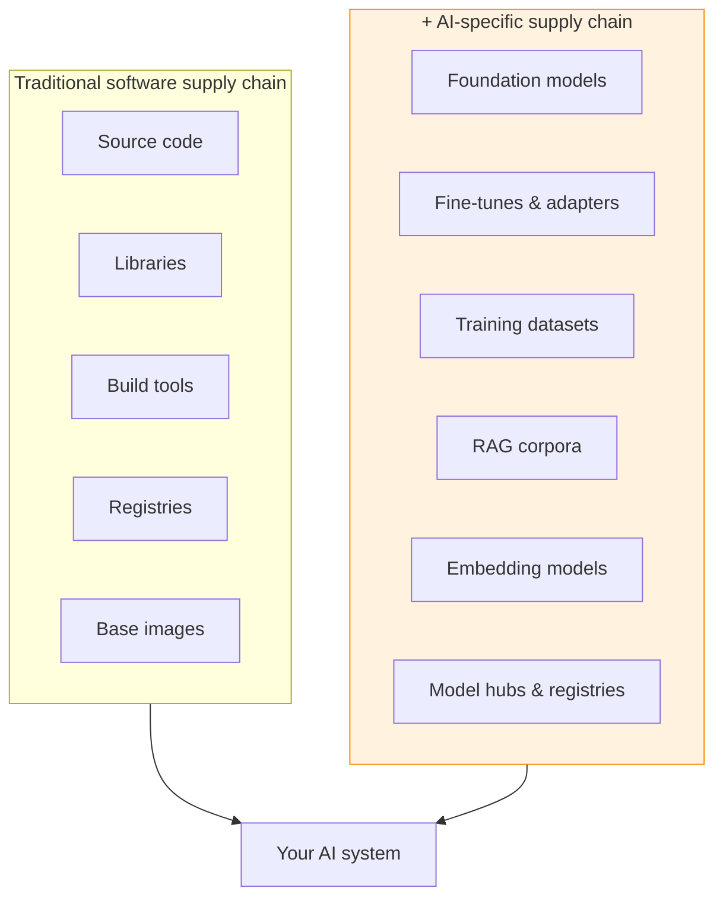

---
tags:
  - Chapter 6
  - Supply Chain
---

# 6.1 An Overview of Supply Chain Security

!!! objective "In this section"
    - What a supply chain attack is
    - Why supply chain attacks are so effective
    - How the AI supply chain differs from the software one
    - The asymmetry that defines the whole problem

---

## What is a supply chain attack?

> A **supply chain attack** compromises a target by tampering with something the target *depends
> on*, rather than attacking the target directly.

You do not break into the fortress. You poison something the fortress imports — the food, the water,
the bricks. When it arrives through the front gate, welcomed and trusted, your payload is already
inside.

In software terms, instead of attacking Company X's well-defended application, you compromise a
library X depends on, a tool in X's build pipeline, or — for AI — a model X downloads. X installs it
willingly, because it came from a trusted source.

You have already met the canonical example: **NotPetya** (section 4.3), where victims were
compromised through a legitimate, expected software update.

---

## Why supply chain attacks are so effective

Four properties make them the attacker's method of choice for high-value targets.

<dl class="caisp-terms" markdown>

<dt>They bypass the target's defences entirely</dt>
<dd>The victim's firewalls, guardrails, and access controls are irrelevant, because the compromise
enters through a trusted channel that those defences are designed to <em>permit</em>.</dd>

<dt>They scale enormously</dt>
<dd>Compromise one widely-used dependency and you compromise everyone who uses it. One poisoned
library, one trojanized base model, thousands of victims. The effort is fixed; the payoff scales
with the dependency's popularity.</dd>

<dt>They exploit trust that is hard to withdraw</dt>
<dd>Modern software — and modern AI especially — is built on deep towers of dependencies. You cannot
audit them all, so you trust. Attackers weaponise exactly that necessary trust.</dd>

<dt>They are hard to detect</dt>
<dd>The malicious component looks legitimate, came from the expected place, and functions correctly.
Detection requires noticing something subtly wrong in something you trusted enough not to
scrutinise.</dd>

</dl>

!!! info "Why attackers increasingly prefer the supply chain"
    As direct defences (endpoint protection, network security, MFA) have improved, attacking targets
    head-on has become harder. The supply chain is the path of least resistance to a well-defended
    organisation — and it has become a dominant pattern in serious breaches over the last decade.

    For AI specifically, it is *even more* attractive, for reasons the rest of this section explains.

---

## The software supply chain

A traditional software supply chain includes:

- Source code (yours and your dependencies')
- Open-source libraries and their transitive dependencies
- Build tools and CI/CD pipelines
- Package registries (npm, PyPI, Maven)
- Container base images
- The infrastructure it all runs on

The discipline of securing this is mature-ish: SCA (Chapter 4), SBOMs, signing, SLSA (section 6.4).
Not solved, but understood, with real tooling.

---

## The AI supply chain adds new links

An AI project depends on everything above **plus** several things traditional tooling was never
built to handle:

Each new link is a dependency you mostly did not build and cannot fully inspect.

### The differences that matter

From section 4.2, restated as the core of this chapter:

| | Software dependency | AI dependency |
|---|---|---|
| Form | Human-readable source | Opaque numeric weights / raw data |
| Reviewable? | Yes — read the code | **No** |
| Meaningful version diff? | Yes | **No** |
| Executes on load? | Usually no | **Sometimes** (pickle — Lab 4.3) |
| Vulnerability database? | Yes (CVE) | **No** |
| Fix cost | Patch and redeploy | **Retrain** — expensive, slow |
| Contains hidden behaviour? | Detectable by review | **Backdoors invisible** (Lab 2.9) |

!!! danger "The two properties that make AI supply chains uniquely dangerous"
    **1. You cannot inspect the artefact.** A model is billions of weights. There is no source to
    review, no meaningful diff, and a backdoor is indistinguishable from legitimate learning
    (Lab 2.9). The traditional supply-chain defence — read it before you trust it — is unavailable.

    **2. The blast radius is concentrated.** A tiny number of foundation models underpin thousands of
    products (section 2.3). Compromising one base model is compromising a huge fraction of the AI
    ecosystem. There is no equivalent single point of leverage in traditional software.

---

## The defining asymmetry

Every threat in this chapter shares one shape, and recognising it explains all the defences:

!!! warning "Cheap to attack, expensive to detect and fix"
    - **Cheap to attack:** contributing a poisoned document to a web-scraped dataset costs the price
      of a web page. Uploading a trojanized model to a hub is free. Editing a model to plant a lie
      takes minutes (Lab 6.1).
    - **Expensive to detect:** you cannot inspect the model; scanning catches files not behaviour
      (Lab 4.3); backdoors pass every evaluation (Lab 2.9).
    - **Expensive to fix:** removing a flaw baked into weights means retraining, which can cost a
      fortune and weeks — *if* you even know the flaw is there.

    When attack is cheap and defence is expensive, you cannot win by out-spending the attacker on
    detection. You must **prevent** — control what enters, and **prove provenance** so you know what
    you are running.

This asymmetry is why the rest of the chapter is about *vetting, provenance, and signing* rather than
*ever-cleverer scanners*. Scanning has its place (Lab 6.3), but it is the weakest of the defences
because it fights the asymmetry head-on and loses.

---

!!! question "Check your understanding"
    ??? success "Why do supply chain attacks bypass a target's defences?"
        Because the compromise enters through a trusted channel — a dependency, an update, a
        downloaded model — that the target's defences are explicitly designed to permit. Firewalls and
        access controls do not inspect what they are configured to trust.

    ??? success "Name the two properties that make AI supply chains uniquely dangerous."
        You cannot inspect the artefact (models are opaque weights with invisible backdoors), and the
        blast radius is concentrated (a few foundation models underpin thousands of products).

    ??? success "Why does the cheap-attack/expensive-defence asymmetry push defenders toward provenance rather than detection?"
        Because you cannot out-spend an attacker on detecting cheap attacks in artefacts you cannot
        inspect. Prevention (controlling what enters) and provenance (proving what you are running)
        break the asymmetry; scanning fights it directly and loses.

---

<a class="caisp-card" href="02-ai-supply-chain-attacks.md">
  Next · 6.2
  AI Supply Chain Attacks
  Data, model, and infrastructure attacks — and package masquerading.
</a>

