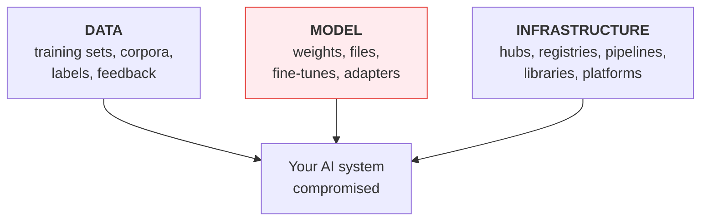
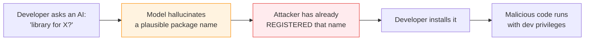

---
tags:
  - Chapter 6
  - Supply Chain
---

# 6.2 Introduction to AI Supply Chain Attacks

!!! objective "In this section"
    - The three categories: data, model, and infrastructure attacks
    - How each works, with realistic examples
    - Abusing generative AI for package masquerading
    - Why the model category is the hardest to defend

---

## Three categories

Every AI supply chain attack targets one of three things:

The model category is highlighted because it is the one with no good inspection defence.

---

## Data-based attacks

Covered as LLM03 in Chapter 3; here is the supply-chain framing.

<dl class="caisp-terms" markdown>

<dt>Poisoning public datasets</dt>
<dd>Web-scraped corpora are assembled from content anyone can publish. Research has shown that
poisoning even a small fraction can implant durable behaviour. The attacker's cost is the cost of
hosting a web page.</dd>

<dt>Poisoning via the feedback loop</dt>
<dd>Systems that retrain on production data or user feedback give <em>every user</em> a write path
into the next model (section 4.2).</dd>

<dt>Label manipulation</dt>
<dd>Labelling is frequently outsourced. Whoever sets the labels shapes what the model believes — a
third party with effective write access to your model's worldview.</dd>

<dt>Corpus poisoning (RAG)</dt>
<dd>Technically runtime rather than training, but the same discipline: untrusted content entering a
trusted store. You demonstrated it in Lab 2.6.</dd>

</dl>

!!! tip "The defining question for data"
    **Who can write to this dataset, and can you prove where each example came from?**

    For most public datasets the honest answers are "anyone" and "no". That is not a reason to avoid
    them — it is a reason to know it and account for it.

---

## Model-based attacks

The AI-specific heart of the chapter. Four distinct techniques, escalating in subtlety.

### 1. Malicious model files

The crudest: a model file whose *format* executes code on load. You built, scanned, and detonated
one in **Lab 4.3**. Defence is comparatively good here — SafeTensors eliminates it, scanning catches
known patterns.

### 2. Trojanized models (backdoors)

A functional, accurate model with hidden trigger-activated behaviour. You built and detected one in
**Lab 2.9**. Defence is poor: the file is structurally innocent, the model passes every evaluation,
and the trigger space is unbounded.

### 3. Model editing

A more recent and more surgical technique. Rather than retraining, an attacker **directly modifies
specific weights** to change a specific belief or association — leaving everything else intact.

Research methods such as **ROME** (Rank-One Model Editing) demonstrated that a factual association
inside a language model can be located and rewritten with a targeted, minimal change. The legitimate
motivation is model repair: correcting an outdated fact without a full retrain.

!!! danger "Why editing matters as a supply-chain threat"
    - It is **fast and cheap** — minutes, not a training run.
    - It is **surgical** — general benchmarks barely move, so quality gates pass.
    - It is **targeted** — an attacker can change exactly the fact or behaviour they care about
      (a security recommendation, a named entity, a policy statement).

    Lab 6.1 explores the concept and, more importantly, what it means for detection.

### 4. Adapter and fine-tune poisoning

Many teams ship small **adapters** (LoRA and similar) rather than full models — a few megabytes
layered onto a base. Adapters are easy to share, easy to trust casually, and can carry the same
backdoors as a full fine-tune. The small file size makes them *feel* harmless; they are not.

!!! warning "Why the model category is hardest"
    For data, you can at least trace provenance and validate sources. For infrastructure, ordinary
    security applies.

    For the model itself, **there is no inspection defence**. You cannot read it, diff it
    meaningfully, or test exhaustively. The only real answers are: get it from a source you can
    verify, check its signature, and constrain what it can do if it turns out to be bad.

---

## Infrastructure-based attacks

Conventional attacks against the AI ecosystem's plumbing (section 4.2):

- **Model hub compromise** — account takeover, or malicious uploads under plausible names
- **Registry compromise** — the highest-leverage target; substitute a model and everything
  downstream inherits it
- **Pipeline compromise** — plant a backdoor during training, or steal credentials
- **Library compromise** — the ML stack is ordinary software with ordinary dependency risk
- **Typosquatting** — `transformer` vs `transformers`, `pytorch-cpu` vs a malicious lookalike

---

## Abusing generative AI for package masquerading

This one deserves its own treatment, because **the AI is the delivery mechanism**.

### The mechanism

1. LLMs **hallucinate package names** (LLM09). Asked for a library, a model may invent
   `requests-async-helper` — plausible, well-formed, non-existent.
2. Hallucinations are **not random**. The same models invent the *same* plausible names repeatedly,
   because they are drawing on the same statistical patterns.
3. An attacker queries models at scale, **harvests the commonly-hallucinated names**, and registers
   them on PyPI or npm with malicious content.
4. A developer follows their assistant's suggestion, runs `pip install`, and executes attacker code.

!!! danger "Sometimes called 'slopsquatting'"
    It is typosquatting where the *typo is generated by the AI rather than the human*. The developer
    made no mistake — they trusted a confident recommendation.

    It is a genuine, demonstrated technique, and it combines **LLM09 (overreliance)** with **LLM05
    (supply chain)** into a working attack chain.

### Defences

- **Verify every package the AI suggests exists and is the one you meant** — check the registry
  page, download counts, repository link, and maintainer.
- **Be suspicious of new packages with low download counts** that solve your exact problem
  conveniently.
- Use **private registries with allowlists** for production.
- Add **dependency review** to code review: a new dependency in a pull request deserves a human
  question.
- Treat **AI-suggested dependencies as unverified claims**, not recommendations.

!!! tip "The general principle"
    An LLM's output is untrusted (LLM02). That includes the names of things it tells you to install.

---

## Putting the categories together

| Category | Example | Detection difficulty | Primary defence |
|---|---|---|---|
| **Data** | Poisoned web-scraped corpus | Very hard | Provenance, curation, source control |
| **Model — file** | Pickle payload | **Easy** | SafeTensors, scanning (Lab 4.3) |
| **Model — backdoor** | Trigger-activated behaviour | **Very hard** | Provenance, signing, least privilege |
| **Model — edited** | Surgically rewritten fact | **Very hard** | Provenance, signing, behavioural testing |
| **Infrastructure** | Registry compromise | Moderate | Conventional security, access control |
| **Package masquerading** | Hallucinated package registered | Easy *if you check* | Verify before installing |

Notice the pattern: the categories where detection is *very hard* all have the **same** primary
defence — **provenance**. That is the argument for sections 6.4 and 6.5.

---

!!! question "Check your understanding"
    ??? success "Why is model editing a distinct threat from backdooring?"
        Editing surgically modifies specific weights to change a targeted fact or association without
        retraining. It is fast, cheap, and leaves general benchmarks almost unchanged, so quality
        gates pass. A backdoor adds hidden trigger behaviour; editing changes what the model
        *believes*.

    ??? success "Explain package masquerading via generative AI in one sentence."
        Attackers harvest package names that LLMs commonly hallucinate, register those names with
        malicious content, and wait for developers who trust their assistant's suggestion to install
        attacker code.

    ??? success "Why do the hardest-to-detect attack categories share a single primary defence?"
        Because data poisoning, backdoors, and model editing all produce artefacts you cannot inspect
        or meaningfully test. When inspection is impossible, the only remaining basis for trust is
        provenance — proving where the artefact came from and that it has not changed.

---

<a class="caisp-card" href="03-vetting.md">
  Next · 6.3
  Vetting Software Frameworks
  Building a repeatable process for deciding what to trust.
</a>

