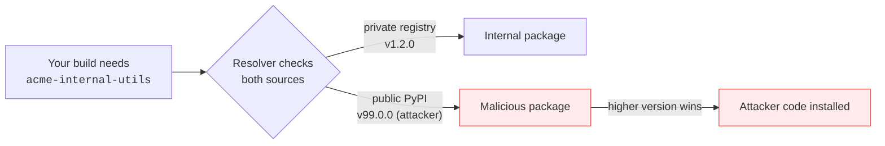

---
tags:
  - Chapter 6
  - Supply Chain
---

# 6.3 Vetting Software Frameworks

!!! objective "In this section"
    - Creating a vetting process that people will actually follow
    - Automating vetting of third-party code
    - Scanning for vulnerabilities
    - Dependency confusion and how pinning defeats it

---

## Why a *process*, not a checklist in someone's head

Every team already "vets" dependencies informally — someone glances at the GitHub stars and decides
it looks fine. That fails in three ways: it is inconsistent, it is invisible to everyone else, and
it produces no record of why a decision was made.

A vetting process fixes those by being **written down, proportionate, and mostly automated**.

!!! warning "The failure mode to design against"
    A vetting process so heavy that developers route around it is worse than no process, because you
    now have unvetted dependencies *and* a false belief that they were vetted.

    **Make the common case fast and automatic. Reserve human review for genuinely new or
    high-risk additions.**

---

## Creating a vetting process

### Tier by risk, not uniformly

Not every dependency deserves the same scrutiny. A practical tiering:

| Tier | What | Vetting |
|---|---|---|
| **Low** | Well-known, widely-used library from a major maintainer | Automated checks only |
| **Medium** | Less common library, or one handling untrusted input | Automated + brief human review |
| **High** | Anything that processes untrusted data, holds credentials, or runs at build time | Full review + approval |
| **AI-specific** | **Any model, dataset, or adapter** | **Always treat as High** |

!!! danger "Models are always high-tier"
    Because you cannot inspect them (section 6.1) and because they can execute code on load
    (Lab 4.3), a model download deserves more scrutiny than a library — not less, which is how most
    teams currently treat it.

### The vetting questions

For a **software dependency**:

- [ ] Is it actively maintained? (recent commits, releases, responsive issues)
- [ ] How many maintainers? (a single-maintainer critical dependency is a risk)
- [ ] Is the repository the one the package claims? (check the link on the registry page)
- [ ] Are there known vulnerabilities? (SCA — Lab 4.1)
- [ ] What is its own dependency footprint?
- [ ] What permissions does it need at runtime?
- [ ] Does it run code at install time? (setup scripts are a classic vector)
- [ ] Is the licence acceptable?

For an **AI model or dataset**, add:

- [ ] **Who published it, and can I verify that identity?** (official org vs. individual re-upload)
- [ ] **What format is it in?** (SafeTensors ✅ / pickle ⚠️ — section 1.4)
- [ ] **Is it signed, and can I verify the signature?** (Lab 6.5)
- [ ] **Is there a model card** documenting training data, intended use, and limitations?
- [ ] **What is the base model**, and does its provenance chain hold? (you inherit it — section 2.3)
- [ ] **What licence applies to the model *and* its training data?**
- [ ] Has it been **scanned**? (Lab 4.3 / Lab 6.3)
- [ ] What will it have **access to** once loaded?

!!! tip "The three questions to ask before any model download"
    If you remember nothing else from this section:

    1. **Who published this, and can I verify it?**
    2. **What format is it, and can it execute on load?**
    3. **What will it have access to?**

    Most practitioners ask none of these. Asking them puts you ahead of most teams.

### Record the decision

Whatever you decide, write it down: what was reviewed, by whom, when, and the outcome. Six months
later — during an incident, an audit, or a version bump — that record is what lets you reason about
what changed.

---

## Automating vetting of third-party code

Human review does not scale to hundreds of transitive dependencies. Automate the baseline:

<dl class="caisp-terms" markdown>

<dt>Vulnerability scanning (SCA)</dt>
<dd><code>pip-audit</code>, Trivy, Grype, Dependabot — in CI, on every change (Lab 4.1).</dd>

<dt>Licence compliance</dt>
<dd>Automatically flag licences incompatible with your use. Increasingly relevant for models, where
licences can restrict commercial use or downstream training.</dd>

<dt>Dependency freshness and health</dt>
<dd>Flag abandoned packages, sudden maintainer changes, or unusual version jumps.</dd>

<dt>Install-time script detection</dt>
<dd>Flag packages that execute code during installation.</dd>

<dt>Model file scanning</dt>
<dd><code>picklescan</code> and format checks on every model pull (Lab 6.3).</dd>

<dt>Signature verification</dt>
<dd>Fail the build if an artefact's signature does not verify (Lab 6.5).</dd>

</dl>

!!! tip "Make the pipeline the enforcement point"
    A vetting policy enforced by documentation is a suggestion. A vetting policy enforced by a CI
    job that fails the build is a control.

    Put the automated checks in the pipeline, and make bypassing them require a visible, recorded
    exception.

---

## Mitigating dependency confusion

### The attack

**Dependency confusion** exploits how package managers resolve names across multiple sources.



1. Your organisation has an internal package, `acme-internal-utils`, on a private registry.
2. An attacker learns the name (from a leaked `requirements.txt`, a job advert, a GitHub commit).
3. They publish a package with **the same name** to the *public* registry, with a very high version
   number.
4. If your resolver checks both sources and prefers the highest version, it pulls the attacker's.

### Defences

- **Use a single, controlled source.** Configure an internal proxy/mirror as the *only* index, which
  pulls approved public packages through it.
- **Namespace or scope internal packages** so the names cannot collide with public ones.
- **Defensively register** your internal package names on public registries.
- **Pin exact versions and verify hashes** — the strongest general defence, below.

---

## Dependency pinning

> **Pinning** means specifying exact versions (and ideally cryptographic hashes) of every dependency,
> so a build always resolves to precisely the artefacts you intended.

```text
# Unpinned — your build can change without you changing anything
transformers>=4.40

# Pinned version — reproducible
transformers==4.40.2

# Pinned with hash — reproducible AND tamper-evident
transformers==4.40.2 \
    --hash=sha256:abc123...
```

!!! tip "Pinning is a security control, not just hygiene"
    Unpinned dependencies mean **your running system can change without any change from you**. That
    is precisely the mechanism behind malicious-update attacks (NotPetya) and dependency confusion.

    Hash pinning goes further: even if an attacker replaces the artefact at the registry, the hash
    mismatch fails the build. It makes tampering *detectable*, which is the whole point of this
    chapter.

**Pin models too.** Pin to a specific model revision or commit hash, not a moving tag. A model hub
reference without a revision is the AI equivalent of `:latest` — and section 4.3 explained why a
silently-changed model version is a real problem.

### The trade-off, stated honestly

Pinning means you do not get security patches automatically. The answer is **deliberate updating**:
regularly review and bump pins as a conscious, reviewed change, rather than absorbing whatever
upstream published overnight.

---

!!! question "Check your understanding"
    ??? success "Why should models always be treated as high-tier in a vetting process?"
        Because they cannot be inspected the way code can, they can execute code on load depending on
        format, and a backdoor in them is undetectable by review. The inability to verify them
        internally demands more external scrutiny, not less.

    ??? success "Explain dependency confusion and the strongest defence."
        An attacker publishes a public package with the same name as your internal one at a higher
        version; a resolver checking both sources installs the attacker's. Strongest defences: a
        single controlled package source, plus pinning with hash verification.

    ??? success "What is the trade-off of pinning, and how do you manage it?"
        You stop receiving upstream security patches automatically. Manage it by updating
        deliberately — reviewing and bumping pins on a regular cadence as a conscious change, rather
        than absorbing arbitrary upstream changes silently.

---

<div class="caisp-cards">
<a class="caisp-card" href="04-frameworks.md">
  <span class="caisp-kicker">Next · 6.4</span>
  <span class="caisp-card-title">Supply Chain Frameworks</span>
  <span class="caisp-card-text">SLSA and SCVS — structured maturity for supply chain security.</span>
</a>
</div>
