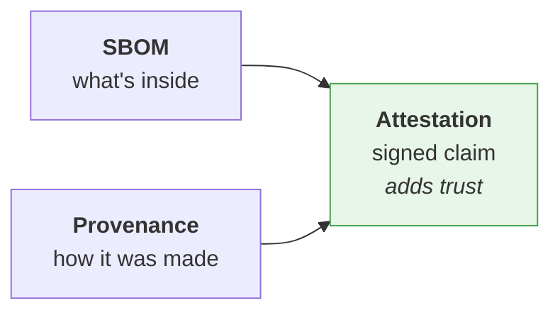
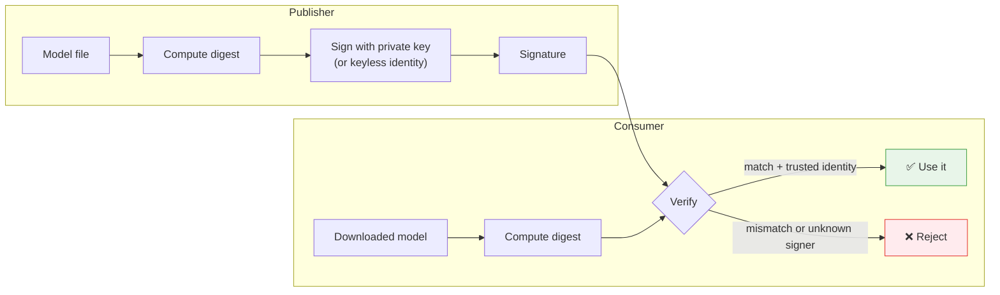

---
tags:
  - Chapter 6
  - Supply Chain
---

# 6.5 Transparency and Integrity in the AI Supply Chain

!!! objective "In this section"
    - Generating a Software Bill of Materials
    - SBOMs, provenance, and attestations — how they differ
    - **Model cards** and **MLBOMs** — the AI-specific artefacts
    - **Model signing** — the defence that actually scales

---

## The two properties you need

Everything in this section serves one of two goals:

<dl class="caisp-terms" markdown>

<dt>Transparency</dt>
<dd><strong>Knowing what you have.</strong> An inventory of components, their versions, and their
origins. Without this you cannot answer "are we affected?" when a vulnerability drops.</dd>

<dt>Integrity</dt>
<dd><strong>Knowing it has not been tampered with.</strong> Cryptographic assurance that the artefact
you are running is the one that was published, by whom it claims.</dd>

</dl>

Transparency tells you *what*. Integrity tells you *whether to trust it*. You need both, and
transparency comes first — you cannot verify an inventory you do not have.

---

## Software Bill of Materials

> An **SBOM** is a formal, machine-readable inventory of the components that make up a piece of
> software, with their versions and relationships.

Think of it as the ingredients label. Two dominant formats: **CycloneDX** (OWASP) and **SPDX**
(Linux Foundation).

### Generating one

```bash
pip install cyclonedx-bom
cyclonedx-py environment -o sbom.json
```

You will do this properly in **Lab 6.4**.

### Why it matters

The value becomes obvious the first time a serious vulnerability is announced in a widely-used
library. The question "are we affected?" is either:

- **Without an SBOM:** days of frantic manual investigation across every repository and container.
- **With an SBOM:** a query, answered in seconds.

SBOMs are also increasingly a **requirement** — in government procurement, in enterprise contracts,
and in emerging regulation (Chapter 7).

!!! warning "An SBOM you do not use is paperwork"
    Generating an SBOM is trivial. The value comes from *consuming* it — querying it during incident
    response, diffing it between releases to spot unexpected additions, and gating builds on its
    contents.

    If your SBOM lands in a bucket and is never read, you have compliance without security.

---

## SBOMs, provenance, and attestations

Three related terms that get conflated. The distinction is worth holding.

| Artefact | Answers | Example |
|---|---|---|
| **SBOM** | *What is in it?* | "This app contains transformers 4.40.2, torch 2.2.0, …" |
| **Provenance** | *Where did it come from and how was it built?* | "Built from commit abc123 by CI job 456 on 2026-01-15" |
| **Attestation** | *Who is vouching for this claim, verifiably?* | A **signed** statement binding the above to an identity |



!!! tip "Attestation is what turns a document into evidence"
    An unsigned SBOM is a claim anyone could have written or modified. A **signed attestation** binds
    that claim to an identity and makes tampering detectable.

    The progression is: *know what you have* (SBOM) → *know where it came from* (provenance) → *be
    able to prove it* (attestation).

---

## Model cards

> A **model card** is structured documentation describing a model: what it is, what it was trained
> on, what it is for, and where it fails.

Introduced to improve transparency and accountability in ML, model cards typically cover:

- **Model details** — architecture, version, date, owner
- **Intended use** — and explicitly, **out-of-scope use**
- **Training data** — sources, size, collection method, known biases
- **Evaluation** — metrics, datasets, and *disaggregated* performance across groups
- **Limitations and risks** — where it fails and who might be harmed
- **Ethical considerations**

### Why a security practitioner should care

Model cards are usually framed as an ethics/transparency artefact. They are also a **security
document**:

<dl class="caisp-terms" markdown>

<dt>They reveal the inherited risk</dt>
<dd>"Trained on a web-scraped corpus" tells you poisoning is plausible (section 6.2). "Fine-tuned
from base model X" tells you what you inherit (section 2.3).</dd>

<dt>Their absence is itself a finding</dt>
<dd>A model with no card, from an unverified publisher, whose training data is undocumented, is a
model you cannot assess. <strong>"No model card" belongs in your risk register.</strong></dd>

<dt>They define out-of-scope use</dt>
<dd>Deploying a model outside its documented intended use is a risk decision — and increasingly a
compliance one under the EU AI Act (Chapter 7).</dd>

</dl>

---

## MLBOMs

> An **MLBOM** (Machine Learning Bill of Materials) extends the SBOM concept to cover the
> AI-specific components a system depends on.

Where a traditional SBOM lists libraries, an MLBOM additionally records:

- **Models** — name, version/revision hash, format, publisher, licence
- **Base models** — the provenance chain behind any fine-tune
- **Datasets** — source, version, licence, collection method
- **Training configuration** — hyperparameters, environment
- **Evaluation results** — what was measured, on what

!!! info "Where MLBOMs stand"
    Standards work is active — CycloneDX in particular has been extending its specification to cover
    ML components and model metadata, and the ecosystem is maturing.

    **The concept matters more than the current tooling.** Whether or not a polished standard exists
    when you read this, *you should maintain an inventory of models and datasets* with the fields
    above. A spreadsheet that is accurate beats a standard nobody implemented.

This directly addresses the gap identified in Lab 4.1: SCA covers your libraries and is blind to your
models and data. The MLBOM is what covers the rest.

---

## Model signing

The defence that scales, and the culmination of the chapter.

### The problem it solves

Recall the chain of reasoning:

1. You cannot inspect a model (section 6.1).
2. Scanning catches malicious *files*, not malicious *models* (Lab 4.3).
3. Backdoors and edits pass every evaluation (Lab 2.9, section 6.2).
4. Therefore trust cannot come from examining the artefact.
5. **So it must come from knowing — provably — who produced it and that it has not changed.**

That is exactly what signing provides.

### How it works



Signing gives you two guarantees:

- **Integrity** — the file has not changed since signing. A single flipped weight breaks the
  signature.
- **Authenticity** — it was signed by a specific, verifiable identity.

### Cosign and keyless signing

**Cosign** (part of the Sigstore project) is the practical tool, and its **keyless** mode is what
made signing genuinely adoptable.

Traditional signing requires managing long-lived private keys — which organisations are historically
bad at. Keyless signing instead:

1. Authenticates you via an existing identity provider (OIDC — e.g. your GitHub or Google identity)
2. Issues a **short-lived** certificate bound to that identity
3. Signs with it
4. Records the signature in a **public transparency log** (Rekor)

The result: no long-lived keys to protect, and a tamper-evident public record that a specific
identity signed a specific artefact at a specific time.

You will do this in **Lab 6.5**.

!!! danger "The critical point about signing that people miss"
    **A signature proves who published an artefact and that it has not changed. It does NOT prove
    the artefact is safe.**

    A signed model can be backdoored. The attacker simply signed their backdoored model — honestly.

    What signing gives you is **accountability and change detection**:

    - You know *exactly* whose model you are running.
    - You can decide whether you trust *that publisher*.
    - If the artefact is ever swapped or altered, verification fails.

    Signing does not make a bad model good. It makes the question **"do I trust this publisher?"**
    answerable — and that is the only form of the question you *can* answer for an artefact you
    cannot inspect.

### Verification must be enforced

!!! warning "Signing without verification is decoration"
    Publishing signatures nobody checks achieves nothing. **Verification must be a blocking step** in
    your pipeline: if a model's signature does not verify against an expected identity, the
    deployment fails.

    This is the difference between framework theatre (section 6.4) and a real control.

---

## Putting it together

A mature AI supply chain practice:

| Practice | Gives you | Lab |
|---|---|---|
| **Inventory / SBOM** | Know what you have | 6.4 |
| **MLBOM** | Know your models and datasets too | 6.4 |
| **Model cards** | Know what a model is and its limits | 6.4 |
| **Scanning** | Catch malicious *files* | 6.3 |
| **Pinning + hashes** | Detect substitution | 6.3 |
| **Signing + verification** | Prove publisher and integrity | 6.5 |
| **Provenance / attestation** | Prove how it was built | 6.5 |
| **Least privilege at load** | Survive being wrong about all of the above | — |

!!! tip "And the last row is the safety net"
    Note that final entry. Even with perfect provenance, you may be wrong — a trusted publisher can
    be compromised.

    So the final control is the one from Chapter 3: **constrain what a model can do**, so that a
    compromised model cannot do much. Provenance reduces the probability; least privilege reduces the
    impact. You want both.

---

!!! question "Check your understanding"
    ??? success "Distinguish an SBOM, provenance, and an attestation."
        An SBOM lists what is *inside* an artefact. Provenance describes *how and from what* it was
        built. An attestation is a *signed* statement binding such claims to a verifiable identity,
        turning a claim into evidence.

    ??? success "Why is the absence of a model card a security finding?"
        Because without documented training data, intended use, base model, and limitations, you
        cannot assess the model's inherited risks — poisoning exposure, bias, licence constraints, or
        whether your use is out of scope. Inability to assess is itself a risk.

    ??? success "A model is signed by a verified publisher. Is it safe?"
        No. Signing proves *who* published it and that it has not been altered — not that it is
        benign. A publisher can sign a backdoored model. Signing makes "do I trust this publisher?"
        answerable and makes tampering detectable; it does not validate the model's behaviour.

---

<div class="caisp-cards" markdown>

<a class="caisp-card" href="../lab-01-rome/" markdown>
<span class="caisp-kicker">Next · Labs begin</span>
### Lab 6.1 — Editing Models (ROME concept)
How surgical model editing works, and why it threatens the supply chain.
</a>

</div>
