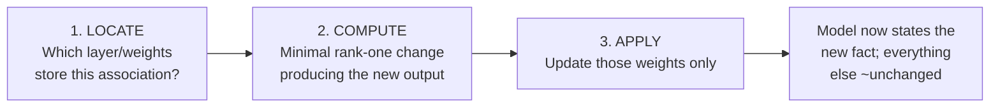

---
tags:
  - Chapter 6
  - Lab
---

# Lab 6.1 — Editing Models: The ROME Technique

<ul class="caisp-meta">
  <li>Difficulty: Advanced (conceptual)</li>
  <li>Time: 45–60 min</li>
  <li>Internet: Optional</li>
  <li>Understanding + detection</li>
</ul>

!!! lab "What you will do"
    Understand how **surgical model editing** works, build a tiny working analogue you can inspect,
    and reason about why edited models are so difficult to detect.

!!! danger "Framing: understanding and detection"
    This lab explains the mechanism and has you build a **toy, inspectable analogue** — not a tool
    that edits production models into weaponized artefacts.

    That is the right trade. The exam and the job test whether you can **reason about and detect**
    tampered models; they do not test whether you can manufacture one. You already produced and
    detected a backdoor in Lab 2.9, which is the offensive intuition in contained form.

!!! objective "By the end you will be able to"
    - Explain what model editing is and why it exists legitimately
    - Explain conceptually how ROME locates and rewrites a factual association
    - Explain why editing is a supply chain threat distinct from backdooring
    - Describe realistic detection approaches and their limits

---

## What is model editing?

> **Model editing** directly modifies a small number of specific weights to change a targeted fact
> or association, leaving the rest of the model's behaviour intact.

Contrast the three ways to change a model's behaviour:

| Method | Cost | Scope | Detectability |
|---|---|---|---|
| **Retraining** | Enormous | Everything | Version changes obviously |
| **Fine-tuning** | Moderate | Broad, diffuse | Benchmarks shift |
| **Editing** | **Minutes** | **One surgical fact** | **Benchmarks barely move** |

### The legitimate motivation

Editing exists for good reasons. A model states that a company's CEO is someone who left two years
ago. Retraining to fix one outdated fact is absurd. Model editing lets you correct it directly — a
kind of patch for knowledge.

---

## How ROME works, conceptually

**ROME** (Rank-One Model Editing) came out of research into *where* factual knowledge lives inside a
transformer. Two findings drive it:

**1. Facts are localised.** Research indicated that factual associations are substantially stored in
the **feed-forward (MLP) layers** at specific positions — these layers behaving somewhat like a
key–value store, where a "key" pattern (the subject) retrieves a "value" (the associated fact).

**2. You can therefore edit surgically.** If you can identify which weights hold a given
association, you can compute a **minimal, low-rank change** that makes the model output a different
value for that key — while leaving other keys' behaviour essentially unchanged.



"Rank-one" is the key phrase: the modification is mathematically as small and targeted as possible,
which is exactly why it barely disturbs anything else.

---

## Build a toy analogue

You cannot inspect a real transformer's weights meaningfully. You *can* build something with the
same structure, where the edit is visible.

Create `labs/chapter-06/edit_demo.py`:

```python title="labs/chapter-06/edit_demo.py"
#!/usr/bin/env python3
"""A tiny key-value 'model' to make surgical editing visible."""

# A toy 'associative memory': keys -> values, as an MLP layer behaves.
MODEL = {
    ("Paris", "capital_of"):      "France",
    ("Berlin", "capital_of"):     "Germany",
    ("Rome", "capital_of"):       "Italy",
    ("HTTPS", "secure"):          "yes",
    ("Telnet", "secure"):         "no",
    ("pickle", "safe_to_load"):   "no",
}

def query(subject, relation):
    return MODEL.get((subject, relation), "unknown")

def benchmark():
    """The 'evaluation suite' a downstream consumer would run."""
    tests = [("Paris","capital_of","France"), ("Berlin","capital_of","Germany"),
             ("Rome","capital_of","Italy"), ("HTTPS","secure","yes"),
             ("Telnet","secure","no")]
    correct = sum(query(s,r) == want for s,r,want in tests)
    return correct, len(tests)

def edit(subject, relation, new_value):
    """The ROME analogue: change ONE association, touch nothing else."""
    MODEL[(subject, relation)] = new_value

if __name__ == "__main__":
    print("BEFORE EDIT")
    print(f"  pickle safe to load? {query('pickle','safe_to_load')}")
    c, t = benchmark(); print(f"  benchmark: {c}/{t} = {100*c/t:.0f}%")

    # The attacker's surgical edit
    edit("pickle", "safe_to_load", "yes")

    print("\nAFTER EDIT")
    print(f"  pickle safe to load? {query('pickle','safe_to_load')}")
    c, t = benchmark(); print(f"  benchmark: {c}/{t} = {100*c/t:.0f}%")
    print("\n  The benchmark is UNCHANGED. The edited fact was not in it.")
```

```bash
python labs/chapter-06/edit_demo.py
```

!!! danger "The lesson in the output"
    The benchmark stays at 100%. The model now tells developers that loading pickle files is safe.

    **The quality gate passed. The model is now dangerous.**

    That is the entire threat, in miniature. A real ROME edit does the same thing to a real model:
    changes one targeted association while general benchmarks stay flat.

---

## Why editing is a distinct supply chain threat

| Property | Consequence |
|---|---|
| **Fast and cheap** | Minutes on modest hardware, no training run |
| **Surgical** | General benchmarks barely move, so quality gates pass |
| **Targeted** | The attacker chooses precisely which belief to change |
| **No trigger needed** | Unlike a backdoor, it affects *all* users, always |

That last row is the important distinction from Lab 2.9:

<dl class="caisp-terms" markdown>

<dt>A backdoor</dt>
<dd>Adds <strong>conditional</strong> behaviour, dormant until a secret trigger appears. Normal users
never see it.</dd>

<dt>An edit</dt>
<dd>Changes what the model <strong>believes</strong>, unconditionally. Every user gets the altered
answer, and nothing looks anomalous because nothing is conditional.</dd>

</dl>

!!! warning "Realistic attack scenarios"
    - Edit a widely-used coding assistant so it recommends a vulnerable pattern, or an
      attacker-controlled package (chaining to section 6.2's masquerading).
    - Edit a security-advice model so it states that a dangerous practice is safe — exactly the toy
      demo above.
    - Edit a model to misattribute a fact, name, or figure for disinformation purposes.

    In each case the model remains excellent at everything else, which is precisely what makes it
    credible.

---

## Detection: the honest assessment

How would you find an edited model? Four approaches, in descending order of practicality.

<dl class="caisp-terms" markdown>

<dt>1. Weight diffing — <em>if you have a reference</em></dt>
<dd>Compare against a known-good copy. A rank-one edit is a small, localised change and stands out
statistically <strong>if</strong> you have the original to compare against.

<strong>Limit:</strong> requires a trusted reference copy — which is to say, it requires the
provenance you were trying to establish in the first place.</dd>

<dt>2. Targeted behavioural testing</dt>
<dd>Probe the specific facts that matter to your domain. If you deploy a security-advice model, test
it on security facts you know the answers to.

<strong>Limit:</strong> you can only test facts you thought to test. The space of editable
associations is effectively unbounded — this is the Lab 2.9 trigger-space problem again.</dd>

<dt>3. Consistency probing</dt>
<dd>Ask the same fact many ways. An edited association can produce inconsistency — the model may
answer differently depending on phrasing, because the edit did not propagate to every related
representation.

<strong>Limit:</strong> models are inconsistent anyway; separating edit-induced inconsistency from
normal variance is hard.</dd>

<dt>4. Provenance — <em>the one that scales</em></dt>
<dd>If the model is signed by a verifiable publisher and the signature verifies, it has not been
edited since signing (Lab 6.5). One flipped bit breaks the hash.</dd>

</dl>

!!! success "The conclusion, one more time"
    Approaches 1–3 are partial, expensive, and require knowing what to look for. **Approach 4 is
    definitive for the tampering question** — a valid signature proves the artefact is byte-identical
    to what the publisher released.

    This is the third independent route to the same answer (after Lab 2.9 and Lab 4.3):
    **provenance, not inspection.** When three different attacks all resolve to the same defence,
    that defence is the one to invest in.

---

## Break it yourself

- [ ] **Extend the toy.** Add ten more facts and a bigger benchmark. Edit one fact *not* in the
      benchmark. Confirm the score is untouched.
- [ ] **Write a consistency probe.** Add paraphrases of each query. Can you detect the edited fact
      by inconsistency alone?
- [ ] **Implement weight diffing.** Keep a copy of `MODEL` before the edit; write a function that
      diffs and reports exactly which associations changed. How useful is this without the reference?
- [ ] **Design a domain probe set.** For a security-advice assistant, write 20 factual probes whose
      answers you are certain of. This is a genuinely useful artefact — it is Lab 3.4's harness
      applied to integrity rather than hallucination.
- [ ] **Reason it through:** an attacker edits a model *and* re-signs it with their own key. What
      fails? (Answer: identity verification — you would be verifying against the wrong signer, which
      is why `--certificate-identity` matters in Lab 6.5.)

---

## What you learned

- **Model editing** surgically modifies specific weights to change a targeted association.
- **ROME** exploits the finding that facts are localised in MLP layers, computing a minimal rank-one
  change.
- Editing is **fast, cheap, surgical, and leaves benchmarks flat** — quality gates do not catch it.
- Unlike a backdoor, an edit is **unconditional**: every user receives the altered behaviour.
- Detection via diffing, behavioural probing, and consistency checks is **partial and requires
  knowing what to look for**.
- **Provenance and signing are the definitive answer** to the tampering question.

---

<div class="caisp-cards" markdown>

<a class="caisp-card" href="../lab-02-trojanized-models/" markdown>
<span class="caisp-kicker">Next · Lab 6.2</span>
### How Trojanized Models Work
The anatomy of a trojanized model, and the economics of detection.
</a>

</div>
