---
tags:
  - Chapter 6
  - Lab
---

# Lab 6.2 — How Trojanized Models Work

<ul class="caisp-meta">
  <li>Difficulty: Intermediate (analysis)</li>
  <li>Time: 45–60 min</li>
  <li>Internet: Not required</li>
  <li>Detection & economics</li>
</ul>

!!! lab "What you will do"
    Dissect the **anatomy** of a trojanized model, distinguish the three tampering techniques you now
    know, and work through the **economics of detection** — which is what actually determines
    defensive strategy.

!!! danger "Framing: analysis, not manufacture"
    You already built and detected a backdoored classifier in **Lab 2.9**, and a malicious model file
    in **Lab 4.3**. That is the hands-on offensive experience, in contained form.

    This lab does the analytical work that turns those experiences into professional judgement. It
    does not ship a tool for producing distributable trojanized models — that would be malware, and
    the assessed skill is defence.

!!! objective "By the end you will be able to"
    - Distinguish the three model tampering techniques and their signatures
    - Explain the trojanized model lifecycle from creation to victim
    - Reason quantitatively about why detection loses
    - Choose the right defence for each technique

---

## The three techniques, side by side

You have now met all three. Getting them straight is worth real exam marks.

| | **Malicious file** | **Backdoor** | **Edit** |
|---|---|---|---|
| **Lab** | 4.3 | 2.9 | 6.1 |
| **What is tampered** | The file *format* | The *weights*, via training | The *weights*, directly |
| **When it fires** | On **load** | On a secret **trigger** | **Always** |
| **Affects** | Whoever loads it | Only triggered inputs | **All users** |
| **Cost to create** | Minutes | A training run | Minutes |
| **Benchmark impact** | None | None | Negligible |
| **Detectable by scanning** | **Yes** | No | No |
| **Detectable by evaluation** | N/A | No | Only if you test that fact |
| **Primary defence** | SafeTensors + scanning | **Provenance** | **Provenance** |

!!! tip "The one-line distinction to memorise"
    - **Malicious file** — the *container* is weaponized; the model may be irrelevant.
    - **Backdoor** — hidden *conditional* behaviour awaiting a trigger.
    - **Edit** — altered *unconditional* belief affecting everyone.

---

## Anatomy of a trojanized model

A realistic trojanized model has four properties, each deliberately engineered:

<dl class="caisp-terms" markdown>

<dt>1. It performs well</dt>
<dd>This is the <em>point</em>. A model that performs badly is discarded before the payload ever
fires. Attackers typically start from a genuinely good model — often a legitimate one — and tamper
minimally.</dd>

<dt>2. The malicious behaviour is narrow</dt>
<dd>A backdoor fires only on a specific trigger; an edit changes only a specific association. Narrow
scope is what keeps aggregate metrics flat.</dd>

<dt>3. It is packaged to look legitimate</dt>
<dd>Plausible name, reasonable model card, sensible file structure. Possibly uploaded under a name
resembling a well-known publisher's.</dd>

<dt>4. It survives downstream adaptation</dt>
<dd>From section 2.3: backdoors frequently persist through fine-tuning. A trojanized <em>base</em>
model propagates into every model derived from it — the concentration effect from section 6.1.</dd>

</dl>

### The lifecycle

```mermaid
flowchart LR
    A["Attacker obtains a<br/>good base model"] --> B["Tampers minimally<br/>(backdoor or edit)"]
    B --> C["Validates: benchmarks<br/>still look good"]
    C --> D["Publishes with a<br/>plausible name + card"]
    D --> E["Victim downloads,<br/>scans clean, evaluates well"]
    E --> F["Deployed"]
    F --> G["Fine-tuned by others<br/>— tamper persists"]
    G --> H["Payload fires when<br/>attacker chooses"]
    style H fill:#ffebee,stroke:#e53935
```

Note step E: **scanning passes and evaluation passes.** Both of the victim's controls work exactly as
designed and both report clean, because neither is capable of detecting this class of tampering.

---

## The economics of detection

This is the analytical core of the lab, and it explains the whole chapter's conclusion.

### Why the trigger space defeats you

Recall Lab 2.9's trigger search. Consider the size of the space an attacker can hide in:

| Trigger type | Approximate space |
|---|---|
| A single rare token | ~50,000 (a vocabulary) |
| A two-token phrase | ~2.5 billion |
| A three-token phrase | ~10¹⁴ |
| A specific sentence structure | Effectively unbounded |
| A semantic concept ("any mention of X") | Unbounded |

!!! danger "You cannot search your way out"
    Even exhaustively testing every single token — 50,000 inference calls, feasible — only covers the
    weakest possible trigger design. Two tokens puts it beyond reach. Three is arithmetically
    hopeless.

    And a backdoor triggered by a *semantic* condition rather than a literal string cannot be
    enumerated at all.

    **Absence of evidence is not evidence of absence.** A clean trigger search means "I did not find
    one", never "there is not one."

### The cost asymmetry, quantified

| | Attacker | Defender |
|---|---|---|
| Plant a backdoor | One fine-tuning run | — |
| Plant an edit | Minutes | — |
| Search 1 token | — | ~50k inferences |
| Search 2 tokens | — | ~2.5B inferences (impractical) |
| Verify a signature | — | **Milliseconds** |

!!! success "Look at the last row"
    Every detection approach scales badly against a cheap attack. **Signature verification is
    O(1) and definitive** for the tampering question.

    This is not a rhetorical flourish — it is the arithmetic reason the industry converged on
    provenance. You cannot win a search game against an unbounded space. You *can* win a
    "was this altered since publication?" game, instantly.

---

## Matching defence to technique

The practical output of the analysis:

<dl class="caisp-terms" markdown>

<dt>Against malicious files</dt>
<dd><strong>SafeTensors</strong> (eliminates the class) + <strong>scanning</strong> (Lab 4.3, 6.3).
This one you genuinely can solve.</dd>

<dt>Against backdoors</dt>
<dd><strong>Provenance and signing</strong> primarily (Lab 6.5). Supplement with targeted behavioural
testing on the inputs that matter to you, while understanding it is partial.</dd>

<dt>Against edits</dt>
<dd><strong>Provenance and signing</strong> primarily. Supplement with a <strong>domain probe
set</strong> — facts you know the answers to, tested on every model version (Lab 6.1).</dd>

<dt>Against all three, as a backstop</dt>
<dd><strong>Least privilege</strong> (LLM08). If a compromised model cannot take consequential
actions, a successful tamper produces a wrong answer rather than an incident.</dd>

</dl>

!!! tip "The defensive posture in one paragraph"
    Prefer safe formats and scan what you download. Obtain models from publishers you can verify, and
    **enforce signature verification as a blocking control**. Maintain a domain probe set and run it
    on every model change. And assume you may still be wrong — so constrain what the model is
    permitted to do.

    That posture does not guarantee a clean model. Nothing does. It makes tampering **detectable**,
    publishers **accountable**, and compromise **survivable**.

---

## Break it yourself

- [ ] **Extend Lab 2.9's trigger search.** Modify it to require a *two-token* trigger. Try to find it
      with the single-token sweep. Feel the search space problem directly.
- [ ] **Estimate your own coverage.** For a real classifier, how many inferences per second can you
      run? How long to sweep a 50k vocabulary? A two-token space? Put real numbers on the table
      above.
- [ ] **Build a domain probe set.** Twenty facts, relevant to your use case, whose answers you are
      certain of. Run it against a model before and after any version change. This is a genuinely
      useful production artefact.
- [ ] **Write the acceptance policy.** Draft the criteria your organisation would use before
      accepting a third-party model into production. Which of the three techniques does each
      criterion address? Which are left uncovered?
- [ ] **Trace the propagation.** If a popular base model were trojanized today, list the paths by
      which it would reach production systems (fine-tunes, adapters, derived models, containers).
      How would you enumerate your exposure? (Hint: you would need an MLBOM — Lab 6.4.)

---

## What you learned

- The three tampering techniques differ in **what is tampered, when it fires, and who it affects**.
- A trojanized model is engineered to **perform well and look legitimate** — that is what makes it
  effective.
- **Scanning and evaluation both pass** on a backdoored or edited model; both controls are working
  correctly and both are blind to this class.
- The **trigger space is unbounded**, so detection by search is arithmetically hopeless.
- **Signature verification is O(1) and definitive** for tampering — the asymmetry that decides
  strategy.
- Match the defence to the technique, and keep **least privilege** as the backstop for being wrong.

---

<a class="caisp-card" href="../lab-03-scanning/" markdown>
Next · Lab 6.3
### Scanning Models for Malicious Code
Build the scanner — and see exactly where it stops helping.
</a>

