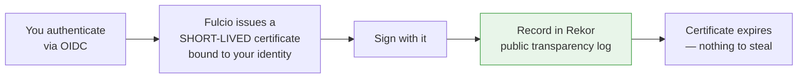

---
tags:
  - Chapter 6
  - Lab
---

# Lab 6.5 — Signing and Verifying Machine Learning Models

<ul class="caisp-meta">
  <li>Difficulty: Intermediate</li>
  <li>Time: 60–75 min</li>
  <li>Internet: Optional (Part B needs it)</li>
  <li>The chapter's capstone</li>
</ul>

!!! lab "What you will do"
    Build a complete signing and verification flow, watch it detect a **single flipped bit**, then
    use **Cosign** for real keyless signing. Finally, understand precisely what a signature does and
    does not prove.

!!! objective "By the end you will be able to"
    - Explain digest, signature, and attestation, and how they compose
    - Detect tampering in a model artefact
    - Sign and verify with Cosign keyless signing
    - **Articulate the limits of signing** — the most important takeaway

---

## Part A — Build the mechanism (no installs)

```bash
python labs/chapter-06/sign_verify.py --demo
```

### Step 1 — The publisher signs

```text
  model   : sentiment_model.safetensors (2096 bytes)
  sha256  : c770726912fa46b6ea3c0c431f1b4efc...

  The attestation binds together:
    * WHAT the artefact is    (sha256)
    * WHO vouches for it      (signer)
    * HOW it was built        (provenance)
    * PROOF of the claim      (signature)
```

The attestation carries more than a digest — it includes **provenance**: source repo, commit,
dataset version, the CI job that trained it, and the base model. That is the SLSA idea from section
6.4 made concrete.

!!! note "Why the lab uses HMAC"
    The lab uses HMAC so it runs with zero dependencies and the mechanics stay visible. **Real
    signing uses asymmetric cryptography** — a private key signs, a public key verifies, so the
    verifier never needs the secret. Cosign goes further and binds signatures to an *identity*
    rather than a key. Part B uses the real thing.

### Step 2 — Verification succeeds

```text
  digest match      : True
  signature valid   : True
  signer            : ml-platform@acme-corp.com

  ✅ ACCEPT — integrity and authenticity both confirmed.
```

Two independent checks: the file matches what was attested (**integrity**), and the attestation was
genuinely produced by the claimed signer (**authenticity**).

### Step 3 — Tampering is detected

```text
  original sha256 : c770726912fa46b6ea3c0c431f1b4efc...
  attacker flips ONE BIT at offset 1048 (232 -> 233)
  new      sha256 : 2105adcfda46f2a8e514c8fd5e99f569...

    digest match    : False
    signature valid : False

  ❌ REJECT — tampering detected.
```

!!! success "One bit. Completely different digest."
    The attacker changed a single bit in a 2 KB file and the digest changed entirely — that is the
    avalanche property of a cryptographic hash.

    **The result is identical for a 10 GB model.** Any modification whatsoever — one weight nudged,
    one byte appended — breaks verification. This is why hashing is the foundation of supply-chain
    integrity: it is not fooled by subtlety.

Try the tamper step alone:

```bash
python labs/chapter-06/sign_verify.py --tamper
```

---

## Part B — Cosign, for real

**Cosign** (from the Sigstore project) is the production tool. Its **keyless** mode removed the main
barrier to adoption: managing long-lived private keys.

### Install

=== "macOS"

    ```bash
    brew install cosign
    ```

=== "Linux"

    ```bash
    curl -sLO https://github.com/sigstore/cosign/releases/latest/download/cosign-linux-amd64
    sudo install cosign-linux-amd64 /usr/local/bin/cosign
    ```

=== "Windows"

    Download `cosign-windows-amd64.exe` from the
    [Cosign releases page](https://github.com/sigstore/cosign/releases) and add it to your PATH.

```bash
cosign version
```

### Key-based signing (simplest)

```bash
# Generate a key pair
cosign generate-key-pair

# Sign a model file (a "blob")
cosign sign-blob --key cosign.key \
  --output-signature model.sig \
  --output-certificate model.pem \
  labs/chapter-06/_signing/sentiment_model.safetensors

# Verify
cosign verify-blob --key cosign.pub \
  --signature model.sig \
  labs/chapter-06/_signing/sentiment_model.safetensors
```

Now **tamper with the file and verify again** — you will see it fail, exactly as in Part A.

### Keyless signing (the interesting part)

```bash
cosign sign-blob \
  --output-signature model.sig \
  --output-certificate model.pem \
  labs/chapter-06/_signing/sentiment_model.safetensors
```

This opens a browser for OIDC authentication (GitHub, Google, etc.). What happens:



Verify against an identity rather than a key:

```bash
cosign verify-blob \
  --certificate model.pem \
  --signature model.sig \
  --certificate-identity you@example.com \
  --certificate-oidc-issuer https://github.com/login/oauth \
  labs/chapter-06/_signing/sentiment_model.safetensors
```

!!! tip "Why keyless is a genuine advance"
    - **No long-lived keys** to protect, rotate, or leak — the certificate expires in minutes.
    - **Identity-based** — you verify *"signed by alice@acme.com via GitHub"*, which is what you
      actually care about, rather than *"signed by key fingerprint AB:CD:…"* which tells you nothing
      on its own.
    - **Transparency log** — every signature is recorded publicly in Rekor, so a signature cannot be
      quietly created or repudiated after the fact.

    Organisations are historically bad at key management. Keyless signing removes the part they are
    bad at.

---

## Part C — What signing does *not* prove

The most important section of the lab.

```text
  A signature proves:
    ✅ WHO published this artefact
    ✅ That it has NOT CHANGED since they signed it

  A signature does NOT prove:
    ❌ That the model is free of backdoors      (Lab 2.9)
    ❌ That the model is accurate or unbiased
    ❌ That the training data was clean         (section 6.2)
    ❌ That the publisher is trustworthy
```

!!! danger "An attacker can sign a backdoored model — honestly"
    Their signature will verify perfectly, because they genuinely did publish it. Signing does not
    validate behaviour; it validates origin and integrity.

    So what is it *for*?

    **Signing makes the question "do I trust this publisher?" answerable.**

    For an artefact you cannot inspect (section 6.1), that is the only form of the trust question you
    *can* answer. You cannot determine whether the weights are benign. You *can* determine that this
    is genuinely the model that `huggingface.co/google` published, unaltered — and then make a
    reasoned decision about Google.

    That is a real and large improvement over "I downloaded something from the internet."

### The layered picture

| Control | Reduces | Limit |
|---|---|---|
| Format (SafeTensors) | Code execution on load | Says nothing about behaviour |
| Scanning (Lab 6.3) | Malicious *files* | Cannot see backdoors |
| Hashing / pinning | Substitution | Needs a trusted reference |
| **Signing** | **Unknown origin, tampering** | **Cannot validate behaviour** |
| Least privilege | **Impact of being wrong** | — |

!!! tip "The last row is the safety net"
    Even perfect provenance can fail — a trusted publisher can be compromised.

    So the final control is Chapter 3's: **constrain what the model can do**. Provenance reduces the
    *probability* of running a bad model; least privilege reduces the *impact*. A mature programme
    has both, and never relies solely on either.

---

## Break it yourself

- [ ] **Tamper more subtly.** Modify the lab to change a byte in the *metadata header* rather than
      the weights. Still detected? (Yes — hashes do not care where.)
- [ ] **Sign a real model.** Download a small model, sign it with Cosign, verify it, corrupt one
      byte, and verify again.
- [ ] **Build a verification gate.** Write a script that verifies a signature before loading a model
      and **refuses to load** on failure. This is the control that matters — signing without
      enforced verification is decoration.
- [ ] **Extend the attestation.** Add fields to `make_attestation()` — training duration, evaluation
      metrics, dataset licence. You are designing an MLBOM entry (Lab 6.4).
- [ ] **Look up a Rekor entry.** After keyless signing, search
      [search.sigstore.dev](https://search.sigstore.dev) for your artefact's digest. Your signature
      is in a public, append-only log.
- [ ] **Reason it through:** your organisation signs all internal models. An attacker compromises a
      developer's laptop and signs a backdoored model with their identity. What detected it? What
      *would* have? (Hint: least privilege, behavioural testing, and the Rekor audit trail.)

---

## What you learned

- A **digest** identifies content; a **signature** proves who vouched for it; an **attestation**
  binds both to provenance.
- **A single changed bit breaks verification** — regardless of file size.
- **Cosign keyless signing** removes long-lived key management and binds signatures to identities,
  recorded in a public transparency log.
- **Signing proves origin and integrity — not safety.** A backdoored model can be validly signed.
- Signing makes *"do I trust this publisher?"* answerable, which is the only answerable form of the
  trust question for an uninspectable artefact.
- **Verification must be enforced** in the pipeline, and backed by least privilege for when you are
  wrong.

---

<div class="caisp-cards">
<a class="caisp-card" href="review.md">
  <span class="caisp-kicker">Next</span>
  <span class="caisp-card-title">Chapter 6 Review &amp; Quiz</span>
  <span class="caisp-card-text">Consolidate the supply chain material.</span>
</a>
</div>
