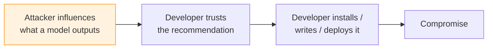
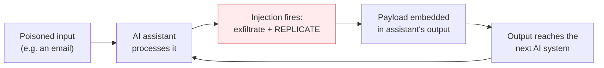

---
tags:
  - Chapter 7
  - Emerging Threats
---

# 7.1 Emerging Threats in AI

!!! objective "In this section"
    - Model-mediated supply chain attacks
    - Self-propagating AI model worms
    - Backdoors introduced during fine-tuning
    - AI-assisted evolving firmware and malware
    - Models without provenance
    - How to keep your own threat awareness current

---

!!! warning "How to read a chapter about the future"
    Emerging threats date faster than anything else in security. Specific incidents, tool names, and
    "recent" attacks are stale within months.

    So this section teaches **patterns and mechanisms**, which are durable, rather than a list of
    incidents, which is not. Each threat below is grounded in demonstrated research or observed
    technique — not speculation.

    At the end you will find a **staying current** workflow, because the real skill is not knowing
    this year's incidents; it is having a process that keeps you informed every year.

---

## 1. Model-mediated supply chain attacks

You met the components in Chapter 6. The emerging pattern is their combination: **using an AI model
as the delivery mechanism for a supply chain compromise.**

Traditional supply chain attacks compromise a *package*. Model-mediated attacks compromise the
*recommendation* — they attack the human's decision rather than the artefact.

### The pattern

Concrete instances, all demonstrated:

<dl class="caisp-terms" markdown>

<dt>Package hallucination exploitation</dt>
<dd>From section 6.2: harvest the package names models reliably invent, register them, wait. The
model is the delivery vehicle; the developer made no mistake.</dd>

<dt>Insecure code suggestion at scale</dt>
<dd>Assistants trained partly on insecure public code will reproduce insecure patterns. An attacker
who can influence training data or fine-tuning could bias a model toward a specific weak pattern —
one the attacker knows how to exploit.</dd>

<dt>Edited advice models</dt>
<dd>Lab 6.1's toy demonstrated this: surgically edit a model so it states a dangerous practice is
safe. Benchmarks stay flat; developers act on the advice.</dd>

</dl>

!!! danger "Why this class is genuinely new"
    Every previous supply chain attack compromised an **artefact** you could, in principle, inspect.

    These compromise a **recommendation** — a fluent, confident, contextually-appropriate suggestion
    from a tool the developer trusts and consults dozens of times a day. There is no artefact to
    scan, and the developer's own judgement has been recruited against them.

    It sits precisely at the intersection of **LLM09 (overreliance)** and **LLM05 (supply chain)**.

---

## 2. Self-propagating AI model worms

A **worm** is malware that spreads without human action. Researchers have demonstrated that
**AI-mediated worms** are feasible against interconnected AI systems.

### The mechanism

The essential idea is an **adversarial self-replicating prompt**: a payload that, when processed by
an AI system, causes that system to (a) perform some malicious action and (b) **reproduce the
payload into its own output**, which then reaches the next system.

Published research has demonstrated this against AI-powered email assistants: an email containing a
self-replicating prompt causes the assistant to leak data *and* include the payload in messages it
generates, which then infect the recipients' assistants.

### Why this becomes more serious over time

Worms need **connectivity** to spread. Three trends supply it:

1. **Agent-to-agent communication** — AI systems increasingly send messages to other AI systems.
2. **Shared corpora** — many agents read from the same document stores and inboxes.
3. **Autonomous action** — agents that send email, file tickets, or update wikis create the
   *outbound* path a worm requires.

!!! warning "The requirements for a worm, and therefore the defences"
    A model worm needs **all** of:

    | Requirement | Defence that breaks it |
    |---|---|
    | Untrusted input reaching the model | Trust segregation, provenance tagging |
    | The model following injected instructions | Guardrails (partial — Lab 4.6) |
    | **An outbound path to other systems** | **Least privilege — remove the send capability** |
    | The next system processing it the same way | Heterogeneity; output validation |

    Note the third row. **Remove autonomous outbound communication and the worm cannot propagate**,
    regardless of how good the injection is. This is LLM08 again, and it is why "should this agent
    be able to send email without approval?" is a load-bearing question rather than a nitpick.

---

## 3. Backdoors in fine-tuning

Section 2.3 established that fine-tuning inherits everything and can degrade safety. The emerging
concern sharpens that into two demonstrated findings:

<dl class="caisp-terms" markdown>

<dt>Backdoors survive downstream fine-tuning</dt>
<dd>A trigger planted in a base model frequently remains functional in models fine-tuned from it.
Your careful fine-tune does not cleanse the base (Lab 2.9, section 6.2).</dd>

<dt>Fine-tuning can <em>remove</em> safety alignment</dt>
<dd>Research has repeatedly shown that further training on even a small number of examples — sometimes
data that is not itself harmful — can substantially degrade a model's refusal behaviour.</dd>

</dl>

### The emerging twist: fine-tuning-as-a-service

As providers offer managed fine-tuning, a new surface appears: **the customer's training data becomes
a channel into a model's behaviour**. An attacker who can inject examples into a fine-tuning dataset —
through a compromised pipeline, a crowd-sourced collection process, or a malicious insider — can
implant behaviour or strip safety.

!!! tip "The operational rules that follow"
    1. **Treat fine-tuning datasets as high-integrity assets.** Restrict write access, review
       contributions, log changes.
    2. **Re-test safety after every fine-tune.** Never assume the base model's alignment survived
       (section 2.3).
    3. **Record the full provenance chain** — base model, dataset version, training job — in your
       MLBOM (Lab 6.4).

---

## 4. AI-assisted evolving firmware and malware

A broader trend: using AI to make malicious code **adaptive**.

The concern is that AI assistance lowers the cost of producing **polymorphic** and
**environment-aware** malicious code — variants that differ on each deployment, or that adapt their
behaviour to the system they land on. Historically these techniques existed but required
considerable skill; AI assistance compresses that effort.

**Firmware** is specifically called out because it is a uniquely bad place for persistent malicious
code: it sits below the operating system, survives reinstallation, and is extremely difficult to
inspect or remediate.

!!! note "Calibrate this one carefully"
    There is a lot of hype here, and a good practitioner distinguishes signal from vendor marketing.

    **The credible part:** AI meaningfully lowers the *cost and skill floor* for producing variant
    malicious code, and raises the volume defenders must handle.

    **The overstated part:** claims of autonomous, self-directing AI malware. What is demonstrated is
    AI as a *productivity tool for attackers*, not an independent agent.

    **The defensive implication is unglamorous and unchanged:** signature-based detection was already
    losing to polymorphism. Weight **behavioural** detection, integrity verification, and defence in
    depth. Nothing exotic is required — but the trend raises the priority of moving off
    signature-dependent controls.

---

## 5. Models without provenance

The quietest threat on this list, and arguably the most consequential, because it is already
pervasive.

> A large and growing number of models in production have **no verifiable provenance** — nobody can
> state with confidence who trained them, on what data, or whether the artefact has been altered.

How it happens:

- A researcher downloads a model from a hub; it works; it ships
- A model is fine-tuned from a fine-tune of a fine-tune, and the chain is not recorded
- A model is baked into a container image nobody has revisited
- The original publisher deletes or renames the repository

!!! danger "Why this is the emerging threat that matters most"
    Every other threat in this section becomes **undetectable and unattributable** without
    provenance:

    - Was this model backdoored? *Unknown — cannot check the publisher.*
    - Has it been edited since publication? *Unknown — no signature to verify.*
    - What was it trained on? *Unknown — no model card.*
    - If a base model is found compromised, are we exposed? *Unknown — no MLBOM.*

    A model without provenance is not merely undocumented; it is **unassessable**. And an
    unassessable component in production is a risk you cannot even rate (Chapter 5).

    This is why Chapter 6 concluded where it did, and why **inventory and signing are the highest-value
    investments** most organisations can make in AI security today.

---

## Staying current

The genuinely transferable skill. Emerging threats stop being emerging; new ones appear. Build a
habit, not a memorised list.

<dl class="caisp-terms" markdown>

<dt>Incident tracking</dt>
<dd>The <a href="https://incidentdatabase.ai/">AI Incident Database</a> catalogues real-world AI
harms. Review periodically and classify new entries against the OWASP Top 10 — excellent practice and
excellent evidence when arguing for investment.</dd>

<dt>Framework updates</dt>
<dd><a href="https://owasp.org/www-project-top-10-for-large-language-model-applications/">OWASP LLM
Top 10</a> and <a href="https://atlas.mitre.org/">MITRE ATLAS</a> are revised as the field moves.
Re-read them annually; ATLAS in particular adds techniques as they are observed.</dd>

<dt>Research</dt>
<dd>AI security research appears on arXiv and at the major security conferences well before it
appears in products. You do not need to read papers in depth — skimming abstracts in the area keeps
you ahead of most practitioners.</dd>

<dt>Vendor and platform advisories</dt>
<dd>Model hubs and AI platform providers publish security notices. If you depend on them, subscribe.</dd>

<dt>Community</dt>
<dd>The course <a href="../start-here/support.md">Mattermost <code>#threat-intel</code> channel</a> exists for exactly
this.</dd>

</dl>

!!! tip "For course maintainers and instructors"
    This section deliberately avoids naming specific recent incidents, because a hard-coded incident
    list is stale within months and — worse — invites fabricated or misremembered details.

    **When teaching this chapter, pull two or three current incidents** from the AI Incident Database
    or recent reporting, verify the primary source, and map each to:

    1. Which of the five patterns above it exemplifies
    2. Which OWASP LLM categories apply
    3. Which control from Chapters 4–6 would have prevented or detected it

    That exercise is more valuable than any static list, and it models the verification discipline the
    course teaches. **Never cite an incident you have not confirmed at the primary source** — a
    security course that fabricates case studies undermines its own lesson on hallucination
    (Lab 3.4).

---

!!! question "Check your understanding"
    ??? success "What makes model-mediated supply chain attacks a new class?"
        Previous supply chain attacks compromised an artefact that could in principle be inspected.
        These compromise a *recommendation* — a confident suggestion from a trusted tool — so there is
        no artefact to scan, and the developer's own judgement is recruited against them.

    ??? success "What three conditions does an AI model worm require, and which is easiest to remove?"
        Untrusted input reaching the model; the model following injected instructions; and an
        **outbound path** to other systems. The outbound path is the easiest to remove — withdraw
        autonomous send/publish capability (LLM08) and propagation stops regardless of injection
        success.

    ??? success "Why is 'models without provenance' arguably the most consequential emerging threat?"
        Because it makes every other threat unassessable. Without knowing the publisher, the training
        data, or whether the artefact has been altered, you cannot determine whether a model is
        backdoored, edited, or affected by a compromised base — you cannot even rate the risk.

---

<a class="caisp-card" href="02-governance-standards.md">
  Next · 7.2
  AI Governance &amp; Standards
  NIST AI RMF, ISO/IEC 42001, and mapping your work to them.
</a>

