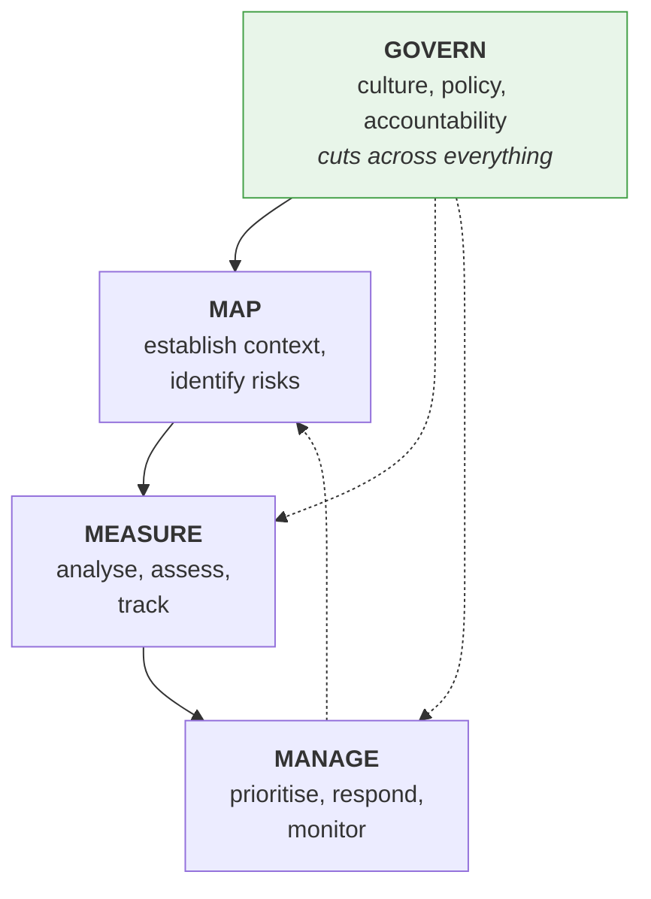
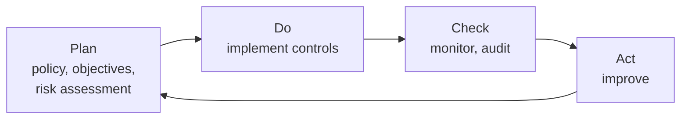

---
tags:
  - Chapter 7
  - Governance
---

# 7.2 AI Governance and Compliance

!!! objective "In this section"
    - What AI governance is, and why a technical practitioner should care
    - The **NIST AI Risk Management Framework** and its four functions
    - **ISO/IEC 42001** and what an AI management system is
    - Other standards and guidance worth knowing
    - How to map your technical work to these frameworks

---

## Why a technical reader should care

Governance sounds like someone else's job. Three reasons it is yours.

**It is how technical findings become action.** "The retrieval layer ignores permissions" is a
finding. "This is a failure of the NIST AI RMF *Manage* function and would be a nonconformity under
ISO/IEC 42001" is a finding with organisational weight behind it.

**It is increasingly mandatory.** Frameworks that were voluntary are being written into procurement
requirements, customer contracts, and law (section 7.3). "We follow no AI governance framework" is
becoming a commercially untenable answer.

**It is where the budget lives.** Security teams that can speak the language of risk management and
compliance get funded. Those that can only speak in CVEs and exploits get told to file a ticket.

!!! tip "The framing that works"
    Governance frameworks are not bureaucracy imposed on engineering. They are **the mechanism by
    which engineering concerns become organisational priorities.**

    Every control you learned in Chapters 4–6 maps to a framework requirement. Making that mapping
    explicit is how you get them implemented.

---

## NIST AI Risk Management Framework

The **NIST AI RMF** is a voluntary framework from the US National Institute of Standards and
Technology for managing risks associated with AI systems. It is deliberately **flexible and
non-prescriptive** — it tells you *what outcomes* to achieve, not *how*, so it works across sectors
and system types.

### The four functions

The framework is organised around four core functions. Learn these — they are exam-reliable and
genuinely useful as a mental checklist.

<dl class="caisp-terms" markdown>

<dt>GOVERN</dt>
<dd>The cross-cutting function: policies, accountability, roles, culture, and oversight. Who is
responsible for AI risk? What are the rules? How are decisions escalated? <strong>Govern applies to
all the others</strong> — without it, the remaining three happen inconsistently or not at all.</dd>

<dt>MAP</dt>
<dd>Establish context and identify risks. What is this system for? Who is affected? What could go
wrong? <strong>This is where your threat modeling lives</strong> (Chapter 5).</dd>

<dt>MEASURE</dt>
<dd>Analyse, assess, benchmark, and monitor the identified risks — quantitatively where possible.
<strong>This is where your evaluation harnesses live</strong>: hallucination rates (Lab 3.4),
guardrail recall (Lab 4.6), injection success rates (Lab 3.1).</dd>

<dt>MANAGE</dt>
<dd>Prioritise risks, allocate resources, respond, and monitor over time. <strong>This is your risk
rating and treatment</strong> (section 5.6) plus ongoing operations.</dd>

</dl>

!!! success "Notice what just happened"
    You have already been doing NIST AI RMF for six chapters. Chapter 5 is **Map**. Labs 3.4 and 4.6
    are **Measure**. Section 5.6 is **Manage**. What most organisations lack is **Govern** — the
    accountability structure that makes the rest happen consistently.

    When you assess an organisation, that is usually the gap: capable individuals doing good work
    inconsistently, with nobody accountable for whether it happens at all.

### The trustworthiness characteristics

NIST also articulates what makes an AI system *trustworthy*. Worth knowing because it shows how
much broader AI risk is than security alone:

- **Valid and reliable** — it works, consistently
- **Safe** — it does not endanger life, health, property, or environment
- **Secure and resilient** — *this course's subject*
- **Accountable and transparent** — decisions can be traced and explained
- **Explainable and interpretable** — its outputs can be understood
- **Privacy-enhanced** — it protects personal data
- **Fair, with harmful bias managed** — it does not unjustly disadvantage groups

!!! warning "Security is one characteristic among seven"
    A model can be perfectly secure and still be untrustworthy — biased, opaque, or unsafe.

    This is the reframing that distinguishes AI security from traditional security: **your remit is
    wider than confidentiality, integrity, and availability.** A discriminatory hiring model is not a
    CIA failure, but it is an AI risk, it is regulated, and increasingly it lands on the AI security
    team's desk.

---

## ISO/IEC 42001

**ISO/IEC 42001** is an international standard specifying requirements for an **AI Management System
(AIMS)**. Published in 2023, it is the first certifiable management-system standard for AI.

### What "management system standard" means

If you know **ISO/IEC 27001** (information security), the pattern is identical: 42001 is to AI what
27001 is to information security.

A management system standard does not tell you which controls to implement. It requires that you
have a **system** for:

- Establishing policy and objectives
- Assigning roles and responsibilities
- Identifying and assessing risks
- Implementing and operating controls
- Monitoring and measuring effectiveness
- Continually improving
- Undergoing internal audit and management review

### Why certifiability matters

This is the practical difference from NIST AI RMF:

| | NIST AI RMF | ISO/IEC 42001 |
|---|---|---|
| Origin | US NIST | International (ISO/IEC) |
| Type | Voluntary framework | **Certifiable standard** |
| Style | Outcome-oriented, flexible | Requirements-based |
| Focus | Risk management for AI | A **management system** for AI |
| Audited? | No | **Yes — by accredited bodies** |
| Best for | Structuring how you think about AI risk | Demonstrating AI governance to third parties |

!!! tip "They are complementary, not competing"
    Many organisations use **both**: NIST AI RMF for the intellectual structure of identifying and
    managing AI risk, and ISO/IEC 42001 for the certifiable management system that proves it to
    customers, regulators, and auditors.

    If an exam question asks which to use, the sophisticated answer is usually "both, for different
    purposes" — RMF to *do* it, 42001 to *demonstrate* it.

---

## Other standards and guidance

You do not need depth on these, but recognise the names.

<dl class="caisp-terms" markdown>

<dt>ISO/IEC 23894</dt>
<dd>Guidance on AI risk management — a companion to 42001, more detailed on risk process.</dd>

<dt>ISO/IEC 27001 / 27002</dt>
<dd>Information security management. Still applies — an AI system is still an information system.
42001 complements rather than replaces it.</dd>

<dt>NIST Cybersecurity Framework (CSF)</dt>
<dd>The long-established general cybersecurity framework (Identify, Protect, Detect, Respond,
Recover). AI systems are still covered by it.</dd>

<dt>NIST Secure Software Development Framework (SSDF)</dt>
<dd>Secure development practices, relevant to the pipeline work in Chapter 4.</dd>

<dt>OWASP AI Exchange and the OWASP LLM Top 10</dt>
<dd>Practitioner-oriented guidance; the Top 10 you know from Chapter 3.</dd>

<dt>MITRE ATLAS</dt>
<dd>Adversary behaviour for AI systems (section 2.5).</dd>

<dt>Sector-specific guidance</dt>
<dd>Finance, healthcare, and defence regulators increasingly publish their own AI expectations. If
you work in a regulated sector, these may matter more to you than the general standards.</dd>

</dl>

---

## Mapping your work to the frameworks

The genuinely useful exercise. Everything you learned in this course maps to framework requirements —
here is the translation table.

| What you learned | NIST AI RMF | ISO/IEC 42001 |
|---|---|---|
| Threat modeling (Ch 5) | **Map** | Risk assessment |
| Hallucination eval (Lab 3.4) | **Measure** | Performance monitoring |
| Guardrail coverage testing (Lab 4.6) | **Measure** | Control effectiveness |
| Risk rating and treatment (5.6) | **Manage** | Risk treatment |
| SBOM / MLBOM (Lab 6.4) | Map, Manage | Asset & supplier management |
| Model signing (Lab 6.5) | Manage | Supplier / integrity controls |
| Model cards (6.5) | Govern, Map | Documentation |
| Least privilege (LLM08) | Manage | Access control |
| Incident logging (Ch 4) | Manage | Monitoring, incident management |
| Who is accountable for AI risk? | **Govern** | Roles and responsibilities |

!!! tip "Use this table in real life"
    When you propose a control, name the framework requirement it satisfies. "We should generate
    MLBOMs" is an engineering preference. "We have no asset inventory for AI components, which is a
    gap against ISO/IEC 42001 and NIST AI RMF *Map*" is a compliance finding with an owner and a
    deadline.

    That translation is one of the most valuable professional skills in this entire course.

---

!!! question "Check your understanding"
    ??? success "Name the four NIST AI RMF functions and which is cross-cutting."
        Govern, Map, Measure, Manage. **Govern** is cross-cutting — it covers policy, accountability,
        roles, and culture, and applies to all the others.

    ??? success "Which RMF function does threat modeling belong to, and which do evaluation harnesses belong to?"
        Threat modeling is **Map** (establishing context and identifying risks). Evaluation harnesses
        — hallucination rates, guardrail recall, injection success rates — are **Measure**.

    ??? success "What is the key practical difference between NIST AI RMF and ISO/IEC 42001?"
        NIST AI RMF is a voluntary, outcome-oriented framework for *structuring* AI risk management.
        ISO/IEC 42001 is a **certifiable management system standard** that can be audited by
        accredited bodies, so it *demonstrates* governance to third parties. Most mature
        organisations use both.

    ??? success "Why does NIST list security as only one of seven trustworthiness characteristics?"
        Because AI risk is broader than security. A system can be perfectly secure while being
        biased, opaque, unreliable, or unsafe. AI security practitioners inherit a remit wider than
        confidentiality, integrity, and availability.

---

<a class="caisp-card" href="03-legislation.md">
  Next · 7.3
  AI Acts, Bills &amp; Legislation
  The EU AI Act's risk tiers and the fragmented US picture.
</a>

