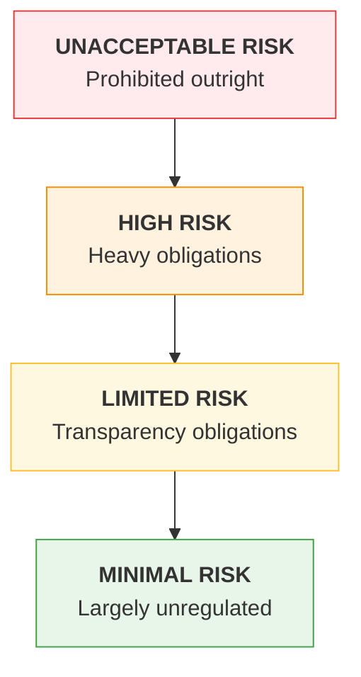

---
tags:
  - Chapter 7
  - Governance
---

# 7.3 AI Acts, Bills, and Legislations

!!! objective "In this section"
    - The **EU AI Act** — the risk-tier model and what each tier requires
    - Extraterritorial reach and why it affects you regardless of location
    - The fragmented **US** picture
    - What a technical practitioner actually needs to do

!!! warning "Law changes; verify before you rely on it"
    Legislation is amended, guidance is issued, and implementation deadlines shift. This section
    teaches the **structure and logic** of these regimes, which is stable and exam-relevant.

    **For any real compliance decision, consult current official sources and qualified legal
    advice.** Nothing here is legal advice, and specific dates and thresholds should be verified
    against the official text before you act on them.

---

## Why regulation arrived

For most of computing history, software was largely unregulated as software — you were liable for
outcomes (data protection, product safety) rather than for how you built it.

AI changed that calculus for three reasons:

1. **Consequential automated decisions.** AI systems increasingly decide who gets hired, credit,
   insurance, bail, or benefits — decisions with direct effects on people's lives.
2. **Opacity.** You cannot inspect a model to establish why it decided (Chapter 1). Existing legal
   mechanisms assume explicability.
3. **Scale.** A flawed human decision-maker affects hundreds of people; a flawed model affects
   millions, identically and instantly.

The regulatory response has been to govern **use** rather than technology — which is why risk-tiering
by application is the dominant model.

---

## The EU AI Act

The **EU AI Act** is the world's first comprehensive horizontal AI regulation. Its defining feature
is a **risk-based tiered approach**: obligations scale with the risk the *use case* presents, not
with the technology used.

### The risk tiers

<dl class="caisp-terms" markdown>

<dt>Unacceptable risk — banned</dt>
<dd>Practices considered incompatible with fundamental rights. Categories include certain
manipulative techniques that exploit vulnerabilities, social scoring by public authorities, and
particular uses of biometric identification and categorisation. <strong>These are prohibited, not
merely regulated.</strong></dd>

<dt>High risk — permitted with substantial obligations</dt>
<dd>AI used in contexts with significant impact on health, safety, or fundamental rights — including
areas such as employment decisions, access to essential services, education, law enforcement, and
critical infrastructure, plus AI as a safety component in regulated products.</dd>

<dt>Limited risk — transparency obligations</dt>
<dd>Systems that interact with people or generate content carry disclosure duties — broadly, people
should know they are dealing with AI, and certain synthetic content should be identifiable as
such.</dd>

<dt>Minimal risk — largely unregulated</dt>
<dd>The majority of AI applications. Spam filters, recommendation engines, game AI.</dd>

</dl>

!!! danger "The tier is set by the USE CASE, not the technology"
    The same underlying model can be minimal risk in one product and high risk in another.

    A text classifier sorting support tickets: minimal. **The same classifier screening job
    applications: high risk**, with all the obligations that entails.

    This is the single most important thing to understand about the Act, and a reliable exam point.
    When asked to assess a system, ask *what is it used for and who does it affect* — never *what
    model does it use*.

### What high-risk classification requires

Broadly, providers of high-risk systems must establish and document things you will find familiar:

| Obligation | You already know this as |
|---|---|
| Risk management system | Chapter 5 — threat modeling and risk treatment |
| Data governance and quality | Chapters 1, 6 — provenance, curation, bias management |
| Technical documentation | Chapter 6 — model cards, MLBOM |
| Record-keeping / logging | Chapter 4 — logging tool calls and decisions |
| Transparency to deployers | Chapter 6 — model cards, intended use, limitations |
| Human oversight | Chapter 3 — LLM08, human-in-the-loop for consequential actions |
| Accuracy, robustness, cybersecurity | **This entire course** |
| Conformity assessment | Demonstrating the above before placing on the market |

!!! success "The reassuring realisation"
    **You have spent six chapters learning what the Act largely requires.**

    Threat modeling, provenance, documentation, logging, human oversight, robustness testing — these
    are not new compliance burdens invented by lawyers. They are the engineering practices this
    course teaches, written into law.

    Teams that have done the security work are most of the way to the compliance work. Teams that
    have not now have a legal deadline attached to it.

### General-purpose AI

The Act also addresses **general-purpose AI models** (foundation models), with obligations around
technical documentation, information for downstream providers, copyright policy, and — for the most
capable models presenting systemic risk — additional evaluation and incident-reporting duties.

This matters for the supply chain reasoning in Chapter 6: it pushes **documentation and transparency
up the chain** toward the model producers, which is exactly what downstream consumers need in order
to establish provenance.

### Extraterritorial reach

!!! warning "It applies to you even if you are not in the EU"
    Like GDPR, the Act reaches beyond EU borders. Broadly, it applies where AI systems are **placed on
    the EU market** or where their **output is used in the EU**, regardless of where the provider is
    established.

    Combined with substantial penalties for non-compliance, this has made the Act a de facto global
    reference point — much as GDPR became the global baseline for data protection. Many
    organisations outside the EU align with it simply because doing otherwise fragments their
    product.

---

## US legislation

The US picture is **fragmented** — and that fragmentation is itself the thing to understand.

There is no single comprehensive federal AI statute equivalent to the EU AI Act. Instead:

<dl class="caisp-terms" markdown>

<dt>Executive action</dt>
<dd>Successive administrations have used executive orders to direct federal agencies on AI safety,
security, and procurement. Executive orders are <strong>durable only as long as the administration
that issued them</strong>, so this layer changes with politics — check current status rather than
relying on recollection.</dd>

<dt>Federal agency authority under existing law</dt>
<dd>Agencies apply their <em>existing</em> mandates to AI: consumer protection authority to
deceptive AI claims, employment discrimination law to biased hiring tools, financial regulation to
AI in lending. <strong>No new AI law is required for an existing law to bite.</strong></dd>

<dt>Sector-specific regulation</dt>
<dd>Healthcare, financial services, and other regulated sectors have AI-relevant requirements through
their sector regulators.</dd>

<dt>State law</dt>
<dd>US states have moved faster than Congress, producing a patchwork covering areas such as automated
employment decision tools, algorithmic discrimination, biometric data, and AI transparency. State
privacy laws also frequently include provisions on automated decision-making.</dd>

<dt>Standards and voluntary frameworks</dt>
<dd>NIST AI RMF (section 7.2) is the most influential US contribution, and is increasingly referenced
in procurement.</dd>

</dl>

!!! tip "The practical consequence of fragmentation"
    A US organisation may face **different obligations in different states** for the same product,
    plus sector regulation, plus existing federal law applied to AI, plus federal procurement
    requirements.

    This complexity is precisely why many organisations adopt a **single high standard** — commonly
    EU AI Act alignment plus NIST AI RMF — and apply it everywhere, rather than maintaining
    jurisdiction-specific variants. Compliance simplicity, not idealism, drives convergence upward.

### Other jurisdictions

Briefly, so you know the landscape is global: the UK has pursued a principles-based,
regulator-led approach rather than a single AI act; China has issued binding rules on specific AI
applications including recommendation algorithms and generative AI; Canada, Japan, Brazil and others
have legislation or frameworks at varying stages. International coordination continues through bodies
such as the OECD and the Council of Europe.

---

## What a technical practitioner should actually do

You are not the compliance function. But your work is where compliance succeeds or fails.

- [ ] **Know your system's risk tier.** Under the EU AI Act model, what is this system *used for* and
      who is affected? Escalate if it plausibly touches employment, credit, healthcare, education,
      law enforcement, or essential services.
- [ ] **Document as you build.** Model cards, MLBOMs, threat models, and evaluation results are
      compliance evidence (Chapters 5, 6). Produced during the work, they are nearly free; produced
      retroactively for an audit, they are expensive and unconvincing.
- [ ] **Log decisions, not just errors.** Record-keeping obligations expect an audit trail of what
      the system did — especially for agentic systems (Chapter 4).
- [ ] **Build in human oversight where impact is high.** LLM08's propose-and-approve pattern is both
      the best security control and a regulatory expectation.
- [ ] **Measure and record.** Accuracy, robustness, and bias testing produce the evidence conformity
      assessment requires — and you already have the harnesses (Labs 3.4, 4.6).
- [ ] **Know who your legal and compliance contacts are**, and involve them early. The worst time to
      discover a system is high-risk is after it ships.

!!! tip "The one-sentence version"
    **Do the engineering well and document it as you go, and compliance largely falls out. Skip the
    documentation and you will pay for it twice.**

---

!!! question "Check your understanding"
    ??? success "What determines a system's risk tier under the EU AI Act?"
        The **use case** — what the system is used for and who it affects — not the underlying
        technology. The same model can be minimal risk sorting support tickets and high risk screening
        job applicants.

    ??? success "Why does the EU AI Act matter to an organisation outside the EU?"
        It has extraterritorial reach: broadly, it applies where systems are placed on the EU market
        or their output is used in the EU, regardless of where the provider is established. Combined
        with significant penalties, this has made it a de facto global reference.

    ??? success "Characterise the US regulatory approach in one sentence."
        Fragmented — no single comprehensive federal AI statute, but a combination of executive
        action, existing agency authority applied to AI, sector regulation, a growing patchwork of
        state laws, and influential voluntary frameworks such as NIST AI RMF.

    ??? success "Name three EU AI Act high-risk obligations you already know from this course."
        Any three of: risk management system (Ch 5), data governance (Ch 6), technical documentation
        via model cards/MLBOM (Ch 6), logging and record-keeping (Ch 4), human oversight (LLM08), and
        accuracy/robustness/cybersecurity testing (Labs 3.4, 4.6).

---

<a class="caisp-card" href="../lab-01-agents/" markdown>
Next · Lab 7.1
### Working with AI Agents
Build a tool-using agent — the most capable and most dangerous AI systems.
</a>

