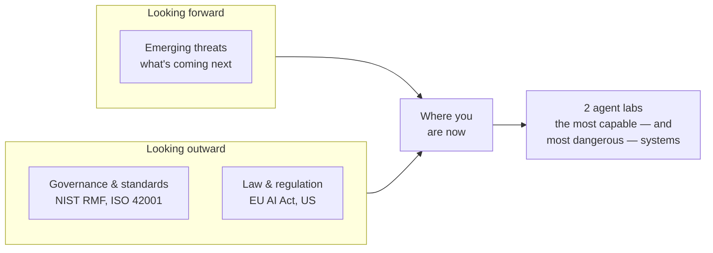

---
tags:
  - Chapter 7
  - Governance
---

# Chapter 7 — Emerging Threats, Governance, and Compliance in AI

<ul class="caisp-meta">
  <li>Level: Intermediate → Advanced</li>
  <li>Reading: ~2 hrs</li>
  <li>Labs: 2</li>
  <li>Exam weight: ~6%</li>
</ul>

The final chapter looks in two directions: **forward**, at the threats emerging on the horizon, and
**outward**, at the frameworks and laws that increasingly govern how AI must be built and run.

It is the smallest exam domain by weight, and skipping it is a classic mistake — governance questions
are among the easiest marks on the exam *if* you did the reading, and among the most embarrassing to
lose. More importantly, in a real career, the governance chapter is the one that gets you budget,
authority, and a seat at the table.

!!! objective "What you will be able to do after this chapter"
    - Describe the frontier of AI threats: model worms, fine-tuning backdoors, AI-assisted evolving
      firmware, and provenance-less models
    - Explain the major AI governance frameworks: **NIST AI RMF** and **ISO/IEC 42001**
    - Summarise the major legal regimes: the **EU AI Act** and the shape of **US legislation**
    - Map your technical work to these frameworks and laws
    - **Build an AI agent** and understand how tool-using systems work
    - **Assess an agent** for security weaknesses using a repeatable methodology

---

## Two directions

The agent labs are placed here deliberately. Agents — systems that plan and take actions with tools —
are simultaneously the **most capable** AI systems and the ones that concentrate every risk from the
whole course: injection (Ch 3), excessive agency (Ch 3), supply chain (Ch 6). They are also where
both the emerging threats and the emerging regulation point. Ending the course with them ties
everything together.

---

## Sections

<a class="caisp-card" href="../01-emerging-threats/" markdown>
7.1
### Emerging Threats in AI
Model worms, fine-tuning backdoors, evolving firmware, and provenance-less models.
</a>

<a class="caisp-card" href="../02-governance-standards/" markdown>
7.2
### AI Governance & Standards
NIST AI RMF, ISO/IEC 42001, and the wider landscape.
</a>

<a class="caisp-card" href="../03-legislation/" markdown>
7.3
### AI Acts, Bills & Legislation
The EU AI Act's risk tiers, and the fragmented US picture.
</a>

## Labs

<a class="caisp-card" href="../lab-01-agents/" markdown>
Lab 7.1 · Build
### Working with AI Agents
Build a tool-using agent from scratch and watch it reason and act.
</a>

<a class="caisp-card" href="../lab-02-abusing-agents/" markdown>
Lab 7.2 · Assess
### Assessing & Abusing AI Agents
Attack an agent you built, then apply every defence in the course.
</a>

---

!!! tip "Do not skip the governance sections"
    Technical readers instinctively skim 7.2 and 7.3. Resist that.

    Governance and legal questions are *reliable* exam marks — they have definite answers, unlike the
    judgement-heavy scenario questions. And in practice, the ability to say "this maps to NIST AI RMF
    Govern function" or "this system is high-risk under the EU AI Act" is what turns a technical
    finding into organisational action.
