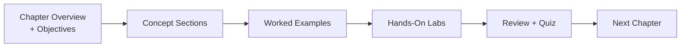

# About This Course

## Why this course exists

In the space of about three years, artificial intelligence went from a research topic to
something embedded in the software almost everyone uses. Your bank's chat support, your
IDE's autocomplete, your company's internal search, your email spam filter, the résumé
screener that read your last job application — all of it increasingly runs on machine
learning models, and much of it now runs on **large language models** (LLMs).

That shift happened fast. Faster than security practice could keep up with.

Here is the uncomfortable truth that this course is built around: **an AI system fails in
ways that traditional software does not.** A normal web application has bugs — a missing
authorisation check, an unescaped string, a race condition. You can point at the line of
code that is wrong and fix it. An AI system has all of those *plus* a category of problem
where there is no line of code to point at. The model produced a harmful output. Why?
Because of the statistical relationships it absorbed from billions of training examples
that nobody individually reviewed. You cannot `git blame` that.

So we need a security discipline that covers both. This course is that discipline, taught
from zero.

---

## Who this course is for

This course is written for **complete beginners**. Specifically, it assumes:

<dl class="caisp-terms" markdown>

<dt>No machine learning background</dt>
<dd>You have never trained a model. You may not be totally sure what the difference
between "AI" and "ML" is. That is fine — Chapter 1 fixes it.</dd>

<dt>No security background required</dt>
<dd>You do not need to know what a buffer overflow or an XSS payload is. Where the course
uses a traditional security concept, it explains it first.</dd>

<dt>Minimal programming ability</dt>
<dd>You should be able to open a terminal, run a command, and edit a text file. You do
<strong>not</strong> need to be a Python programmer. Every line of code in the labs is
explained, and every lab can be completed by copy-pasting and then modifying.</dd>

<dt>No maths beyond school level</dt>
<dd>There is no calculus in this course. Where a mathematical idea matters (like "a
vector is a list of numbers"), it is explained with analogies and small concrete
examples, not equations.</dd>

</dl>

### Who this course is *not* for

If you already train transformer models for a living and you want a deep treatment of
adversarial robustness theory, this is not that course. This is the on-ramp. It will take
you from zero to competent practitioner, not from competent practitioner to researcher.

---

## What you need

### Hardware

| Requirement | Minimum | Comfortable |
|---|---|---|
| RAM | 8 GB | 16 GB |
| Free disk space | 20 GB | 40 GB |
| CPU | Any 64-bit x86-64 or Apple Silicon | 4+ cores |
| GPU | **Not required** | Optional; speeds up a few optional labs |
| Internet | Required for setup and model downloads | — |

!!! info "About the GPU question"
    Beginners often assume AI work requires an expensive graphics card. For *training
    large models from scratch*, yes. For *this course*, no. Every mandatory lab runs on
    CPU. Where a lab would be slow on CPU, we give you a smaller model or a pre-computed
    result so you can still complete the exercise. Labs that benefit from a GPU are
    clearly marked as optional.

### Software

Everything is free and open source:

- **Python 3.11 or 3.12** (3.10 also works) — the language every lab is written in.
- **A terminal** — Terminal on macOS/Linux, PowerShell or Windows Terminal on Windows.
- **A text editor** — VS Code is recommended (free), but any editor works.
- **Git** — used to fetch a couple of tools in later chapters.
- Optionally **Docker** — a small number of later labs are simpler with it; alternatives
  are always provided.

The [Lab Environment Setup](lab-environment.md) page walks you through installing all of
this, step by step, for each operating system.

### Accounts (all optional)

Some labs are more interesting with a real hosted model behind them. Where that is true,
we tell you, and we **always** provide a free local alternative so you are never blocked
by a paywall.

- A **Hugging Face** account (free) — for downloading open models.
- Optionally an **OpenAI**, **Anthropic**, or **Google AI Studio** key — some have free
  tiers; none are required.

---

## How each chapter is structured

Every chapter in this course follows the same rhythm, so you always know where you are.



**1. Chapter overview and learning objectives.** A short page that tells you exactly what
you will be able to do when you finish, and roughly how long it will take.

**2. Concept sections.** The main reading. Each topic from the syllabus gets its own page
or section, written in plain language, with analogies, diagrams, and small examples. Key
terms are bolded on first use and defined in the [glossary](glossary.md).

**3. Worked examples.** Short, runnable snippets embedded in the reading, so you see the
idea in code immediately after you see it in prose.

**4. Hands-on labs.** The heart of the course. Each lab has:

- A clear goal ("by the end you will have a working X")
- Time estimate and difficulty
- Complete, tested, runnable code in the `labs/` folder
- A step-by-step walkthrough explaining *why* each step exists
- "Break it yourself" challenges that go beyond the guided steps
- A troubleshooting section for the errors people actually hit

**5. Review and quiz.** A summary of the key takeaways, a self-test with answers, and a
checklist so you can confirm you are ready to move on.

---

## How to actually learn this material

You are an adult learning a technical subject in your own time. Here is what works, based
on how people actually succeed with this material.

### Do the labs. Genuinely do them.

The single strongest predictor of whether someone passes the certification and can do the
job afterwards is whether they ran the labs themselves or just read them. Reading a
prompt-injection walkthrough gives you vocabulary. Typing one in and watching a model
obey it gives you intuition — and intuition is what the exam and the job both test.

### Type the code, do not only paste it

Yes, we give you complete files. Use them when you are stuck. But the first time through a
lab, type the important parts. It is slower, and that slowness is the point: it forces you
to notice each piece.

### Break things on purpose

Every lab ends with "break it yourself" challenges. Change a parameter to something
absurd. Remove a safety check and see what happens. Feed the model garbage. Security
intuition is built by seeing failure modes, and the lab is the only place you can safely
manufacture them.

### Explain it out loud

After each chapter, try to explain the core idea to someone non-technical — a friend, a
partner, a rubber duck. If you find yourself saying "it's kind of like, um, it just sort
of knows", you have found a gap. Go back and close it.

### Pace yourself realistically

| Your situation | Suggested pace | Total time |
|---|---|---|
| Full-time study | 1 chapter every 2 days | ~2 weeks |
| Evenings and weekends | 1 chapter per week | ~7–8 weeks |
| Occasional, busy schedule | 1 chapter per 2 weeks | ~4 months |

Chapters are **not** equal in size. Chapters 2 and 3 are the largest (Chapter 2 has ten
labs). Budget extra time there.

!!! tip "Consistency beats intensity"
    Forty-five focused minutes four evenings a week will get you further than one heroic
    eight-hour Saturday. Spaced repetition is how technical material sticks.

---

## Conventions used in this course

Throughout the course you will see these visual signals.

!!! objective "Learning objectives"
    Green blocks at the top of each chapter list exactly what you should be able to do
    afterwards. Use them as a self-check.

!!! note "Note"
    Additional context that is useful but not essential on a first read.

!!! tip "Tip"
    A practical shortcut, or advice from people who have done this before.

!!! warning "Warning"
    Something that commonly goes wrong. Read these — they save time.

!!! danger "Danger"
    A safety, legal, or ethical boundary. Always read these.

!!! lab "Hands-on lab"
    Purple blocks mark hands-on work. Files live in the `labs/` directory of the course
    repository.

!!! question "Check your understanding"
    Quick self-test questions. Try to answer before expanding the solution.

### Code blocks

Commands you type into a terminal look like this. Type (or copy) exactly what is shown:

```bash
python --version
```

Python code looks like this, with a copy button in the top-right corner:

```python
message = "Hello, AI security."
print(message)
```

Where a command differs by operating system, you will see tabs:

=== "macOS / Linux"

    ```bash
    source .venv/bin/activate
    ```

=== "Windows (PowerShell)"

    ```powershell
    .venv\Scripts\Activate.ps1
    ```

---

## A note on ethics, before you begin

This course will teach you to make AI systems do things their creators did not intend. That
is not a side effect of the curriculum; it is the curriculum. You cannot defend a system
whose failure modes you have never induced.

That knowledge carries an obligation.

- **Practise only on your own systems**, or systems where you have explicit, written,
  scope-defined permission to test. Verbal permission from someone who is not authorised
  to give it is not permission.
- **Disclose responsibly.** If you find a real vulnerability in someone's AI product,
  report it through their security contact or bug-bounty programme. Give them reasonable
  time to fix it before talking about it publicly.
- **Consider the downstream human.** Many AI failures are not "the server crashed"; they
  are "the model produced racist output to a real customer" or "the model leaked another
  person's medical data". Treat those with the seriousness they deserve.
- **Do not build the weapon.** Chapter 2 discusses tools like WormGPT and FraudGPT that
  exist specifically to enable crime. We study them so defenders understand the threat
  landscape. Building or distributing such tools is criminal, and this course is not cover
  for it.

Every lab here is self-contained and local by design, so you can develop real offensive
skill without ever touching a system you do not own.

---

<div class="caisp-cards">
<a class="caisp-card" href="syllabus.md">
  <span class="caisp-kicker">Next</span>
  <span class="caisp-card-title">Syllabus &amp; Roadmap</span>
  <span class="caisp-card-text">See the full topic list for all seven chapters.</span>
</a>
<a class="caisp-card" href="lab-environment.md">
  <span class="caisp-kicker">Or jump to</span>
  <span class="caisp-card-title">Lab Environment Setup</span>
  <span class="caisp-card-text">Get your machine ready. Takes about 20 minutes.</span>
</a>
</div>
