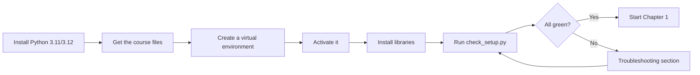

# Lab Environment Setup

!!! danger "Do not skip this page"
    Every hands-on lab in this course expects the environment described here. Setting it up
    now, carefully, takes about 20 minutes and saves you hours of confusing errors later.
    When you finish, `python labs/check_setup.py` should print **READY**.

## What we are building

By the end of this page you will have:

- A supported version of **Python** installed.
- An isolated **virtual environment** so the course's libraries do not interfere with
  anything else on your computer.
- The **core lab libraries** installed inside it.
- A passing run of the **smoke-test script** that confirms it all works.



---

## Step 0 — A word about the terminal

Almost everything here happens in a **terminal** (also called a command line, shell, or
console). If you have never used one, that is fine — you will only need a handful of
commands, and we give you every one.

=== "macOS"

    Open **Terminal**: press ++cmd+space++, type `Terminal`, press ++enter++.

=== "Windows"

    Open **Windows Terminal** or **PowerShell**: press the Start button, type
    `PowerShell`, and click it. (Windows Terminal is nicer if you have it, but PowerShell
    works.)

=== "Linux"

    Open your terminal app — often ++ctrl+alt+t++, or search "Terminal" in your app menu.

Throughout the course, a line starting with `$` (macOS/Linux) or `PS>` (Windows) shows a
command to type. **Do not type the `$` or `PS>` itself** — just what comes after.

---

## Step 1 — Install Python

!!! warning "Use Python 3.11 or 3.12 — not the very newest release"
    The AI libraries this course uses (PyTorch, Transformers) sometimes lag a few months
    behind brand-new Python releases. If you install the absolute latest Python, some
    libraries may have **no installable version yet**, and you will hit confusing errors.

    **Recommended: Python 3.11 or 3.12.** Python 3.10 also works. Avoid 3.13+ until the
    ecosystem catches up.

### Check what you already have

```bash
python3 --version
```

If that prints `Python 3.11.x` or `Python 3.12.x`, you are set — skip to Step 2.

=== "macOS"

    The easiest route is [Homebrew](https://brew.sh):

    ```bash
    brew install python@3.12
    ```

    Then confirm:

    ```bash
    python3.12 --version
    ```

    No Homebrew? Download the installer from
    [python.org/downloads](https://www.python.org/downloads/) and choose a 3.12.x release.

=== "Windows"

    1. Go to [python.org/downloads](https://www.python.org/downloads/).
    2. Download a **3.12.x** installer.
    3. Run it. On the **first screen, tick "Add python.exe to PATH"** — this is the single
       most commonly missed step on Windows.
    4. Click "Install Now".

    Confirm in a **new** PowerShell window:

    ```powershell
    python --version
    ```

=== "Linux (Debian/Ubuntu)"

    ```bash
    sudo apt update
    sudo apt install python3.12 python3.12-venv python3-pip
    python3.12 --version
    ```

    On other distributions, use your package manager (`dnf`, `pacman`, etc.) to install
    Python 3.12 and the matching `venv` package.

---

## Step 2 — Get the course files

The labs live in a folder called `labs/`. However you received the course (a download, a
Git repository, or a provided archive), place the course folder somewhere convenient — for
example your home directory or Desktop — and open a terminal **inside that folder**.

If the course is a Git repository:

```bash
git clone <the-course-repository-url> caisp
cd caisp
```

To confirm you are in the right place, list the contents. You should see a `labs` folder:

=== "macOS / Linux"

    ```bash
    ls
    ```

=== "Windows (PowerShell)"

    ```powershell
    dir
    ```

---

## Step 3 — Create a virtual environment

A **virtual environment** (venv) is a private, isolated copy of Python for this project.
Anything you install into it stays in it. This means the course's libraries cannot break
other Python projects on your machine, and vice versa. It is the single best habit in
Python development.

From inside the course folder, create one called `.venv`:

=== "macOS / Linux"

    ```bash
    python3.12 -m venv .venv
    ```

=== "Windows (PowerShell)"

    ```powershell
    python -m venv .venv
    ```

This creates a hidden `.venv` folder. You only do this once.

---

## Step 4 — Activate the virtual environment

Activating tells your terminal "use this project's private Python". You do this **every
time you open a new terminal** to work on the course.

=== "macOS / Linux"

    ```bash
    source .venv/bin/activate
    ```

=== "Windows (PowerShell)"

    ```powershell
    .venv\Scripts\Activate.ps1
    ```

    !!! note "If PowerShell blocks the script"
        You may see a message about execution policies. Run this once, then try activating
        again:
        ```powershell
        Set-ExecutionPolicy -Scope CurrentUser -ExecutionPolicy RemoteSigned
        ```

When it works, your prompt changes to show `(.venv)` at the start. That is how you know the
environment is active.

To leave it later, just type `deactivate`.

---

## Step 5 — Install the lab libraries

With the environment **active** (you can see `(.venv)`), upgrade pip and install the
requirements:

```bash
python -m pip install --upgrade pip
pip install -r labs/requirements.txt
```

!!! info "This step downloads a lot and takes a while"
    PyTorch alone is a few hundred megabytes. On a normal connection the whole install
    takes 5–15 minutes. It is normal for it to look like it has paused — leave it running.

!!! tip "Windows and `faiss-cpu`"
    The requirements file skips `faiss-cpu` on Windows because it can be awkward to
    install there. Chapter 1 does not need it. When you reach the labs that use vector
    search, that chapter gives Windows users an alternative. You do not need to do anything
    now.

---

## Step 6 — Run the smoke test

This is the moment of truth. Run the checker:

```bash
python labs/check_setup.py
```

Read the output top to bottom. Every core library should say `PASS`. The last line should
say **READY** or **ALL GREEN**.

The script also tries to download a tiny model to prove your machine can fetch and run
models from Hugging Face. If you are behind a corporate proxy or have no internet right
now, skip just that part:

```bash
python labs/check_setup.py --no-network
```

!!! success "What 'ready' looks like"
    ```
    ============================================================
      RESULT: ALL GREEN — you are ready for Chapter 1!
    ============================================================
    ```

If you see that, you are done. **[Go to Chapter 1.](../chapter-01/index.md)**

---

## Troubleshooting

The errors below are the ones beginners actually hit. Find yours.

### `python: command not found` (or `python3: command not found`)

Your terminal cannot find Python.

- On **Windows**, this almost always means you did not tick "Add python.exe to PATH"
  during installation. Re-run the installer, choose "Modify", and enable it — or reinstall
  and tick the box. Then open a **new** terminal.
- On **macOS/Linux**, try `python3` instead of `python`, or the exact version, e.g.
  `python3.12`.

### `pip install` fails with a long red error about "Could not find a version"

This is the classic **Python-too-new** problem. Check your version:

```bash
python --version
```

If it is 3.13 or newer, that is very likely the cause. Install Python 3.12, recreate the
virtual environment with it (delete the `.venv` folder first), and reinstall.

### The install of `torch` fails or runs out of memory/disk

PyTorch is large. Make sure you have at least a few GB of free disk space. If a download is
interrupted, simply run the `pip install` command again — pip resumes and skips what it
already has.

### `OSError: We couldn't connect to 'https://huggingface.co'`

Your machine cannot reach Hugging Face, where models are downloaded from. Causes:

- **No internet** — reconnect and retry.
- **Corporate proxy or VPN** blocking it — try from a home network, or ask your IT team to
  allow `huggingface.co`. You can configure a proxy with the `HTTPS_PROXY` environment
  variable if your organisation provides one.
- **Firewall** — same as above.

!!! tip "You are not blocked from the course"
    Many labs — including the first chatbot lab — have a fully **offline** mode that needs
    no downloads at all. If you cannot reach Hugging Face right now, run
    `check_setup.py --no-network`, then start Chapter 1; its lab will still work offline.

### My prompt does not show `(.venv)`

The environment is not active. Re-run the activate command from Step 4. Remember you must
activate it in **every new terminal window**.

### `Activate.ps1 cannot be loaded because running scripts is disabled` (Windows)

See the note under Step 4 — set the execution policy for your user, then activate again.

### Something else

- Copy the **full** error message.
- Re-read the step you were on.
- Search, then ask in the [`#labs-help` Mattermost channel](support.md), following the
  "how to ask a good question" guidance. Include your OS, Python version, and the full
  error as text.

---

## Optional extras

You do not need these for Chapter 1, but they make the whole course nicer.

- **VS Code** (free, [code.visualstudio.com](https://code.visualstudio.com)) with the
  Python extension — a friendly editor that can select your `.venv` automatically.
- **Git** — needed to fetch a couple of tools in later chapters.
- **Docker** — a small number of later labs are cleaner with it; alternatives are always
  provided.

---

<div class="caisp-cards" markdown>

<a class="caisp-card" href="../glossary/" markdown>
<span class="caisp-kicker">Reference</span>
### Glossary
Keep this open while you read.
</a>

<a class="caisp-card" href="../../chapter-01/" markdown>
<span class="caisp-kicker">You're ready</span>
### Start Chapter 1
Introduction to AI Security.
</a>

</div>
