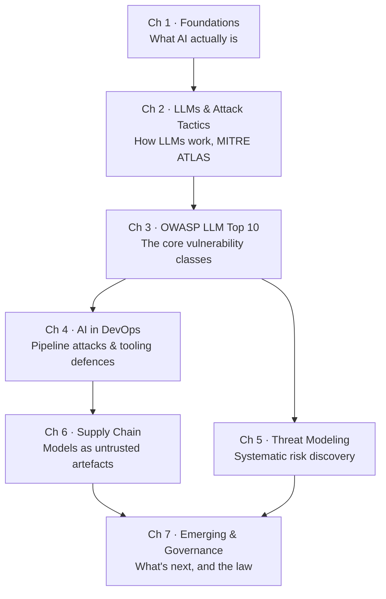

# Syllabus & Roadmap

This page is the map. Every topic the course covers is listed here, in order, so you can
see where you are and what is coming.

!!! tip "How to use this page"
    Bookmark it. Come back after each chapter and tick things off. Seeing the list shrink
    is surprisingly motivating when you are eight hours into a seven-chapter course.

---

## Course structure at a glance

**Chapters 1–3 are the foundation.** Do them in order; each genuinely depends on the last.

**Chapters 4–6 are the practitioner core.** They can tolerate slight reordering, but the
default order is recommended.

**Chapter 7 is the horizon.** It only makes sense once you have the earlier material.

---

## Chapter 1 — Introduction to AI Security

!!! objective "By the end you can"
    Explain what AI, ML, and deep learning are and how they differ; describe the core
    components of an AI system; explain what RAG is and why it matters for security; and
    build a working chatbot on your own machine.

**Course orientation**

- [x] Course introduction — about the course, syllabus, and how to approach it
- [x] About certification and how to approach it
- [x] Course lab environment
- [x] Lifetime course support (Mattermost)

**An overview of AI security**

- Why AI systems fail differently from traditional software
- The expanded attack surface
- Who attacks AI systems and why

**Basics of AI and ML**

- What is AI?
- History and evolution of AI
- Key concepts in AI

**Types of AI**

- Narrow AI vs. General AI
- Supervised learning
- Unsupervised learning
- Reinforcement learning
- Natural Language Processing (NLP)
- Computer vision

**Core components of AI systems**

- Algorithms and models
- Data
- Computing power

**Introduction to machine learning**

- What is machine learning?
- Differences between AI and ML
- Key ML concepts
- Retrieval Augmented Generation (RAG)

**Basics of deep learning**

- What is deep learning?
- Introduction to neural networks
- Brief overview of Convolutional Neural Networks (CNNs)

**Hands-on exercise**

- :material-flask: [Lab 1.1 — Building a chatbot using an LLM](../chapter-01/lab-01-chatbot.md)

**Estimated time:** 5–7 hours

---

## Chapter 2 — Understanding and Attacking Large Language Models

!!! objective "By the end you can"
    Explain the transformer architecture at a conceptual level; distinguish foundational
    from fine-tuned models; navigate the MITRE ATLAS matrix tactic by tactic; and run a
    range of offensive and analytical techniques against models you control.

**Introduction to large language models**

- Definition of large language models
- How LLMs work
- Importance and impact of LLMs in AI

**Understanding LLMs**

- GPT (Generative Pre-trained Transformer)
- BERT (Bidirectional Encoder Representations from Transformers)

**Training and augmenting LLMs**

- Foundational model and fine-tuned model
- Retrieval augmented generation

**Use cases of LLMs**

- Text generation
- Text understanding
- Conversational AI

**Attack tactics and techniques**

- MITRE ATT&CK
- MITRE ATLAS matrix
- Reconnaissance tactic
- Resource development tactic
- Initial access tactic
- ML model access tactic
- Execution tactic
- Persistence tactic
- Privilege escalation tactic
- Defense evasion tactic
- Credential access tactic
- Discovery tactic
- Collection tactic
- ML attack staging
- Exfiltration tactic
- Impact tactic

**Real-world LLM attack tools on the internet**

- XXXGPT, WormGPT, FraudGPT — what they are, how they are marketed, and what their
  existence tells defenders

**Hands-on exercises**

- :material-flask: [Lab 2.1 — Creating a simple chatbot](../chapter-02/lab-01-simple-chatbot.md)
- :material-flask: [Lab 2.2 — Exploring how tokenizers work](../chapter-02/lab-02-tokenizers.md)
- :material-flask: [Lab 2.3 — Building a summarizer tool using an LLM](../chapter-02/lab-03-summarizer.md)
- :material-flask: [Lab 2.4 — Building a fine-tuned model](../chapter-02/lab-04-fine-tuning.md)
- :material-flask: [Lab 2.5 — Building a simple website scraper](../chapter-02/lab-05-scraper.md)
- :material-flask: [Lab 2.6 — Building a RAG system](../chapter-02/lab-06-rag.md)
- :material-flask: [Lab 2.7 — Attacking an LLM model using TextAttack](../chapter-02/lab-07-textattack.md)
- :material-flask: [Lab 2.8 — Performing sentiment analysis using an LLM](../chapter-02/lab-08-sentiment.md)
- :material-flask: [Lab 2.9 — Backdoor attacks — understanding and detection](../chapter-02/lab-09-backdoors.md)
- :material-flask: [Lab 2.10 — Building a speech-to-text system](../chapter-02/lab-10-speech-to-text.md)

**Estimated time:** 12–15 hours — this is the largest chapter

---

## Chapter 3 — LLM Top 10 Vulnerabilities

!!! objective "By the end you can"
    Name, explain, demonstrate, and mitigate each of the OWASP Top 10 for LLM
    Applications, and recognise them in an unfamiliar architecture.

**Introduction to the OWASP Top 10 LLM attacks**

**1. Prompt injection**

- System prompts versus user prompts
- Direct and indirect prompt injection
- Prompt injection techniques
- Mitigating prompt injection

**2. Insecure output handling**

- Consequences of insecure output handling
- Mitigating insecure output handling

**3. Training data poisoning**

- LLM's core learning approaches
- Mitigating training data poisoning

**4. Model denial of service**

- DoS on networks, applications, and models
- Context windows and exhaustion
- Mitigating denial of service

**5. Supply chain vulnerabilities**

- Components or stages in an LLM
- Compromising the LLM supply chain
- Mitigating supply chain vulnerabilities

**6. Sensitive information disclosure**

- Exploring data leaks in various incidents
- Mitigating sensitive information disclosure

**7. Insecure plugin design**

- Plugin / connected software attack scenarios
- Mitigating insecure plugin design

**8. Excessive agency**

- Excessive permissions and autonomy
- Mitigating excessive agency

**9. Overreliance**

- Understanding hallucinations
- Overreliance examples
- Mitigating overreliance

**10. Model theft**

- Stealing models
- Mitigating model theft

**Hands-on exercises**

- :material-flask: [Lab 3.1 — Learning prompt injection step by step](../chapter-03/lab-01-prompt-injection.md)
- :material-flask: [Lab 3.2 — Working with user prompts and system prompts](../chapter-03/lab-02-system-user-prompts.md)
- :material-flask: [Lab 3.3 — Extracting sensitive information through an LLM](../chapter-03/lab-03-data-extraction.md)
- :material-flask: [Lab 3.4 — LLM hallucination lab](../chapter-03/lab-04-hallucination.md)

**Estimated time:** 10–12 hours

---

## Chapter 4 — AI Attacks and Defenses Using DevOps

!!! objective "By the end you can"
    Describe an ML deployment pipeline and its attack surface; and use SCA, static
    analysis, dynamic analysis, and AI firewalls to defend one.

**Introduction to AI in DevOps**

- Definition and principles of DevOps and DevSecOps
- The role of AI in enhancing DevOps practices

**Types of AI attacks on DevOps teams**

- Model creation and deployment process/pipeline
- Attacks on pipelines

**Cases of attacks in DevOps and AI**

- Hugging Face AI platform incidents
- NotPetya attack
- SAP AI Core vulnerabilities

**DevSecOps tooling and defenses for AI projects**

- Software composition analysis for AI projects
- Static analysis of models and applications
- Dynamic analysis of models and applications
- AI firewalls for guarding models

**Hands-on exercises**

- :material-flask: [Lab 4.1 — Analyzing and fixing vulnerabilities in third-party components](../chapter-04/lab-01-sca.md)
- :material-flask: [Lab 4.2 — Finding and fixing weaknesses in AI code](../chapter-04/lab-02-static-analysis.md)
- :material-flask: [Lab 4.3 — Scanning a malicious pickle file using Picklescan](../chapter-04/lab-03-picklescan.md)
- :material-flask: [Lab 4.4 — Scanning an LLM for agent-based vulnerabilities](../chapter-04/lab-04-agent-scanning.md)
- :material-flask: [Lab 4.5 — Sanitizing prompts with LLM Guard](../chapter-04/lab-05-llm-guard.md)
- :material-flask: [Lab 4.6 — Guarding LLM input and output](../chapter-04/lab-06-guardrails.md)

**Estimated time:** 8–10 hours

---

## Chapter 5 — Threat Modeling AI Systems

!!! objective "By the end you can"
    Draw a data flow diagram for an LLM application, apply STRIDE to it, pull threats
    from AI-specific libraries, and rate the resulting risks defensibly.

**What is threat modeling**

- Why threat model?
- Threat modeling challenges
- Threat modeling benefits

**The threat model parlance**

- What are assets?
- Weaknesses and vulnerability
- Risk management stages
- STRIDE methodology

**Diagramming for threat modeling**

- Data flow diagram
- DFD components

**An LLM application architecture**

- Simple LLM architecture
- DFD for an LLM architecture
- STRIDE threats for LLM applications

**AI threat libraries**

- STRIDE
- OWASP LLM Top 10
- MITRE ATLAS
- BIML risk framework
- AI Risk Repository
- AI Incident Database
- AI Threat Map

**Rating and managing risks**

- Risk management meets threat modeling
- Risk management strategies
- Example risk rating methodology

**Hands-on exercise**

- :material-flask: [Lab 5.1 — Threat modeling an AI system](../chapter-05/lab-01-threat-model.md)

**Estimated time:** 6–8 hours

---

## Chapter 6 — Supply Chain Attacks in AI

!!! objective "By the end you can"
    Explain why a downloaded model is untrusted executable content; vet third-party AI
    dependencies systematically; and produce and verify SBOMs, model cards, and
    signatures.

**An overview of supply chain security**

**Introduction to AI supply chain attacks**

- Data, model, and infrastructure-based attacks
- Abusing generative AI for package masquerading

**Vetting software frameworks**

- Creating a vetting process
- Automating vetting of third-party code
- Scanning for vulnerabilities
- Mitigating dependency confusion
- Dependency pinning

**Supply chain frameworks**

- SLSA
- Software Component Verification Standard (SCVS)

**Transparency and integrity in the AI supply chain**

- Generate a Software Bill of Materials
- SBOMs, provenance, and attestations
- Model cards and MLBOMs
- Model signing

**Hands-on exercises**

- :material-flask: [Lab 6.1 — Editing models using the ROME technique](../chapter-06/lab-01-rome.md)
- :material-flask: [Lab 6.2 — How trojanized models work](../chapter-06/lab-02-trojanized-models.md)
- :material-flask: [Lab 6.3 — Scanning models and detecting malicious code](../chapter-06/lab-03-scanning.md)
- :material-flask: [Lab 6.4 — Generating an SBOM (and extending it to an MLBOM)](../chapter-06/lab-04-sbom.md)
- :material-flask: [Lab 6.5 — Signing and verifying machine learning models](../chapter-06/lab-05-signing.md)

**Estimated time:** 8–10 hours

---

## Chapter 7 — Emerging Threats, Governance, and Compliance in AI

!!! objective "By the end you can"
    Describe the frontier of AI threats, and map security work to the major frameworks
    and legal regimes governing AI.

**Emerging threats in AI**

- Model-mediated supply chain attacks
- Self-propagating AI model worms
- Backdoors in fine-tuning
- AI-assisted evolving firmware
- Models without provenance

**AI governance and compliance**

- Standards, guidelines, frameworks, checklists for AI security
- NIST AI RMF
- ISO/IEC 42001
- Other standards and guidelines

**AI acts, bills, and legislation**

- EU AI Act
- US legislation

**Hands-on exercises**

- :material-flask: [Lab 7.1 — Working with AI agents](../chapter-07/lab-01-agents.md)
- :material-flask: [Lab 7.2 — Assessing and abusing AI agents](../chapter-07/lab-02-abusing-agents.md)

**Estimated time:** 6–8 hours

---

## Total commitment

| | Hours |
|---|---|
| Reading and concepts | ~25 |
| Hands-on labs | ~30 |
| Review, quizzes, and exam prep | ~10 |
| **Total** | **~65 hours** |

That is a genuine estimate for someone starting from zero and doing every lab. If you have
an ML or security background already, expect closer to 35–40 hours.

---

<a class="caisp-card" href="certification.md">
  Next
  Certification Guide
  Exam format and how to prepare.
</a>
<a class="caisp-card" href="lab-environment.md">
  Then
  Lab Environment Setup
  Get your machine ready.
</a>

